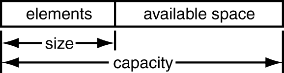

# C++中的向量:简单指南

> 原文：<https://blog.devgenius.io/vectors-in-c-a-simple-guide-1c809e4d7ef6?source=collection_archive---------7----------------------->


照片由 [Unsplash](https://unsplash.com?utm_source=medium&utm_medium=referral) 上的 [Azharul Islam](https://unsplash.com/@azhar93?utm_source=medium&utm_medium=referral) 拍摄

如果你是程序员，你一定玩过数组。C++中的向量非常像数组，但是它们比数组更灵活。

这篇文章是关于 C++中向量的综合指南。所以让我们开始吧。

# 什么是向量？

Vector 是 C++编程语言标准模板库中的模板类。C++中的向量是存储元素的序列容器。

它是一个动态存储元素的容器。

> 简单地说，向量是**动态数组**，具有自我调整大小的能力。

向量的大小可以根据需求增长，也就是说，当程序员在向量中添加元素时。

# 迭代器

## 向量::begin()

begin()函数用于返回指向向量第一个元素的迭代器。

```
vector_name.begin()
```

## vector::end()

end()函数用于返回指向向量最后一个元素的迭代器。

```
vector_name.end()
```

# 尺寸和容量

向量有两种相关的大小。

1.  其中一个被称为 **size** ，它指示了它当前保存的元素数量。
2.  另一个叫做**容量**，是它可以容纳的元素数量。



作者照片

在 vector 的末尾增加额外的空间是为了减少每次向 vector 添加新元素时的内存分配成本。

如上图所示，当通过向 vector 添加一些元素来填充可用空间时，**vector 的容量增加了两个**，这意味着分配给 vector 的内存增加了一倍。在解释与 vector 类相关联的 capacity()方法时，下面包含了此行为的示例。

# 如何初始化向量

在初始化一个 vector 之前，你要知道要使用 vector，你必须包含下面的头文件。

> #包括

现在让我们回到初始化。

向量可以串行存储任何类型的数据。存储在 vector 中的数据类型可以是 int、char、float 等，也可以是特定类的 vector。

向量通常如下初始化，

```
vector<int> a;
vector<char> ch;
vector<Book> b; // where Book is a class defined.
```

从下面的代码中，可以更详细地理解向量的初始化。

# Vector 类上可用的方法

> ***push_back()***

该方法**在矢量的末端**添加元素。

> ***pop_back()***

这个方法**从向量中移除最后一个元素**。

> ***尺寸()***

返回它当前保存的元素数量。

通过下面代码可以很好地理解以上三种方法:

**输出:**

```
0\. size: 0
1\. size: 10
2\. size: 20
3\. size: 19
```

> ***容量()***

返回**它能容纳的元素数量**。

通过下面例子可以很好地理解，

**输出:**

```
0\. capacity: 0
1\. capacity: 16
```

**解释:**

1.  在**初始化**后，矢量**容量**为零
2.  **在**添加第一个**元素后**容量**变为**一个****
3.  **在**增加第二个**元素后**容量**变成了**两个****
4.  **在**增加第三个**元素后**容量**变成了**四个****
5.  **在**添加第五个**元素后**容量**变成了**八个****
6.  **在**增加第九个**元素后**容量**变成了**十六个****

> *****空()*****

**返回布尔值**真**或**假**。**

1.  **如果 vector 为空，则为 True**
2.  **如果 vector 不为空，则为 False**

**通过下面例子可以很好地理解，**

**输出:**

```
1
0
```

> *****前面()*****

**返回向量的**前元素**。**

> *****回()*****

**返回向量的最后一个元素。**

**以下代码解释了 front()和 back()函数，**

****输出:****

```
Front element: 0
Back element: 9
```

> *****插入()*****

**在数组中间插入元素。**

> *****erase()*****

**从数组中间擦除元素。**

**insert()和 erase()可以通过下面的代码示例很好地理解，**

****输出:****

```
The vector elements are: 2 3 7 10 20 30 40
After Erase: 2 3 10 20 30 40
```

# **结论**

**在本文中，我们学习了 C++中的向量以及与它们相关的方法。我们也看到了一些使用它们的例子。**

**非常感谢您的阅读。祝你愉快！**