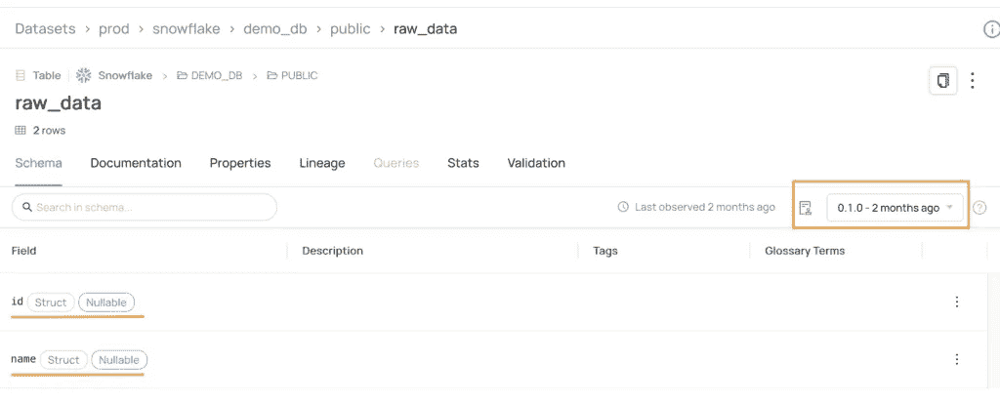
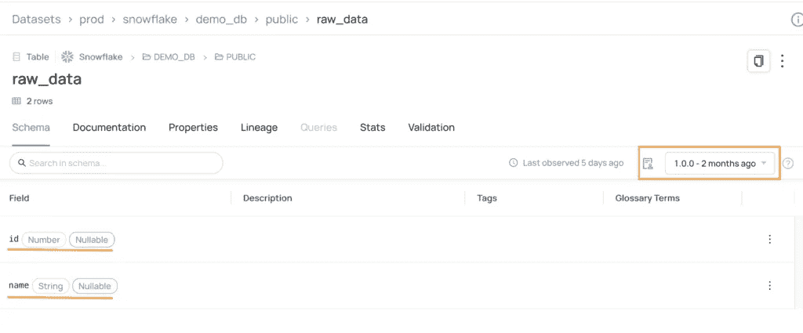
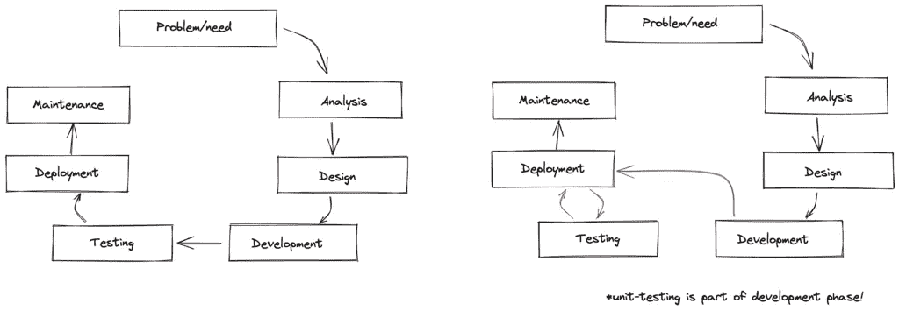

# 分析平台中的版本控制

> 原文：<https://blog.devgenius.io/versioning-in-analytics-platforms-7d9968d3e146?source=collection_archive---------2----------------------->

文章首发@ own your data . ai。

就像考古学家分析和揭示历史一样，我们也需要根据历史事实来分析和评估一件产品。产品的组件也被称为工件，它们的范围从架构图和文档到代码和数据。在本文中，您将了解需要版本控制的工件——将一个版本附加到工件上并能够在将来访问它的能力。这个特性不仅使您能够对您的工件的先前版本进行分析，而且它还提供了对您的产品演进的洞察。

# 代码版本控制

产品最重要的神器是(当然！)的代码。不管你是基础设施工程师、软件工程师还是数据工程师，你都是写代码的。代码有其专用的源代码管理范例。[1]你可能已经听说过 git[2]，它是目前最常用的版本控制工具(还有许多其他工具[3])。我们中的一些人经历了使用 svn 的痛苦，并且很高兴 git 的存在，虽然它的灵感来自于 SVN！需要注意的是，当涉及到*大文件*时，这些实用程序有其局限性。

# 模式版本化

除了代码版本控制之外，web 应用程序和数据产品还有共同的模式版本控制。这两个应用程序都定义了保存数据的数据库模型，要么通过 SQL(带 DDL)，要么通过 SQLAlchemy/ Alembic/ Django 这样的包装器。但是，如果在 web 应用程序中，数据库模型/模式的代码足以进一步开发应用程序，那么在分析中，模式的元数据就是核心组件。

无论您如何[创建和部署](https://ownyourdata.ai/wp/programmatic-schema-management/)模式，analytics 都可以访问模式定义和版本，使您能够轻松地发现数据。因此，数据目录(和数据发现工具)处理模式的元数据，并以用户友好的方式显示它。例如，在 DataHub [4]中，我们可以很容易地看到表的当前版本，并在需要时检索以前的版本[5]:



# 数据版本化

对于 web 应用程序(或其他软件产品)产生的数据是否应该被认为是应用程序团队的产品，有一个长期的争论。长期以来，数据是分析平台的产物，而不是应用程序本身的产物，因为数据的版本化是分析中的一个常见过程，但在大多数软件应用程序中并不是必需的。当然，任何应用程序(应该)都有其数据的备份，但是数据版本控制不仅仅是能够从备份中检索所有数据。

在分析中，数据版本化是使您能够从过去获得洞察力的过程。根据定义，事件是不可变的，但是维度确实会随着时间而变化。维度是分析的核心:它们提供了事件的背景，告诉*“谁、什么、哪里、何时、为什么以及如何”* [6]。虽然维度是在 1996 年引入的，但它们仍然是在通常的业务设置中为您的事件带来时变背景的最有效方式。

关于数据版本控制的更多细节你可以在[这篇文章](/what-is-data-versioning-and-3-ways-to-implement-it-4b6377bbdf93)中找到，展示了实现它的 3 种方法【7】。

# 模型版本控制

长期以来，分析意味着数据仓库、商业智能和统计模型。例如，银行需要预测未偿还贷款的比率，他们需要有足够的预算来避免破产。这些是“传统的”数据科学模型，由数据工程师和统计学家在数据仓库中实现。“传统”数据科学模型的其他例子是所谓的基于规则的模型:基于 SQL 过滤器或 IF 条件计算的分数。这些模型 100%遵循上述版本化范例。

随着计算的突破，我们有了高级分析计划，这些计划涉及人工智能或更复杂的数据科学模型(如机器学习)。如果几年前这些类型的模型处于试验阶段，那么现在就需要部署到生产环境中，这就需要对模型工件进行一定程度的版本控制。更不用说我认为在我们生活的这个充满偏见的世界中，模型版本化是必须的！模型注册是支持模型版本控制的应用程序[8]，通过保持模型工件的跟踪和历史。

# 实验版本

虽然它与软件非常相似，但分析开发生命周期有一个重要的要求:访问*产品，如数据*。虽然在软件开发中，工厂可以很容易地伪造数据，但在分析中，这样做的工作量太大了:软件工程师处理 1 个单位的数据(1 个用户、1 个产品、1 个订单)，而数据(专业人员)处理大量数据(在一段时间内购买特定类别产品的特定用户)。

这就是数据(专业人员)在生产中“工作”的原因:他们最初在生产中运行查询并创建代码(即使他们并不真正影响“主要/主”数据和代码)。这意味着数据专业人员:

1.  重复劳动。通常，他们编写 SQL 来定义他们的解决方案。在他们验证解决方案之后，他们需要将 SQL 翻译成他们的执行框架(PL/SQL、过程、函数、dbt、Python、ETL 工具等)；
2.  仅在他们的解决方案影响到数据用户后，才接收对其解决方案的反馈。仅在主要数据受到影响后才收到负面反馈可能需要回滚或热修复，这在分析中需要更长的部署时间(大数据纠正非常耗时)；
3.  无法使用“快速失败”模式。反馈发生得太晚，见第 2 点。
4.  部署生产解决方案并不意味着持久，增加了技术债务。

我不认为解决方案是将所有生产数据都放在本地:数据隐私有人知道吗？

我不认为解决方案是每个人都习惯的接受环境:它通常只包含数据的某些部分，很少刷新，并且随着时间的推移，它会变得损坏或陈旧。

我确实认为一种前进的方式是 Nessie 项目提出的 git 类版本控制[9]。使用它，您可以从主数据分支创建分支，并在不影响主分支用户的情况下进行试验。

# 尼斯湖水怪实验分支

在软件工程中，我们有所谓的 alpha、beta、canary 版本(更不用说生产中的 A/B 测试):这意味着我们可以将代码部署到生产中，但不能让它真正对最终用户可用。那么，如果我们也可以在数据中采用这种部署风格，会怎么样呢？

让我们来看看 Nessie 是如何工作的，代码可在 Github [11]中找到:

```
def create_table(branch, spark_session):
    spark_session.sql(f"USE REFERENCE {branch} IN dev_catalog")
    spark_session.sql(
        "CREATE or REPLACE TABLE dev_catalog.iceberg_acid_example (  \
            time timestamp,  \
            produced_kwh decimal(18,2),  \
            reporting_date date, \
            reporting_month string ) \
        USING iceberg \
        PARTITIONED BY (reporting_month)"
    )

def load_data(branch, spark_session):
    spark_session.sql(f"USE REFERENCE {branch} IN dev_catalog")
    df_input = get_data(spark_session, "happy")
    df_input.write.\
        mode("overwrite").\
        format("iceberg"). \
        save('dev_catalog.iceberg_acid_example')
```

在上面这段代码中，有两个动作:

1.  在作为输入提供的分支中创建一个表
2.  给它加载一些数据

当用`branch=main`执行上述操作时，我们在主分支中创建表格。它看起来是这样的:

```
spark_session.sql("describe formatted dev_catalog.iceberg_acid_example").show(truncate=False)
+----------------------------+---------------------------------------------------+-------+
|col_name                    |data_type                                          |comment|
+----------------------------+---------------------------------------------------+-------+
|time                        |timestamp                                          |       |
|produced_kwh                |decimal(18,2)                                      |       |
|reporting_date              |date                                               |       |
|reporting_month             |string                                             |       |
|                            |                                                   |       |
|# Partitioning              |                                                   |       |
|Part 0                      |reporting_month                                    |       |
|                            |                                                   |       |
|# Metadata Columns          |                                                   |       |
|_spec_id                    |int                                                |       |
|_partition                  |struct<reporting_month:string>                     |       |
|_file                       |string                                             |       |
|_pos                        |bigint                                             |       |
|_deleted                    |boolean                                            |       |
|                            |                                                   |       |
|# Detailed Table Information|                                                   |       |
|Name                        |dev_catalog.iceberg_acid_example                   |       |
|Location                    |file:///app/output_data/nessie/iceberg_acid_example|       |
|Provider                    |iceberg                                            |       |
|Owner                       |root                                               |       |
+----------------------------+---------------------------------------------------+-------+
```

现在让我们创建一个特性分支:`feature_nessie`。分支是从 main 开始创建的，这意味着 main 中的所有对象都被复制到新分支中。复制是在元数据级别，因此没有重复的数据:

```
spark_session.sql("create branch feature_nessie IN dev_catalog FROM main").toPandas()
  refType            name                                               hash
0  Branch  feature_nessie  c7538dc1abd091cc44e0215cf3da4253e036d8ca83911f...
```

```
spark_session.sql("select * from dev_catalog.`iceberg_acid_example@main`").withColumn("file_name", input_file_name()).show(truncate=False, n=1)
+-------------------+------------+--------------+---------------+----------------------------------------------------------------------------------------------------------------------------------------+
|time               |produced_kwh|reporting_date|reporting_month|file_name                                                                                                                               |
+-------------------+------------+--------------+---------------+----------------------------------------------------------------------------------------------------------------------------------------+
|2022-01-01 07:02:47|0.00        |2022-01-01    |202201         |file:/app/output_data/nessie/iceberg_acid_example/data/reporting_month=202201/00000-1-6690dcf4-78d9-43e1-8f2a-fbe55a15eb10-00001.parquet|
+-------------------+------------+--------------+---------------+----------------------------------------------------------------------------------------------------------------------------------------+
only showing top 1 row

spark_session.sql("select * from dev_catalog.`iceberg_acid_example@feature_nessie`").withColumn("file_name", input_file_name()).show(truncate=False, n=1)
+-------------------+------------+--------------+---------------+----------------------------------------------------------------------------------------------------------------------------------------+
|time               |produced_kwh|reporting_date|reporting_month|file_name                                                                                                                               |
+-------------------+------------+--------------+---------------+----------------------------------------------------------------------------------------------------------------------------------------+
|2022-01-01 07:02:47|0.00        |2022-01-01    |202201         |file:/app/output_data/nessie/iceberg_acid_example/data/reporting_month=202201/00000-1-6690dcf4-78d9-43e1-8f2a-fbe55a15eb10-00001.parquet|
+-------------------+------------+--------------+---------------+----------------------------------------------------------------------------------------------------------------------------------------+
only showing top 1 row
```

有趣的是，Nessie 不会为 feature_nessie 表创建新目录，而是使用完全相同的位置:

```
branch = 'feature_nessie'
from src.data_processing_nessie import load_data
load_data(branch, spark_session)
```

```
spark_session.sql("describe formatted dev_catalog.`iceberg_acid_example@feature_nessie`").show(truncate=False)
+----------------------------+---------------------------------------------------+-------+
|col_name                    |data_type                                          |comment|
+----------------------------+---------------------------------------------------+-------+
|time                        |timestamp                                          |       |
|produced_kwh                |decimal(18,2)                                      |       |
|reporting_date              |date                                               |       |
|reporting_month             |string                                             |       |
|                            |                                                   |       |
|# Partitioning              |                                                   |       |
|Part 0                      |reporting_month                                    |       |
|                            |                                                   |       |
|# Metadata Columns          |                                                   |       |
|_spec_id                    |int                                                |       |
|_partition                  |struct<reporting_month:string>                     |       |
|_file                       |string                                             |       |
|_pos                        |bigint                                             |       |
|_deleted                    |boolean                                            |       |
|                            |                                                   |       |
|# Detailed Table Information|                                                   |       |
|Name                        |dev_catalog.iceberg_acid_example@feature_nessie    |       |
|Location                    |file:///app/output_data/nessie/iceberg_acid_example|       |
|Provider                    |iceberg                                            |       |
|Owner                       |root                                               |       |
+----------------------------+---------------------------------------------------+-------+
```

那么当我们删除一列并添加一些新数据时会发生什么呢？主分支保持不变，而特征分支反映了我们的变化:

```
df_input = df_input.drop("reporting_date")
spark_session.sql("alter table dev_catalog.`iceberg_acid_example@feature_nessie` drop column reporting_date")
df_input.write.mode("append").format("iceberg").save('dev_catalog.iceberg_acid_example')
```

```
spark_session.sql("select count(*) from dev_catalog.`iceberg_acid_example@feature_nessie`").withColumn("file_name", input_file_name()).show(truncate=False)
+--------+----------------------------------------------------------------------------------------------------------------------------------------+
|count(1)|file_name                                                                                                                               |
+--------+----------------------------------------------------------------------------------------------------------------------------------------+
|2732    |file:/app/output_data/nessie/iceberg_acid_example/data/reporting_month=202206/00000-5-bd1ebd16-cb5c-4e7d-a9ce-44868aef40f1-00006.parquet|
+--------+----------------------------------------------------------------------------------------------------------------------------------------+

spark_session.sql("select count(*) from dev_catalog.`iceberg_acid_example@main`").withColumn("file_name", input_file_name()).show(truncate=False)
+--------+----------------------------------------------------------------------------------------------------------------------------------------+
|count(1)|file_name                                                                                                                               |
+--------+----------------------------------------------------------------------------------------------------------------------------------------+
|1366    |file:/app/output_data/nessie/iceberg_acid_example/data/reporting_month=202206/00000-1-6690dcf4-78d9-43e1-8f2a-fbe55a15eb10-00006.parquet|
+--------+----------------------------------------------------------------------------------------------------------------------------------------+

spark_session.sql("select * from dev_catalog.`iceberg_acid_example@feature_nessie` order by time").show(n=2)
+-------------------+------------+---------------+
|               time|produced_kwh|reporting_month|
+-------------------+------------+---------------+
|2022-01-01 07:02:47|        0.00|         202201|
|2022-01-01 07:02:47|        0.00|         202201|
+-------------------+------------+---------------+
only showing top 2 rows
```

观察结果:

本例中 Nessie 的设置是`in memory`，这意味着每次容器停止时元数据都会丢失。查看文档了解如何使其持久化[11]。删除分支时，不会自动删除数据，只会删除与其关联的元数据。

# 生产实验:提案

考虑到您已经在利用代码版本管理，如果:

1.  主要分支的数据是官方数据
2.  CI/CD 管道管理两种部署类型:

*   主分支部署:影响主分支中的对象
*   要素分支部署:影响要素分支中的对象

3.两个部署管道都将遵循 CI/CD:单元测试和代码审查过程，但没有验收测试。

4.功能部署管道在功能分支上自动创建名为版本控制(提交)的分支，并且不允许在主数据分支表上部署任何更改(这可以通过数据访问权限来管理)

5.通过将代码合并到主代码分支*，这个特性就正式了。只有在对象是全新的情况下，才允许在特征分支和主分支之间合并数据，以避免用特征分支中的陈旧数据更新主数据分支*

6.当在 main 中合并要素代码分支时，将删除与其关联的数据对象(包括数据)

虽然这种方法不能帮助解决数据专业人员所做的重复工作，但它确实可以加快分析开发的迭代速度，并开启新的见解，如性能和成本指标。注意，这只是另一个分析实验！



从 SDLC 到实验生命周期

# 附录

1.  [版本控制](https://en.wikipedia.org/wiki/Version_control)
2.  [吉特](https://www.atlassian.com/git/tutorials/what-is-version-control)
3.  [代码版本控制工具列表](https://www.atlassian.com/git/tutorials/what-is-version-control)
4.  [数据中枢演示](https://datahubproject.io/docs/demo)
5.  [数据中心时间轴 API](https://datahubproject.io/docs/dev-guides/timeline)
6.  [尺寸建模](https://www.kimballgroup.com/data-warehouse-business-intelligence-resources/kimball-techniques/dimensional-modeling-techniques/)
7.  [数据版本化](/what-is-data-versioning-and-3-ways-to-implement-it-4b6377bbdf93)
8.  [车型注册处](https://www.phdata.io/blog/what-is-a-model-registry/)
9.  [尼西项目](https://projectnessie.org/)
10.  GitHub 演示版尼西
11.  [尼西配置](https://projectnessie.org/try/configuration/)