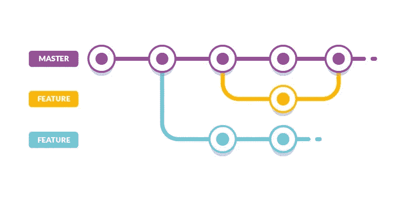

# 版本化 REST APIs。网络 6

> 原文：<https://blog.devgenius.io/versioning-rest-apis-in-net-6-7b3caeb6f14a?source=collection_archive---------14----------------------->



API 版本控制是一种实践，用于隔离对 API 所做的可能破坏现有消费者的更改。对 API 的更改是不可避免的，一旦您的 API 脱离生产并被数百个客户端应用程序使用，任何未版本化的突破性更改都可能是破坏性的，需要小心管理。版本控制让你以一种可控的方式做到这一点。

对 API 的突破性更改包括以下内容:

*   一个或多个呼叫的响应数据格式的改变
*   请求或响应类型的变化(例如，将整数变为浮点数)
*   删除 API 的任何部分。

有几种方法可以对 API 进行版本控制。让我们看看最突出的。

这种方法包括指定版本，如 v1、v2 等。在 API 本身的 URL 中。这是 API 版本控制最直接、最容易维护的形式。这也是目前最流行的版本控制方法。以下是一些例子:

> ***YouTube API***
> 
> 【https://developers.google.com/youtube/v3/docs】文档:[](https://developers.google.com/youtube/v3/docs)
> 
> ****sales force API****
> 
> **文档:*[*https://developer . sales force . com/docs/atlas . en-us . API _ rest . meta/API _ rest/intro _ curl . htm*](https://developer.salesforce.com/docs/atlas.en-us.api_rest.meta/api_rest/intro_curl.htm)*
> 
> **举例:*[*https://my domain name . my . sales force . com/services/data/v 56.0/s objects/Account*](https://MyDomainName.my.salesforce.com/services/data/v56.0/sobjects/Account)*

*在这种方法中，API 版本在查询字符串中传递。这方面的一个例子是*

> ****谷歌地图 API****
> 
> **文档:*[*https://developers . Google . com/maps/Documentation/JavaScript/versions*](https://developers.google.com/maps/documentation/javascript/versions)*
> 
> **举例:*[*https://maps.googleapis.com/maps/api/js?v=3.49&KEY = YOUR _ API _ KEY&callback = init map*](https://maps.googleapis.com/maps/api/js?v=3.49&key=YOUR_API_KEY&callback=initMap)*

*另一种方法是使用日期而不是数字，作为 URI API 的一个版本。这种方法被 Twilio 使用。*

> ****朱里奥****
> 
> **文献:【https://www.twilio.com/docs/usage/api/address?】*[*code-sample = code-create-an-address&code-language = node . js&code-SDK-version = 3 . x*](https://www.twilio.com/docs/usage/api/address?code-sample=code-create-an-address&code-language=Node.js&code-sdk-version=3.x)*
> 
> **举例:*[*https://API . twilio . com/2010-04-01/Accounts/{ Accounts id }/addresses . JSON*](https://api.twilio.com/2010-04-01/Accounts/%7bAccountSid%7d/Addresses.json)*

*最后一种版本控制方法是使用消息头，消费者应该在自定义消息头中传递版本号。头(例如，内容类型)允许您保留版本之间的 URIs(URL 路径保持不变),并且还可以用于返回链接的资源 URL 版本。*

*根据 [RMM Level 3 REST 原则:超媒体控件](https://en.wikipedia.org/wiki/HATEOAS)，您应该使用 HTTP Accept 和 Content-Type 头来处理数据版本以及描述数据。此外，纯 REST 原则规定，一个资源应该由一个且只有一个端点来标识，这可以通过基于头的版本控制非常有效地实现。*

> ****GitHub API****
> 
> **文档:*[*https://docs . github . com/en/rest/guides/getting-started-with-the-rest-API # using-headers*](https://docs.github.com/en/rest/guides/getting-started-with-the-rest-api#using-headers)*
> 
> **例子:接受:application/JSON；v=2**

*本文假设您已经安装了 Visual Studio 2022，并且熟悉创建 ASP.Net Web API 项目。*

*我们现在将在 ASP.Net web API 中使用请求头方法进行版本控制。安装**微软。AspNetCore . MVC . versioning**nu get 包。最简单的方法是通过软件包管理安装*

```
*PM/> Install-Package Microsoft.AspNetCore.Mvc.Versioning*
```

*现在打开 **Program.cs** 并添加以下代码行*

```
*builder.Services.AddApiVersioning();*
```

*现在构建并运行项目，并直接访问端点。*

*您将收到以下回复。*

*`"code": "ApiVersionUnspecified", "message": "An API version is required, but was not specified.", "innerError": null`*

*您的 API 项目被连接起来以支持版本控制，并在没有版本的情况下访问任何端点时返回 HTTP 400 响应。默认情况下需要追加**？api-request=1.0** 到 URL 以使其工作，就像这样:*

> *[https://localhost:7146/API/Listings？api-request=1.0](https://localhost:7146/api/Listings?api-request=1.0)*

*但是，这不是很直观。没有办法通过查看 swagger 文档来确定 API 期望使用这个查询字符串参数的版本。*

*解决这个问题的一种方法是在没有指定版本时设置一个默认版本。下面这段 ***Program.cs*** 中的代码可以完成这一点:*

*`builder.Services.AddApiVersioning(options => options.AssumeDefaultVersionWhenUnspecified = true; options.DefaultApiVersion = new ApiVersion(1, 0);`*

*现在，您将能够运行项目并浏览端点，而不会出现错误。*

***使用请求头进行版本控制***

*要使用定制请求头，您可以将 API 的 **ApiVersionReader** 设置为 **HeaderApiVersionReader** ，然后传入头名称。下面是代码的样子:*

*`builder.Services.AddApiVersioning(options => options.DefaultApiVersion = new ApiVersion(1, 0); options.ApiVersionReader = new HeaderApiVersionReader("X-Api-Version");`*

*现在尝试使用 [Postman](https://www.postman.com/) 或 Curl 调用 API 端点，并在请求中传递头部`X-Api-Version` 。*

*这就是在 ASP 中启用 API 版本控制所需要做的全部工作。Ner 核心 web API，并使用自定义请求头来版本化您的 API。*

*要了解更多关于剩余版本方案的细节，请订阅我的邮件列表和即将发布的电子书。*

*编程快乐！*

> *我最新的电子书出版了。这是一个循序渐进的指南，将教你如何用 MongoDB 后端和。网芯。用 NoSQL 数据库 Mongo DB 获得您的 [**副本**](https://www.amazon.com/dp/B0BT1Z8D4Z)*