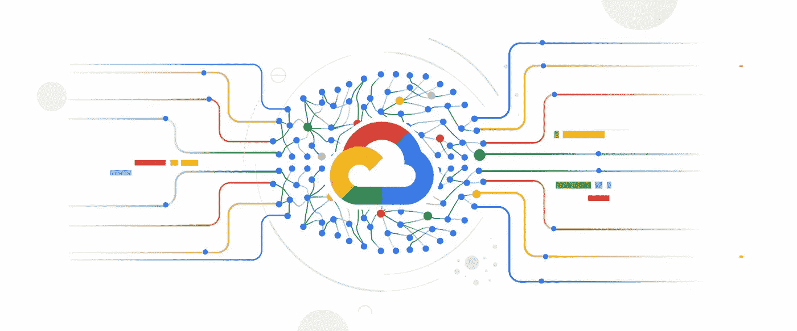
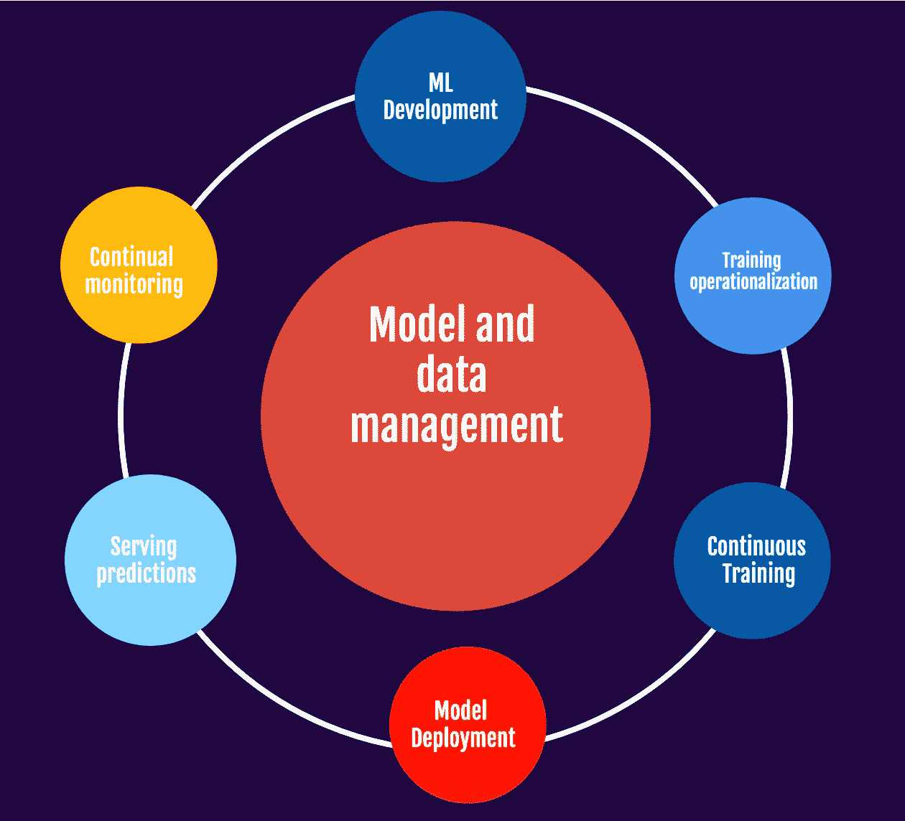
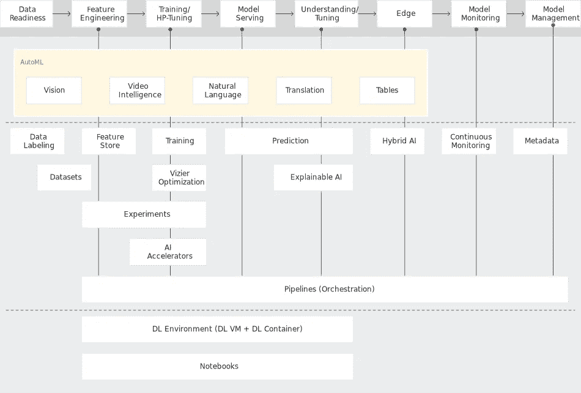

# 顶点人工智能

> 原文：<https://blog.devgenius.io/vertex-ai-a7bd387d73e0?source=collection_archive---------2----------------------->

图片来源:-[https://storage . Google APIs . com/gweb-Cloud blog-publish/original _ images/Cloud _ ai . jpg](https://storage.googleapis.com/gweb-cloudblog-publish/original_images/Cloud_AI.jpg)

在 5 月初的谷歌 I/O 开发者大会上，谷歌云宣布全球推出 Vertex AI，这是一个机器学习(ML)平台，使企业能够更快地部署和管理人工智能(AI)模型。借助 Vertex AI 上的机器学习操作(MLOps ),与竞争平台相比，训练模型所需的代码量减少了约 80%,允许各级工程师利用该技术在软件项目的所有阶段增加产出。

Vertex AI 的承诺是拥有一个允许公司从头到尾看到研发框架的环境。

有了 Vertex AI，这些问题将通过高度灵活的界面以及用于模型维护的 MLOps 资源的可用性来解决。此外，它声称能够将模型构建和培训所需的时间减少一半。使用 CloudML，用户可以将众多的 Google 服务融合到一个 UI 和 API 中来开发 ML。在一个统一的环境中，从研究到模式和预测的过渡可以更加无缝。

1.  在一个通用的用户界面中统一所有的 ML 工作流。
2.  有一些预先训练好的 API 可用于计算机视觉、自然语言处理、视频等。
3.  端到端集成数据
4.  支持来自所有开源社区的框架

利用 Vertex AI 通常涉及以下内容之一:

来源:谷歌人工智能

## 特征工程方法

我们的顶点特征库为服务、交换和复制 ML 特征提供了一个完整且功能齐全的特征注册库；监控、评估和探索顶点实验有助于加速模型选择；顶点张量板可用于模拟 ML 假设，顶点流水线可用于通过标准化 ML 流水线的开发和执行来简化 MLOps 过程。

## 训练和调整超参数

通过使用 AutoML 来确定图像、表格、文本或视频预测任务的最佳模型配置，或者通过使用存储库来制作不同的模型，从而自动化 ML 模型的开发，而无需编写代码。为了获得最佳预测结果，顶点维兹尔在顶点训练时优化训练的超参数。

**监控和管理模型**

持续监控持续监控模型的输出指标，并在它们偏离基线时向您发出警报。它诊断原因，触发模型的再训练路径，或者收集相关的训练数据。Vertex ML 提供的元数据通过自动监控顶点管道的每个模块的输入和输出，实现了对 ML 工作流的轻松检查和管理，以进行工件、背景和工作流跟踪。

**边缘管理器:**

借助 Vertex ML Edge Manager(测试版)，自动化工作流可以在各种部署场景、边缘条件和边缘假设之间进行优化。通过这种方法，您可以利用人工智能来开发跨公共云和私有云、数据中心和边缘的应用程序。

**服务、调音、理解模特**

通过将模型部署到开发中，无论是通过 HTTP 的数字分发还是批量评分的批量投影，顶点预测都可以简化模型部署。顶点预测可以在任何模型上实现(包括 TensorFlow、PyTorch、Scikit 和 XGB ),还可以使用大量内置工具监控模型输出。可解释的 AI 是一种工具，它可以通过使用一组内置的度量标准来测量模型评估和属性假设。可解释的人工智能向您推荐预测中每个输入属性的重要性。有几种方法可以使用这个特性，包括 AutoML 表、顶点预测和笔记本。