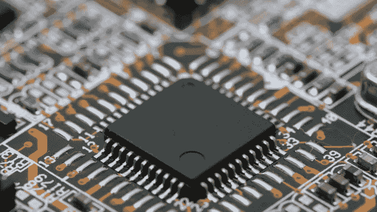
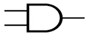

# VHDL —集成电路的语言。

> 原文：<https://blog.devgenius.io/vhdl-the-language-of-integrated-circuits-32bd15d0a679?source=collection_archive---------23----------------------->

> **简介**

VHDL 代表超高速集成电路硬件描述语言。它是一种编程语言，用于使用建模方法(如数据流建模、行为建模和结构建模)对数字电路进行建模。使用的建模方法有数据流建模、行为建模和结构建模。

> **VHDL 编程**

VHDL 程序基本上有三个部分，它们是

1.  图书馆
2.  实体
3.  体系结构

> **VHDL 库和包**

一组相关的过程和函数可以聚合到一个称为包的模型中。包可以在许多 VHDL 模型之间共享。该包还可以包含用户定义的数据类型和常数。库是相关包的集合。包和库充当函数、生产者和数据类型的存储库。而库是相关包的集合。在大多数 VHDL 程序中，我们使用库，例如:

图书馆 IEEE

使用 IEEE。std_logic_1164。全部

使用 IEEE。std_ logic_ singed.all

使用 IEEE。std_ logic_ arith。全部

“std_logic_1164”、“std_logic_signed”和“std_logic_arith”是包，IEEE 是库。

> **VHDL 实体和架构**

一个实体指定了指定设计和它运行的环境之间的接口。另一方面，架构是对内部设计操作的描述，它必须被分配给一个实体。体系结构只能分配给一个实体，但一个实体可以分配给多个体系结构。实体语句声明设计名称。和实体可以包含自己在 begin 关键字后声明的语句。那么它的声明可以由库和使用子句来处理。这样，包中定义的所有声明对实体都是可见的。

> **实体的语法**

实体和实体名称为

港口申报；

结束实体名称；

> **架构的语法**

实体名称的体系结构体系结构名称为

建筑 _ 装饰 _ 部分；

开始

声明；

结束体系结构名称；

> **VHDL 建模技术**

VHDL 编程中的 VHDL 建模技术，它们是数据流建模、结构建模和行为建模。

> **数据流建模**

在这种建模技术中，通过实体的数据流使用并发信号来表示。除此之外，仅使用运算符(AND、NOT、+、-)的赋值也可以用于代码的形成。在这个并发代码中，可以使用以下代码

经营者

WHEN / ELSE 语句

生成语句

BLOCK 语句

> **行为模型**

这种建模方法将实体的行为风格化为一组以指定顺序连续执行的语句。只有放在过程函数或过程中语句才是顺序的。流程函数和过程是唯一按顺序执行的黄金部分。行为语句是 great eastern 2 变量，也是受限制，应该只在顺序代码中使用。

> **结构建模**

在这种建模中，实体被描述为一组相互连接的组件。因为语句中的成分是并发语句，所以语句的顺序并不重要。在结构化建模体系结构中，主体由两部分组成:声明部分和陈述部分。

下面是一个简单的 VHDL 代码在与门上应用逻辑运算的例子。

> **与门**

标志

与门符号

> **VHDL 代码**

图书馆 ieee

使用 IEEE . STD _ logic _ 1164 . all；

实体 or1 是

端口(x，y:以位为单位；z:out 位)；

end or1

or1 的架构 ANKIT 是

开始

z<=x 或 y；

end ANKIT