# 使用 Python 进行视频游戏销售分析

> 原文：<https://blog.devgenius.io/video-game-sales-analysis-using-python-bf10102d8e44?source=collection_archive---------3----------------------->


在 [Unsplash](https://unsplash.com?utm_source=medium&utm_medium=referral) 上由 [Hitesh Choudhary](https://unsplash.com/@hiteshchoudhary?utm_source=medium&utm_medium=referral) 拍摄的照片

作者:约翰·伊克佩姆

这是一个案例研究，重点分析一段时间内视频游戏的销售情况，考虑了按游戏名称、发行商、地区等划分的销售量。

***这项研究的目的是发现视频游戏销售在流派、发行商&地区方面的趋势。***

这项研究使用的数据是开源的，并且是从 vgchartz.com[那里获得的。该数据集包含 1980 年至 2020 年间销量超过 100，000 份的视频游戏列表。点击](https://www.vgchartz.com/)下载该数据集[。我选择了这个数据集，因为它将是完成这项研究所必需的相关性。](https://www.kaggle.com/datasets/gregorut/videogamesales)

**字段包括:**

*   排名——总销售额的排名
*   名称—游戏名称
*   平台——游戏发布的平台(如 PC、PS4 等)。)
*   年份——游戏发行的年份
*   游戏的类型
*   发行商——游戏的发行商
*   NA_Sales —北美销售额(百万)
*   EU_Sales —在欧洲的销售额(以百万计
*   JP_Sales —日本销售额(百万)
*   Other_Sales —世界其他地区的销售额(百万)
*   Global_Sales —全球总销售额。

这个数据是一个。“csv”文件按行和列排列。数据以“zip”文件的形式从源下载，解压缩后存储在本地驱动器上。

用于此分析的工具是 Python，位于 Jupyter 笔记本 IDE 上。首先，我们导入本研究所需的所有工具，并将数据集导入 Jupyter notebook。虽然这篇文章中包含了一些代码片段，但是您可以在这里访问完整的代码。

```
import pandas as pd
import matplotlib.pyplot as plt
import seaborn as sns
import numpy as np
import plotly.express as px
import plotly.graph_objects as godata=pd.read_csv(r'C:\Users\HI\Downloads\Compressed\archive_11\vgsales.csv')
data.head()
```

数据集位于我的本地驱动器 C:上，在下载目录下。

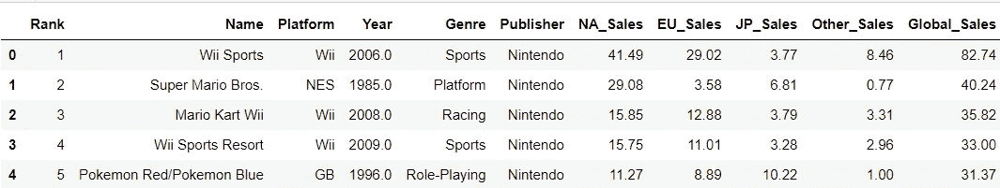

**检查缺失值**

接下来，我们检查数据集中缺失的值或列。这将提高我们分析的准确性。

```
data.isnull().sum()
```

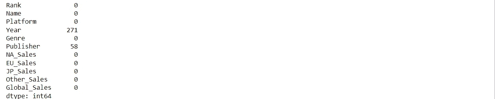

由于我们的缺失值在“年份”和“出版商”项下，相对来说可以忽略不计，因此在研究这些参数时，这些值将被排除在研究之外。然而，由于游戏名称和销售额的输入是可用的，所以它们在研究中很重要。因此，我们不会将这些整列排除在研究之外。

# **1。2006 年& 2009 年哪些游戏销量最高？**

首先，我们需要找到 2006 年和 2009 年每年销售额最高的游戏。我们的目标是查看每年的前五(5)名。

**一、2006 年**

```
twosix=data[data.Year==2006]
twosix=twosix.sort_values('Global_Sales',ascending=False).head(5)
twosix
```

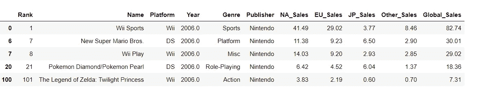

出于形象化的目的，我将在一个条形图中展示它。

```
figure=px.bar(twosix,x='Name',y='Global_Sales',
             title="Best selling games in 2006")
figure.show()
```

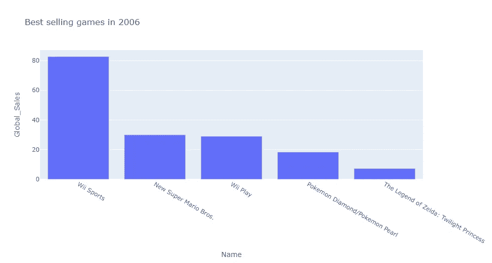

2006 年最畅销的游戏

从这张图表来看，2006 年销量最好的游戏是《Wii Sports 》,销量超过 8000 万份，其次是《新超级马里奥兄弟》,销量为 3000 万份。对 Wii 来说，这是很棒的一年,“Wii Play”位居第三。

**二世。2009 年**

```
twonine=data[data.Year==2009]
twonine=twonine.sort_values('Global_Sales',ascending=False).head(5)
twonine
```

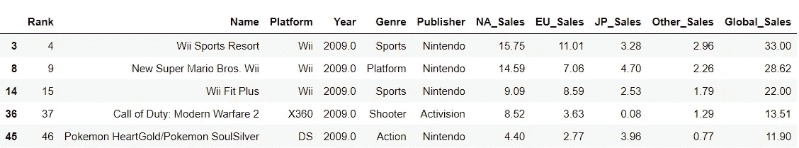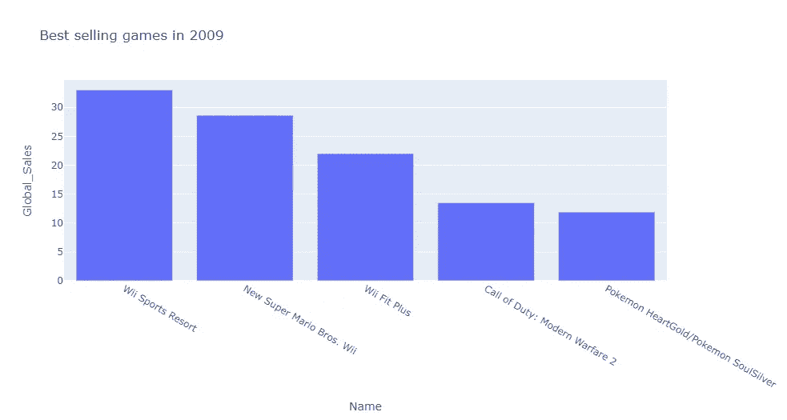

2009 年最畅销的游戏

从这张图表来看，“Wii Sports Resort”在 2009 年占据榜首，销量超过 3000 万册，“新超级马里奥兄弟 Wii”销量约为 2800 万册，位居第二。

# 2.表现最好的流派有哪些？

接下来，我们将找出这一时期哪些流派销量最高。寻找前五名(5):

```
genre=data.groupby('Genre').sum()['Global_Sales'].reset_index()
genre=genre.sort_values('Global_Sales',ascending=False).head(5)
genre
```


```
figure4=px.bar(genre,x='Genre',y='Global_Sales',
              title="Best performing genre")
figure4.show()
```

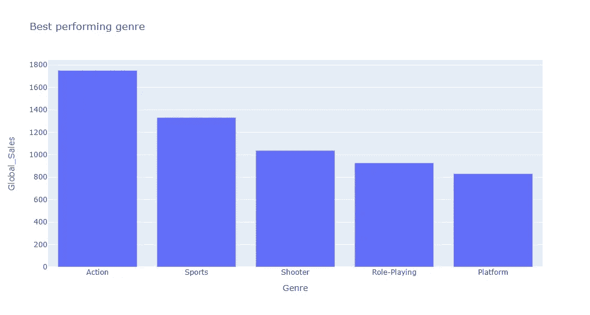

最佳表演游戏类型

动作游戏是这个时间段最受用户欢迎的游戏，全球售出超过 17 亿份动作游戏。其次是体育，13 亿份，第三是射击游戏，10 亿多份。

# 3.表现最好的平台有哪些？

```
#Best performing platformsplatform=data.groupby('Platform').sum()['Global_Sales'].reset_index()
platform=platform.sort_values('Global_Sales',ascending=False).head(5)
platform
```

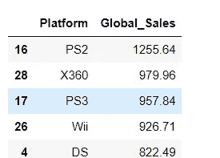

```
figure2=px.bar(platform,x='Platform',y='Global_Sales',
              title="Platforms with most sales")
figure2.show()
```

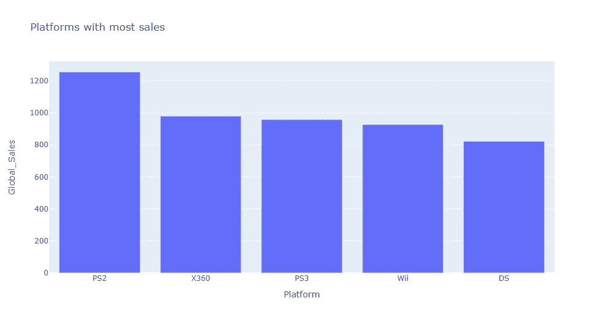

销售额最高的平台

《PS2》是 PlayStation 系列游戏中的第二个版本，创下了 12 亿多份的最高销量，其次是微软的 Xbox 360，销量超过 9 亿份。

# 4.世卫组织是表现最好的出版商？

出版商对销售有很大的影响，因为客户与出版商的关系是基于他们的历史和声誉。使用我们的数据集，我们将找出这一时期表现最好的出版商。

```
publisher=data.groupby('Publisher').sum()['Global_Sales'].reset_index()
publisher=publisher.sort_values('Global_Sales',ascending=False).head(5)
publisher
```

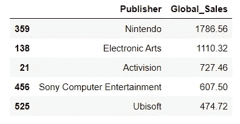

```
figure13=px.bar(publisher,x='Publisher',y='Global_Sales',
              title="Best performing publisher")
figure13.show()
```

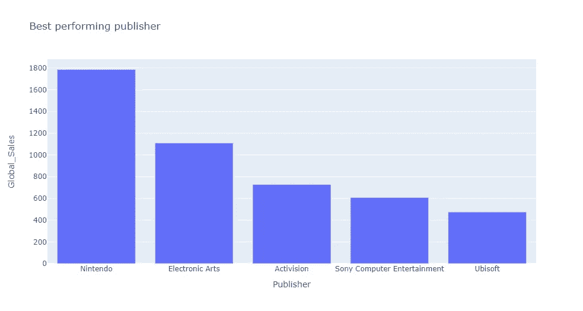

最佳表现出版商

任天堂以超过 17 亿份的销量在受欢迎的出版商中占据销量榜首。紧随其后的是艺电(Electronic Arts)，销量超过 11 亿份，位居第二；动视(Activision)位居第三，销量超过 7 亿份。

# **5。世卫组织是不同地区最好的出版商？**

接下来，我们将了解这些出版商在不同地区的表现，其中北美、欧洲和日本是我们的主要关注区域。

```
#Top 3 publishers in Japan, Europe, North America & Other parts of the worldpubreg=data.groupby('Publisher').agg({'JP_Sales':'sum','EU_Sales':'sum','NA_Sales':'sum','Other_Sales':'sum'})
pubreg=pubreg.sort_values('NA_Sales',ascending=False).head(3)
pubreg
```

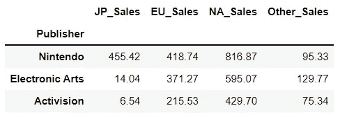

为了更直观，我将使用分组条形图来显示比较。

```
pubreg.plot(kind='bar',figsize=(15,8))
plt.xlabel('Publisher')
plt.ylabel('Sales')
plt.title('Video Game Sales Per Region from Publishers')
```

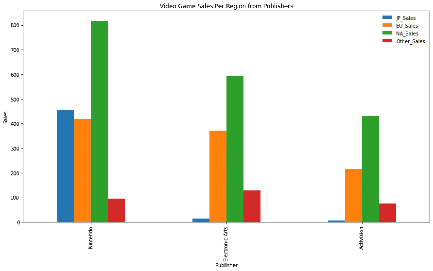

发行商在每个地区的视频游戏销售额

从上面的图表来看，大部分销售记录在北美，分别来自三大出版商任天堂、艺电和动视。

# 6.不同地区性能最佳的平台

最后，我们确定我们每个流行的游戏平台在这些地区的表现。

```
#Best performing platforms in all regionsplatreg=data.groupby('Platform').agg({'JP_Sales':'sum','EU_Sales':'sum','NA_Sales':'sum','Other_Sales':'sum'})
platreg=platreg.sort_values('NA_Sales',ascending=False).head(5)
platreg
```

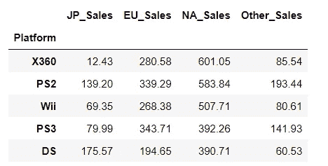

```
platreg.plot(kind='bar',figsize=(15,8))
plt.xlabel('Platform')
plt.ylabel('Sales')
plt.title('Best Performing Platforms in Regions')
```

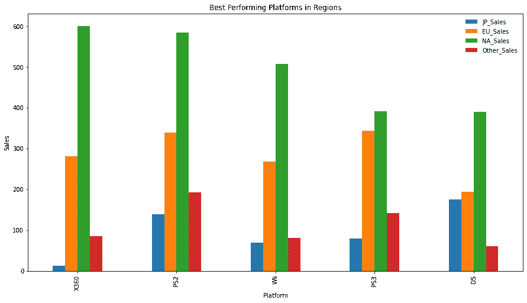

每个地区性能最佳的平台

Xbox 360 是北美最成功的平台，游戏销量超过 6 亿份。紧随其后的是 PS2，发行量刚刚超过 5.8 亿份。与其他受欢迎的平台相比，任天堂的 DS 在日本销量最高。

# 分析:

1.  与其他发行商相比，任天堂在日本的销量更高。这可能是因为营销距离近，因为他们的总部设在日本京都。尽管如此，任天堂在世界其他地区的销售额仍然高居榜首。
2.  动作游戏是最受欢迎的游戏类型。
3.  2006 年发布的 Wii Sports 是有史以来最畅销的游戏。它的成功可以说是由于它的发布时间是在 2006 年冬季奥运会期间，并且它是“运动”类型中的第一个同类概念。
4.  视频游戏的销售/成功高度依赖于它在北美的成功。