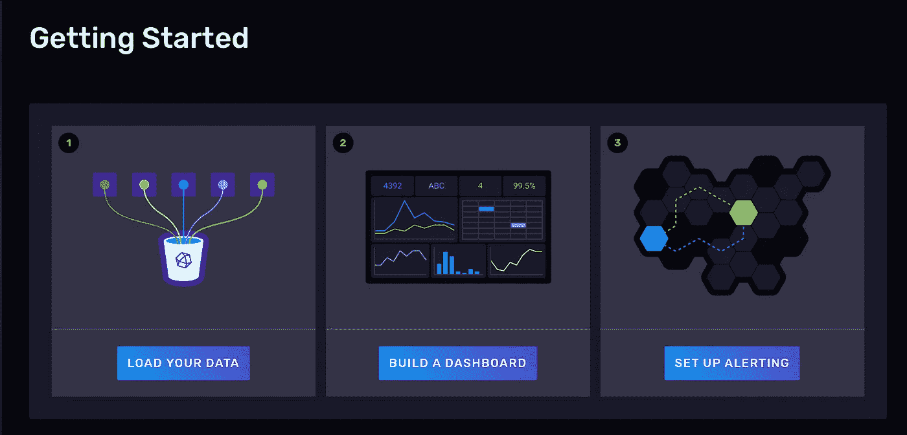
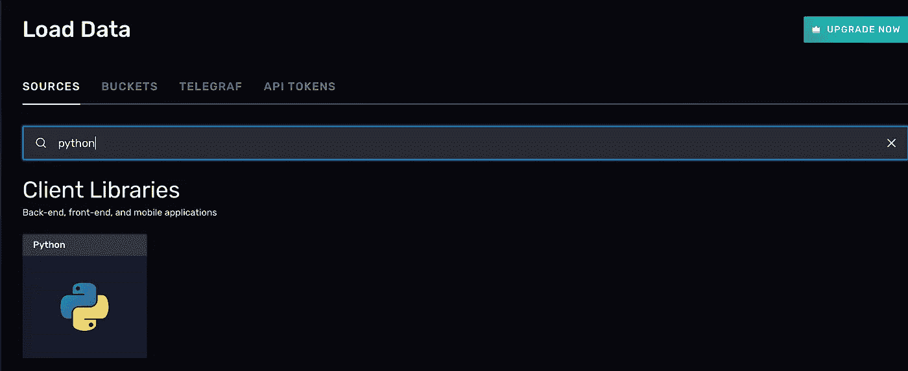

# Viessmann 锅炉数据流入数据库云

> 原文：<https://blog.devgenius.io/viessmann-boiler-data-to-influxdb-cloud-a9f66042663d?source=collection_archive---------8----------------------->

## 如何获取 Viessmann API 数据，将其推送到 InfluxDB 云并创建仪表板


卢卡斯·布拉塞克在 [Unsplash](https://unsplash.com?utm_source=medium&utm_medium=referral) 上的照片

今年夏天，我搬进了新装修的房子。因为这是一个到处都是砖块和石头的非常古老的乡村房子，所以供暖系统是由地板下的供暖系统制成的，而不是墙壁散热器。热水器是一台 **Vitodens 200-W** ，一台燃气壁挂式冷凝锅炉，配有调制缸燃烧器，是 Viessmann 公司的旗舰产品。

这款机型包括 **WiFi 连接**和一个配套应用程序，可以设置加热器热水温度，并检查按日、周、月和年分组的燃气和电力消耗历史。

这太棒了，但在锅炉触摸屏上，我可以读取更多关于性能的实时细节:**输送温度，热水温度，火焰燃烧器调制，外部传感器温度，燃烧器小时数，燃烧器启动**。为什么在 app 上看不到这个数据？为什么锅炉上连历史数据都没有？

首先，我们必须在 [Viessmann 开发人员门户](https://developer.viessmann.com/en/doc/getting-started)API 上创建一个帐户，该帐户是免费的，每日调用限制为 **1450 次**，可以用于除商业目的以外的任何用途。

然后我们将需要 [**PyViCare**](https://github.com/somm15/PyViCare) ，一个 Python 库，通过官方 API 轻松访问 Viessmann 设备。

# **Viessmann API 实现**

打开**终端**，运行以下命令:

```
sudo pip3 install PyViCare
```

让我们导入这个库，在 Viessmann 开发人员门户上用 API 凭证创建一个新实例，并获得第一个可用的设备(如果您有多个设备，您必须更改这一部分)。

现在，让我们来了解一下该设备的一些基本信息和一些有趣的统计数据。我们将获取并打印**设备型号、燃烧器启动、燃烧器状态标志、火焰调制、主加热器温度和热水温度**，代码如下:

```
print(viDevice.getModel())
print(viDevice.asGazBoiler().burners[0].getStarts())
print(viDevice.asGazBoiler().burners[0].getActive())
print(viDevice.asGazBoiler().burners[0].getModulation())
print(viDevice.asGazBoiler().getBoilerCommonSupplyTemperature())
print(viDevice.asGazBoiler().getDomesticHotWaterStorageTemperature())
```

这是我的案例的结果:


我终于不用下楼就能在电脑上看到实时数据了，但这还不够。你还记得我也想要史料吗？那么我们需要一个数据库！

# InfluxDB

来自维基百科:“ *InfluxDB 是由 InfluxData 公司开发的开源时间序列数据库。它是用 Go 编程语言编写的，用于存储和检索运营监控、应用度量、物联网传感器数据和实时分析等领域的时间序列数据。*

你可以通过下载 **docker 镜像**，从[官方下载页面](https://portal.influxdata.com/downloads/)获取，或者你可以选择新的**云解决方案**来自行托管。

由于我不想在我可怜的 Raspberry PI 4 上安装另一个服务，并且 [**自由层**](https://github.com/influxdata/influxdb) 已经足够了，我将使用**第二个选项**！

作为第一步，您必须在 [InfluxDB Cloud](https://www.influxdata.com/get-influxdb/) 上创建一个新帐户。然后你需要在 ***入门*** 页面选择 ***加载你的数据*** 。



在搜索框中键入“ ***Python*** ”，然后单击那里唯一可用的库:



在下一页，创建一个**新令牌**(注意；您很快就会需要它)和一个专门针对此应用的新铲斗。

然后，打开**终端**，运行以下命令安装所需的**库**:

```
sudo pip3 install influxdb_client
```

回到代码，创建一个新文件(我将其命名为 main.py ),复制并粘贴“*初始化客户端*”部分。在这里你会找到你的**令牌**、**组织**和**桶**信息。


现在是时候创建一个新的***InfluxDBClient***了，将令牌和 org 作为参数传递，并传递一个 ***write_api*** 实例。

```
token = “YOURTOKEN”
org = “YOURORGANIZATIONAME”
bucket = “YOURBUCKETNAME”client = InfluxDBClient(url=”https://us-east-1-1.aws.cloud2.influxdata.com", token=token, org=org)write_api = client.write_api()
```

我们现在可以创建一个 ***点****的单个数据记录，类似于 SQL 数据库表中的一行。每个点都有一个**测量值**，一个**标签集**，一个**字段关键字**，一个**字段值**，一个**时间戳，**以及唯一标识它的系列和时间戳。最后，我们可以将这个点发送到端点。*

```
*burnerStarts = viDevice.asGazBoiler().burners[0].getStarts()
pBurnerStarts = Point(“Boiler”).tag(“host”, “host1”).field(“StartsNumber”, burnerStarts)write_api.write(bucket=bucket,org=org,record=pBurnerStarts)*
```

# *运行并测试它*

*是时候**运行脚本**了！打开一个终端，移动到项目目录，并执行它:*

```
*python3 main.py*
```

*回到 InfluxDB Cloud " ***数据浏览器*** *"* 页面，应该可以看到刚刚发送的数据，过滤为**度量**、**字段**，以及**主机**。*

**

*下面你可以找到**完整代码**和一些**附加字段**，我发现它们对我的情况很有帮助:*

# *仪表盘*

*现在，您已经准备好创建一个仪表板，将所有这些统计数据作为一个**图表**、**仪表**、**热图**、**直方图**或**简单表格**。*

*这是最终的预期结果:*

**

# ***最后一项改进***

*当然，我不想每隔五分钟就手动运行这个脚本。这就是为什么我把这个脚本作为 cronjob 添加到我的 Raspberry PI 上！*

*该命令将在编辑模式下打开 **cron 调度程序**文件:*

```
*crontab -e*
```

*并且通过这一行，它会每 5 分钟执行 *main.py* 脚本**。如果你想要它更频繁/更不频繁，你可以**改变前五个星号**，使用[这个站点](https://crontab.guru/)来生成正确的值。***

```
**/5 * * * * python3 /home/pi/main.py*
```

*[](https://www.buymeacoffee.com/nicolidomenico)*

## ***感谢您的阅读！***