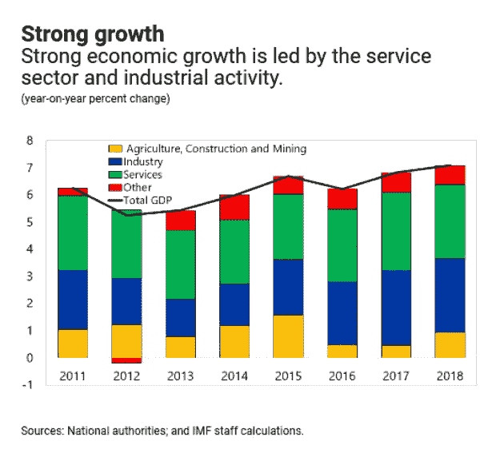
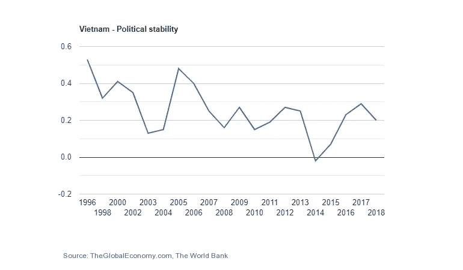
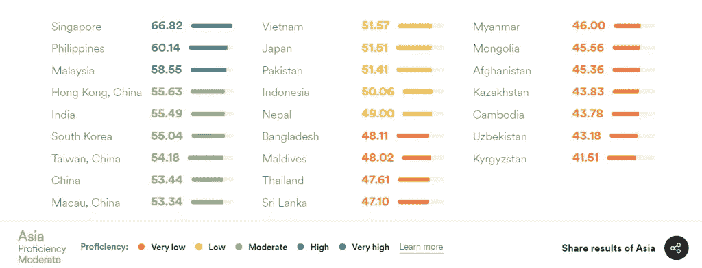

# 越南——一个受欢迎的敏捷软件外包目的地

> 原文：<https://blog.devgenius.io/vietnam-a-popular-agile-software-outsourcing-destination-67a64d9ed340?source=collection_archive---------34----------------------->

凯利·西克玛在 [Unsplash](https://unsplash.com?utm_source=medium&utm_medium=referral) 上的照片

如今，越南在软件外包行业已经非常成功。据预测，它有可能成为东南亚的软件开发和创新中心。

# 越南 IT 软件外包史上的一次飞跃

几年前，当 Oracle、Intel 和 Nash Harvey 等知名技术公司开始在越南投资高科技人力资源时，越南的 IT 外包行业被评估为具有潜力。如今，越南在软件外包行业已经非常成功。据预测，它将成为东南亚的软件开发和创新中心。
抓住国家的优势，除了出台政策鼓励技术开发和投资，越南政府还投资 STEM 教育模式，提高专业技术工程师的素质。
根据 A.T. Kearney 的数据，2017 年，越南在全球服务地点指数中上升了 5 位，从第 11 位升至第 5 位，成为全球外包服务最具吸引力的 55 个国家之一。的确，越南在敏捷软件外包产业上取得了显著的进步，逐渐成为印度的竞争对手。

# 敏捷软件外包需要考虑的因素

## 充满活力的高素质劳动力

越南年轻劳动力占总人口的 34%。他们是年轻、有活力和创造力的人，优势是敏捷、果断和对时代潮流敏感。与印度相比，该行业的劳动力成本低 30%至 35%。

越南政府大力鼓励外商投资企业(FIE)和国内企业进行技术开发和投资，出台了税收优惠政策、土地租金优惠政策、基础设施租赁政策、金融支持政策、人力资源开发培训政策等。

此外，这支劳动力队伍的质量保证是来自全国 290 所 IT 大学的毕业生。十年前，一家公司的 IT 员工只有 200–300 人。现有员工 1000 多人，这反映了当今越南外包产业的积极发展。

## 经济、政治稳定

自 2007 年加入世贸组织，成为 APEC 成员，并于 2006 年和 2017 年领导 APEC 以来，越南在管理公共债务和创造财政空间方面做出了显著努力。此外，越南经济也逐渐从传统农业向工业和服务业转型，*“从 2014 年的年均 6.6%，到 2018 年达到 7.1%的十年高点”*——根据国际货币基金组织(IMF)。

根据 ValueChampion 的一项研究，在政治局势方面，越南在 APAC 地区最安全的国家中排名前十(第八)。显然，越南是一个理想的“天堂”,可以创造一个稳定、安全的工作环境，并将项目运营中的风险降至最低。

## 文化兼容性

文化在许多方面的更新、整合和适应过程为越南多样化和丰富的文化发展创造了新的动力。
作为软件开发领域的潜在候选人，越南在培训符合国际工作标准的人力资源方面仍然面临困难和挑战。 [**IDS 软件**](http://idsoftware.biz/about-us) 坚信成败在于个人和企业双方的能力和努力。
认识到这些挑战， [**IDS Software**](http://idsoftware.biz/about-us) 一直致力于提供更好的技术来改善我们的社区。

## 英语交流能力

这些年来，越南的英语水平指数有所提高。仅在 7 年内，这个国家就从低水平发展到了平均水平。认识到英语在经济一体化中的重要性，越南政府一直认真关注教育系统的质量，并通过有效的课程鼓励人们。未来，越南有望在教育质量排名中排名更靠前。

# 敏捷软件外包到越南的惊人事实

*   越南是亚洲一级新兴市场所在地，也是外包业务的前五大地点之一(2016 年 Gartner 全球领先离岸服务地点)
*   美国有 2000 万移动用户使用越南人写的通话软件；英国有 400 万儿童正在使用越南工程师编写的教学软件。
*   400.00 福特汽车使用越南制造的移动软件。
*   2 亿谷歌用户正在使用越南开发者提供的照片标签软件进行在线搜索。
*   越南的一些专业软件目前帮助世界安全运行，并在世界各地广泛使用。
*   胡志明市连续 8 年位列外包城市前 20 名(Tholons，2009–2016)
*   越南在全球离岸外包热点中排名第三，在竞争成本中排名第一(Tower Watson，2013 年服务离岸外包排名)
*   越南在开拓性地点和成本环境方面排名第一(高纬环球业务流程外包和成形服务地点指数，2016–2017)
*   越南是日本公司最青睐的离岸目的地(Resorz 有限公司，2016 年)

[***IDS 软件***](http://idsoftware.biz) *是越南一家敏捷软件开发外包公司。我们有超过 5 年与来自欧洲、美洲和亚洲的全球客户合作的经验。我们公司为不同的 IT 需求提供端到端的软件开发服务。客户对我们服务的信任:* ***美国运通*** *，* ***Belga，Berluti，Stripe，Superdesk，Reserv，Endava，Evolus，11 月 5 日等。***