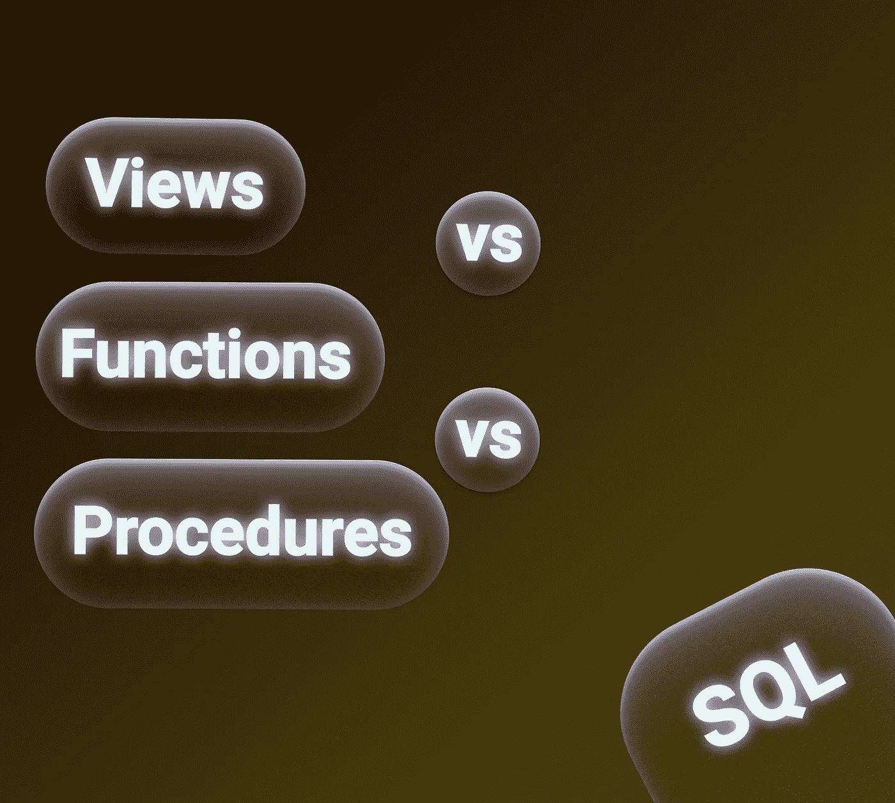
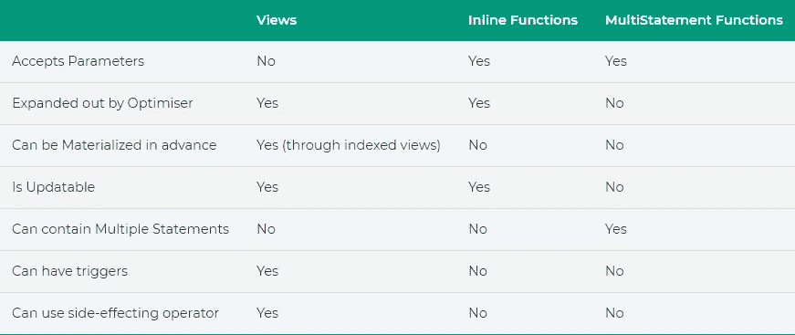
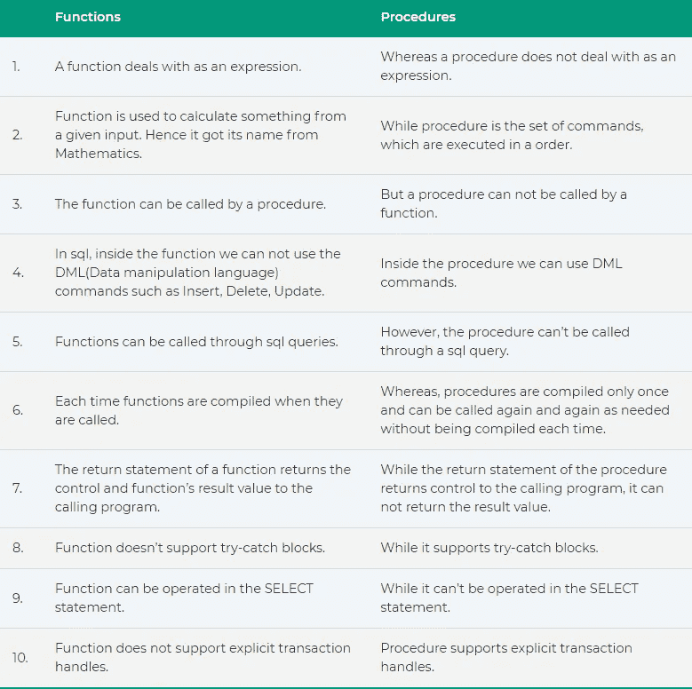

# 视图对函数对过程(SQL)

> 原文：<https://blog.devgenius.io/views-vs-functions-vs-procedures-sql-91f2e16d0546?source=collection_archive---------0----------------------->

嗨，开发者们！

SQL Server 有几种方法来存储查询以供以后执行—视图、函数、过程。它让我们的生活更轻松，让我们遵循**不要重复自己(干**)的原则。

让我们来看看视图、函数和过程之间的主要区别。

**视图 vs 功能**

摘要:视图和函数几乎服务于相同的目的。但是主要的区别是函数可以接受参数，而视图不能。此外，用户定义函数的输出可以直接在 SELECT 子句中使用，而不能在视图中使用。

**功能 vs 程序**

摘要:函数返回一个值，可以被过程调用，在 SELECT 语句中使用，只要被调用就编译，而过程只执行命令，编译一次，可以使用 DML 命令。

快乐编码:)

# 学到了新东西？

如果你喜欢这篇文章，可以 [**给我买杯咖啡**](https://www.buymeacoffee.com/stasoz) 我写下一篇文章的时候再喝:)

*更多内容尽在*[*blog . dev genius . io*](http://blog.devgenius.io)*。*