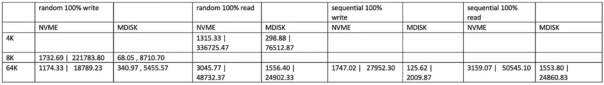

# 基于云的虚拟机磁盘性能测试

> 原文：<https://blog.devgenius.io/virtual-machine-disk-performance-testing-on-cloud-b7a7c2e62a6f?source=collection_archive---------6----------------------->

如今，主要的云提供商提供许多托管服务，甚至是无服务器计算，让您不必担心管理基础架构和关心底层硬件(CPU、内存、磁盘、网络)。然而，仍然有许多传统工作负载假设有一台服务器。在这种情况下，当将 onprem 工作负载迁移到云时，您必须使用 IaaS 和 lift-and-shift，这意味着您自己需要关心服务器性能。

# 语境

本文讨论了测量服务器磁盘性能的基本概念和工具。工作负载是一个定制的数据库软件。通常，数据库性能取决于 CPU、内存，但最重要的是磁盘性能(因为通常数据库有很多读/写活动。如果您的磁盘很慢，并且您进行了大量的磁盘读/写操作，那么总体性能将是次优的。因此，我们希望选择提供最佳性能的磁盘。

# Azure 上的磁盘类型

非托管磁盘:它是 Azure 上最老的产品。一般你需要创建 Azure blob 存储和[页面 blob](https://azure.microsoft.com/en-us/pricing/details/storage/page-blobs/) ，你得自己管理。

托管盘:后来 Azure 提供了[托管盘](https://docs.microsoft.com/en-us/azure/virtual-machines/disks-types)。呈现给你的是一个“磁盘”，而不需要关心“页面 blob”。不同的层提供不同的性能级别。我认为它是由 Azure 存储支持的。你可以看看这篇[文章](https://docs.microsoft.com/en-us/azure/virtual-machines/disks-types)。

本地 NVMe SSD:这是最新的产品，磁盘是虚拟机的“本地”磁盘。它是由这个 [Azure VM SKU](https://docs.microsoft.com/en-us/azure/virtual-machines/lsv2-series) 提供的。据微软称，磁盘 IOPS 和吞吐量是这一类别中最好的。

# 磁盘测试概念

通常，当您比较磁盘性能时，有 3 个最重要的指标是您需要的，即 IOPS、吞吐量和延迟。以下两篇文章是很好的参考。

[](https://www.sqlshack.com/using-diskspd-to-test-sql-server-storage-subsystems/) [## 使用 Diskspd 测试 SQL Server 存储子系统

### 2020 年 7 月 28 日在本文中，我们将了解如何使用 Diskspd 测试我们的存储子系统性能。的…

www.sqlshack.com](https://www.sqlshack.com/using-diskspd-to-test-sql-server-storage-subsystems/) [](https://www.sqlshack.com/how-to-analyze-storage-subsystem-performance-in-sql-server/) [## 如何分析 SQL Server 中存储子系统的性能

### 2017 年 2 月 23 日为了提高性能，数据库管理员通常会在除分析存储之外的各个方面进行搜索…

www.sqlshack.com](https://www.sqlshack.com/how-to-analyze-storage-subsystem-performance-in-sql-server/) 

其他概念是 I/O(输入/输出):

[块大小](https://medium.com/@duhroach/the-impact-of-blocksize-on-persistent-disk-performance-7e50a85b2647):I/O 操作时的数据单位。你可以想一想管道的直径，越高，在同样的单位时间内，可以通过的数据越多。

随机 I/O 与顺序 I/O:这些是数据访问模式。出自[本文](https://www.tech21century.com/sequential-vs-random-access-drives/)、 [2](https://condusiv.com/sequential-io-always-outperforms-random-io-on-hard-disk-drives-or-ssds/) 顺序访问一个数据文件是指计算机系统顺序地读取或写入信息到文件，从文件的开头开始，一步一步地进行。另一方面，对文件的随机存取意味着计算机系统可以在数据文件的任何地方读取或写入信息。由于磁盘是一个物理设备，并使用磁盘头来访问信息，要进行随机访问，它需要将磁盘头移动到准确的位置，因此通常随机 I/O 比顺序 I/O 慢得多。然而，对于数据库，一般读/写是随机的，但对于备份，它是顺序的。

[未完成的 I/O](https://louwrentius.com/understanding-storage-performance-iops-and-latency.html) :存储子系统通常为 I/O 请求维护一个队列。高队列深度可能表示存储子系统无法处理工作负载

磁盘测试实用程序具有这些选项的标志，以模拟不同的工作负载。理解这些标志对于了解您要测试什么是很重要的。

# 使用本地 NVMe SSD 和托管磁盘调配 Azure 虚拟机

我们想比较本地 NVMe SSD 和托管磁盘的性能。以下是我们用来为虚拟机提供托管磁盘的示例(我们使用 [bastion 主机](https://azure.microsoft.com/en-us/services/azure-bastion/)来访问虚拟机，因为客户端环境不允许虚拟机上的公共 IP，我们使用 Ubuntu 操作系统)

```
provider “azurerm” {
 # The “feature” block is required for AzureRM provider 2.x.
 # If you are using version 1.x, the “features” block is not allowed.
 version = “~>2.0”
 features {}
}

locals {
 myterraformgroup = “rg1 “
}

resource “azurerm_virtual_network” “myterraformnetwork” {
 name = “myVnet”
 address_space = [“10.0.0.0/16”]
 location = “eastus”
 resource_group_name = local.myterraformgroup

 tags = {
 environment = “Terraform Demo”
 }
}

# Bastion subnet
resource “azurerm_subnet” “bastionsubnet” {
 name = “AzureBastionSubnet”
 resource_group_name = local.myterraformgroup
 virtual_network_name = azurerm_virtual_network.myterraformnetwork.name
 address_prefixes = [“10.0.200.0/27”]
}

resource “azurerm_public_ip” “bastionip” {
 name = “bastionip”
 location = azurerm_virtual_network.myterraformnetwork.location
 resource_group_name = local.myterraformgroup
 allocation_method = “Static”
 sku = “Standard”
}

resource “azurerm_bastion_host” “bastionhost” {
 name = “myvmbastion”
 location = azurerm_virtual_network.myterraformnetwork.location
 resource_group_name = local.myterraformgroup

 ip_configuration {
 name = “configuration”
 subnet_id = azurerm_subnet.bastionsubnet.id
 public_ip_address_id = azurerm_public_ip.bastionip.id
 }
}

# Create worker subnet
resource “azurerm_subnet” “myterraformsubnet” {
 name = “mySubnet”
 resource_group_name = local.myterraformgroup
 virtual_network_name = azurerm_virtual_network.myterraformnetwork.name
 address_prefixes = [“10.0.1.0/24”]
}

# Create Network Security Group and rule
resource “azurerm_network_security_group” “myterraformnsg” {
 name = “myNetworkSecurityGroup”
 location = “eastus”
 resource_group_name = local.myterraformgroup

 security_rule {
 name = “SSH”
 priority = 1001
 direction = “Inbound”
 access = “Allow”
 protocol = “Tcp”
 source_port_range = “*”
 destination_port_range = “22”
 source_address_prefix = “*”
 destination_address_prefix = “*”
 }

 tags = {
 environment = “Terraform Demo”
 }
}

# Create network interface
resource “azurerm_network_interface” “myterraformnic” {
 name = “myNIC”
 location = “eastus”
 resource_group_name = local.myterraformgroup

 ip_configuration {
 name = “myNicConfiguration”
 subnet_id = azurerm_subnet.myterraformsubnet.id
 private_ip_address_allocation = “Dynamic”
 }

 tags = {
 environment = “Terraform Demo”
 }
}

# Connect the security group to the network interface
resource “azurerm_network_interface_security_group_association” “example” {
 network_interface_id = azurerm_network_interface.myterraformnic.id
 network_security_group_id = azurerm_network_security_group.myterraformnsg.id
}

# Generate random text for a unique storage account name
resource “random_id” “randomId” {
 keepers = {
 # Generate a new ID only when a new resource group is defined
 resource_group = local.myterraformgroup
 }

 byte_length = 8
}

# Create storage account for boot diagnostics
resource “azurerm_storage_account” “mystorageaccount” {
 name = “diag${random_id.randomId.hex}”
 resource_group_name = local.myterraformgroup
 location = “eastus”
 account_tier = “Standard”
 account_replication_type = “LRS”

 tags = {
 environment = “Terraform Demo”
 }
}

# Create (and display) an SSH key
resource “tls_private_key” “example_ssh” {
 algorithm = “RSA”
 rsa_bits = 4096
}
output “tls_private_key” { 
 value = nonsensitive(tls_private_key.example_ssh.private_key_pem)
}

# Create virtual machine
resource “azurerm_linux_virtual_machine” “myterraformvm” {
 name = “myVM”
 location = “eastus”
 resource_group_name = local.myterraformgroup
 network_interface_ids = [azurerm_network_interface.myterraformnic.id]
 size = “<SKU>”

 os_disk {
 name = “myOsDisk”
 caching = “ReadWrite”
 storage_account_type = “Premium_LRS”
 }

 source_image_reference {
 publisher = “Canonical”
 offer = “UbuntuServer”
 sku = “18.04-LTS”
 version = “latest”
 }

 computer_name = “myvm”
 admin_username = “azureuser”
 disable_password_authentication = true

 admin_ssh_key {
 username = “azureuser”
 public_key = tls_private_key.example_ssh.public_key_openssh
 }

 boot_diagnostics {
 storage_account_uri = azurerm_storage_account.mystorageaccount.primary_blob_endpoint
 }

 tags = {
 environment = “Terraform Demo”
 }
}

resource “azurerm_managed_disk” “example” {
 name = “myVM-disk1”
 location = “eastus”
 resource_group_name = local.myterraformgroup
 storage_account_type = “Premium_LRS”
 create_option = “Empty”
 disk_size_gb = 2048
}

resource “azurerm_virtual_machine_data_disk_attachment” “example” {
 managed_disk_id = azurerm_managed_disk.example.id
 virtual_machine_id = azurerm_linux_virtual_machine.myterraformvm.id
 lun = “10”
 caching = “ReadWrite”
}
```

对于普通优质 SSD，我们使用“Standard _ d 16 ads _ V5”；NVMe 固态硬盘
标配 _L8s_v3。

```
terraform init
terraform plan
terraform apply
```

# 磁盘测试预设置

## 挂载磁盘

下面是 NVMe 磁盘的输出

```
# check NVMe disk
lsblk
NAME MAJ:MIN RM SIZE RO TYPE MOUNTPOINT
sda 8:0 0 30G 0 disk 
├─sda1 8:1 0 29.9G 0 part /
├─sda14 8:14 0 4M 0 part 
└─sda15 8:15 0 106M 0 part /boot/efi
sdb 8:16 0 80G 0 disk 
└─sdb1 8:17 0 80G 0 part /mnt
sdc 8:32 0 2T 0 disk 
sr0 11:0 1 628K 0 rom 
nvme0n1 259:0 0 1.8T 0 disk
```

装载被管理的磁盘

```
# mount managed disk
sudo parted /dev/sdc — script mklabel gpt mkpart xfspart xfs 0% 100%
sudo mkfs.xfs /dev/sdc1
sudo partprobe /dev/sdc1
sudo mkdir /datadrive
sudo mount /dev/sdc1 /datadrive
```

NVMe 山固态硬盘

```
# mount local nvme SSD disk
sudo parted /dev/nvme0n1 — script mklabel gpt mkpart xfspart xfs 0% 100%
sudo mkfs.xfs /dev/nvme0n1p1
sudo partprobe /dev/nvme0n1p1
sudo mkdir /datadrive_nvme
sudo mount /dev/nvme0n1p1 /datadrive_nvme
```

## 检查磁盘分区

```
df -h
Filesystem Size Used Avail Use% Mounted on
udev 32G 0 32G 0% /dev
tmpfs 6.3G 736K 6.3G 1% /run
/dev/sda1 29G 1.5G 28G 5% /
tmpfs 32G 0 32G 0% /dev/shm
tmpfs 5.0M 0 5.0M 0% /run/lock
tmpfs 32G 0 32G 0% /sys/fs/cgroup
/dev/sda15 105M 4.4M 100M 5% /boot/efi
/dev/sdb1 79G 57M 75G 1% /mnt
tmpfs 6.3G 0 6.3G 0% /run/user/1000
/dev/sdc1 2.0T 2.1G 2.0T 1% /datadrive
/dev/nvme0n1p1 1.8T 1.9G 1.8T 1% /datadrive_nvme
```

## 安装磁盘测试工具

我们使用的磁盘测试工具是 diskspd。也可以用 [FIO](https://docs.microsoft.com/en-us/azure/virtual-machines/disks-benchmarks) 。

```
# install build tool
sudo apt update -y
sudo apt install build-essential -y
sudo apt install libaio1 -y
sudo apt install libaio-dev -y

# download diskspd tool
git clone [https://github.com/microsoft/diskspd-for-linux.git](https://github.com/microsoft/diskspd-for-linux.git)
cd diskspd-for-linux

# compile
make

sudo make install

# create folder for test
sudo mkdir -p /datadrive/diskspdtest
sudo chmod -R 777 /datadrive/diskspdtest

sudo mkdir -p /datadrive_nvme/diskspdtest
sudo chmod -R 777 /datadrive_nvme/diskspdtest
```

# 圆盘试验

## 托管磁盘随机 100%写入 8K 块大小

示例命令

```
echo “random 100% write 8K test” >> mdisk.log
diskspd -c50G -w100 -b8K -F4 -r -o128 -W30 -d30 -Sh /datadrive/diskspdtest/testfile.dat >> mdisk.log
random 100% write 8K test
```

结果

```
Command Line: diskspd -c50G -w100 -b8K -F4 -r -o128 -W30 -d30 -Sh /datadrive/diskspdtest/testfile.datSystem info:
processor count: 16
caching options: fua=0Input parameters:job: 1
________
duration: 30s
warm up time: 30s
random seed: 0
total threads: 4
path: ‘/datadrive/diskspdtest/testfile.dat’
size: 53687091200B
using O_DIRECT
using O_SYNC
performing mix test (read/write ratio: 0/100)
block size: 8192
using random I/O (alignment: 65536)
number of outstanding I/O operations: 128)
thread stride size: 0
block device: sdc
device scheduler: noneResults for job 1:
test time: 30s
*****************************************************CPU | Usage | User | Kernel | IO Wait | Idle 
 — — — — — — — — — — — — — — — — — — — — — — — — — — — -
 0 | 3.26% | 1.50% | 1.76% | 0.00% | 96.74% 
 1 | 3.22% | 1.59% | 1.63% | 0.00% | 96.78% 
 2 | 3.25% | 1.79% | 1.46% | 0.00% | 96.75% 
 3 | 3.48% | 1.66% | 1.82% | 0.00% | 96.52% 
 4 | 1.28% | 0.00% | 1.28% | 41.71% | 57.01% 
 5 | 0.03% | 0.03% | 0.00% | 0.00% | 99.97% 
 6 | 0.00% | 0.00% | 0.00% | 0.00% | 100.00% 
 7 | 0.00% | 0.00% | 0.00% | 0.00% | 100.00% 
 8 | 1.35% | 0.00% | 1.35% | 44.66% | 53.99% 
 9 | 1.19% | 0.00% | 1.19% | 44.92% | 53.90% 
 10 | 1.11% | 0.00% | 1.11% | 41.65% | 57.23% 
 11 | 0.00% | 0.00% | 0.00% | 0.00% | 100.00% 
 12 | 0.00% | 0.00% | 0.00% | 0.00% | 100.00% 
 13 | 0.07% | 0.00% | 0.07% | 0.00% | 99.93% 
 14 | 0.10% | 0.07% | 0.03% | 0.00% | 99.90% 
 15 | 0.00% | 0.00% | 0.00% | 0.00% | 100.00% 
 — — — — — — — — — — — — — — — — — — — — — — — — — — — -
avg: 1.15% | 0.42% | 0.73% | 10.81% | 88.04%Total IO
thread | bytes | I/Os | MB/s | I/O per s | file
 — — — — — — — — — — — — — — — — — — — — — — — — — — — — — — — — — — — — — — — -
 0 | 535412736 | 65358 | 17.02 | 2178.60 | /datadrive/diskspdtest/testfile.dat (53687091200B)
 1 | 532193280 | 64965 | 16.92 | 2165.50 | /datadrive/diskspdtest/testfile.dat (53687091200B)
 2 | 536616960 | 65505 | 17.06 | 2183.50 | /datadrive/diskspdtest/testfile.dat (53687091200B)
 3 | 536518656 | 65493 | 17.06 | 2183.10 | /datadrive/diskspdtest/testfile.dat (53687091200B)
 — — — — — — — — — — — — — — — — — — — — — — — — — — — — — — — — — — — — — — — -
*total: 2140741632 | 261321 | 68.05 | 8710.70*Read IO
thread | bytes | I/Os | MB/s | I/O per s | file
 — — — — — — — — — — — — — — — — — — — — — — — — — — — — — — — — — — — — — — — -
 0 | 0 | 0 | 0.00 | 0.00 | /datadrive/diskspdtest/testfile.dat (53687091200B)
 1 | 0 | 0 | 0.00 | 0.00 | /datadrive/diskspdtest/testfile.dat (53687091200B)
 2 | 0 | 0 | 0.00 | 0.00 | /datadrive/diskspdtest/testfile.dat (53687091200B)
 3 | 0 | 0 | 0.00 | 0.00 | /datadrive/diskspdtest/testfile.dat (53687091200B)
 — — — — — — — — — — — — — — — — — — — — — — — — — — — — — — — — — — — — — — — -
*total: 0 | 0 | 0.00 | 0.00*Write IO
thread | bytes | I/Os | MB/s | I/O per s | file
 — — — — — — — — — — — — — — — — — — — — — — — — — — — — — — — — — — — — — — — -
 0 | 535412736 | 65358 | 17.02 | 2178.60 | /datadrive/diskspdtest/testfile.dat (53687091200B)
 1 | 532193280 | 64965 | 16.92 | 2165.50 | /datadrive/diskspdtest/testfile.dat (53687091200B)
 2 | 536616960 | 65505 | 17.06 | 2183.50 | /datadrive/diskspdtest/testfile.dat (53687091200B)
 3 | 536518656 | 65493 | 17.06 | 2183.10 | /datadrive/diskspdtest/testfile.dat (53687091200B)
 — — — — — — — — — — — — — — — — — — — — — — — — — — — — — — — — — — — — — — — -
*total: 2140741632 | 261321 | 68.05 | 8710.70*
```

您可以看到吞吐量(MB/s)和 IOPS(I/O/s)有“总计”、“读取”、“写入”部分。最重要的指标用斜体表示。

## 托管磁盘随机 100%写入 64K 块大小

```
echo “random 100% write 64K test” >> mdisk.log
diskspd -c50G -w100 -b64K -F4 -r -o128 -W30 -d30 -Sh /datadrive/diskspdtest/testfile.dat >> mdisk.log
```

结果

```
Command Line: diskspd -c50G -w100 -b64K -F4 -r -o128 -W30 -d30 -Sh /datadrive/diskspdtest/testfile.datSystem info:
processor count: 16
caching options: fua=0Input parameters:job: 1
________
duration: 30s
warm up time: 30s
random seed: 0
total threads: 4
path: ‘/datadrive/diskspdtest/testfile.dat’
size: 53687091200B
using O_DIRECT
using O_SYNC
performing mix test (read/write ratio: 0/100)
block size: 65536
using random I/O (alignment: 65536)
number of outstanding I/O operations: 128)
thread stride size: 0
block device: sdc
device scheduler: noneResults for job 1:
test time: 30s
*****************************************************CPU | Usage | User | Kernel | IO Wait | Idle 
 — — — — — — — — — — — — — — — — — — — — — — — — — — — -
 0 | 2.69% | 0.96% | 1.73% | 0.00% | 97.31% 
 1 | 2.56% | 1.03% | 1.53% | 0.00% | 97.44% 
 2 | 2.43% | 0.90% | 1.53% | 0.00% | 97.57% 
 3 | 2.63% | 1.00% | 1.63% | 0.00% | 97.37% 
 4 | 0.97% | 0.00% | 0.97% | 24.79% | 74.24% 
 5 | 0.00% | 0.00% | 0.00% | 0.00% | 100.00% 
 6 | 0.00% | 0.00% | 0.00% | 0.00% | 100.00% 
 7 | 0.00% | 0.00% | 0.00% | 0.00% | 100.00% 
 8 | 1.14% | 0.00% | 1.14% | 28.22% | 70.64% 
 9 | 1.14% | 0.00% | 1.14% | 26.29% | 72.57% 
 10 | 0.94% | 0.00% | 0.94% | 23.22% | 75.84% 
 11 | 0.00% | 0.00% | 0.00% | 0.00% | 100.00% 
 12 | 0.00% | 0.00% | 0.00% | 0.00% | 100.00% 
 13 | 0.03% | 0.00% | 0.03% | 0.00% | 99.97% 
 14 | 0.10% | 0.03% | 0.07% | 0.00% | 99.90% 
 15 | 0.00% | 0.00% | 0.00% | 0.00% | 100.00% 
 — — — — — — — — — — — — — — — — — — — — — — — — — — — -
avg: 0.92% | 0.25% | 0.67% | 6.41% | 92.68%Total IO
thread | bytes | I/Os | MB/s | I/O per s | file
 — — — — — — — — — — — — — — — — — — — — — — — — — — — — — — — — — — — — — — — -
 0 | 2681143296 | 40911 | 85.23 | 1363.70 | /datadrive/diskspdtest/testfile.dat (53687091200B)
 1 | 2682388480 | 40930 | 85.27 | 1364.33 | /datadrive/diskspdtest/testfile.dat (53687091200B)
 2 | 2681470976 | 40916 | 85.24 | 1363.87 | /datadrive/diskspdtest/testfile.dat (53687091200B)
 3 | 2681077760 | 40910 | 85.23 | 1363.67 | /datadrive/diskspdtest/testfile.dat (53687091200B)
 — — — — — — — — — — — — — — — — — — — — — — — — — — — — — — — — — — — — — — — -
*total: 10726080512 | 163667 | 340.97 | 5455.57*Read IO
thread | bytes | I/Os | MB/s | I/O per s | file
 — — — — — — — — — — — — — — — — — — — — — — — — — — — — — — — — — — — — — — — -
 0 | 0 | 0 | 0.00 | 0.00 | /datadrive/diskspdtest/testfile.dat (53687091200B)
 1 | 0 | 0 | 0.00 | 0.00 | /datadrive/diskspdtest/testfile.dat (53687091200B)
 2 | 0 | 0 | 0.00 | 0.00 | /datadrive/diskspdtest/testfile.dat (53687091200B)
 3 | 0 | 0 | 0.00 | 0.00 | /datadrive/diskspdtest/testfile.dat (53687091200B)
 — — — — — — — — — — — — — — — — — — — — — — — — — — — — — — — — — — — — — — — -
*total: 0 | 0 | 0.00 | 0.00*Write IO
thread | bytes | I/Os | MB/s | I/O per s | file
 — — — — — — — — — — — — — — — — — — — — — — — — — — — — — — — — — — — — — — — -
 0 | 2681143296 | 40911 | 85.23 | 1363.70 | /datadrive/diskspdtest/testfile.dat (53687091200B)
 1 | 2682388480 | 40930 | 85.27 | 1364.33 | /datadrive/diskspdtest/testfile.dat (53687091200B)
 2 | 2681470976 | 40916 | 85.24 | 1363.87 | /datadrive/diskspdtest/testfile.dat (53687091200B)
 3 | 2681077760 | 40910 | 85.23 | 1363.67 | /datadrive/diskspdtest/testfile.dat (53687091200B)
 — — — — — — — — — — — — — — — — — — — — — — — — — — — — — — — — — — — — — — — -
*total: 10726080512 | 163667 | 340.97 | 5455.57*
```

## 托管磁盘随机 100%读取 4K 块大小

```
echo “random 100% read 4K test” >> mdisk.log
diskspd -c50G -b4K -F4 -r -o128 -W60 -d30 -Sh /datadrive/diskspdtest/testfile.dat >> mdisk.log
```

结果

```
random 100% read 4K testCommand Line: diskspd -c50G -b4K -F4 -r -o128 -W60 -d30 -Sh /datadrive/diskspdtest/testfile.datSystem info:
processor count: 16
caching options: fua=0Input parameters:job: 1
________
duration: 30s
warm up time: 60s
random seed: 0
total threads: 4
path: ‘/datadrive/diskspdtest/testfile.dat’
size: 53687091200B
using O_DIRECT
using O_SYNC
performing mix test (read/write ratio: 100/0)
block size: 4096
using random I/O (alignment: 65536)
number of outstanding I/O operations: 128)
thread stride size: 0
block device: sdc
device scheduler: noneResults for job 1:
test time: 30s
*****************************************************CPU | Usage | User | Kernel | IO Wait | Idle 
 — — — — — — — — — — — — — — — — — — — — — — — — — — — -
 0 | 19.85% | 9.69% | 10.16% | 0.00% | 80.15% 
 1 | 20.08% | 10.46% | 9.62% | 0.00% | 79.92% 
 2 | 20.26% | 10.43% | 9.82% | 0.00% | 79.74% 
 3 | 20.18% | 10.82% | 9.36% | 0.00% | 79.82% 
 4 | 0.07% | 0.03% | 0.03% | 0.00% | 99.93% 
 5 | 0.00% | 0.00% | 0.00% | 0.00% | 100.00% 
 6 | 0.10% | 0.00% | 0.10% | 0.00% | 99.90% 
 7 | 0.00% | 0.00% | 0.00% | 0.00% | 100.00% 
 8 | 0.00% | 0.00% | 0.00% | 0.00% | 100.00% 
 9 | 0.00% | 0.00% | 0.00% | 0.00% | 100.00% 
 10 | 0.00% | 0.00% | 0.00% | 0.00% | 100.00% 
 11 | 0.00% | 0.00% | 0.00% | 0.00% | 100.00% 
 12 | 0.00% | 0.00% | 0.00% | 0.00% | 100.00% 
 13 | 0.00% | 0.00% | 0.00% | 0.00% | 100.00% 
 14 | 0.00% | 0.00% | 0.00% | 0.00% | 100.00% 
 15 | 0.00% | 0.00% | 0.00% | 0.00% | 100.00% 
 — — — — — — — — — — — — — — — — — — — — — — — — — — — -
avg: 5.03% | 2.59% | 2.44% | 0.00% | 94.97%Total IO
thread | bytes | I/Os | MB/s | I/O per s | file
 — — — — — — — — — — — — — — — — — — — — — — — — — — — — — — — — — — — — — — — -
 0 | 2350694400 | 573900 | 74.73 | 19130.00 | /datadrive/diskspdtest/testfile.dat (53687091200B)
 1 | 2350731264 | 573909 | 74.73 | 19130.30 | /datadrive/diskspdtest/testfile.dat (53687091200B)
 2 | 2349465600 | 573600 | 74.69 | 19120.00 | /datadrive/diskspdtest/testfile.dat (53687091200B)
 3 | 2351009792 | 573977 | 74.74 | 19132.57 | /datadrive/diskspdtest/testfile.dat (53687091200B)
 — — — — — — — — — — — — — — — — — — — — — — — — — — — — — — — — — — — — — — — -
*total: 9401901056 | 2295386 | 298.88 | 76512.87*Read IO
thread | bytes | I/Os | MB/s | I/O per s | file
 — — — — — — — — — — — — — — — — — — — — — — — — — — — — — — — — — — — — — — — -
 0 | 2350694400 | 573900 | 74.73 | 19130.00 | /datadrive/diskspdtest/testfile.dat (53687091200B)
 1 | 2350731264 | 573909 | 74.73 | 19130.30 | /datadrive/diskspdtest/testfile.dat (53687091200B)
 2 | 2349465600 | 573600 | 74.69 | 19120.00 | /datadrive/diskspdtest/testfile.dat (53687091200B)
 3 | 2351009792 | 573977 | 74.74 | 19132.57 | /datadrive/diskspdtest/testfile.dat (53687091200B)
 — — — — — — — — — — — — — — — — — — — — — — — — — — — — — — — — — — — — — — — -
*total: 9401901056 | 2295386 | 298.88 | 76512.87*Write IO
thread | bytes | I/Os | MB/s | I/O per s | file
 — — — — — — — — — — — — — — — — — — — — — — — — — — — — — — — — — — — — — — — -
 0 | 0 | 0 | 0.00 | 0.00 | /datadrive/diskspdtest/testfile.dat (53687091200B)
 1 | 0 | 0 | 0.00 | 0.00 | /datadrive/diskspdtest/testfile.dat (53687091200B)
 2 | 0 | 0 | 0.00 | 0.00 | /datadrive/diskspdtest/testfile.dat (53687091200B)
 3 | 0 | 0 | 0.00 | 0.00 | /datadrive/diskspdtest/testfile.dat (53687091200B)
 — — — — — — — — — — — — — — — — — — — — — — — — — — — — — — — — — — — — — — — -
*total: 0 | 0 | 0.00 | 0.00*
```

## 托管磁盘随机 100%读取 64K 块大小

```
echo "random 100% read 64K test" >> mdisk.log
diskspd -c50G -b64K -F4 -r -o128 -W60 -d30 -Sh /datadrive/diskspdtest/testfile.dat >> mdisk.log
```

结果

```
random 100% read 64K test
Command Line: diskspd -c50G -b64K -F4 -r -o128 -W60 -d30 -Sh /datadrive/diskspdtest/testfile.dat
System info:
processor count: 16
caching options: fua=0
Input parameters:
job: 1
________
duration: 30s
warm up time: 60s
random seed: 0
total threads: 4
path: '/datadrive/diskspdtest/testfile.dat'
size: 53687091200B
using O_DIRECT
using O_SYNC
performing mix test (read/write ratio: 100/0)
block size: 65536
using random I/O (alignment: 65536)
number of outstanding I/O operations: 128)
thread stride size: 0
block device: sdc
device scheduler: none
Results for job 1:
test time: 30s
*****************************************************
CPU | Usage | User | Kernel | IO Wait | Idle 
 - - - - - - - - - - - - - - - - - - - - - - - - - - - -
 0 | 7.99% | 3.11% | 4.88% | 0.00% | 92.01% 
 1 | 7.87% | 3.35% | 4.52% | 0.00% | 92.13% 
 2 | 8.21% | 3.47% | 4.74% | 0.00% | 91.79% 
 3 | 7.99% | 3.37% | 4.61% | 0.00% | 92.01% 
 4 | 0.00% | 0.00% | 0.00% | 0.00% | 100.00% 
 5 | 0.00% | 0.00% | 0.00% | 0.00% | 100.00% 
 6 | 0.13% | 0.03% | 0.10% | 0.00% | 99.87% 
 7 | 0.00% | 0.00% | 0.00% | 0.00% | 100.00% 
 8 | 0.00% | 0.00% | 0.00% | 0.03% | 99.97% 
 9 | 0.00% | 0.00% | 0.00% | 0.00% | 100.00% 
 10 | 0.00% | 0.00% | 0.00% | 0.00% | 100.00% 
 11 | 0.00% | 0.00% | 0.00% | 0.00% | 100.00% 
 12 | 0.00% | 0.00% | 0.00% | 0.00% | 100.00% 
 13 | 0.00% | 0.00% | 0.00% | 0.00% | 100.00% 
 14 | 0.00% | 0.00% | 0.00% | 0.00% | 100.00% 
 15 | 0.00% | 0.00% | 0.00% | 0.00% | 100.00% 
 - - - - - - - - - - - - - - - - - - - - - - - - - - - -
avg: 2.01% | 0.83% | 1.18% | 0.00% | 97.99%
Total IO
thread | bytes | I/Os | MB/s | I/O per s | file
 - - - - - - - - - - - - - - - - - - - - - - - - - - - - - - - - - - - - - - - -
 0 | 12241797120 | 186795 | 389.16 | 6226.50 | /datadrive/diskspdtest/testfile.dat (53687091200B)
 1 | 12239372288 | 186758 | 389.08 | 6225.27 | /datadrive/diskspdtest/testfile.dat (53687091200B)
 2 | 12239044608 | 186753 | 389.07 | 6225.10 | /datadrive/diskspdtest/testfile.dat (53687091200B)
 3 | 12239765504 | 186764 | 389.09 | 6225.47 | /datadrive/diskspdtest/testfile.dat (53687091200B)
 - - - - - - - - - - - - - - - - - - - - - - - - - - - - - - - - - - - - - - - -
*total: 48959979520 | 747070 | 1556.40 | 24902.33*
Read IO
thread | bytes | I/Os | MB/s | I/O per s | file
 - - - - - - - - - - - - - - - - - - - - - - - - - - - - - - - - - - - - - - - -
 0 | 12241797120 | 186795 | 389.16 | 6226.50 | /datadrive/diskspdtest/testfile.dat (53687091200B)
 1 | 12239372288 | 186758 | 389.08 | 6225.27 | /datadrive/diskspdtest/testfile.dat (53687091200B)
 2 | 12239044608 | 186753 | 389.07 | 6225.10 | /datadrive/diskspdtest/testfile.dat (53687091200B)
 3 | 12239765504 | 186764 | 389.09 | 6225.47 | /datadrive/diskspdtest/testfile.dat (53687091200B)
 - - - - - - - - - - - - - - - - - - - - - - - - - - - - - - - - - - - - - - - -
*total: 48959979520 | 747070 | 1556.40 | 24902.33*
Write IO
thread | bytes | I/Os | MB/s | I/O per s | file
 - - - - - - - - - - - - - - - - - - - - - - - - - - - - - - - - - - - - - - - -
 0 | 0 | 0 | 0.00 | 0.00 | /datadrive/diskspdtest/testfile.dat (53687091200B)
 1 | 0 | 0 | 0.00 | 0.00 | /datadrive/diskspdtest/testfile.dat (53687091200B)
 2 | 0 | 0 | 0.00 | 0.00 | /datadrive/diskspdtest/testfile.dat (53687091200B)
 3 | 0 | 0 | 0.00 | 0.00 | /datadrive/diskspdtest/testfile.dat (53687091200B)
 - - - - - - - - - - - - - - - - - - - - - - - - - - - - - - - - - - - - - - - -
*total: 0 | 0 | 0.00 | 0.00*
```

## NVMe 磁盘随机 100%写入 8K 块大小

```
echo “random 100% write 8K test” >> nvmessd.log
diskspd -c50G -w100 -b8K -F4 -r -o128 -W30 -d30 -Sh /datadrive_nvme/diskspdtest/testfile.dat >> nvmessd.log
```

结果

```
random 100% write 8K testCommand Line: diskspd -c50G -w100 -b8K -F4 -r -o128 -W30 -d30 -Sh /datadrive_nvme/diskspdtest/testfile.datSystem info:processor count: 8caching options: fua=0Input parameters:job: 1________duration: 30swarm up time: 30srandom seed: 0total threads: 4path: ‘/datadrive_nvme/diskspdtest/testfile.dat’size: 53687091200Busing O_DIRECTusing O_SYNCperforming mix test (read/write ratio: 0/100)block size: 8192using random I/O (alignment: 65536)number of outstanding I/O operations: 128)thread stride size: 0block device: nvme0n1device scheduler: noneResults for job 1:test time: 30s*****************************************************CPU | Usage | User | Kernel | IO Wait | Idle— — — — — — — — — — — — — — — — — — — — — — — — — — — -0 | 83.38% | 29.97% | 53.40% | 0.00% | 16.62%1 | 83.32% | 31.08% | 52.24% | 0.00% | 16.68%2 | 83.27% | 29.84% | 53.44% | 0.00% | 16.73%3 | 83.40% | 29.43% | 53.97% | 0.00% | 16.60%4 | 0.10% | 0.00% | 0.10% | 0.00% | 99.90%5 | 0.03% | 0.00% | 0.03% | 0.00% | 99.97%6 | 0.07% | 0.03% | 0.03% | 0.00% | 99.93%7 | 0.00% | 0.00% | 0.00% | 0.00% | 100.00%— — — — — — — — — — — — — — — — — — — — — — — — — — — -avg: 41.70% | 15.04% | 26.65% | 0.00% | 58.30%Total IOthread | bytes | I/Os | MB/s | I/O per s | file— — — — — — — — — — — — — — — — — — — — — — — — — — — — — — — — — — — — — — — -0 | 13626580992 | 1663401 | 433.18 | 55446.70 | /datadrive_nvme/diskspdtest/testfile.dat (53687091200B)1 | 13626392576 | 1663378 | 433.17 | 55445.93 | /datadrive_nvme/diskspdtest/testfile.dat (53687091200B)2 | 13626064896 | 1663338 | 433.16 | 55444.60 | /datadrive_nvme/diskspdtest/testfile.dat (53687091200B)3 | 13626548224 | 1663397 | 433.18 | 55446.57 | /datadrive_nvme/diskspdtest/testfile.dat (53687091200B)— — — — — — — — — — — — — — — — — — — — — — — — — — — — — — — — — — — — — — — -*total: 54505586688 | 6653514 | 1732.69 | 221783.80*Read IOthread | bytes | I/Os | MB/s | I/O per s | file— — — — — — — — — — — — — — — — — — — — — — — — — — — — — — — — — — — — — — — -0 | 0 | 0 | 0.00 | 0.00 | /datadrive_nvme/diskspdtest/testfile.dat (53687091200B)1 | 0 | 0 | 0.00 | 0.00 | /datadrive_nvme/diskspdtest/testfile.dat (53687091200B)2 | 0 | 0 | 0.00 | 0.00 | /datadrive_nvme/diskspdtest/testfile.dat (53687091200B)3 | 0 | 0 | 0.00 | 0.00 | /datadrive_nvme/diskspdtest/testfile.dat (53687091200B)— — — — — — — — — — — — — — — — — — — — — — — — — — — — — — — — — — — — — — — -*total: 0 | 0 | 0.00 | 0.00*Write IOthread | bytes | I/Os | MB/s | I/O per s | file— — — — — — — — — — — — — — — — — — — — — — — — — — — — — — — — — — — — — — — -0 | 13626580992 | 1663401 | 433.18 | 55446.70 | /datadrive_nvme/diskspdtest/testfile.dat (53687091200B)1 | 13626392576 | 1663378 | 433.17 | 55445.93 | /datadrive_nvme/diskspdtest/testfile.dat (53687091200B)2 | 13626064896 | 1663338 | 433.16 | 55444.60 | /datadrive_nvme/diskspdtest/testfile.dat (53687091200B)3 | 13626548224 | 1663397 | 433.18 | 55446.57 | /datadrive_nvme/diskspdtest/testfile.dat (53687091200B)— — — — — — — — — — — — — — — — — — — — — — — — — — — — — — — — — — — — — — — -*total: 54505586688 | 6653514 | 1732.69 | 221783.80*
```

## NVMe 磁盘随机 100%写入 64K 块大小

```
echo “random 100% write 64K test” >> nvmessd.log
diskspd -c50G -w100 -b64K -F4 -r -o128 -W30 -d30 -Sh /datadrive_nvme/diskspdtest/testfile.dat >> nvmessd.log
```

结果

```
random 100% write 64K testCommand Line: diskspd -c50G -w100 -b64K -F4 -r -o128 -W30 -d30 -Sh /datadrive_nvme/diskspdtest/testfile.datSystem info:
processor count: 8
caching options: fua=0Input parameters:job: 1
________
duration: 30s
warm up time: 30s
random seed: 0
total threads: 4
path: ‘/datadrive_nvme/diskspdtest/testfile.dat’
size: 53687091200B
using O_DIRECT
using O_SYNC
performing mix test (read/write ratio: 0/100)
block size: 65536
using random I/O (alignment: 65536)
number of outstanding I/O operations: 128)
thread stride size: 0
block device: nvme0n1
device scheduler: noneResults for job 1:
test time: 30s
*****************************************************CPU | Usage | User | Kernel | IO Wait | Idle 
 — — — — — — — — — — — — — — — — — — — — — — — — — — — -
 0 | 40.97% | 2.35% | 38.61% | 0.00% | 59.03% 
 1 | 38.87% | 2.49% | 36.38% | 0.00% | 61.13% 
 2 | 48.30% | 2.59% | 45.72% | 0.00% | 51.70% 
 3 | 42.05% | 2.43% | 39.62% | 0.00% | 57.95% 
 4 | 0.00% | 0.00% | 0.00% | 0.00% | 100.00% 
 5 | 0.13% | 0.00% | 0.13% | 0.00% | 99.87% 
 6 | 0.17% | 0.00% | 0.17% | 0.00% | 99.83% 
 7 | 0.07% | 0.00% | 0.07% | 0.00% | 99.93% 
 — — — — — — — — — — — — — — — — — — — — — — — — — — — -
avg: 21.32% | 1.23% | 20.09% | 0.00% | 78.68%Total IO
thread | bytes | I/Os | MB/s | I/O per s | file
 — — — — — — — — — — — — — — — — — — — — — — — — — — — — — — — — — — — — — — — -
 0 | 9235267584 | 140919 | 293.58 | 4697.30 | /datadrive_nvme/diskspdtest/testfile.dat (53687091200B)
 1 | 9235333120 | 140920 | 293.58 | 4697.33 | /datadrive_nvme/diskspdtest/testfile.dat (53687091200B)
 2 | 9235267584 | 140919 | 293.58 | 4697.30 | /datadrive_nvme/diskspdtest/testfile.dat (53687091200B)
 3 | 9235267584 | 140919 | 293.58 | 4697.30 | /datadrive_nvme/diskspdtest/testfile.dat (53687091200B)
 — — — — — — — — — — — — — — — — — — — — — — — — — — — — — — — — — — — — — — — -
*total: 36941135872 | 563677 | 1174.33 | 18789.23*Read IO
thread | bytes | I/Os | MB/s | I/O per s | file
 — — — — — — — — — — — — — — — — — — — — — — — — — — — — — — — — — — — — — — — -
 0 | 0 | 0 | 0.00 | 0.00 | /datadrive_nvme/diskspdtest/testfile.dat (53687091200B)
 1 | 0 | 0 | 0.00 | 0.00 | /datadrive_nvme/diskspdtest/testfile.dat (53687091200B)
 2 | 0 | 0 | 0.00 | 0.00 | /datadrive_nvme/diskspdtest/testfile.dat (53687091200B)
 3 | 0 | 0 | 0.00 | 0.00 | /datadrive_nvme/diskspdtest/testfile.dat (53687091200B)
 — — — — — — — — — — — — — — — — — — — — — — — — — — — — — — — — — — — — — — — -
*total: 0 | 0 | 0.00 | 0.00*Write IO
thread | bytes | I/Os | MB/s | I/O per s | file
 — — — — — — — — — — — — — — — — — — — — — — — — — — — — — — — — — — — — — — — -
 0 | 9235267584 | 140919 | 293.58 | 4697.30 | /datadrive_nvme/diskspdtest/testfile.dat (53687091200B)
 1 | 9235333120 | 140920 | 293.58 | 4697.33 | /datadrive_nvme/diskspdtest/testfile.dat (53687091200B)
 2 | 9235267584 | 140919 | 293.58 | 4697.30 | /datadrive_nvme/diskspdtest/testfile.dat (53687091200B)
 3 | 9235267584 | 140919 | 293.58 | 4697.30 | /datadrive_nvme/diskspdtest/testfile.dat (53687091200B)
 — — — — — — — — — — — — — — — — — — — — — — — — — — — — — — — — — — — — — — — -
*total: 36941135872 | 563677 | 1174.33 | 18789.23*
```

## NVMe 磁盘随机 100%读取 4K 块大小

```
echo “random 100% read 4K test” >> nvmessd.log
diskspd -c50G -b4K -F4 -r -o128 -W60 -d30 -Sh /datadrive_nvme/diskspdtest/testfile.dat >> nvmessd.log
```

结果

```
random 100% read 4K test
Command Line: diskspd -c50G -b4K -F4 -r -o128 -W60 -d30 -Sh /datadrive_nvme/diskspdtest/testfile.dat
System info:
processor count: 8
caching options: fua=0
Input parameters:
job: 1
________
duration: 30s
warm up time: 60s
random seed: 0
total threads: 4
path: '/datadrive_nvme/diskspdtest/testfile.dat'
size: 53687091200B
using O_DIRECT
using O_SYNC
performing mix test (read/write ratio: 100/0)
block size: 4096
using random I/O (alignment: 65536)
number of outstanding I/O operations: 128)
thread stride size: 0
block device: nvme0n1
device scheduler: none
Results for job 1:
test time: 30s
*****************************************************
CPU | Usage | User | Kernel | IO Wait | Idle 
 - - - - - - - - - - - - - - - - - - - - - - - - - - - -
 0 | 90.78% | 48.60% | 42.18% | 0.00% | 9.22% 
 1 | 90.89% | 49.49% | 41.40% | 0.00% | 9.11% 
 2 | 90.95% | 48.30% | 42.64% | 0.00% | 9.05% 
 3 | 91.58% | 48.15% | 43.43% | 0.00% | 8.42% 
 4 | 0.03% | 0.00% | 0.03% | 0.00% | 99.97% 
 5 | 0.03% | 0.00% | 0.03% | 0.00% | 99.97% 
 6 | 0.03% | 0.03% | 0.00% | 0.00% | 99.97% 
 7 | 0.00% | 0.00% | 0.00% | 0.00% | 100.00% 
 - - - - - - - - - - - - - - - - - - - - - - - - - - - -
avg: 45.54% | 24.32% | 21.22% | 0.00% | 54.46%
Total IO
thread | bytes | I/Os | MB/s | I/O per s | file
 - - - - - - - - - - - - - - - - - - - - - - - - - - - - - - - - - - - - - - - -
 0 | 10434953216 | 2547596 | 331.72 | 84919.87 | /datadrive_nvme/diskspdtest/testfile.dat (53687091200B)
 1 | 10434940928 | 2547593 | 331.72 | 84919.77 | /datadrive_nvme/diskspdtest/testfile.dat (53687091200B)
 2 | 10361815040 | 2529740 | 329.39 | 84324.67 | /datadrive_nvme/diskspdtest/testfile.dat (53687091200B)
 3 | 10145116160 | 2476835 | 322.50 | 82561.17 | /datadrive_nvme/diskspdtest/testfile.dat (53687091200B)
 - - - - - - - - - - - - - - - - - - - - - - - - - - - - - - - - - - - - - - - -
total: 41376825344 | 10101764 | 1315.33 | 336725.47
Read IO
thread | bytes | I/Os | MB/s | I/O per s | file
 - - - - - - - - - - - - - - - - - - - - - - - - - - - - - - - - - - - - - - - -
 0 | 10434953216 | 2547596 | 331.72 | 84919.87 | /datadrive_nvme/diskspdtest/testfile.dat (53687091200B)
 1 | 10434940928 | 2547593 | 331.72 | 84919.77 | /datadrive_nvme/diskspdtest/testfile.dat (53687091200B)
 2 | 10361815040 | 2529740 | 329.39 | 84324.67 | /datadrive_nvme/diskspdtest/testfile.dat (53687091200B)
 3 | 10145116160 | 2476835 | 322.50 | 82561.17 | /datadrive_nvme/diskspdtest/testfile.dat (53687091200B)
 - - - - - - - - - - - - - - - - - - - - - - - - - - - - - - - - - - - - - - - -
total: 41376825344 | 10101764 | 1315.33 | 336725.47
Write IO
thread | bytes | I/Os | MB/s | I/O per s | file
 - - - - - - - - - - - - - - - - - - - - - - - - - - - - - - - - - - - - - - - -
 0 | 0 | 0 | 0.00 | 0.00 | /datadrive_nvme/diskspdtest/testfile.dat (53687091200B)
 1 | 0 | 0 | 0.00 | 0.00 | /datadrive_nvme/diskspdtest/testfile.dat (53687091200B)
 2 | 0 | 0 | 0.00 | 0.00 | /datadrive_nvme/diskspdtest/testfile.dat (53687091200B)
 3 | 0 | 0 | 0.00 | 0.00 | /datadrive_nvme/diskspdtest/testfile.dat (53687091200B)
 - - - - - - - - - - - - - - - - - - - - - - - - - - - - - - - - - - - - - - - -
total: 0 | 0 | 0.00 | 0.00
```

## NVMe 磁盘随机 100%读取 64K 块大小

```
echo “random 100% read 64K test” >> nvmessd.log
diskspd -c50G -b64K -F4 -r -o128 -W60 -d30 -Sh /datadrive_nvme/diskspdtest/testfile.dat >> nvmessd.log
```

结果

```
random 100% read 64K testCommand Line: diskspd -c50G -b64K -F4 -r -o128 -W60 -d30 -Sh /datadrive_nvme/diskspdtest/testfile.datSystem info:
processor count: 8
caching options: fua=0Input parameters:job: 1
________
duration: 30s
warm up time: 60s
random seed: 0
total threads: 4
path: ‘/datadrive_nvme/diskspdtest/testfile.dat’
size: 53687091200B
using O_DIRECT
using O_SYNC
performing mix test (read/write ratio: 100/0)
block size: 65536
using random I/O (alignment: 65536)
number of outstanding I/O operations: 128)
thread stride size: 0
block device: nvme0n1
device scheduler: noneResults for job 1:
test time: 30s
*****************************************************CPU | Usage | User | Kernel | IO Wait | Idle 
 — — — — — — — — — — — — — — — — — — — — — — — — — — — -
 0 | 13.18% | 5.07% | 8.11% | 0.00% | 86.82% 
 1 | 12.35% | 5.00% | 7.35% | 0.00% | 87.65% 
 2 | 12.97% | 5.16% | 7.81% | 0.00% | 87.03% 
 3 | 12.89% | 5.10% | 7.79% | 0.00% | 87.11% 
 4 | 0.00% | 0.00% | 0.00% | 0.00% | 100.00% 
 5 | 0.00% | 0.00% | 0.00% | 0.00% | 100.00% 
 6 | 0.10% | 0.03% | 0.07% | 0.00% | 99.90% 
 7 | 0.00% | 0.00% | 0.00% | 0.00% | 100.00% 
 — — — — — — — — — — — — — — — — — — — — — — — — — — — -
avg: 6.44% | 2.54% | 3.89% | 0.00% | 93.56%Total IO
thread | bytes | I/Os | MB/s | I/O per s | file
 — — — — — — — — — — — — — — — — — — — — — — — — — — — — — — — — — — — — — — — -
 0 | 23954391040 | 365515 | 761.49 | 12183.83 | /datadrive_nvme/diskspdtest/testfile.dat (53687091200B)
 1 | 23954194432 | 365512 | 761.48 | 12183.73 | /datadrive_nvme/diskspdtest/testfile.dat (53687091200B)
 2 | 23952687104 | 365489 | 761.44 | 12182.97 | /datadrive_nvme/diskspdtest/testfile.dat (53687091200B)
 3 | 23950458880 | 365455 | 761.36 | 12181.83 | /datadrive_nvme/diskspdtest/testfile.dat (53687091200B)
 — — — — — — — — — — — — — — — — — — — — — — — — — — — — — — — — — — — — — — — -
*total: 95811731456 | 1461971 | 3045.77 | 48732.37*Read IO
thread | bytes | I/Os | MB/s | I/O per s | file
 — — — — — — — — — — — — — — — — — — — — — — — — — — — — — — — — — — — — — — — -
 0 | 23954391040 | 365515 | 761.49 | 12183.83 | /datadrive_nvme/diskspdtest/testfile.dat (53687091200B)
 1 | 23954194432 | 365512 | 761.48 | 12183.73 | /datadrive_nvme/diskspdtest/testfile.dat (53687091200B)
 2 | 23952687104 | 365489 | 761.44 | 12182.97 | /datadrive_nvme/diskspdtest/testfile.dat (53687091200B)
 3 | 23950458880 | 365455 | 761.36 | 12181.83 | /datadrive_nvme/diskspdtest/testfile.dat (53687091200B)
 — — — — — — — — — — — — — — — — — — — — — — — — — — — — — — — — — — — — — — — -
*total: 95811731456 | 1461971 | 3045.77 | 48732.37*Write IO
thread | bytes | I/Os | MB/s | I/O per s | file
 — — — — — — — — — — — — — — — — — — — — — — — — — — — — — — — — — — — — — — — -
 0 | 0 | 0 | 0.00 | 0.00 | /datadrive_nvme/diskspdtest/testfile.dat (53687091200B)
 1 | 0 | 0 | 0.00 | 0.00 | /datadrive_nvme/diskspdtest/testfile.dat (53687091200B)
 2 | 0 | 0 | 0.00 | 0.00 | /datadrive_nvme/diskspdtest/testfile.dat (53687091200B)
 3 | 0 | 0 | 0.00 | 0.00 | /datadrive_nvme/diskspdtest/testfile.dat (53687091200B)
 — — — — — — — — — — — — — — — — — — — — — — — — — — — — — — — — — — — — — — — -
*total: 0 | 0 | 0.00 | 0.00*
```

## 托管磁盘随机 80%读取 64K 块大小

```
echo “random 80% read 64K test” >> mdisk.log
diskspd -c50G -w20 -b64K -F4 -r -o128 -W60 -d30 -Sh /datadrive/diskspdtest/testfile.dat >> mdisk.log
```

结果

```
random 80% read 64K testCommand Line: diskspd -c50G -w20 -b64K -F4 -r -o128 -W60 -d30 -Sh /datadrive/diskspdtest/testfile.datSystem info:
processor count: 16
caching options: fua=0Input parameters:job: 1
________
duration: 30s
warm up time: 60s
random seed: 0
total threads: 4
path: ‘/datadrive/diskspdtest/testfile.dat’
size: 53687091200B
using O_DIRECT
using O_SYNC
performing mix test (read/write ratio: 80/20)
block size: 65536
using random I/O (alignment: 65536)
number of outstanding I/O operations: 128)
thread stride size: 0
block device: sdc
device scheduler: noneResults for job 1:
test time: 30s
*****************************************************CPU | Usage | User | Kernel | IO Wait | Idle 
 — — — — — — — — — — — — — — — — — — — — — — — — — — — -
 0 | 7.18% | 3.00% | 4.17% | 0.00% | 92.82% 
 1 | 7.35% | 3.22% | 4.13% | 0.00% | 92.65% 
 2 | 7.23% | 3.13% | 4.10% | 0.00% | 92.77% 
 3 | 7.08% | 3.13% | 3.95% | 0.00% | 92.92% 
 4 | 0.71% | 0.00% | 0.71% | 32.01% | 67.28% 
 5 | 0.00% | 0.00% | 0.00% | 0.00% | 100.00% 
 6 | 0.20% | 0.00% | 0.20% | 0.00% | 99.80% 
 7 | 0.00% | 0.00% | 0.00% | 0.00% | 100.00% 
 8 | 0.84% | 0.00% | 0.84% | 36.11% | 63.04% 
 9 | 0.74% | 0.00% | 0.74% | 38.40% | 60.85% 
 10 | 0.77% | 0.00% | 0.77% | 29.41% | 69.82% 
 11 | 0.00% | 0.00% | 0.00% | 0.00% | 100.00% 
 12 | 0.07% | 0.07% | 0.00% | 0.00% | 99.93% 
 13 | 0.00% | 0.00% | 0.00% | 0.00% | 100.00% 
 14 | 0.13% | 0.00% | 0.13% | 0.03% | 99.83% 
 15 | 0.00% | 0.00% | 0.00% | 0.00% | 100.00% 
 — — — — — — — — — — — — — — — — — — — — — — — — — — — -
avg: 2.02% | 0.78% | 1.24% | 8.50% | 89.48%Total IO
thread | bytes | I/Os | MB/s | I/O per s | file
 — — — — — — — — — — — — — — — — — — — — — — — — — — — — — — — — — — — — — — — -
 0 | 7128023040 | 108765 | 226.59 | 3625.50 | /datadrive/diskspdtest/testfile.dat (53687091200B)
 1 | 7128416256 | 108771 | 226.61 | 3625.70 | /datadrive/diskspdtest/testfile.dat (53687091200B)
 2 | 7128416256 | 108771 | 226.61 | 3625.70 | /datadrive/diskspdtest/testfile.dat (53687091200B)
 3 | 7129661440 | 108790 | 226.65 | 3626.33 | /datadrive/diskspdtest/testfile.dat (53687091200B)
 — — — — — — — — — — — — — — — — — — — — — — — — — — — — — — — — — — — — — — — -
*total: 28514516992 | 435097 | 906.45 | 14503.23*Read IO
thread | bytes | I/Os | MB/s | I/O per s | file
 — — — — — — — — — — — — — — — — — — — — — — — — — — — — — — — — — — — — — — — -
 0 | 5694423040 | 86890 | 181.02 | 2896.33 | /datadrive/diskspdtest/testfile.dat (53687091200B)
 1 | 5709955072 | 87127 | 181.51 | 2904.23 | /datadrive/diskspdtest/testfile.dat (53687091200B)
 2 | 5703073792 | 87022 | 181.30 | 2900.73 | /datadrive/diskspdtest/testfile.dat (53687091200B)
 3 | 5685903360 | 86760 | 180.75 | 2892.00 | /datadrive/diskspdtest/testfile.dat (53687091200B)
 — — — — — — — — — — — — — — — — — — — — — — — — — — — — — — — — — — — — — — — -
*total: 22793355264 | 347799 | 724.58 | 11593.30*Write IO
thread | bytes | I/Os | MB/s | I/O per s | file
 — — — — — — — — — — — — — — — — — — — — — — — — — — — — — — — — — — — — — — — -
 0 | 1433600000 | 21875 | 45.57 | 729.17 | /datadrive/diskspdtest/testfile.dat (53687091200B)
 1 | 1418461184 | 21644 | 45.09 | 721.47 | /datadrive/diskspdtest/testfile.dat (53687091200B)
 2 | 1425342464 | 21749 | 45.31 | 724.97 | /datadrive/diskspdtest/testfile.dat (53687091200B)
 3 | 1443758080 | 22030 | 45.90 | 734.33 | /datadrive/diskspdtest/testfile.dat (53687091200B)
 — — — — — — — — — — — — — — — — — — — — — — — — — — — — — — — — — — — — — — — -
*total: 5721161728 | 87298 | 181.87 | 2909.93*
```

## 托管磁盘顺序 100%写入 64K 块大小

```
echo “sequential 100% write 64K test” >> mdisk.log
diskspd -c50G -w100 -b64K -F4 -o128 -W30 -d30 -Sh /datadrive/diskspdtest/testfile.dat >> mdisk.log
```

结果

```
sequential 100% write 64K test
Command Line: diskspd -c50G -w100 -b64K -F4 -o128 -W30 -d30 -Sh /datadrive/diskspdtest/testfile.dat
System info:
processor count: 16
caching options: fua=0
Input parameters:
job: 1
________
duration: 30s
warm up time: 30s
random seed: 0
total threads: 4
path: '/datadrive/diskspdtest/testfile.dat'
size: 53687091200B
using O_DIRECT
using O_SYNC
performing mix test (read/write ratio: 0/100)
block size: 65536
using sequential I/O (stride: 65536)
number of outstanding I/O operations: 128)
thread stride size: 0
block device: sdc
device scheduler: none
Results for job 1:
test time: 30s
*****************************************************
CPU | Usage | User | Kernel | IO Wait | Idle 
 - - - - - - - - - - - - - - - - - - - - - - - - - - - -
 0 | 1.66% | 0.60% | 1.06% | 0.00% | 98.34% 
 1 | 1.40% | 0.57% | 0.83% | 0.00% | 98.60% 
 2 | 1.83% | 0.43% | 1.40% | 0.00% | 98.17% 
 3 | 1.53% | 0.50% | 1.03% | 0.00% | 98.47% 
 4 | 0.50% | 0.00% | 0.50% | 5.16% | 94.33% 
 5 | 0.00% | 0.00% | 0.00% | 0.00% | 100.00% 
 6 | 0.00% | 0.00% | 0.00% | 0.00% | 100.00% 
 7 | 0.00% | 0.00% | 0.00% | 0.00% | 100.00% 
 8 | 0.57% | 0.00% | 0.57% | 5.53% | 93.90% 
 9 | 0.70% | 0.00% | 0.70% | 5.64% | 93.66% 
 10 | 0.44% | 0.00% | 0.44% | 4.63% | 94.93% 
 11 | 0.00% | 0.00% | 0.00% | 0.00% | 100.00% 
 12 | 0.07% | 0.07% | 0.00% | 0.00% | 99.93% 
 13 | 0.00% | 0.00% | 0.00% | 0.00% | 100.00% 
 14 | 0.20% | 0.00% | 0.20% | 0.03% | 99.77% 
 15 | 0.03% | 0.00% | 0.03% | 0.00% | 99.97% 
 - - - - - - - - - - - - - - - - - - - - - - - - - - - -
avg: 0.56% | 0.14% | 0.42% | 1.31% | 98.13%
Total IO
thread | bytes | I/Os | MB/s | I/O per s | file
 - - - - - - - - - - - - - - - - - - - - - - - - - - - - - - - - - - - - - - - -
 0 | 985006080 | 15030 | 31.31 | 501.00 | /datadrive/diskspdtest/testfile.dat (53687091200B)
 1 | 983302144 | 15004 | 31.26 | 500.13 | /datadrive/diskspdtest/testfile.dat (53687091200B)
 2 | 981729280 | 14980 | 31.21 | 499.33 | /datadrive/diskspdtest/testfile.dat (53687091200B)
 3 | 1001521152 | 15282 | 31.84 | 509.40 | /datadrive/diskspdtest/testfile.dat (53687091200B)
 - - - - - - - - - - - - - - - - - - - - - - - - - - - - - - - - - - - - - - - -
*total: 3951558656 | 60296 | 125.62 | 2009.87*
Read IO
thread | bytes | I/Os | MB/s | I/O per s | file
 - - - - - - - - - - - - - - - - - - - - - - - - - - - - - - - - - - - - - - - -
 0 | 0 | 0 | 0.00 | 0.00 | /datadrive/diskspdtest/testfile.dat (53687091200B)
 1 | 0 | 0 | 0.00 | 0.00 | /datadrive/diskspdtest/testfile.dat (53687091200B)
 2 | 0 | 0 | 0.00 | 0.00 | /datadrive/diskspdtest/testfile.dat (53687091200B)
 3 | 0 | 0 | 0.00 | 0.00 | /datadrive/diskspdtest/testfile.dat (53687091200B)
 - - - - - - - - - - - - - - - - - - - - - - - - - - - - - - - - - - - - - - - -
*total: 0 | 0 | 0.00 | 0.00*
Write IO
thread | bytes | I/Os | MB/s | I/O per s | file
 - - - - - - - - - - - - - - - - - - - - - - - - - - - - - - - - - - - - - - - -
 0 | 985006080 | 15030 | 31.31 | 501.00 | /datadrive/diskspdtest/testfile.dat (53687091200B)
 1 | 983302144 | 15004 | 31.26 | 500.13 | /datadrive/diskspdtest/testfile.dat (53687091200B)
 2 | 981729280 | 14980 | 31.21 | 499.33 | /datadrive/diskspdtest/testfile.dat (53687091200B)
 3 | 1001521152 | 15282 | 31.84 | 509.40 | /datadrive/diskspdtest/testfile.dat (53687091200B)
 - - - - - - - - - - - - - - - - - - - - - - - - - - - - - - - - - - - - - - - -
*total: 3951558656 | 60296 | 125.62 | 2009.87*
```

## NVMe 磁盘顺序 100%写入 64K 数据块大小

```
echo “sequential 100% write 64K test” >> nvmessd.log
diskspd -c50G -w100 -b64K -F4 -o128 -W30 -d30 -Sh /datadrive_nvme/diskspdtest/testfile.dat >> nvmessd.log
```

结果

```
sequential 100% write 64K test
Command Line: diskspd -c50G -w100 -b64K -F4 -o128 -W30 -d30 -Sh /datadrive_nvme/diskspdtest/testfile.dat
System info:
processor count: 8
caching options: fua=0
Input parameters:
job: 1
________
duration: 30s
warm up time: 30s
random seed: 0
total threads: 4
path: '/datadrive_nvme/diskspdtest/testfile.dat'
size: 53687091200B
using O_DIRECT
using O_SYNC
performing mix test (read/write ratio: 0/100)
block size: 65536
using sequential I/O (stride: 65536)
number of outstanding I/O operations: 128)
thread stride size: 0
block device: nvme0n1
device scheduler: none
Results for job 1:
test time: 30s
*****************************************************
CPU | Usage | User | Kernel | IO Wait | Idle 
 - - - - - - - - - - - - - - - - - - - - - - - - - - - -
 0 | 37.69% | 4.12% | 33.57% | 0.00% | 62.31% 
 1 | 35.70% | 4.06% | 31.64% | 0.00% | 64.30% 
 2 | 36.92% | 3.91% | 33.01% | 0.00% | 63.08% 
 3 | 40.50% | 3.89% | 36.61% | 0.00% | 59.50% 
 4 | 0.00% | 0.00% | 0.00% | 0.03% | 99.97% 
 5 | 0.50% | 0.00% | 0.50% | 0.00% | 99.50% 
 6 | 0.20% | 0.03% | 0.17% | 0.00% | 99.80% 
 7 | 0.13% | 0.00% | 0.13% | 0.00% | 99.87% 
 - - - - - - - - - - - - - - - - - - - - - - - - - - - -
avg: 18.95% | 2.00% | 16.95% | 0.00% | 81.04%
Total IO
thread | bytes | I/Os | MB/s | I/O per s | file
 - - - - - - - - - - - - - - - - - - - - - - - - - - - - - - - - - - - - - - - -
 0 | 13722976256 | 209396 | 436.24 | 6979.87 | /datadrive_nvme/diskspdtest/testfile.dat (53687091200B)
 1 | 13709606912 | 209192 | 435.82 | 6973.07 | /datadrive_nvme/diskspdtest/testfile.dat (53687091200B)
 2 | 13735755776 | 209591 | 436.65 | 6986.37 | /datadrive_nvme/diskspdtest/testfile.dat (53687091200B)
 3 | 13788119040 | 210390 | 438.31 | 7013.00 | /datadrive_nvme/diskspdtest/testfile.dat (53687091200B)
 - - - - - - - - - - - - - - - - - - - - - - - - - - - - - - - - - - - - - - - -
*total: 54956457984 | 838569 | 1747.02 | 27952.30*
Read IO
thread | bytes | I/Os | MB/s | I/O per s | file
 - - - - - - - - - - - - - - - - - - - - - - - - - - - - - - - - - - - - - - - -
 0 | 0 | 0 | 0.00 | 0.00 | /datadrive_nvme/diskspdtest/testfile.dat (53687091200B)
 1 | 0 | 0 | 0.00 | 0.00 | /datadrive_nvme/diskspdtest/testfile.dat (53687091200B)
 2 | 0 | 0 | 0.00 | 0.00 | /datadrive_nvme/diskspdtest/testfile.dat (53687091200B)
 3 | 0 | 0 | 0.00 | 0.00 | /datadrive_nvme/diskspdtest/testfile.dat (53687091200B)
 - - - - - - - - - - - - - - - - - - - - - - - - - - - - - - - - - - - - - - - -
*total: 0 | 0 | 0.00 | 0.00*
Write IO
thread | bytes | I/Os | MB/s | I/O per s | file
 - - - - - - - - - - - - - - - - - - - - - - - - - - - - - - - - - - - - - - - -
 0 | 13722976256 | 209396 | 436.24 | 6979.87 | /datadrive_nvme/diskspdtest/testfile.dat (53687091200B)
 1 | 13709606912 | 209192 | 435.82 | 6973.07 | /datadrive_nvme/diskspdtest/testfile.dat (53687091200B)
 2 | 13735755776 | 209591 | 436.65 | 6986.37 | /datadrive_nvme/diskspdtest/testfile.dat (53687091200B)
 3 | 13788119040 | 210390 | 438.31 | 7013.00 | /datadrive_nvme/diskspdtest/testfile.dat (53687091200B)
 - - - - - - - - - - - - - - - - - - - - - - - - - - - - - - - - - - - - - - - -
*total: 54956457984 | 838569 | 1747.02 | 27952.30*
```

## 托管磁盘顺序 100%读取 64K 块大小

```
echo “sequential 100% read 64K test” >> mdisk.log
diskspd -c50G -b64K -F4 -o128 -W60 -d30 -Sh /datadrive/diskspdtest/testfile.dat >> mdisk.log
```

结果

```
sequential 100% read 64K test
Command Line: diskspd -c50G -b64K -F4 -o128 -W60 -d30 -Sh /datadrive/diskspdtest/testfile.dat
System info:
processor count: 16
caching options: fua=0
Input parameters:
job: 1
________
duration: 30s
warm up time: 60s
random seed: 0
total threads: 4
path: '/datadrive/diskspdtest/testfile.dat'
size: 53687091200B
using O_DIRECT
using O_SYNC
performing mix test (read/write ratio: 100/0)
block size: 65536
using sequential I/O (stride: 65536)
number of outstanding I/O operations: 128)
thread stride size: 0
block device: sdc
device scheduler: none
Results for job 1:
test time: 30s
*****************************************************
CPU | Usage | User | Kernel | IO Wait | Idle 
 - - - - - - - - - - - - - - - - - - - - - - - - - - - -
 0 | 6.91% | 3.26% | 3.66% | 0.00% | 93.09% 
 1 | 7.20% | 3.25% | 3.95% | 0.00% | 92.80% 
 2 | 7.17% | 3.48% | 3.69% | 0.00% | 92.83% 
 3 | 7.18% | 3.05% | 4.12% | 0.00% | 92.82% 
 4 | 0.00% | 0.00% | 0.00% | 0.00% | 100.00% 
 5 | 0.00% | 0.00% | 0.00% | 0.00% | 100.00% 
 6 | 0.00% | 0.00% | 0.00% | 0.00% | 100.00% 
 7 | 0.00% | 0.00% | 0.00% | 0.00% | 100.00% 
 8 | 0.00% | 0.00% | 0.00% | 0.00% | 100.00% 
 9 | 0.00% | 0.00% | 0.00% | 0.00% | 100.00% 
 10 | 0.03% | 0.00% | 0.03% | 0.00% | 99.97% 
 11 | 0.00% | 0.00% | 0.00% | 0.00% | 100.00% 
 12 | 0.03% | 0.03% | 0.00% | 0.00% | 99.97% 
 13 | 0.00% | 0.00% | 0.00% | 0.00% | 100.00% 
 14 | 0.00% | 0.00% | 0.00% | 0.00% | 100.00% 
 15 | 0.00% | 0.00% | 0.00% | 0.00% | 100.00% 
 - - - - - - - - - - - - - - - - - - - - - - - - - - - -
avg: 1.78% | 0.82% | 0.97% | 0.00% | 98.22%
Total IO
thread | bytes | I/Os | MB/s | I/O per s | file
 - - - - - - - - - - - - - - - - - - - - - - - - - - - - - - - - - - - - - - - -
 0 | 12344950784 | 188369 | 392.44 | 6278.97 | /datadrive/diskspdtest/testfile.dat (53687091200B)
 1 | 12290490368 | 187538 | 390.70 | 6251.27 | /datadrive/diskspdtest/testfile.dat (53687091200B)
 2 | 12082872320 | 184370 | 384.10 | 6145.67 | /datadrive/diskspdtest/testfile.dat (53687091200B)
 3 | 12160073728 | 185548 | 386.56 | 6184.93 | /datadrive/diskspdtest/testfile.dat (53687091200B)
 - - - - - - - - - - - - - - - - - - - - - - - - - - - - - - - - - - - - - - - -
*total: 48878387200 | 745825 | 1553.80 | 24860.83*
Read IO
thread | bytes | I/Os | MB/s | I/O per s | file
 - - - - - - - - - - - - - - - - - - - - - - - - - - - - - - - - - - - - - - - -
 0 | 12344950784 | 188369 | 392.44 | 6278.97 | /datadrive/diskspdtest/testfile.dat (53687091200B)
 1 | 12290490368 | 187538 | 390.70 | 6251.27 | /datadrive/diskspdtest/testfile.dat (53687091200B)
 2 | 12082872320 | 184370 | 384.10 | 6145.67 | /datadrive/diskspdtest/testfile.dat (53687091200B)
 3 | 12160073728 | 185548 | 386.56 | 6184.93 | /datadrive/diskspdtest/testfile.dat (53687091200B)
 - - - - - - - - - - - - - - - - - - - - - - - - - - - - - - - - - - - - - - - -
*total: 48878387200 | 745825 | 1553.80 | 24860.83*
Write IO
thread | bytes | I/Os | MB/s | I/O per s | file
 - - - - - - - - - - - - - - - - - - - - - - - - - - - - - - - - - - - - - - - -
 0 | 0 | 0 | 0.00 | 0.00 | /datadrive/diskspdtest/testfile.dat (53687091200B)
 1 | 0 | 0 | 0.00 | 0.00 | /datadrive/diskspdtest/testfile.dat (53687091200B)
 2 | 0 | 0 | 0.00 | 0.00 | /datadrive/diskspdtest/testfile.dat (53687091200B)
 3 | 0 | 0 | 0.00 | 0.00 | /datadrive/diskspdtest/testfile.dat (53687091200B)
 - - - - - - - - - - - - - - - - - - - - - - - - - - - - - - - - - - - - - - - -
*total: 0 | 0 | 0.00 | 0.00*
```

## NVMe 磁盘顺序 100%读取 64K 块大小

```
echo “sequential 100% read 64K test” >> nvmessd.log
diskspd -c50G -b64K -F4 -o128 -W60 -d30 -Sh /datadrive_nvme/diskspdtest/testfile.dat >> nvmessd.log
```

结果

```
sequential 100% read 64K test
Command Line: diskspd -c50G -b64K -F4 -o128 -W60 -d30 -Sh /datadrive_nvme/diskspdtest/testfile.dat
System info:
processor count: 8
caching options: fua=0
Input parameters:
job: 1
________
duration: 30s
warm up time: 60s
random seed: 0
total threads: 4
path: '/datadrive_nvme/diskspdtest/testfile.dat'
size: 53687091200B
using O_DIRECT
using O_SYNC
performing mix test (read/write ratio: 100/0)
block size: 65536
using sequential I/O (stride: 65536)
number of outstanding I/O operations: 128)
thread stride size: 0
block device: nvme0n1
device scheduler: none
Results for job 1:
test time: 30s
*****************************************************
CPU | Usage | User | Kernel | IO Wait | Idle 
 - - - - - - - - - - - - - - - - - - - - - - - - - - - -
 0 | 11.80% | 5.22% | 6.58% | 0.00% | 88.20% 
 1 | 11.26% | 5.26% | 6.00% | 0.00% | 88.74% 
 2 | 12.37% | 5.40% | 6.97% | 0.00% | 87.63% 
 3 | 12.18% | 4.86% | 7.31% | 0.00% | 87.82% 
 4 | 0.03% | 0.03% | 0.00% | 0.00% | 99.97% 
 5 | 0.00% | 0.00% | 0.00% | 0.00% | 100.00% 
 6 | 0.03% | 0.03% | 0.00% | 0.00% | 99.97% 
 7 | 0.00% | 0.00% | 0.00% | 0.00% | 100.00% 
 - - - - - - - - - - - - - - - - - - - - - - - - - - - -
avg: 5.96% | 2.60% | 3.36% | 0.00% | 94.04%
Total IO
thread | bytes | I/Os | MB/s | I/O per s | file
 - - - - - - - - - - - - - - - - - - - - - - - - - - - - - - - - - - - - - - - -
 0 | 24843911168 | 379088 | 789.77 | 12636.27 | /datadrive_nvme/diskspdtest/testfile.dat (53687091200B)
 1 | 24843976704 | 379089 | 789.77 | 12636.30 | /datadrive_nvme/diskspdtest/testfile.dat (53687091200B)
 2 | 24843780096 | 379086 | 789.76 | 12636.20 | /datadrive_nvme/diskspdtest/testfile.dat (53687091200B)
 3 | 24844042240 | 379090 | 789.77 | 12636.33 | /datadrive_nvme/diskspdtest/testfile.dat (53687091200B)
 - - - - - - - - - - - - - - - - - - - - - - - - - - - - - - - - - - - - - - - -
*total: 99375710208 | 1516353 | 3159.07 | 50545.10*
Read IO
thread | bytes | I/Os | MB/s | I/O per s | file
 - - - - - - - - - - - - - - - - - - - - - - - - - - - - - - - - - - - - - - - -
 0 | 24843911168 | 379088 | 789.77 | 12636.27 | /datadrive_nvme/diskspdtest/testfile.dat (53687091200B)
 1 | 24843976704 | 379089 | 789.77 | 12636.30 | /datadrive_nvme/diskspdtest/testfile.dat (53687091200B)
 2 | 24843780096 | 379086 | 789.76 | 12636.20 | /datadrive_nvme/diskspdtest/testfile.dat (53687091200B)
 3 | 24844042240 | 379090 | 789.77 | 12636.33 | /datadrive_nvme/diskspdtest/testfile.dat (53687091200B)
 - - - - - - - - - - - - - - - - - - - - - - - - - - - - - - - - - - - - - - - -
*total: 99375710208 | 1516353 | 3159.07 | 50545.10*
Write IO
thread | bytes | I/Os | MB/s | I/O per s | file
 - - - - - - - - - - - - - - - - - - - - - - - - - - - - - - - - - - - - - - - -
 0 | 0 | 0 | 0.00 | 0.00 | /datadrive_nvme/diskspdtest/testfile.dat (53687091200B)
 1 | 0 | 0 | 0.00 | 0.00 | /datadrive_nvme/diskspdtest/testfile.dat (53687091200B)
 2 | 0 | 0 | 0.00 | 0.00 | /datadrive_nvme/diskspdtest/testfile.dat (53687091200B)
 3 | 0 | 0 | 0.00 | 0.00 | /datadrive_nvme/diskspdtest/testfile.dat (53687091200B)
 - - - - - - - - - - - - - - - - - - - - - - - - - - - - - - - - - - - - - - - -
*total: 0 | 0 | 0.00 | 0.00*
```

# 吞吐量比较



观察

1.  在所有情况下，NVMe 始终优于 2TB 管理的磁盘，并与 ms 文档保持一致
2.  无论是随机还是顺序，读取性能通常都高于写入性能
3.  NVMe 随机写入比托管磁盘好得多，而读取差异较小
4.  在大多数情况下，较小数据块大小(4K)的吞吐量小于较大数据块的吞吐量。如果可能的话，取 64KB、256KB、1MB、4MB 的块大小比 4KB 好。

# 数据库工作负载的存储性能测试文章

[](https://github.com/Microsoft/diskspd/wiki/Command-line-and-parameters) [## 命令行和参数 microsoft/diskspd Wiki

### 此时您不能执行该操作。您已使用另一个标签页或窗口登录。您已在另一个选项卡中注销，或者…

github.com](https://github.com/Microsoft/diskspd/wiki/Command-line-and-parameters) [](https://www.sqlservercentral.com/blogs/sql-server-storage-best-practices) [## SQL Server 存储最佳实践- SQLServerCentral

### 服务器存储是 SQL Server 性能最重要的因素之一。利用大量内存的机会...

www.sqlservercentral.com](https://www.sqlservercentral.com/blogs/sql-server-storage-best-practices) [](https://blog.purestorage.com/purely-technical/what-is-sql-servers-io-block-size/) [## SQL Server 的 IO 块大小是多少？

### 请访问这篇纯存储帖子，了解更多有关 SQL Server IO 块大小以及备份和恢复的信息…

blog.purestorage.com](https://blog.purestorage.com/purely-technical/what-is-sql-servers-io-block-size/) [](https://docs.microsoft.com/en-us/azure/virtual-machines/disks-types#premium-ssds) [## 为 Azure IaaS 虚拟机选择磁盘类型-托管磁盘- Azure 虚拟机

### 适用于:✔️ Linux 虚拟机✔️ Windows 虚拟机✔️灵活规模集✔️统一规模集 Azure 托管磁盘当前…

docs.microsoft.com](https://docs.microsoft.com/en-us/azure/virtual-machines/disks-types#premium-ssds) [](https://storagereviews.net/what-is-the-average-read-write-speed-of-an-ssd-hard-drive/) [## SSD 硬盘的平均读写速度是多少？-存储审查

### 作者 Paul |最近更新时间:2022 年 7 月 5 日众所周知，固态硬盘在为您提供……

storagereviews.net](https://storagereviews.net/what-is-the-average-read-write-speed-of-an-ssd-hard-drive/) [](https://www.partitionwizard.com/partitionmanager/nvme-vs-ssd.html) [## NVMe VS SSD:有什么区别，如何升级到 SSD？

### 什么是 NVMe 固态硬盘？NVMe 和 SSD 有什么区别？不重装 OS 怎么升级到 SSD？很多…

www.partitionwizard.com](https://www.partitionwizard.com/partitionmanager/nvme-vs-ssd.html) [](https://www.enterprisestorageforum.com/hardware/how-fast-are-nvme-speeds/) [## NVMe 的速度有多快？企业存储论坛

### NVMe 速度令人印象深刻并不奇怪:一个由存储和服务器供应商组成的蓝带财团开发了 NVMe…

www.enterprisestorageforum.com](https://www.enterprisestorageforum.com/hardware/how-fast-are-nvme-speeds/) [](https://storageioblog.com/server-storage-io-benchmarking-tools-microsoft-diskspd-part/) [## 服务器存储 I/O 基准测试工具:Microsoft Diskspd(第一部分)

### Microsoft Diskspd 是一个合成的工作负载生成(例如基准测试)工具，它可以作为一个工具在各种 Windows 系统上运行

storageioblog.com](https://storageioblog.com/server-storage-io-benchmarking-tools-microsoft-diskspd-part/) [](https://github.com/microsoft/diskspd/issues/131) [## 在随机读取测试中，IOPS 比其他工具高得多

### 我用这些命令运行了 diskspd，以测试不同存储系统的存储系统性能(4KB 随机读取，QD16x16T)

github.com](https://github.com/microsoft/diskspd/issues/131)