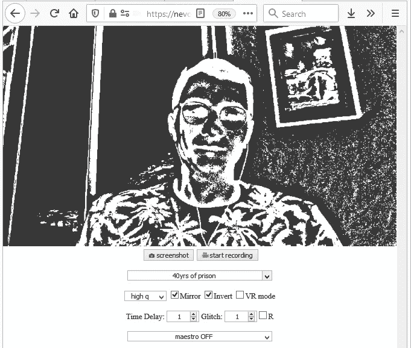
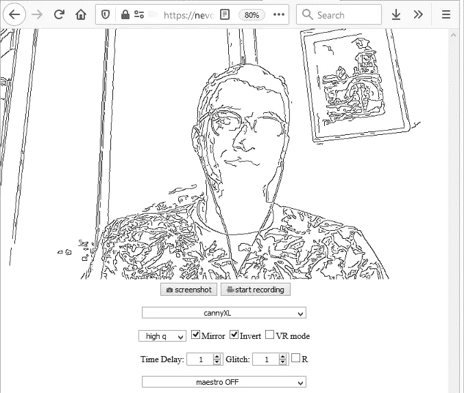
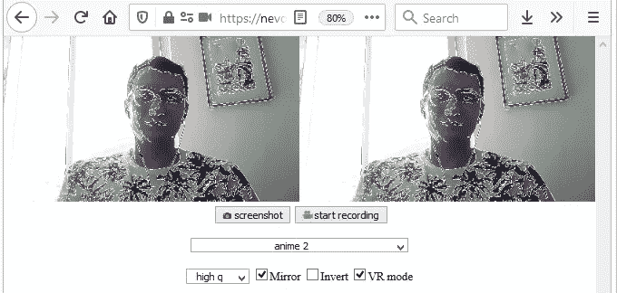
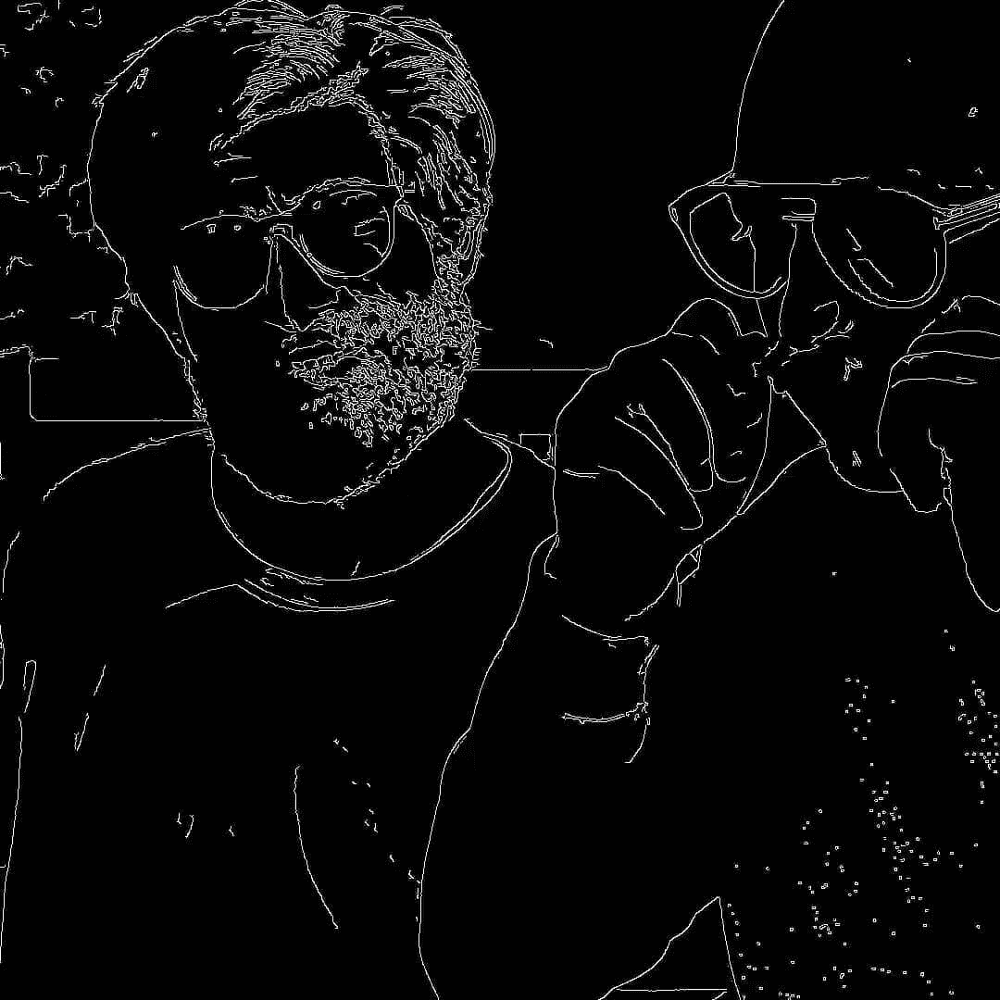
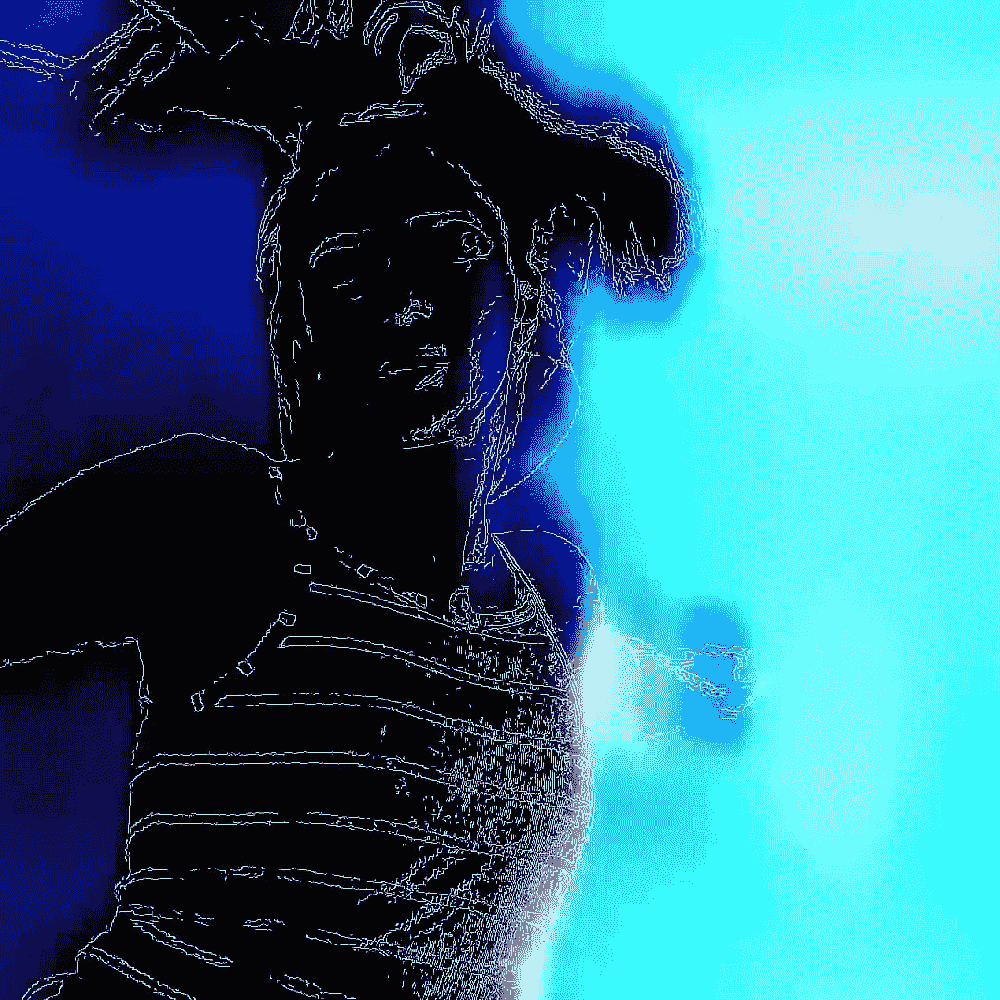
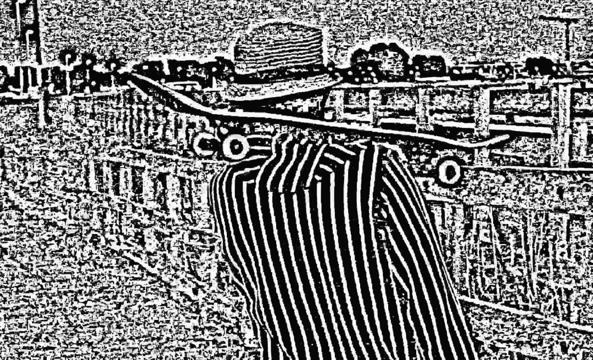

# 在浏览器中使用 VR/AR 进行视频处理

> 原文：<https://blog.devgenius.io/virtual-reality-vr-ar-and-video-processing-in-the-browser-e20c1c6b73ca?source=collection_archive---------13----------------------->

AlterWorld 是一个基于 OpenCV for JavaScript(前端)的开源实时视频处理项目。它有几个有趣的功能，如不同的图像过滤器和效果，VR/AR 功能和音频/音乐生成。

现场演示:[https://nevolin.be/alterworld/](https://nevolin.be/alterworld/)

用一个预算**的 VR 耳机**(比如谷歌 Cardboard VR)搭配你的 smartpone，体验超赞！

有大量内置的**滤镜**和**特效**可用。使用下拉框选择所需的过滤器。时间延迟和**毛刺效果**可以用来创造令人眩晕、滑稽或恐怖的效果，这些都是对画面的干扰。

有一个特殊的功能“大师”是在最底部的按钮。基本的想法是从图像中头脑风暴出音乐节拍，这在概念上可能对音乐家有用。这使用某种算法来根据图像上的像素值生成基本的电子节拍。您可以调整算法或实现自己的算法。

如需更多信息和 YouTube 演示，请访问 Github(并主演美国 https://github.com/healzer/AlterWorld ❤):

# 视频制作中的 AlterWorld:

