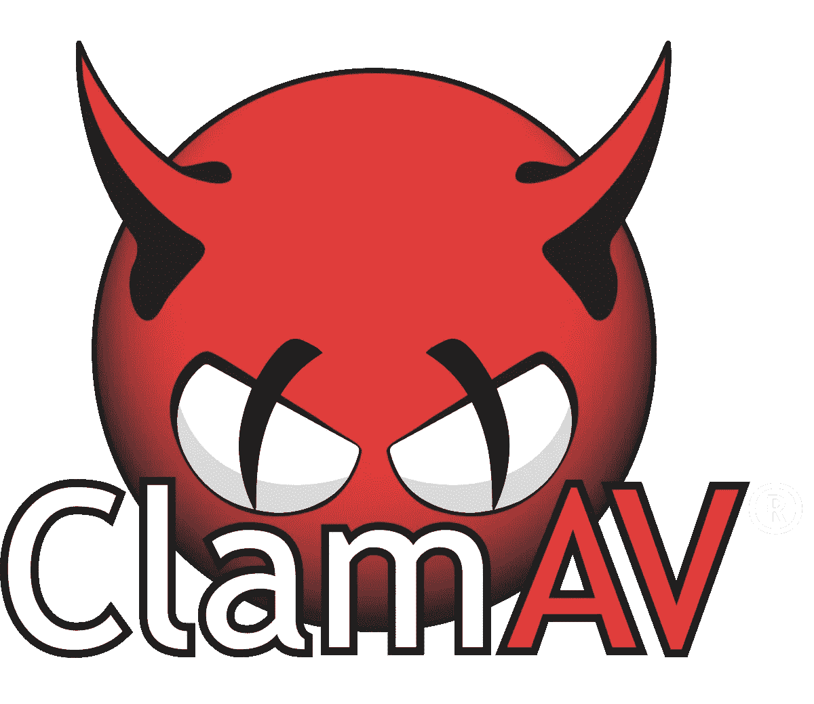
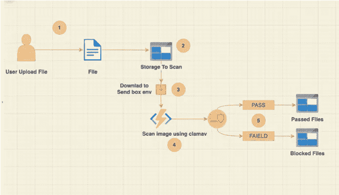
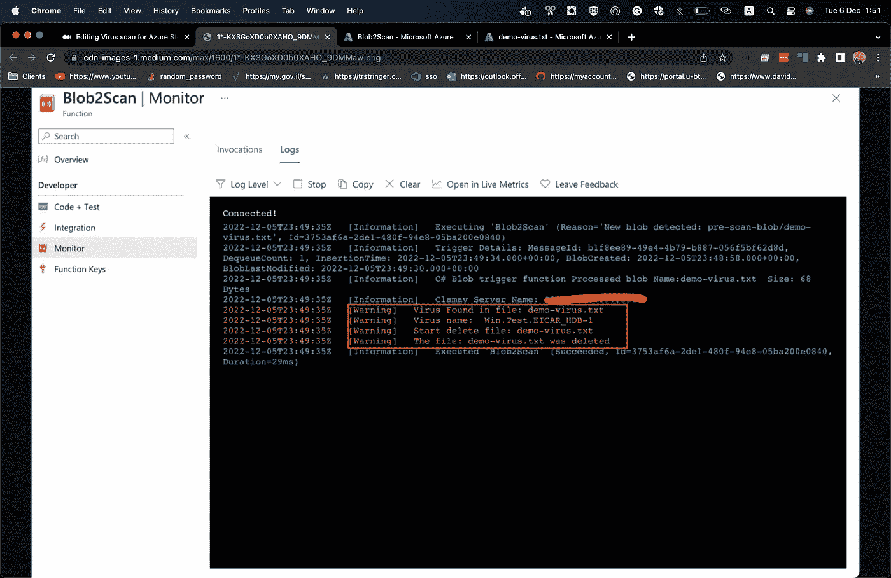

# 使用 ClamAV 对 Azure 存储帐户进行病毒扫描

> 原文：<https://blog.devgenius.io/virus-scan-for-azure-storage-account-using-clamav-41e78214dfbe?source=collection_archive---------2----------------------->



[https://www.clamav.net/](https://www.clamav.net/)

今天，我想介绍我的解决方案来扫描 Azure 存储帐户上的病毒和漏洞。

对于那些不熟悉 Azure 存储帐户的人来说，这是一种 Azure 服务，允许在容器下保存和管理文件。例如，假设您有一个需要用户上传文件的应用程序，您希望将这个文件保存在云中。Azure 存储帐户是一个很好的解决方案。

但问题来了:我如何确保这些文件不包含病毒、漏洞或可能损害我的系统或客户端的东西？

Azure 有一个扫描存储帐户下文件的解决方案，它被称为[存储防御](https://learn.microsoft.com/en-us/azure/defender-for-cloud/defender-for-storage-introduction)，但它有一些限制，如:

> [**哈希信誉分析不支持所有文件协议和操作类型
> 哈希信誉不是深度文件检查**](https://learn.microsoft.com/en-us/azure/defender-for-cloud/defender-for-storage-introduction#limitations-of-hash-reputation-analysis)

所以让我们开始…

# **先决条件:**

*   [Azure 账户](https://azure.microsoft.com/en-us/free/)
*   [Azure 功能](https://learn.microsoft.com/en-us/azure/azure-functions/functions-overview)
*   [存储账户](https://learn.microsoft.com/en-us/azure/storage/common/storage-account-overview)
*   问
*   [Clamav](https://www.clamav.net/)

# Clamav:

我们将使用一个名为 Clamav 的工具来扫描上传到存储帐户的文件。

> **ClamAV 是一款开源(GPL)防病毒引擎，可用于各种场合，包括电子邮件和网页扫描以及终端安全。它为用户提供了许多实用工具，包括灵活且可伸缩的多线程守护程序、命令行扫描器和用于自动数据库更新的高级工具。**

*   **ClamAV 检测数百万病毒、蠕虫、特洛伊木马和其他恶意软件，包括 Microsoft Office 宏病毒、移动恶意软件和其他威胁。**
*   ClamAV 的字节码签名运行时由 LLVM 或我们的自定义字节码解释器提供支持，允许 ClamAV 签名作者创建和分发非常复杂的检测例程，并远程增强扫描仪的功能。
*   **签名的签名数据库确保 ClamAV 只执行可信的签名定义。**
*   **内置的存档提取能力包括:
    - Zip，RAR，7Zip，ARJ(包括 SFX)，Tar，CPIO，Gzip，…**

# 解决方案图表:



溶液流程图

# **在 Kubernetes 上部署 ClamAV:**

ClamAV 有多种运行方式。我选择在 AKS 上运行它的原因很简单，在 AKS 上运行，我可以根据上传到存储帐户的文件数量来扩展 ClamAV。

因此，让我们从将 ClamAV 部署到我们的集群
开始，创建一个名为 **clamav-deployment.yml** 的新文件，并将该内容粘贴到文件中

```
apiVersion: apps/v1
kind: Deployment
metadata:
  name: clamav-deployment
  labels:
    app: clamav
spec:
  replicas: 3
  selector:
    matchLabels:
      app: clamav
  template:
    metadata:
      labels:
        app: clamav
    spec:
      containers:
      - name: clamav
        image: mkodockx/docker-clamav:alpine-idb-amd64
        ports:
        - containerPort: 3310
```

通过运行以下命令部署该文件:

```
~ kubectl apply -f ./clamav-deployment.yml
~ kubectl get po

NAME                                 READY   STATUS    RESTARTS   AGE
clamav-deployment-5757657868-2jjm8   1/1     Running   0          34s
clamav-deployment-5757657868-8pc6t   1/1     Running   0          55s
clamav-deployment-8697d578f8-f6cgj   1/1     Running   0          34s
clamav-deployment-8697d578f8-jfj6s   1/1     Running   0          33s
```

现在让我们公开我们的 ClamAV 服务，这样我们就可以通过添加 Kubernetes 服务与他通信，创建一个名为 **clamav-service.yml，**的新文件，并将该内容粘贴到文件中:

```
apiVersion: v1
kind: Service
metadata:
  name: clamav-service
spec:
  selector:
    app.kubernetes.io/name: clamav
  ports:
    - protocol: TCP
      type: LoadBalancer
      port: 80
      targetPort: 3310 
```

通过运行以下命令部署该文件:

```
~ kubectl apply -f ./clamav-service.yml
~ kubectl get svc
NAME         TYPE           CLUSTER-IP     EXTERNAL-IP   PORT(S)          AGE
clamav-svc   LoadBalancer   10.0.134.201   <Public Ip>   3310:32466/TCP   5d9h
```

就是这样。现在，我们已经在群集
上启动并运行了 ClamAV。为了确保 ClamAV 正在运行，我们可以运行以下命令来获取 ClamAV 日志:

```
~ kubectl logs clamav-deployment-5757657868-2jjm8

[bootstrap] Schedule freshclam DB updater.
[bootstrap] Run clamav daemon...
LibClamAV Warning: **************************************************
LibClamAV Warning: ***  The virus database is older than 7 days!  ***
LibClamAV Warning: ***   Please update it as soon as possible.    ***
LibClamAV Warning: **************************************************
Mon Dec  5 23:14:22 2022 -> Limits: Global time limit set to 120000 milliseconds.
Mon Dec  5 23:14:22 2022 -> Limits: Global size limit set to 314572800 bytes.
Mon Dec  5 23:14:22 2022 -> Limits: File size limit set to 104857600 bytes.
Mon Dec  5 23:14:22 2022 -> Limits: Recursion level limit set to 30.
Mon Dec  5 23:14:22 2022 -> Limits: Files limit set to 50000.
Mon Dec  5 23:14:22 2022 -> Limits: MaxEmbeddedPE limit set to 41943040 bytes.
Mon Dec  5 23:14:22 2022 -> Limits: MaxHTMLNormalize limit set to 41943040 bytes.
Mon Dec  5 23:14:22 2022 -> Limits: MaxHTMLNoTags limit set to 2097152 bytes.
Mon Dec  5 23:14:22 2022 -> Limits: MaxScriptNormalize limit set to 5242880 bytes.
Mon Dec  5 23:14:22 2022 -> Limits: MaxZipTypeRcg limit set to 1048576 bytes.
Mon Dec  5 23:14:22 2022 -> Limits: MaxPartitions limit set to 128.
Mon Dec  5 23:14:22 2022 -> Limits: MaxIconsPE limit set to 200.
Mon Dec  5 23:14:22 2022 -> Limits: MaxRecHWP3 limit set to 16.
Mon Dec  5 23:14:22 2022 -> Limits: PCREMatchLimit limit set to 10000.
Mon Dec  5 23:14:22 2022 -> Limits: PCRERecMatchLimit limit set to 10000.
Mon Dec  5 23:14:22 2022 -> Limits: PCREMaxFileSize limit set to 26214400.
Mon Dec  5 23:14:22 2022 -> Archive support enabled.
Mon Dec  5 23:14:22 2022 -> AlertExceedsMax heuristic detection disabled.
Mon Dec  5 23:14:22 2022 -> Heuristic alerts enabled.
Mon Dec  5 23:14:22 2022 -> Portable Executable support enabled.
Mon Dec  5 23:14:22 2022 -> ELF support enabled.
Mon Dec  5 23:14:22 2022 -> Alerting on broken executables enabled.
Mon Dec  5 23:14:22 2022 -> Mail files support enabled.
Mon Dec  5 23:14:22 2022 -> OLE2 support enabled.
Mon Dec  5 23:14:22 2022 -> PDF support enabled.
Mon Dec  5 23:14:22 2022 -> SWF support enabled.
Mon Dec  5 23:14:22 2022 -> HTML support enabled.
Mon Dec  5 23:14:22 2022 -> XMLDOCS support enabled.
Mon Dec  5 23:14:22 2022 -> HWP3 support enabled.
Mon Dec  5 23:14:22 2022 -> Self checking every 600 seconds.
Mon Dec  5 23:14:22 2022 -> Set stacksize to 1048576
```

# 部署 Azure 功能:

现在让我们部署带有 blob 触发器的 Azure 函数，这样每次文件上传到我们的存储帐户时，该函数都会触发并调用 ClamAV 来扫描文件
如果您没有经验或者不知道如何设置带有 Blob 触发器的 Azure 函数，您可以查看 Azure 文档，这是一个简单易行的过程。

以下是如何创建 Azure Function Blob 触发器的链接:

[https://learn . Microsoft . com/en-us/azure/azure-functions/functions-bindings-storage-blob-trigger？tabs =进程内% 2c extension V5&pivots =编程语言-csharp](https://learn.microsoft.com/en-us/azure/azure-functions/functions-bindings-storage-blob-trigger?tabs=in-process%2Cextensionv5&pivots=programming-language-csharp)

现在将这段代码复制到函数中:

```
using System;
using System.IO;
using Microsoft.Azure.WebJobs;
using Microsoft.Azure.WebJobs.Host;
using Microsoft.Extensions.Logging;
using nClam;
using Azure.Storage.Blobs;
using Microsoft.Extensions.Azure;
using Azure.Identity;

// Functio to scan file
namespace Scan.Function
{

    public class Blob2Scan
    {

        [FunctionName("Blob2Scan")]
        public void Run([BlobTrigger("pre-scan-blob/{name}", Connection = "STORAGE_CONNECTION")]Stream myBlob, string name, ILogger log)
        {
            log.LogInformation($"C# Blob trigger function Processed blob Name:{name}  Size: {myBlob.Length} Bytes");

            // Set the Clmav server address & Port
            string serverName = Environment.GetEnvironmentVariable("<REPLACE_WITH_VLAMAV_PUBLIC_IP>");
            int serverPort = 3310;

            log.LogInformation($"Clamav Server Name: ${serverName}:${serverPort}");

            // Create client for clamv
            var clam = new ClamClient(serverName, serverPort);

            // Scanning for viruses...
            var scanResult = clam.SendAndScanFileAsync(myBlob).Result;

            switch (scanResult.Result)
            {
                case ClamScanResults.Clean:
                    log.LogInformation($"The file: {name} is clean!");
                    break;
                case ClamScanResults.VirusDetected:

                    log.LogWarning($"Virus Found in file: {name}");

                    foreach(var virus in scanResult.InfectedFiles){
                        log.LogWarning("Virus name: {0}", virus.VirusName);
                    }

                    log.LogWarning($"Start delete file: {name}");

                    BlobClient blobClient = new(Environment.GetEnvironmentVariable("STORAGE_CONNECTION"), "pre-scan-blob", name);

                    blobClient.DeleteAsync();

                    log.LogWarning($"The file: {name} was deleted");

                    break;
                case ClamScanResults.Error:
                    log.LogInformation("Error scanning file: {0}", scanResult.RawResult);
                    break;
            }
        }
    }
}
```

此代码的解释:

1.  我们将该函数配置为在每次文件上传到名为 ***预扫描-blob*** 的容器时开始运行
2.  我们创建一个 ClamAV 客户端来扫描文件；请确保您设置了 ClamAV 服务的公共 IP:

```
string serverName = Environment.GetEnvironmentVariable("<REPLACE_WITH_VLAMAV_PUBLIC_IP>");
```

3.然后我们调用 ClamAV 并检查病毒是否在我们的文件中找到

为了检查该功能是否工作，我们可以创建一个带有病毒的新演示文件，创建一个名为 **demo-virus.txt** 的新文件，并将该内容复制到文件中:



如你所见，ClamAV 在我们的文件中发现了 1 个病毒，名为: **Win。HDB EICAR-1 号测试**

> EICAR 反病毒测试文件[1]或 EICAR 测试文件是由欧洲计算机反病毒研究所(EICAR)和计算机反病毒研究组织(CARO)开发的计算机文件，用于测试计算机反病毒(AV)程序的响应。[2]这种测试文件允许人们在不使用真正的计算机病毒的情况下测试反病毒软件，而不是使用真正的恶意软件，后者可能会造成真正的损害。[3]

就是这样；现在，您可以确保每次该文件上传到您的存储帐户，它将被 ClamAV 扫描，并确保该文件是干净的(或不是)

希望这个指南对你有帮助；如果你有任何意见或见解，我很乐意支持:)