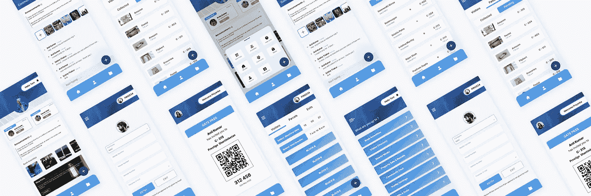
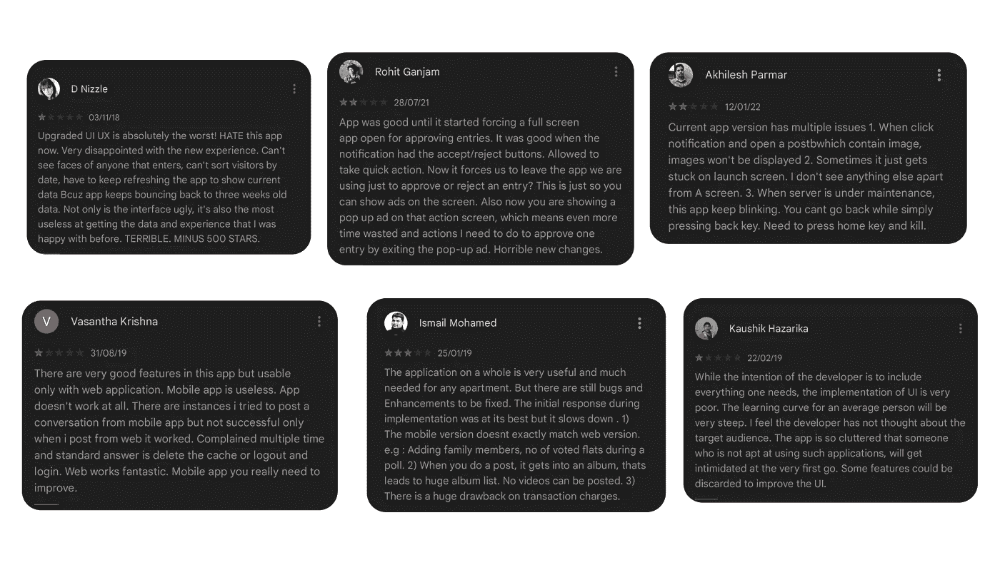
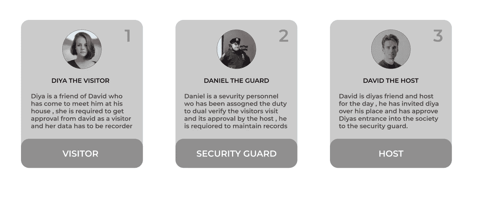
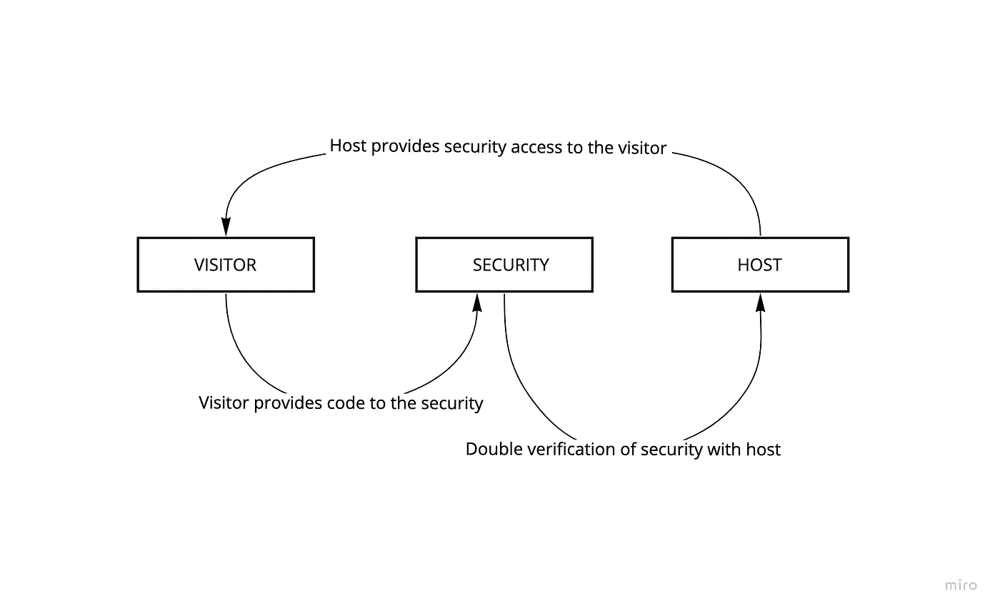
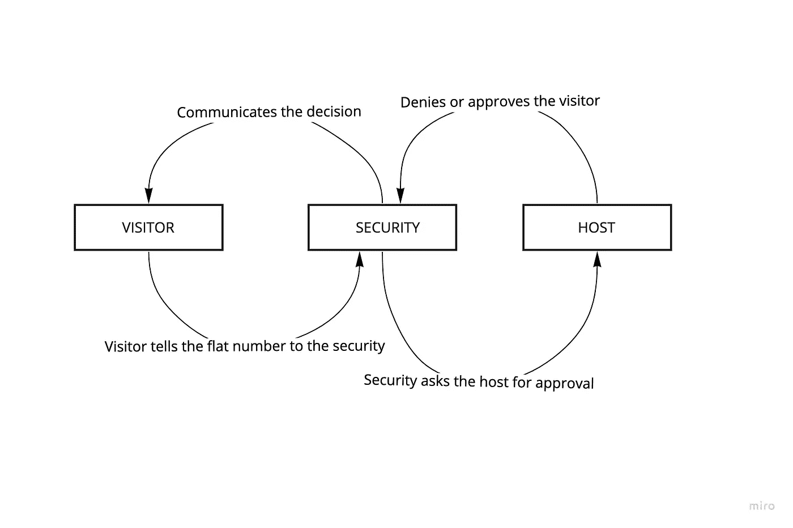
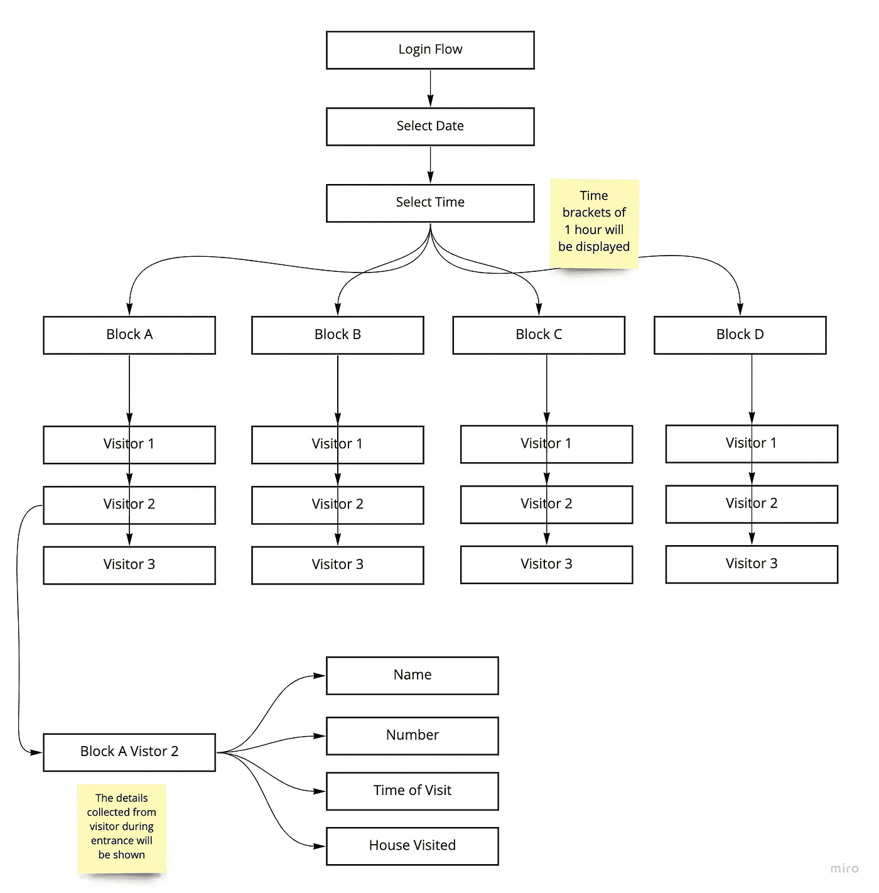
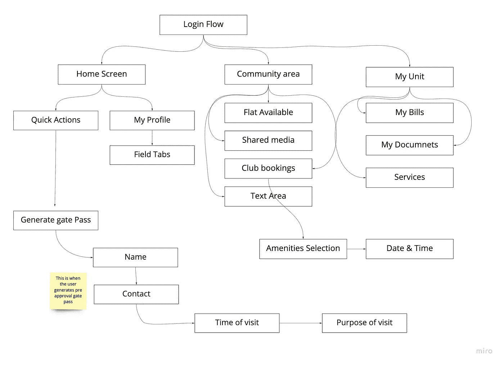
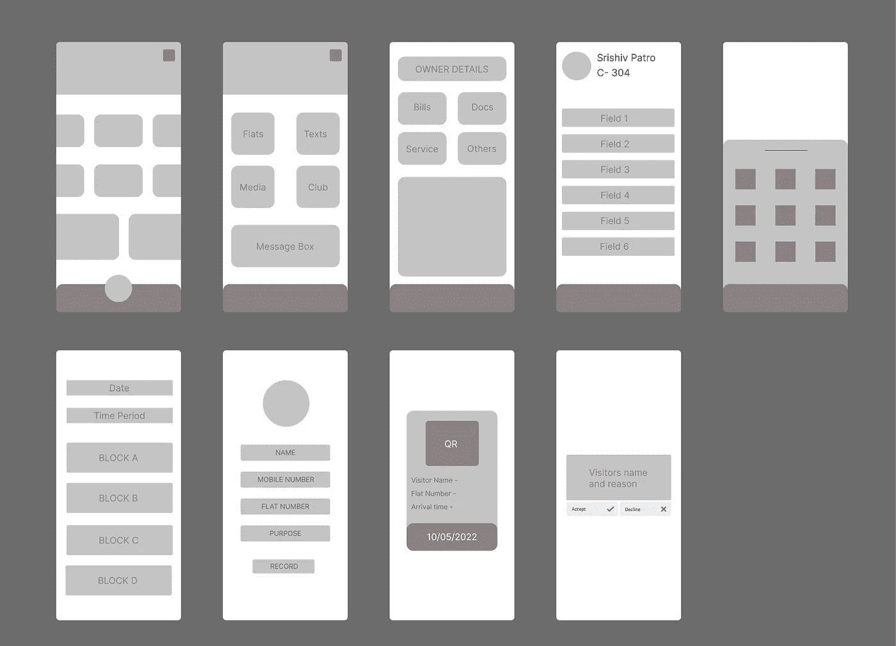

# 游客管理应用程序

> 原文：<https://blog.devgenius.io/visitors-management-app-5086572aa664?source=collection_archive---------8----------------------->

**背景—**

访客应用程序管理系统是所有门禁社会和复杂以及各种办公空间广泛使用的应用程序之一，用于市民的安全和福祉。保护人们的隐私和安全至关重要。

**用户端开发—**

**应用重要性—**

1.  进出住宅和商业建筑的人员流量增加。
2.  公民隐私和福祉的安全
3.  在需要的时候保持每日访问者的跟踪和数据库。
4.  比传统的笔记本和笔更安全，因为害怕脾气和腐败。

**研究支柱—**

> T *他* ***的目标*** *是开发一个完整的用户流网站地图，并为最终原型设计开发数字线框，以便更好地理解整个应用程序，基于开发范围内的以下难点—*

1.  用户注册困难。
2.  代替人工进行访客登记
3.  大多数当前的应用程序缺乏来自访问者和宿主双方的双重批准和验证。
4.  缺少从大门到主人家的合适的游客路线图
5.  在应用程序中开发一个用户友好的紧急 SOS，用于意外情况。

**研究问题—**

以下是一些来自使用类似应用程序的用户的反馈，我主要关注应用程序的可用性方面，并抓住以下难点，以更好地开发用户界面。

总结上述反馈，以下是几个发展领域-

1.  展示游客的脸作为额外的安全层
2.  通知栏批准或拒绝访问者
3.  返回到上一个屏幕
4.  在不同屏幕之间轻松移动
5.  复杂的元素布局
6.  聊天中缺乏人性化的界面让使用机器人聊天的用户感到沮丧。

**研究概要—**

**基于软件的问题-**

问:市场上现有的应用程序是否让你感到足够安全？

问:双重验证功能(如果有)有多强？

问:你从主人那里拿到通行证后，有没有被保安指引到错误的街区或公寓？

问:这款应用的内置社区有多好？

在需要的情况下，大门或保安人员是否足够反应灵敏或容易接近？

**发展问题—**

问:你愿意尝试一个能提供更好的用户流和设计的新应用吗？

问:你认为在主人的房子里为来访者提供一个固定的位置会有好处吗(假设人们经常走错房子)

问:对你来说，简单的界面和更好的设计哪个更重要？

(考虑到家中有老年人，他们可能对技术不太友好)

> 然而，最终目标是提供一个更好的设计和一个方便的用户界面

**用户角色—**

***用户集合 1*** -访客(这些是需要得到主人或他们要去的地方的批准的人)

***用户设置 2-*** 安全人员(他们是访客和主人之间的桥梁，他们需要对访客和主人进行识别和交叉验证，并保持记录)

****基本流程—****

> **场景 1——在代码的帮助下对预期访问者进行预批准:与主机一起完成双重验证**

****

> **场景 2——借助警报消息的实时非预期访客验证:给予主机批准或拒绝选项**

****

****管理端开发****

****管理端面临的主要问题—****

1.  **所有居民都没有登记访客管理申请。**
2.  **客流量大时管理的庞大。**
3.  **如果游客走错了地方，就无法追踪。**
4.  **根据给定的数据对访客进行分类——送货员不得不前往只有一个入口的各个家庭时面临的困难。**

****发展目标—****

> **创建一个能够进行双重验证的结构，并在单个访客多户的情况下同时维护大量访客。使访客记录在任何需要的时候都可以访问和搜索。**

****线流—****

**管理方在操作包含所有访问者记录的应用程序数据库时，将遵循以下结构；**

****

**用户在操作应用程序时将遵循以下结构-**

****

****应用开发—****

**基于上述研究和痛点，我开始设计一个应用程序，在纸上画出草图后，从一个非常基本的数字线框开始。**

****数字线框-****

****

****原型流程—****

****

****最终设计—****

****