# Visual Studio 代码- Arduino，配置和导入解决方案

> 原文：<https://blog.devgenius.io/visual-studio-code-arduino-configuration-and-import-solution-a5f188a0cfd0?source=collection_archive---------1----------------------->

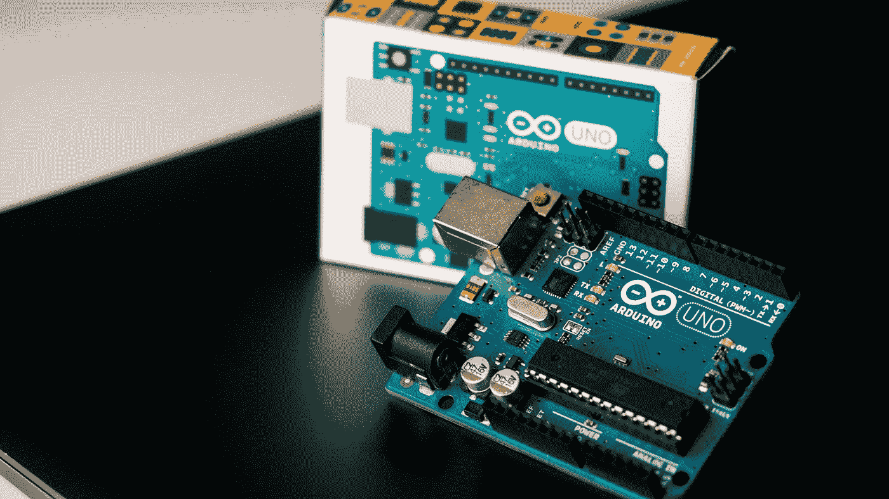

哈里森·布罗德本特在 [Unsplash](https://unsplash.com?utm_source=medium&utm_medium=referral) 上的照片

我注意到 [Arduino IDE](https://www.arduino.cc/en/software) 不太稳定，经常死机！所以我决定做一个关于如何为 Arduino 配置 [Visual Studio 代码](https://code.visualstudio.com)的指南。

此外，Arduino IDE 并不是最好的编程 IDE。

然而，要将 Visual Studio 代码用作 Arduino 的 IDE，您必须已经安装了 [Arduino IDE](https://www.arduino.cc/en/software) ，然后在 [Visual Studio 代码](https://code.visualstudio.com)中下载 Arduino 扩展，转到扩展选项卡并查找 **Arduino** :

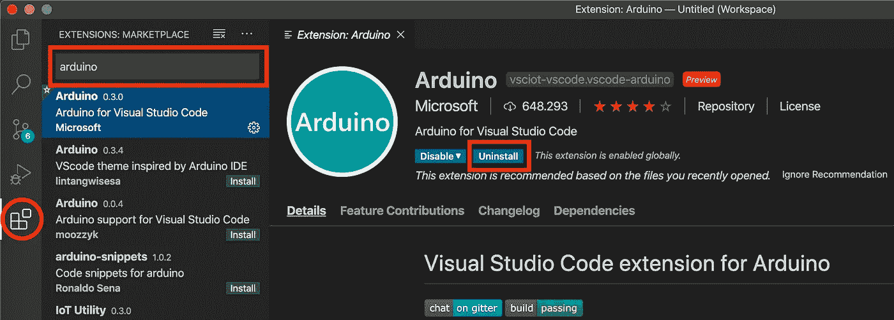

作者图片

现在以同样的方式安装 **c/c++** 扩展:

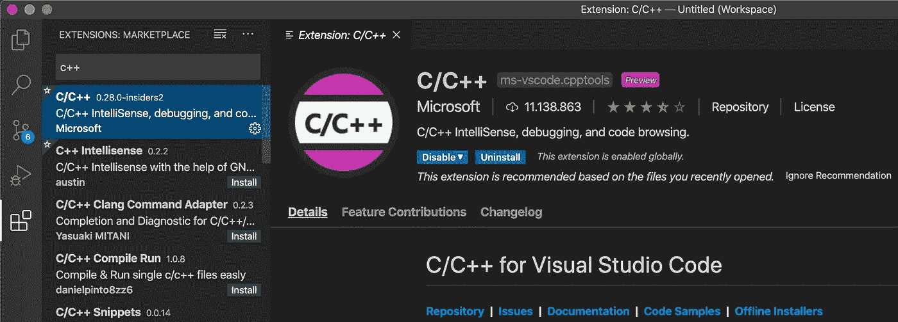

作者图片

现在转到**视图**->-**命令面板...**

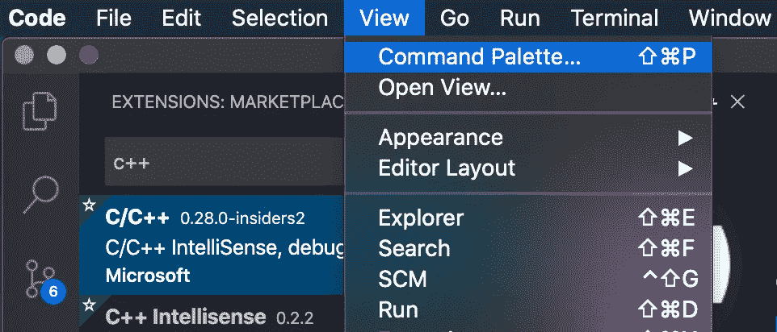

作者图片

寻找**打开设置(UI)** :

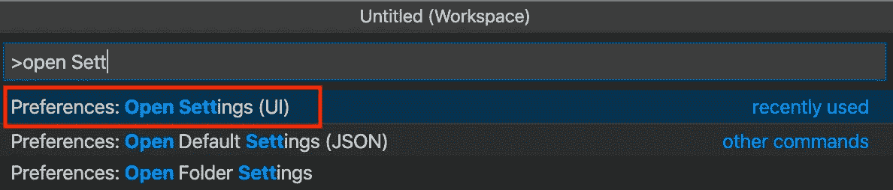

作者图片

然后进入**扩展**->-**C/c++**，点击 settings.json 中的**编辑**

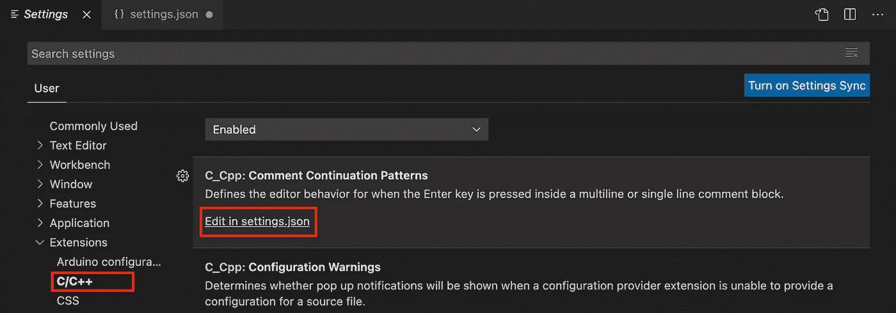

作者图片

并添加红色部分，为方便起见，该部分也在图像下表示为代码:

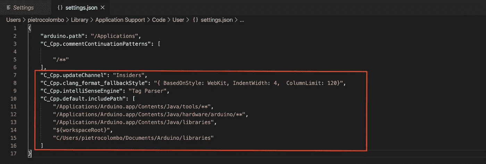

作者图片

唯一要做的就是检查路径是否正确，并用您的 Mac 用户替换您的用户:

```
"C_Cpp.updateChannel": "Insiders",
"C_Cpp.clang_format_fallbackStyle": "{ BasedOnStyle: WebKit, IndentWidth: 4,  ColumnLimit: 120}",
"C_Cpp.intelliSenseEngine": "Tag Parser",
"C_Cpp.default.includePath": [
    "/Applications/Arduino.app/Contents/Java/tools/**",
    "/Applications/Arduino.app/Contents/Java/hardware/arduino/**",
    "/Applications/Arduino.app/Contents/Java/libraries",
    "${workspaceRoot}",
    "/Users/**your_user**/Documents/Arduino/libraries"
]
```

现在可以用**打开文件夹了。或在你打开的文件夹中创建一个新的(文件夹名必须与文件名相同)。一旦完成，进入**视图**->-**命令面板…** 如前所述，编写 **Arduino: Initialize****

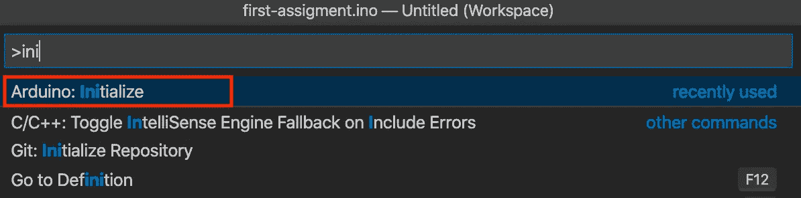

作者图片

一旦完成，它将创建一个**。vscode 文件夹**，里面有一个 **arduino.json** 文件。始终用**视图**->-**命令调板...**查找 **Arduino:板卡配置**

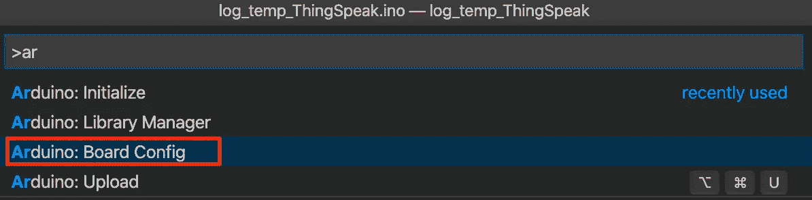

作者图片

选择您拥有的**板**和各种设置:

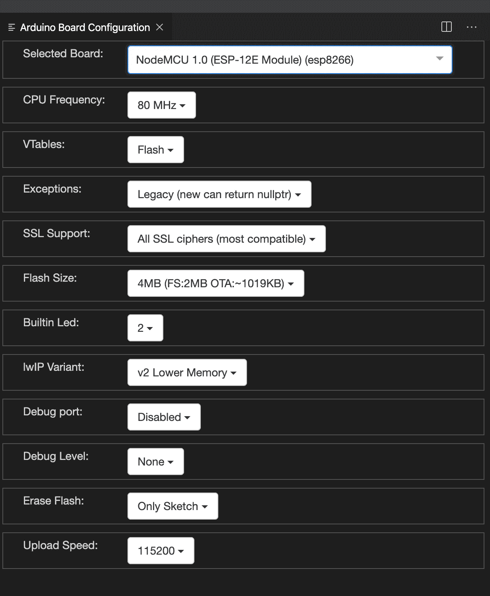

作者图片

现在我找到的解决**导入问题**的最后一件事就是在**里加上这一行。vs code/c _ CPP _ properties . JSON**文件，将您的用户名:

```
"/Users/your_username/Documents/Arduino/**"
```

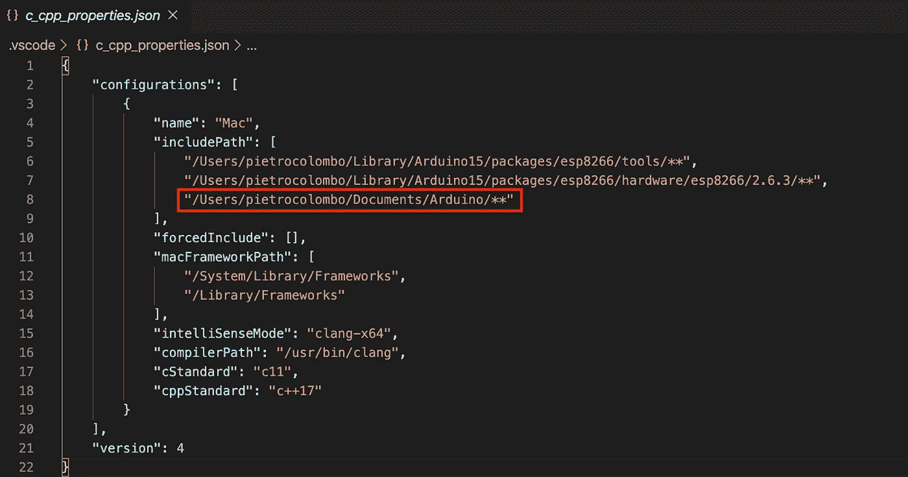

作者图片

一旦所有这些都完成了，你应该能够通过直接在板上加载你的项目来使用 IDE，我已经用一个 ESP8266 板试过了。

如果您有 Windows，指南是类似的更改路径:

```
"C_Cpp.updateChannel": "Insiders",
"C_Cpp.clang_format_fallbackStyle": "{ BasedOnStyle: WebKit, IndentWidth: 4,  ColumnLimit: 120}",
"C_Cpp.intelliSenseEngine": "Tag Parser",
"C_Cpp.default.includePath": [
    "E:\\Program Files\\Arduino\\tools\\**",
    "E:\\Program Files\\Arduino\\hardware\\arduino\\avr\\**",
    "E:\\Program Files\\Arduino\\libraries",
    "${workspaceRoot}",
    "C:\\Users\\bahnh\\Documents\\Arduino\\libraries"
]
```

如果你有任何问题或者你已经用其他方式解决了它们，不要犹豫，在评论中写下它们！

感谢阅读！

为了获得无限的故事，你也可以考虑只花 5 美元注册成为媒体会员。如果你用我的 [*链接*](https://pietrocolombo.medium.com/membership) *注册，我会收到一点佣金。*