# Visual Studio 代码远程开发

> 原文：<https://blog.devgenius.io/visual-studio-code-remote-development-70fa932811d7?source=collection_archive---------12----------------------->

## 创建最接近生产的环境，并从本地开发/调试

最近我把笔记本电脑换成了新机。因此，我失去了我的 golang 环境。有一天看到一篇很酷的 golang 文章，就试着玩了一下。但是，这一次，我不想在笔记本电脑上安装 golang。尽管安装起来并不难，但我认为它会污染我的本地环境。我知道[Visual Studio Code remote ssh](https://code.visualstudio.com/docs/remote/ssh)功能已经有一段时间了，它允许我使用远程机器作为开发环境。然而，研究表明 VSCode 也支持[远程容器](https://code.visualstudio.com/docs/remote/containers)，这意味着:

*   我可以创建与生产环境相似的环境(例如，相同的操作系统、运行时、其他依赖项)。
*   维护多种环境非常容易(例如不同版本的 Go、Python、Java、C#等。)，就像您有多台笔记本电脑一样
*   我不需要在我的本地笔记本电脑上安装上述内容，并尽可能保持干净，但我仍然喜欢现场调试体验
*   只要其他团队成员拥有 docker 和 VSCode，就可以很容易地与他们共享这个环境

更详细的解释可以在下面的文章中找到:

[](https://code.visualstudio.com/docs/remote/remote-overview) [## Visual Studio 代码远程开发

### Visual Studio 代码远程开发允许您使用容器、远程机器或用于 Linux 的 Windows 子系统…

code.visualstudio.com](https://code.visualstudio.com/docs/remote/remote-overview) [](https://raevskymichail.medium.com/vs-code-remote-development-starting-guide-8631abced225) [## VS 代码远程开发—入门指南

### 为什么以及如何开始远程使用 VS 代码

raevskymichail.medium.com](https://raevskymichail.medium.com/vs-code-remote-development-starting-guide-8631abced225) 

# VSCode 远程体验

使用以下 Python 示例

[](https://github.com/tiangolo/uvicorn-gunicorn-fastapi-docker) [## GitHub-tiangolo/uvicon-gunicorn-fastapi-Docker:Docker 镜像带有由 guni corn 管理的 uvicon…

### Gunicorn 为 Python 3.6 及以上版本中的高性能 FastAPI web 应用程序管理的带有 Uvicorn 的 Docker 映像…

github.com](https://github.com/tiangolo/uvicorn-gunicorn-fastapi-docker) 

注意:不建议使用粘胶自动生成的 docker 文件(有一些“节点”相关的命令，从来没有为我工作过)，自己写 docker 文件。

VSCode 使用。devcontainer/devcontainer.json 来告诉您远程容器环境的一些重要信息。下面是一个例子。

```
// For format details, see [https://aka.ms/devcontainer.json](https://aka.ms/devcontainer.json). For config options, see the README at:
// [https://github.com/microsoft/vscode-dev-containers/tree/v0.245.0/containers/python-3-anaconda-postgres](https://github.com/microsoft/vscode-dev-containers/tree/v0.245.0/containers/python-3-anaconda-postgres)
{
 "name": "Python 3",
 "service": "app",
 "dockerFile": "../docker-images/python3.9.dockerfile",// Configure tool-specific properties.
 "customizations": {
  // Configure properties specific to VS Code.
  "vscode": {
   // Set *default* container specific settings.json values on container create.
   "settings": { 
    "python.defaultInterpreterPath": "/opt/conda/bin/python",
    "python.linting.enabled": true,
    "python.linting.pylintEnabled": true,
    "python.formatting.autopep8Path": "/opt/conda/bin/autopep8",
    "python.formatting.yapfPath": "/opt/conda/bin/yapf",
    "python.linting.flake8Path": "/opt/conda/bin/flake8",
    "python.linting.pycodestylePath": "/opt/conda/bin/pycodestyle",
    "python.linting.pydocstylePath": "/opt/conda/bin/pydocstyle",
    "python.linting.pylintPath": "/opt/conda/bin/pylint"
   },

   // Add the IDs of extensions you want installed when the container is created.
   "extensions": [
    "ms-python.python",
    "ms-python.vscode-pylance"
   ]
  }
 },// Use 'forwardPorts' to make a list of ports inside the container available locally.
 "forwardPorts": [8080],// Use 'postCreateCommand' to run commands after the container is created.
 // "postCreateCommand": "python --version",// Comment out to connect as root instead. More info: [https://aka.ms/vscode-remote/containers/non-root](https://aka.ms/vscode-remote/containers/non-root).
 // "remoteUser": "vscode"
}
```

请注意，最重要的设置是:

1.  dockerFile，指向要在哪个 dockerfile 中构建开发容器和打开文件的 VSCode
2.  forwardPorts，例如，如果您的应用程序是一个网站或 restful API，您希望在您的本地上公开端口以对其进行测试
3.  remoteUser，通常生产容器应该在非 root 用户下运行。您可以在容器映像中添加一个非 root 用户，并指向 VSCode 以在该用户下启动容器

单击 VSCode 左下角的“打开远程窗口”图标，选择“在容器中打开文件夹”…命令，或者您可以打开命令调板，然后选择“远程-容器:在容器中打开文件夹”命令。然后选择项目文件夹的克隆副本。

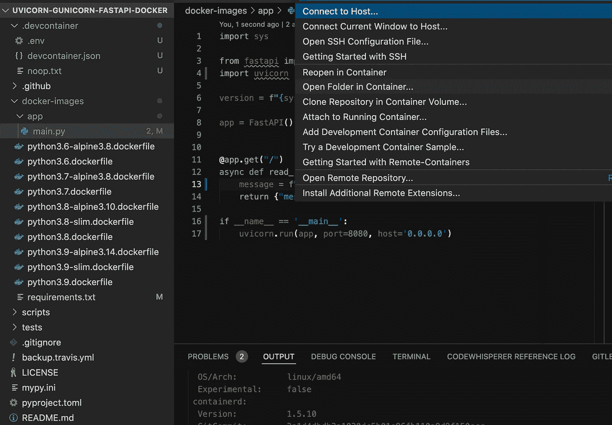

选择 DockerFile 选项，一般将 Dockerfile 放在项目的根文件夹中(否则以后就要修改 devcontainer.json)

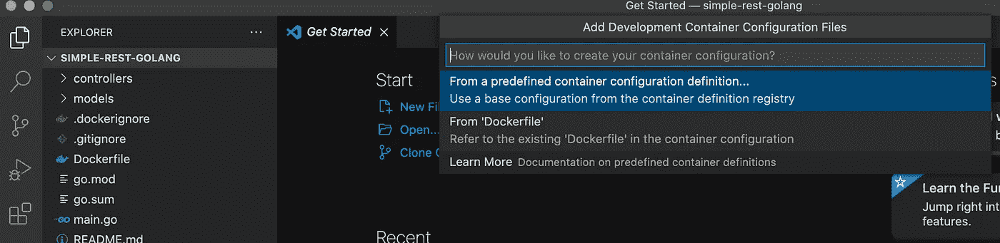

构建完容器后，打开终端窗口并测试您的应用程序，例如我们的示例中的 python /app/main.py。然后您可以从 [http://0.0.0.0:8080 访问 restful API。](http://0.0.0.0:8080.)

修改代码后，可以使用“Remote-Containers:Rebuild Container”命令，这样修改就会生效。下面的截图是我第一次运行“远程-容器:打开容器中的文件夹”命令后的。

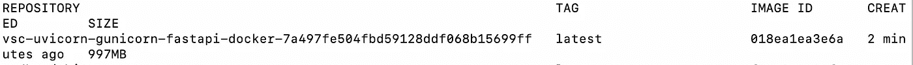

在执行“Remote-Containers:Rebuild Container”命令后，先前的映像将被新映像替换(当有太多“悬空”映像时，您可以使用' docker RMI $(docker images-f " dangling = true "-q)'来删除它们)

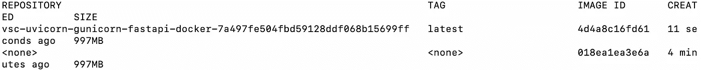

码头工人视察<container id=""></container>

在 volumes，bind 中，您将看到您的本地文件夹被装载到容器内的文件夹中。

# 现场调试

IDE 的一个重要经验是能够设置断点，并调试实时会话。将[调试器或语言扩展](https://code.visualstudio.com/api/extension-guides/debugger-extension)安装到开发容器、Python、.NET，Java，Golang 体验接近笔记本电脑本地调试。

## 计算机编程语言

您需要在 dev 容器中安装 python 扩展。默认情况下，它是禁用的，当您开始调试时，VSCode 将显示“未找到调试扩展”。

要安装，在命令托盘中选择 python 解释器，键入 python:选择解释器，打开它选择 python 解释器或输入 Python 解释器的完整路径

打开 app.py
添加一个断点(例如在第 8 行)。
按 F5 启动容器中的应用程序。一旦断点命中，尝试悬停在变量上(例如第 7 行的 app 变量)，检查局部变量，等等。

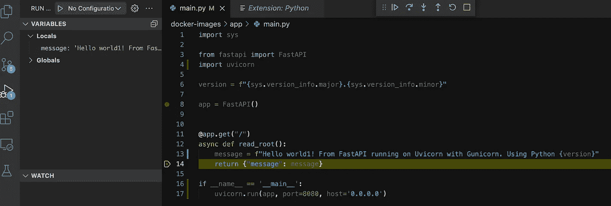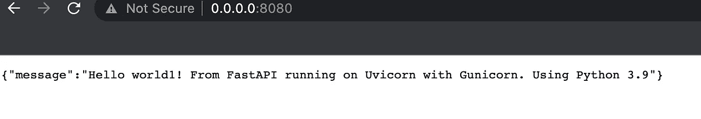

## 。网

[](https://github.com/dotnet/dotnet-docker/tree/main/samples/aspnetapp) [## 位于主 dotnet/dotnet-docker 的 dot net-docker/samples/aspnet app

### 这个示例演示了如何为 ASP.NET 核心 web 应用程序构建容器映像。您可以将这些示例用于 Linux…

github.com](https://github.com/dotnet/dotnet-docker/tree/main/samples/aspnetapp) 

在容器中，运行后

dotnet /app/aspnetapp.dll

您将看到端口自动转发


单击“本地地址”会将您带到 aspnet 页面

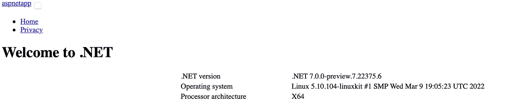

在“开发容器”中安装 C#扩展和 docker 扩展进行调试

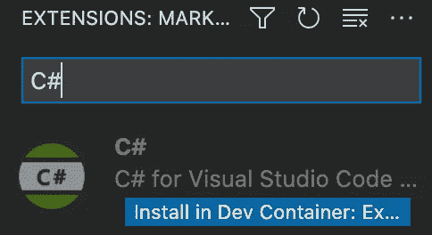

确保 launch.json 具有正确的配置。

```
{
    // Use IntelliSense to learn about possible attributes.
    // Hover to view descriptions of existing attributes.
    // For more information, visit: [https://go.microsoft.com/fwlink/?linkid=830387](https://go.microsoft.com/fwlink/?linkid=830387)
    "version": "0.2.0",
    "configurations": [
        {
            // Use IntelliSense to find out which attributes exist for C# debugging
            // Use hover for the description of the existing attributes
            // For further information visit [https://github.com/OmniSharp/omnisharp-vscode/blob/master/debugger-launchjson.md](https://github.com/OmniSharp/omnisharp-vscode/blob/master/debugger-launchjson.md)
            "name": ".NET Core Launch (web)",
            "type": "coreclr",
            "request": "launch",
            "preLaunchTask": "build",
            // If you have changed target frameworks, make sure to update the program path.
            "program": "${workspaceFolder}/aspnetapp/bin/container/Debug/net7.0/aspnetapp.dll",
            "args": [],
            "cwd": "${workspaceFolder}/aspnetapp",
            "stopAtEntry": false,
            // Enable launching a web browser when ASP.NET Core starts. For more information: [https://aka.ms/VSCode-CS-LaunchJson-WebBrowser](https://aka.ms/VSCode-CS-LaunchJson-WebBrowser)
            "serverReadyAction": {
                "action": "openExternally",
                "pattern": "\\bNow listening on:\\s+(https?://\\S+)"
            },
            "env": {
                "ASPNETCORE_ENVIRONMENT": "Development"
            },
            "sourceFileMap": {
                "/Views": "${workspaceFolder}/Views"
            }
        }
    ]
}
```

要调试，单击“运行并调试”，选择“启动”。NET 核心启动(web)”配置。

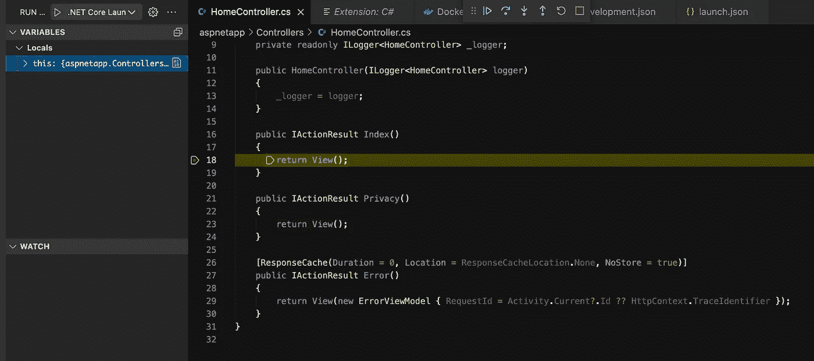

## Java 语言(一种计算机语言，尤用于创建网站)

[](https://github.com/microsoft/vscode-remote-try-java) [## GitHub-Microsoft/VS Code-Remote-try-Java:Java 示例项目，用于试用 VS 代码远程…

### 开发容器是一个运行中的 Docker 容器，具有定义良好的工具/运行时堆栈及其先决条件。你…

github.com](https://github.com/microsoft/vscode-remote-try-java) 

安装 Java，Java 调试器，Java 扩展 Maven

要调试，点击“运行和调试”，选择“启动应用程序”

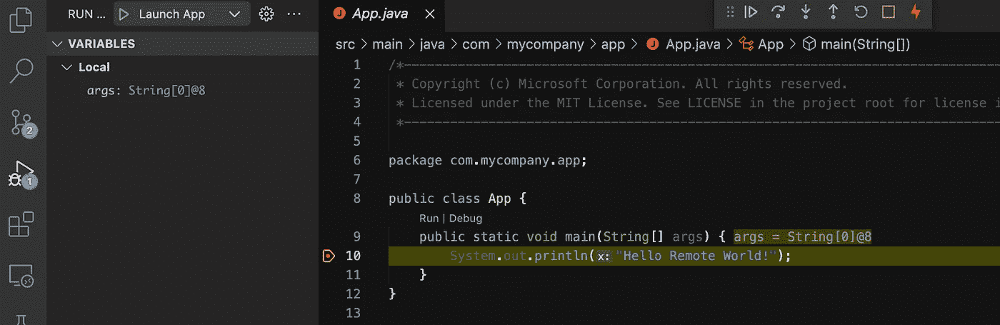

## 戈朗

[](https://github.com/Microsoft/vscode-remote-try-go) [## GitHub-Microsoft/VS Code-Remote-try-Go:Go 示例项目，用于测试“VS Code Remote …

### 开发容器是一个运行中的 Docker 容器，具有定义良好的工具/运行时堆栈及其先决条件。你…

github.com](https://github.com/Microsoft/vscode-remote-try-go) 

要调试，单击“运行和调试”，选择“启动服务器”

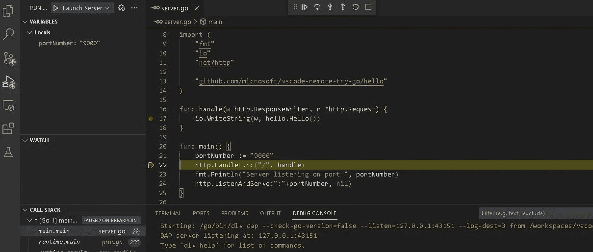

闯入其中一个控制者

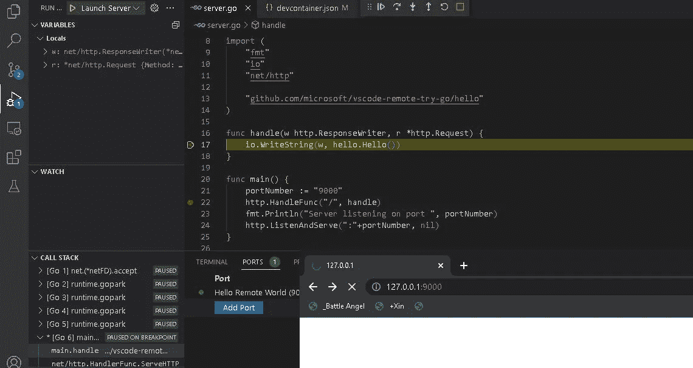

# 附录

[](https://medium.com/macoclock/remote-development-with-vscode-on-mac-in-simple-5-steps-6ae100938d67) [## 通过 5 个简单的步骤在 Mac 上使用 VS 代码进行远程开发

### 这是关于在 macOS 上使用 VS 代码进行远程开发

medium.com](https://medium.com/macoclock/remote-development-with-vscode-on-mac-in-simple-5-steps-6ae100938d67) [](https://medium.com/homullus/remote-development-or-how-i-learned-to-stop-worrying-and-love-the-mainframe-90165147a57d) [## 远程开发，或者说:我是如何学会不再担心并爱上大型机的

### 远程服务器上的开发并不像听起来那么复杂。事实上，得到一个便宜的 VPS 液滴或一簇有一些…

medium.com](https://medium.com/homullus/remote-development-or-how-i-learned-to-stop-worrying-and-love-the-mainframe-90165147a57d) 

## 嘘

[](https://nsanka.medium.com/use-vs-code-for-remote-development-366bdc217977) [## 使用 VS 代码进行远程开发

### 在 Windows 10 上使用远程 SSH 连接到 Linux 的设置与代码

nsanka.medium.com](https://nsanka.medium.com/use-vs-code-for-remote-development-366bdc217977) [](https://medium.com/good-robot/use-visual-studio-code-remote-ssh-sftp-without-crashing-your-server-a1dc2ef0936d) [## 使用 Visual Studio 代码远程 SSH/SFTP，而不会使您的服务器崩溃

### TL；dr:你在 VS 代码中使用过远程 SSH 扩展吗？你可能没有意识到，但默认设置它吃…

medium.com](https://medium.com/good-robot/use-visual-studio-code-remote-ssh-sftp-without-crashing-your-server-a1dc2ef0936d) 

## 容器

[](https://learn.microsoft.com/en-us/shows/beginners-series-to-dev-containers/) [## 初学者系列:开发容器

### 使用 Docker 容器作为开发环境有很多好处，比如很容易在…

learn.microsoft.com](https://learn.microsoft.com/en-us/shows/beginners-series-to-dev-containers/) [](https://code.visualstudio.com/docs/containers/ssh) [## 连接到远程机器上运行的 Docker 引擎

### 我们建议使用 Visual Studio Code Remote - SSH 扩展来连接到运行 Docker 引擎的远程机器…

code.visualstudio.com](https://code.visualstudio.com/docs/containers/ssh) [](https://medium.com/asos-techblog/running-your-local-dev-environment-inside-a-container-vs-code-remote-github-codespaces-c7740c786c17) [## 在容器中运行本地开发环境——VS Code Remote+GitHub Code spaces

### 在过去的十年中，容器已经成为软件工程的一个主要趋势。用它们来运行您的…

medium.com](https://medium.com/asos-techblog/running-your-local-dev-environment-inside-a-container-vs-code-remote-github-codespaces-c7740c786c17) [](https://levelup.gitconnected.com/a-complete-go-development-environment-with-docker-and-vs-code-2355aafe2a96) [## 一个完整的 Go 开发环境，包含 Docker 和 VS 代码

### 享受宁静——第三

levelup.gitconnected.com](https://levelup.gitconnected.com/a-complete-go-development-environment-with-docker-and-vs-code-2355aafe2a96) [](https://docs.microsoft.com/en-us/learn/modules/use-docker-container-dev-env-vs-code/) [## 使用 Docker 容器作为 Visual Studio 代码学习的开发环境

### 使用 Visual Studio 代码远程创建和配置一个功能全面的基于容器的开发环境…

docs.microsoft.com](https://docs.microsoft.com/en-us/learn/modules/use-docker-container-dev-env-vs-code/) [](https://github.com/philipz/cloud-code-devcontainer) [## GitHub-philipz/cloud-code-dev container:4/21 GCPUG.TW 会谈

### “Hello World”是一个包含单一部署和相应服务的 Kubernetes 应用程序。部署…

github.com](https://github.com/philipz/cloud-code-devcontainer) 

## 具有 Docker-compose 的多容器

[](https://code.visualstudio.com/docs/remote/create-dev-container) [## 使用 Visual Studio 代码远程开发创建开发容器

### Visual Studio Code Remote-Containers 扩展允许您将 Docker 容器用作全功能开发工具…

code.visualstudio.com](https://code.visualstudio.com/docs/remote/create-dev-container) [](https://code.visualstudio.com/docs/containers/docker-compose) [## 使用 Docker Compose 处理多个容器

### Docker Compose 提供了一种编排多个容器协同工作的方法。例如，一项服务…

code.visualstudio.com](https://code.visualstudio.com/docs/containers/docker-compose) 

## Windows 上的 Docker

[](https://medium.com/devops-with-valentine/how-to-install-docker-on-windows-10-11-step-by-step-83074a80e6f9) [## 如何在 Windows 10/11 上安装 Docker(循序渐进)

### 随着 Docker 成为我们日常开发工作的一部分，难怪越来越多的人把它安装在他们的…

medium.com](https://medium.com/devops-with-valentine/how-to-install-docker-on-windows-10-11-step-by-step-83074a80e6f9) [](https://medium.com/@ferarias/docker-in-windows-11-using-wsl2-8e30faddc32c) [## Windows 11 中的 Docker 使用 WSL2

### Windows 11 中使用 WSL2 的免费本地 Docker 开发环境

medium.com](https://medium.com/@ferarias/docker-in-windows-11-using-wsl2-8e30faddc32c) [](https://medium.com/@tushar0618/installing-docker-desktop-on-window-10-501e594fc5eb) [## 在 Window 10 上安装 Docker 桌面

### 想学 docker？…想在您的机器上本地执行一些 docker 命令吗？…那么来吧，让我们建立码头…

medium.com](https://medium.com/@tushar0618/installing-docker-desktop-on-window-10-501e594fc5eb)