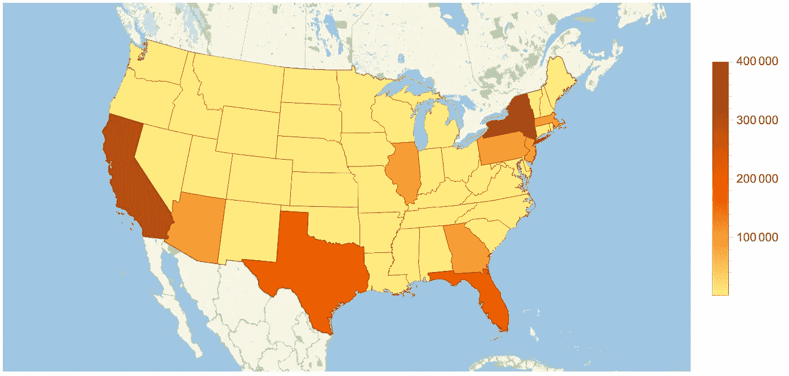
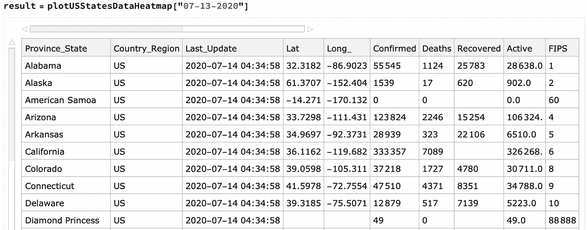
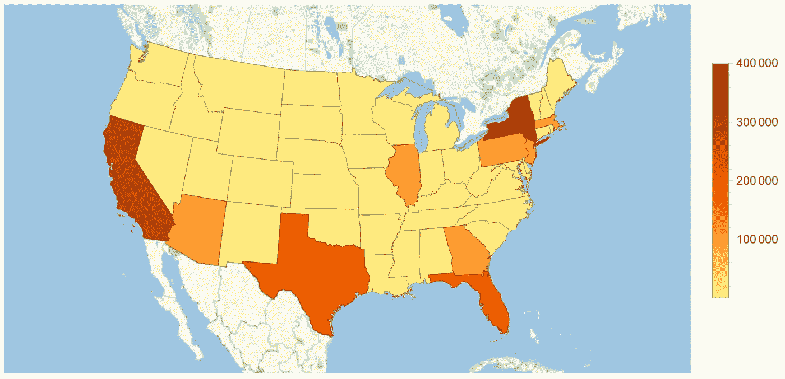
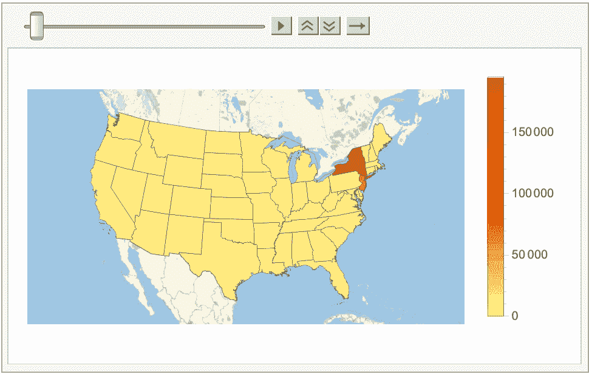
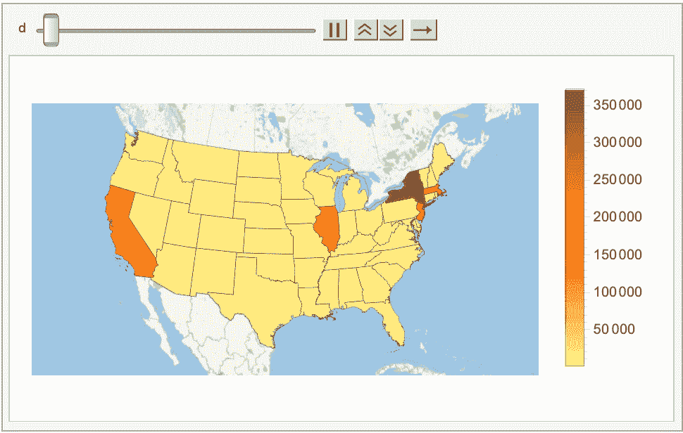

# 使用 Mathematica 图形化可视化美国新冠肺炎传播

> 原文：<https://blog.devgenius.io/visualising-us-covid-19-spread-graphically-using-mathematica-b55a2494d1f4?source=collection_archive---------21----------------------->

数据的图形可视化比数字表格更容易理解和直观。



图片来源:作者

我们在这篇文章中的目的是使用美国大陆的图形表示，并可视化新冠肺炎感染的传播如何随着时间的推移而变化。

# **检索和处理原始数据的功能**

我们将使用 [Johns Hopkins 的原始数据](https://github.com/CSSEGISandData/COVID-19) —注意,“MM”和“dd”分别表示月份和日期，如果它们小于 10，则用零填充，即根据流行编程语言中的标准日期和数字格式规范，七月是“09”而不是“9”。

```
https://raw.githubusercontent.com/CSSEGISandData/COVID-19/master/csse_covid_ 19_data/csse_covid_19_daily_reports_us/MM-dd-YYYY.csv
```

首先，我们需要加载原始 CSV 数据，并将其转换成一个[数据集](https://reference.wolfram.com/language/ref/Dataset.html)，以便后续操作。我们将使用一个简单的函数将带有一个标题行的 CSV 文件转换成数据集，

现在，我们将要分析的绘图函数的第一次迭代，

我知道你们中的一些 Wolfram 语言纯粹主义者可能会在这里畏缩和摇头，我只能道歉……但是我已经尽力为那些可能不太熟悉这门语言的人把事情提前安排好了。

在函数*plotusstatestadataheatmap[date _]*中，会传入一个格式为 MM-dd-YYYY 的日期字符串，并从指定的 URL 中检索一个 CSV 文件，然后使用 toDataset[]函数将其处理成一个数据集。

这个数据集有原始的形式，



在所述的列中，我们只需要*省 _ 州*、*已确认的*、*纬度*和*经度 _* 列，因此它们直接从数据集中提取到变量 *allMatches* 中，代码如下:

```
allMatches=data[All,{"Province_State","Lat","Long_","Confirmed"}];
```

因为我们不想包含不在大陆上的地理区域，例如美属萨摩亚群岛或钻石公主号游轮，所以我们还包含了对允许的纬度和经度值的简单限制，

```
filteredMatches=allMatches[Select[#"Lat">20 && #"Long_">-150&]];
```

一旦我们有了过滤的数据，而不是使用纬度和经度来绘图(因为它们是点值)，我们需要州或省的值，以便我们可以将它们着色。Wolfram 语言有丰富的地理数据集，但不幸的是，它在将字符串转换成实体时非常特别。

为了准确地做到这一点，名字必须删除空格，这样“南卡罗来纳州”就变成了“南卡罗来纳州”，而“哥伦比亚特区”在数据中被列为“哥伦比亚特区”，这有一个问题——大写字母“O”在这里至关重要。无论如何，我们做一些简单的字符串替换来解决这个问题，

```
states=Normal[filteredMatches[All,"Province_State"]];
states=Map[StringReplace[#,
           "District of Columbia"->"District Of Columbia"]&,states];
states=Map[StringReplace[#," "->""]&,states];
```

最终的状态列表现在是，

```
{Alabama,Arizona,Arkansas,California,Colorado,Connecticut,Delaware,DistrictOfColumbia,Florida,Georgia,Idaho,Illinois,Indiana,Iowa,Kansas,Kentucky,Louisiana,Maine,Maryland,Massachusetts,Michigan,Minnesota,Mississippi,Missouri,Montana,Nebraska,Nevada,NewHampshire,NewJersey,NewMexico,NewYork,NorthCarolina,NorthDakota,Ohio,Oklahoma,Oregon,Pennsylvania,RhodeIsland,SouthCarolina,SouthDakota,Tennessee,Texas,Utah,Vermont,Virginia,Washington,WestVirginia,Wisconsin,Wyoming}
```

从州列表创建实体现在很简单，

```
stateEntities=Map[Entity["AdministrativeDivision",#]&,states];
```

最后(在第一次迭代中)调用 GeoRegionValuePlot[]，将 stateEntities 映射到先前从原始数据中提取的值，

```
values=filteredMatches[All,"Confirmed"]//Normal;[GeoRegionValuePlot](https://reference.wolfram.com/language/ref/GeoRegionValuePlot.html)[Partition[Riffle[stateEntities,values],2],
                   PlotLegends->True,
                   ColorFunction->Automatic]
```



GeoRegionValuePlot 是丰富的可用函数之一。

# 随时间绘制

Mathematica 和 Wolfram 语言提供了几种方法来显示随时间变化的图表。

**列表动画**

使用 [ListAnimate](https://reference.wolfram.com/language/ref/ListAnimate.html?q=ListAnimate) 可以实现用不同的日期值调用 plotUSStatesDataHeatmap 】,并存储返回值。首先，将函数的输出存储到一个列表中。

```
list = {plotUSStatesDataHeatmap["04-13-2020"],
        plotUSStatesDataHeatmap["05-13-2020"],
        plotUSStatesDataHeatmap["06-13-2020"],
        plotUSStatesDataHeatmap["07-13-2020"]};
```

制作动画很简单，只需在列表上调用 ListAnimate，

```
ListAnimate[list, AnimationRunning -> True]
```



ListAnimate 只对原型或几帧有用，因为重复手动调用原始函数非常重复和耗时，并且必须传递完整的日期。

如果我们稍微改变一下函数的参数，取一个月份和日期，我们就能够更成功地自动化这个过程。

**动画制作和操纵功能**

[操作](https://reference.wolfram.com/language/ref/Manipulate.html)函数给了我们更多的空间。如果我们稍后对 plotusstatedataatmap[]函数稍加修改，并将其重命名，如下图所示我们可以传入月份和日期。

为了做到这一点，我们必须确保传入的数字在组合成用于导入原始数据的文件名时，在左侧补零。

Animate 可用于播放一系列月份和日期，简单地提供了一个更自动化(和更少的工作要求)的方式来使用 ListAnimate。

```
Animate[plotUSStatesDataHeatmapSpecific[6, x], {x, 1, 30, 1}]
```



令人惊讶的是，Manipulate 允许手动控制参数，因此您可以在给定的范围内前后移动。调用格式与 Animate 非常相似。

```
Manipulate[plotUSStatesDataHeatmapSpecific[6, x], {x, 1, 30, 1}]
```

# 进一步增强

*   图右侧的图例可以更好地标准化，以便提供感染变化的统一测量，而不是在动画之间跳跃。
*   代替使用感染数据，累积病例数，原始数据的原始 URL 可以很容易地被改变以可视化死亡率。
*   传递给动画(或操纵)的月份和日期的范围。这将是一个更好的连续几个月的范围，这样动画可以连续运行更长的时间。

这三个练习留给有兴趣的读者作为学习经验，以提高他们的技能！

从详细的标签和各种颜色方案，有各种各样的选项来控制图表的绘制——既有预定义的，也可以由开发人员完全控制。

# 尾注

我希望这是一个有用的简短见解，关于如何使用 Mathematica(和 Wolfram 语言)强大的内置功能快速可视化复杂的数据。