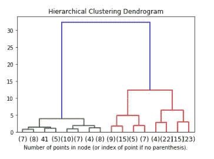
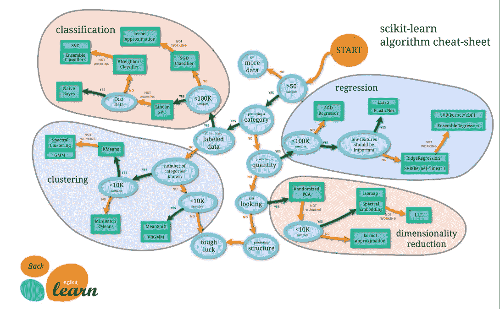

# 机器学习模型的可视化

> 原文：<https://blog.devgenius.io/visualizations-of-machine-learning-models-bec2f0bfa496?source=collection_archive---------20----------------------->

## 机器学习没那么难


不然我怎么能抓住你的注意力呢？

现在我可能已经疏远了我的所有观众，因为没有一个头脑正常的人认为机器学习是容易的，让我来解释一下。

机器学习这个术语是一个令人生畏的术语——几乎每次我在 ML 项目中工作时，我都会查找关于如何执行特定模型的代码。但是我要和你分享一个秘密:

> “大多数你向其展示你的发现的人不知道线性和逻辑之间的区别。他们也不在乎。”

因此，在你创建一个新的分类器“**我放弃机器学习**”之前，一个可能相当准确的模型，取决于用例(笑话)，尝试一下本文中概述的例子！

# 假设您已经有了数据并准备好了

您是否已经完成了设置工作——通过任何必要的方式获取数据、格式化数据、添加列、删除空值、转换数据类型、执行一些初步分析(散点图、热图、面积图等)。)?

我将使用欺诈数据集。它来自 ka ggle——我会使用一些我自己从现在/以前的公司得到的数据，但是……关于 PII 的一些东西，它可能会让我被解雇，所以是的。我们将使用公共数据集，没什么大不了的。

```
# Print the shape of the data
data = pd.read_csv('creditcard.csv')
data = data.sample(frac=0.1, random_state = 1)
print(data.columns)
print(data.shape)
print(data.describe())# V1 - V28 are the results of a PCA Dimensionality reduction to protect user identities and sensitive features
```


请打印出来

# 太好了，现在你的数据是什么样的？

一些表格可以让你感受一下你的数据框架:

```
df = data
# df.head()table_bar = df.head(10).style.bar(color='lightblue')
table_bar
```


病床。生病的

```
gradient = df.head(10).style.background_gradient(cmap='Blues')
gradient
```


蓝色的！

# 初步分析:


柱状图


热图

```
# Plot histograms of each parameter data.hist(figsize = (20, 20))plt.show()# Correlation matrixcorrmat = data.corr()
fig = plt.figure(figsize = (12, 9))sns.heatmap(corrmat, vmax = .8, square = True)plt.show()
```


```
sns.pairplot(data)
```

# 又一个直观的初步视觉——树状图

我是出了名的懒，在学习到完美的时候。一开始我看起来非常有动力，一旦我发现了足够的信息让我到达终点，也许更远一点，我就出局了。这些模型大部分是我在网上找到的，并插入了我自己的数据。我只是不明白你为什么要从头开始写？我甚至不相信我自己写的 ML 模型，看来这是唯一的出路。

*是的，这就是人们在创造一些视觉效果时大肆宣传的同一个虹膜数据集。别担心，我用下面不同的数据重新创建。

```
#dendrogram
from scipy.cluster.hierarchy import dendrogram
from sklearn.datasets import load_iris
from sklearn.cluster import AgglomerativeClusteringdef plot_dendrogram(model, **kwargs):
    # Create linkage matrix and then plot the dendrogram# create the counts of samples under each node
    counts = np.zeros(model.children_.shape[0])
    n_samples = len(model.labels_)
    for i, merge in enumerate(model.children_):
        current_count = 0
        for child_idx in merge:
            if child_idx < n_samples:
                current_count += 1  # leaf node
            else:
                current_count += counts[child_idx - n_samples]
        counts[i] = current_countlinkage_matrix = np.column_stack([model.children_, model.distances_,
                                      counts]).astype(float)# Plot the corresponding dendrogram
    dendrogram(linkage_matrix, **kwargs)iris = load_iris()
X = iris.data# setting distance_threshold=0 ensures we compute the full tree.
model = AgglomerativeClustering(distance_threshold=0, n_clusters=None)model = model.fit(X)
plt.title('Hierarchical Clustering Dendrogram')
# plot the top three levels of the dendrogram
plot_dendrogram(model, truncate_mode='level', p=3)
plt.xlabel("Number of points in node (or index of point if no parenthesis).")
plt.show()
```



没错。这一切都是为了这个。

# 下一步——准备好你的数据 ML(Xs，Ys，Trains，Tests，Targets 等)。)

```
# Determine number of fraud cases in dataset
Fraud = data[data['Class'] == 1]
Valid = data[data['Class'] == 0]outlier_fraction = len(Fraud)/float(len(Valid))
print(outlier_fraction)print('Fraud Cases: {}'.format(len(data[data['Class'] == 1])))
print('Valid Transactions: {}'.format(len(data[data['Class'] == 0])))print(Fraud.head())
print(Valid.head())# Get all the columns from the dataFrame
columns = data.columns.tolist()# Filter the columns to remove data we do not want
columns = [c for c in columns if c not in ["Class"]]# Store the variable we'll be predicting on
target = "Class"X = data[columns]
Y = data[target]# Print shapes
print(X.shape)
print(Y.shape)
print(columns)
print(X.head())
print(Y.head())
```

# 下一个即插即用—我的最爱

**决策树分类器**

```
#decisiontreeclassifier 
from sklearn.tree import DecisionTreeClassifier
from sklearn.model_selection import train_test_split# Create the training and test sets
X_train, X_test, y_train, y_test = train_test_split(X, Y, test_size=0.2, random_state=123)# Instantiate the classifier: dt_clf_4
dt_clf_4 = DecisionTreeClassifier(random_state=123, max_depth=4)# Fit the classifier to the training set
dt_clf_4.fit(X_train,y_train)# Predict the labels of the test set: y_pred_4
y_pred_4 = dt_clf_4.predict(X_test)# Compute the accuracy of the predictions: accuracy
accuracy = float(np.sum(y_pred_4==y_test))/y_test.shape[0]
print("accuracy:", accuracy)
```

> 精确度:0.9984612609

**极端梯度提升分类器(可以说是分类的最佳算法)**

```
#xgboost and decisiontreeclassifier
from sklearn.model_selection import train_test_split
from sklearn.tree import DecisionTreeClassifier
import xgboost as xgbstate=1#xgboost
X_train, X_test, y_train, y_test = train_test_split(X, Y, test_size=0.2, random_state=1)
xg_cl = xgb.XGBClassifier(objective='binary:logistic',n_estimators=10,seed=state)
xg_cl.fit(X_train, y_train)#decisiontreeclassifier
dt_clf_4 = DecisionTreeClassifier(random_state=123, max_depth=4)
dt_clf_4.fit(X_train,y_train)# Predict the labels of the test set: y_pred_4
preds = xg_cl.predict(X_test)
y_pred_4 = dt_clf_4.predict(X_test)
accuracy_xg_cl = float(np.sum(preds==y_test))/y_test.shape[0]
accuracy_dt_clf_4 = float(np.sum(y_pred_4==y_test))/y_test.shape[0]#print it
print("accuracy_dt_clf_4:", accuracy)
print("accuracy_xg_cl: %f" % (accuracy))
```

> accuracy _ dt _ clf _ 4:0.9989468141126909
> accuracy _ XG _ cl:0.998947

**xgboost 的更多例子**

```
#xgboost# import xgboost as xgb
# import pandas as pd# Create arrays for the features and the target: X, y
#X, y = df.iloc[:,:-1], df.iloc[:,-1]# Create the DMatrix from X and y: churn_dmatrix
churn_dmatrix = xgb.DMatrix(data=data.iloc[:,:-1], label=data.Class)
data.iloc[1]
X.iloc[1]# Create the parameter dictionary: params
params = {"objective":"reg:logistic", "max_depth":3}# Perform cross-validation: cv_results
cv_results_error = xgb.cv(dtrain=churn_dmatrix,params=params,\
                          nfold=3,num_boost_round=5,metrics="error",as_pandas=True,seed=123)
cv_results_auc = xgb.cv(dtrain=churn_dmatrix,params=params,\
                        nfold=3,num_boost_round=5,metrics="auc", as_pandas=True, seed=123)# Print cv_results
print(cv_results_error)
print(cv_results_auc)# Print the %
print(((1-cv_results_error["test-error-mean"]).iloc[-1]))
print((cv_results_auc["test-auc-mean"]).iloc[-1])
```


大话等于大文。好吧，没有。

**隔离林和局部离群因子**

```
#isolationforest and localoutlierfactor
from sklearn.metrics import classification_report, accuracy_score
from sklearn.ensemble import IsolationForest
from sklearn.neighbors import LocalOutlierFactor# define random states
state = 1# define outlier detection tools to be compared
classifiers = {
    "Isolation Forest": IsolationForest(max_samples=len(X),
                                        contamination=outlier_fraction,
                                        random_state=state),
    "Local Outlier Factor": LocalOutlierFactor(n_neighbors=20,
                                               contamination=outlier_fraction)
}n_outliers = len(Fraud)
for i, (clf_name,clf) in enumerate(classifiers.items()):
    #Fit the data and tag outliers
    if clf_name == "Local Outlier Factor":
        y_pred = clf.fit_predict(X)
        scores_prediction = clf.negative_outlier_factor_
    elif clf_name == "Support Vector Machine":
        clf.fit(X)
        y_pred = clf.predict(X)
    else:    
        clf.fit(X)
        scores_prediction = clf.decision_function(X)
        y_pred = clf.predict(X)
    #Reshape the prediction values to 0 for Valid transactions , 1 for Fraud transactions
    y_pred[y_pred == 1] = 0
    y_pred[y_pred == -1] = 1
    n_errors = (y_pred != Y).sum()
    # Run Classification Metrics
    print("{}: {}".format(clf_name,n_errors))
    print("Accuracy Score :")
    print(accuracy_score(Y,y_pred))
    print("Classification Report :")
    print(classification_report(Y,y_pred))
```


使用 f1 分数—精确度和召回率的组合(分别为 28%和 2%)

克内堡分级机

```
#KNeighborsClassifier predicting labels
from sklearn.neighbors import KNeighborsClassifier
from sklearn.model_selection import train_test_split#train test
X_train, X_test, y_train, y_test = train_test_split(X, Y, test_size=0.2, random_state=1)# Create arrays for the features and the response variable
y = data['Class'].values
X = data.drop('Class', axis=1).valuesy
X# Create a k-NN classifier with 6 neighbors
knn = KNeighborsClassifier(n_neighbors=6)# Fit the classifier to the data
knn.fit(X,y)# Predict the labels for the training data X
y_pred = knn.predict(X)
y_predprint("Prediction: {}".format(y_pred))
print(knn.score(X_test, y_test))
```

> 预测:[0 0 0...0 0 0]
> 0 . 54860 . 48868888661

# 好的，但是你怎么知道使用哪种模型呢？

很高兴你这么问，`Sklearn`人们已经为测试你的模型编写了一些非常酷的代码。

```
import numpy as np
import matplotlib.pyplot as plt
from matplotlib.colors import ListedColormap
from sklearn.model_selection import train_test_split
from sklearn.preprocessing import StandardScaler
from sklearn.datasets import make_moons, make_circles, make_classification
from sklearn.neural_network import MLPClassifier
from sklearn.neighbors import KNeighborsClassifier
from sklearn.svm import SVC
from sklearn.gaussian_process import GaussianProcessClassifier
from sklearn.gaussian_process.kernels import RBF
from sklearn.tree import DecisionTreeClassifier
from sklearn.ensemble import RandomForestClassifier, AdaBoostClassifier
from sklearn.naive_bayes import GaussianNB
from sklearn.discriminant_analysis import QuadraticDiscriminantAnalysish = .02  # step size in the meshnames = ["Nearest Neighbors", "Linear SVM", "RBF SVM", "Gaussian Process",
         "Decision Tree", "Random Forest", "Neural Net", "AdaBoost",
         "Naive Bayes", "QDA"]classifiers = [
    KNeighborsClassifier(3),
    SVC(kernel="linear", C=0.025),
    SVC(gamma=2, C=1),
    GaussianProcessClassifier(1.0 * RBF(1.0)),
    DecisionTreeClassifier(max_depth=5),
    RandomForestClassifier(max_depth=5, n_estimators=10, max_features=1),
    MLPClassifier(alpha=1, max_iter=1000),
    AdaBoostClassifier(),
    GaussianNB(),
    QuadraticDiscriminantAnalysis()]X, y = make_classification(n_features=2, n_redundant=0, n_informative=2,
                           random_state=1, n_clusters_per_class=1)
rng = np.random.RandomState(2)
X += 2 * rng.uniform(size=X.shape)
linearly_separable = (X, y)datasets = [make_moons(noise=0.3, random_state=0),
            make_circles(noise=0.2, factor=0.5, random_state=1),
            linearly_separable
            ]figure = plt.figure(figsize=(30, 12))i = 1
# iterate over datasets
for ds_cnt, ds in enumerate(datasets):
    # preprocess dataset, split into training and test part
    X, y = ds
    X = StandardScaler().fit_transform(X)
    X_train, X_test, y_train, y_test = \
        train_test_split(X, y, test_size=.4, random_state=42)x_min, x_max = X[:, 0].min() - .5, X[:, 0].max() + .5
    y_min, y_max = X[:, 1].min() - .5, X[:, 1].max() + .5
    xx, yy = np.meshgrid(np.arange(x_min, x_max, h),
                         np.arange(y_min, y_max, h))# just plot the dataset first
    cm = plt.cm.winter
    cm_bright = ListedColormap(['#3B5ADC', '#67CDD9'])
    ax = plt.subplot(len(datasets), len(classifiers) + 1, i)
    if ds_cnt == 0:
        ax.set_title("Input data")
    # Plot the training points
    ax.scatter(X_train[:, 0], X_train[:, 1], c=y_train, cmap=cm_bright,
               edgecolors='k')
    # Plot the testing points
    ax.scatter(X_test[:, 0], X_test[:, 1], c=y_test, cmap=cm_bright, alpha=0.6,
               edgecolors='k')
    ax.set_xlim(xx.min(), xx.max())
    ax.set_ylim(yy.min(), yy.max())
    ax.set_xticks(())
    ax.set_yticks(())
    i += 1# iterate over classifiers
    for name, clf in zip(names, classifiers):
        ax = plt.subplot(len(datasets), len(classifiers) + 1, i)
        clf.fit(X_train, y_train)
        score = clf.score(X_test, y_test)# Plot the decision boundary. For that, we will assign a color to each
        # point in the mesh [x_min, x_max]x[y_min, y_max].
        if hasattr(clf, "decision_function"):
            Z = clf.decision_function(np.c_[xx.ravel(), yy.ravel()])
        else:
            Z = clf.predict_proba(np.c_[xx.ravel(), yy.ravel()])[:, 1]# Put the result into a color plot
        Z = Z.reshape(xx.shape)
        ax.contourf(xx, yy, Z, cmap=cm, alpha=.8)# Plot the training points
        ax.scatter(X_train[:, 0], X_train[:, 1], c=y_train, cmap=cm_bright,
                   edgecolors='k')
        # Plot the testing points
        ax.scatter(X_test[:, 0], X_test[:, 1], c=y_test, cmap=cm_bright,
                   edgecolors='k', alpha=0.6)ax.set_xlim(xx.min(), xx.max())
        ax.set_ylim(yy.min(), yy.max())
        ax.set_xticks(())
        ax.set_yticks(())
        if ds_cnt == 0:
            ax.set_title(name)
        ax.text(xx.max() - .3, yy.min() + .3, ('%.2f' % score).lstrip('0'),
                size=15, horizontalalignment='right')
        i += 1# plt.tight_layout()
plt.show()
```


我自己选的颜色

# 好吧，但是我怎么知道这些聚类算法实际上在做什么呢？

很高兴你也问了这个问题。sklearn 的人制作了一个非常酷的脚本来展示一些更流行的 ml 模型在分组和分类方面所做的事情。

```
import time
import warningsimport numpy as np
import matplotlib.pyplot as pltfrom sklearn import cluster, datasets, mixture
from sklearn.neighbors import kneighbors_graph
from sklearn.preprocessing import StandardScaler
from itertools import cycle, islicenp.random.seed(0)# ============
# Generate datasets. We choose the size big enough to see the scalability
# of the algorithms, but not too big to avoid too long running times
# ============
n_samples = 1500
noisy_circles = datasets.make_circles(n_samples=n_samples, factor=.5,
                                      noise=.05)
noisy_moons = datasets.make_moons(n_samples=n_samples, noise=.05)
blobs = datasets.make_blobs(n_samples=n_samples, random_state=8)
no_structure = np.random.rand(n_samples, 2), None# Anisotropicly distributed data
random_state = 170
X, y = datasets.make_blobs(n_samples=n_samples, random_state=random_state)
transformation = [[0.6, -0.6], [-0.4, 0.8]]
X_aniso = np.dot(X, transformation)
aniso = (X_aniso, y)# blobs with varied variances
varied = datasets.make_blobs(n_samples=n_samples,
                             cluster_std=[1.0, 2.5, 0.5],
                             random_state=random_state)# ============
# Set up cluster parameters
# ============
plt.figure(figsize=(9 * 2 + 3, 12.5))
plt.subplots_adjust(left=.02, right=.98, bottom=.001, top=.96, wspace=.05,
                    hspace=.01)plot_num = 1default_base = {'quantile': .3,
                'eps': .3,
                'damping': .9,
                'preference': -200,
                'n_neighbors': 10,
                'n_clusters': 3,
                'min_samples': 20,
                'xi': 0.05,
                'min_cluster_size': 0.1}datasets = [
    (noisy_circles, {'damping': .77, 'preference': -240,
                     'quantile': .2, 'n_clusters': 2,
                     'min_samples': 20, 'xi': 0.25}),
    (noisy_moons, {'damping': .75, 'preference': -220, 'n_clusters': 2}),
    (varied, {'eps': .18, 'n_neighbors': 2,
              'min_samples': 5, 'xi': 0.035, 'min_cluster_size': .2}),
    (aniso, {'eps': .15, 'n_neighbors': 2,
             'min_samples': 20, 'xi': 0.1, 'min_cluster_size': .2}),
    (blobs, {}),
    (no_structure, {})]for i_dataset, (dataset, algo_params) in enumerate(datasets):
    # update parameters with dataset-specific values
    params = default_base.copy()
    params.update(algo_params)X, y = dataset# normalize dataset for easier parameter selection
    X = StandardScaler().fit_transform(X)# estimate bandwidth for mean shift
    bandwidth = cluster.estimate_bandwidth(X, quantile=params['quantile'])# connectivity matrix for structured Ward
    connectivity = kneighbors_graph(
        X, n_neighbors=params['n_neighbors'], include_self=False)
    # make connectivity symmetric
    connectivity = 0.5 * (connectivity + connectivity.T)# ============
    # Create cluster objects
    # ============
    ms = cluster.MeanShift(bandwidth=bandwidth, bin_seeding=True)
    two_means = cluster.MiniBatchKMeans(n_clusters=params['n_clusters'])
    ward = cluster.AgglomerativeClustering(
        n_clusters=params['n_clusters'], linkage='ward',
        connectivity=connectivity)
    spectral = cluster.SpectralClustering(
        n_clusters=params['n_clusters'], eigen_solver='arpack',
        affinity="nearest_neighbors")
    dbscan = cluster.DBSCAN(eps=params['eps'])
    optics = cluster.OPTICS(min_samples=params['min_samples'],
                            xi=params['xi'],
                            min_cluster_size=params['min_cluster_size'])
    affinity_propagation = cluster.AffinityPropagation(
        damping=params['damping'], preference=params['preference'])
    average_linkage = cluster.AgglomerativeClustering(
        linkage="average", affinity="cityblock",
        n_clusters=params['n_clusters'], connectivity=connectivity)
    birch = cluster.Birch(n_clusters=params['n_clusters'])
    gmm = mixture.GaussianMixture(
        n_components=params['n_clusters'], covariance_type='full')clustering_algorithms = (
        ('MiniBatchKMeans', two_means),
        ('AffinityPropagation', affinity_propagation),
        ('MeanShift', ms),
        ('SpectralClustering', spectral),
        ('Ward', ward),
        ('AgglomerativeClustering', average_linkage),
        ('DBSCAN', dbscan),
        ('OPTICS', optics),
        ('Birch', birch),
        ('GaussianMixture', gmm)
    )for name, algorithm in clustering_algorithms:
        t0 = time.time()# catch warnings related to kneighbors_graph
        with warnings.catch_warnings():
            warnings.filterwarnings(
                "ignore",
                message="the number of connected components of the " +
                "connectivity matrix is [0-9]{1,2}" +
                " > 1\. Completing it to avoid stopping the tree early.",
                category=UserWarning)
            warnings.filterwarnings(
                "ignore",
                message="Graph is not fully connected, spectral embedding" +
                " may not work as expected.",
                category=UserWarning)
            algorithm.fit(X)t1 = time.time()
        if hasattr(algorithm, 'labels_'):
            y_pred = algorithm.labels_.astype(np.int)
        else:
            y_pred = algorithm.predict(X)plt.subplot(len(datasets), len(clustering_algorithms), plot_num)
        if i_dataset == 0:
            plt.title(name, size=18)colors = np.array(list(islice(cycle(['#2C629B', '#24C8AA', '#9D7BD5',
                                             '#20CF6B', '#B548D8', '#341D98',
                                             '#77F2FC', '#FB5A36', '#2C6CFF']),
                                      int(max(y_pred) + 1))))
        # add purple color for outliers (if any)
        colors = np.append(colors, ["#DA7FFE"])
        plt.scatter(X[:, 0], X[:, 1], s=10, color=colors[y_pred])plt.xlim(-2.5, 2.5)
        plt.ylim(-2.5, 2.5)
        plt.xticks(())
        plt.yticks(())
        plt.text(.99, .01, ('%.2fs' % (t1 - t0)).lstrip('0'),
                 transform=plt.gca().transAxes, size=14,
                 horizontalalignment='right', bbox=dict(facecolor='white', alpha=0.5),
                color='#B548D8')
        plot_num += 1plt.show()
```


这些颜色也是我自己选的。你。是。欢迎光临。

# 好的，最后一个——结合热图和树状图，赢得胜利

热图很累，树状图有太多的问题。因此，当你向任何人展示你的结果时，当他们问你问题时，这是一个视觉效果，让他们感到哑口无言——因为这就像聚类一样清晰。如果你问我，就回答:

> 伙计，看一下图表。


# 使用哪种模型的良好经验法则



香槟酒

# 综上

如果你是自由职业者，没有大公司给你买机器学习自动化产品，那么就找一些听起来很酷的模型，然后插入你自己的数据。没有必要重新发明轮子！在决定使用哪种型号时，请尝试上图以获得帮助。

如果你在一家大公司工作，能够负担得起一款新的人工智能产品，我会选择[数据机器人](https://www.datarobot.com/lp/ai-ethics/?utm_medium=search&utm_source=google&utm_campaign=2019aiethicsBRANDED2020paidadsGPS&utm_term=message2&utm_content=variation1&campaignid=9733876715&adgroupid=103232814641&adid=428351901572&gclid=EAIaIQobChMIv4P84ei56gIVqtSzCh2lawNcEAAYASAAEgLT3PD_BwE)——这可能是我见过的最酷、最简单的人工智能产品。我目前没有权限访问它，但我过去有，而且它肯定有我的批准。数据机器人如果你要招人，来找我吧。

如果你觉得这篇文章很有帮助，欢迎鼓掌或提出问题。我喜欢反馈。在一天内完成这件事也让我非常头疼。请随意捐赠一些咖啡或止痛药。

> **欢呼**，
> 
> **最大**

[](https://www.buymeacoffee.com/31yearoldmoron)

**Github**:[https://github.com/maxwellbade/machine_learning_fraud](https://github.com/maxwellbade/machine_learning_fraud)

**Instagram** : @maxbade

**linkedin** : @maxbade