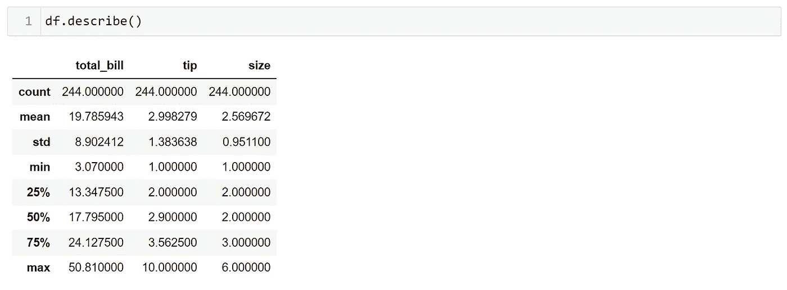

# 在 Seaborn 中可视化箱线图

> 原文：<https://blog.devgenius.io/visualizing-box-plots-in-seaborn-d5d760dbf9bd?source=collection_archive---------3----------------------->

让我们讨论在 Seaborn 中创建盒状图的不同可视化技术。

当我们需要一种标准化的方法来分析数据分布时，我们通常绘制箱线图。

为了实现这一点，我们借助五个汇总数字:

1.  最小值
2.  第一个四分位数(Q1)
3.  第二个四分位数/中位数
4.  第三个四分位数(Q3)
5.  最大值

盒图的另一个名字是盒须图。这是因为当我们绘制盒状图时，连接最小 Q1 和最大 Q3 的线看起来像猫须，如下所示。

作者图片

[benot ARMONI 拍摄的图片](https://www.pexels.com/photo/close-up-photo-of-brown-tabby-cat-12392366/)

在我们学习如何对盒状图进行编码之前，让我们讨论一下摘要数字，它是盒状图的基础。

第一个和第五个数字是不言自明的，即数据集中的最小和最大数字。

第一个四分位数是数据集中值左侧数字的中值。

让我们看看下面的数字:

3, 3, 6, 7, 7, 10, 10, 10, 11, 13, 30.

**第一步:**我们需要检查所有的值是否都是升序。

在我们的例子中，上述数字已经按顺序排列。

**第二步:**接下来，让我们计算数据集的中位数。

中位数是数据集的中间点。

在我们的例子中，我们有 11 个数字，所以我们需要取数据集的中间数。

3，3，6，7，7， **10** ，10，10，11，13，30。

**第三步:**现在有了中值，我们来计算第一个四分位数。

我们需要计算 10 剩下的所有数字的中位数。

我们将前五个数字的中间值设为 6。

3，3， **6** ，7，7。

**第 4 步:**与 Q1 计算类似，我们可以通过取 10 右侧值的中值来计算 Q3。

10，10， **11** ，13，30。

现在我们有了绘制箱线图的所有数字:

最小值= 3

Q1 = 6

中位数= 10

Q3 = 11

最大值= 30

现在我们知道了如何计算汇总数。

让我们开始学习如何用 python 编写方框图。

我们将首先在 jupyter 笔记本中加载所需的库。

和前面的文章一样，我们将加载 pandas、seaborn 和 matplotlib pyplot。

作者图片

我们将为我们的示例选择 tips 数据集。

第一个任务是加载数据集，我们将它加载到一个名为 df 的数据框中。

df = sns.load_dataset('提示')

接下来，为了理解数据，让我们看看前五行。
我们可以使用 head 方法来实现这一点。

作者图片

要创建一个简单的箱形图，我们可以使用 seaborn，如下所示:

作者图片

我们基于数据框的提示列创建了一个箱线图。

我们也可以将它绘制在 y 轴上，得到如下所示的结果:

检查生成的图，我们在图表中看到一些绘制的点。

这些点就是数据的*。*

*离群值是任何不遵循数据集总体趋势的数据点。*

*在统计学中，我们通过取第三个和第一个四分位数之间的差来计算异常值。这个结果数字被称为*四分位数间距*或简称为 IQR。*

*任何小于第一个四分位数减去 1 . 5 倍 IQR 或大于第三个四分位数加上 1 . 5 倍 IQR 的数字都被视为异常值。*

*如果我们把它写成一个公式，我们得到如下结果:*

***编号<Q1-1.5 * IQR 或编号> Q3 + 1.5 * IQR***

*在数据框中，我们有一个名为“描述”的方法，它给出了四分位数中位数的详细信息和其他统计信息，如下所示:*

**

*作者图片*

*查看生成的盒图和“describe”方法的输出，我们看到了一些有趣的东西。*

*晶须位于 Q3 + 1.5 * IQR，而不是最大值。*

*我们可以通过计算数量来验证这一点。*

*我们有，
Q3 = 3.56
Q1 = 2.00*

*IQR = Q3—Q1 = 3.56–2.00 = 1.56
1.5 * IQR = 2.34*

*Q3 + 1.5 * IQR = 3.56 + 2.34 = 5.9*

*在生成的图表中，任何大于 5.9 的数字都是异常值。*

**

*作者图片*

*请记住，在 seaborn 绘图时，Q3 + 1.5 * IQR 而不是最大值标记在箱线图上。*

*接下来，让我们创建一个更复杂的方框图。*

*让我们画出餐馆营业不同日子的小费金额。*

*我们将考虑 x 轴上的天数和 y 轴上的小费，如下所示:*

**

*作者图片*

*我们可以看到周六的小费是最高的。*

*现在，让我们看看可以用来创建不同盒状图的各种参数。*

*我们将探讨的第一个参数是“色调”。与前几篇文章中讨论的函数一样，hue 用于根据特定的列给数据着色。*

*让我们创建一个和以前一样的图，但是根据性别来划分图形。*

**

*作者图片*

*我们可以看到，女性在周四给的小费更多，而男性在周六给的小费更多。*

*接下来，我们使用“order”参数来改变输出的顺序。*

*假设我们想要绘制一天中某个时间收到的小费的箱线图。*

**

*作者图片*

*默认情况下，先显示午餐，然后显示晚餐。如果我们想颠倒时间列的顺序，我们可以这样做:*

**

*作者图片*

*我们可以将该参数中的列的顺序作为一个列表来提供，然后运行代码，我们会得到如上所示的输出。*

*使用“hue_order”参数可以在色调参数元素中获得类似的输出。*

*假设我们想得到上面图中的雌性分布，然后是雄性分布。
我们可以根据期望的输出传递一个性别列表，如下所示:*

**

*作者图片*

*接下来，我们使用调色板参数来改变绘图的颜色。*

*我们用‘PRGn’吧，它是紫-绿组合的简称。
我们将绘制之前的图表，并使用调色板参数更改颜色组合，如下所示:*

**

*作者图片*

*接下来，我们有盒子的宽度，默认情况下是 0.8，但是我们可以根据自己的需要更改它。*

*假设我们想要 1 的宽度而不是 0.8。我们可以像下面这样传递它:*

**

*作者图片*

*接下来，我们有“fliersize ”,它定义了异常值在图上的大小。*

*如果你还记得的话，我们看到的第一个图没有任何异常值映射在图上。我们可以通过向“fliersize”参数传递零来实现这一点，如下所示:*

**

*作者图片*

*让我们试着分解用于情节的代码。
首先，通过使用“matplotlib ”,我们定义了图表的图形和轴。
在下一步中，我们用零“弗利尔泽”和等于第一步中声明的值的轴绘制盒状图。
最后，我们定义 x 轴的极限，我们只关注前八个数字，这给了我们如上图所示的最终输出。*

*下次见！*