# 在 Seaborn 中可视化 Boxen 或 Letter 值图

> 原文：<https://blog.devgenius.io/visualizing-boxen-or-letter-value-plots-in-seaborn-410397d7eee2?source=collection_archive---------5----------------------->

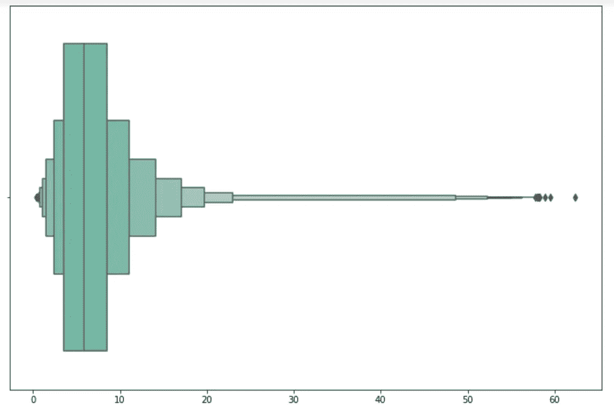

博兴图示例(图片由作者提供)

让我们讨论在 Seaborn 中创建 boxen 图的不同可视化技术。

boxen 图，也称为字母值图，与我们在前面的文章中讨论的 box 图非常相似。

这两个图的主要区别在于图表上数据的显示方式。

箱形图适用于较小的数据集，尤其是少于 500–1000 个数据点的数据集。当我们为一个较小的数据集绘制异常值时，我们发现图上标记的点更少，更容易分析。

假设我们有一个包含 5 万、10 万或更多条目的数据集。当我们考虑绘制异常值时，它可以立即填充绘图区域。这种输出会迷惑我们，而不是帮助我们分析数据。

让我们考虑一个例子来更好地理解这一点。我们将考虑来自 UCI 机器学习知识库的[二级蘑菇数据集](https://archive.ics.uci.edu/ml/datasets/Secondary+Mushroom+Dataset)，它有大约 61000 个条目。

现在，第一步是在我们的环境中加载数据集。

按照上面提供的超链接，从网站下载数据。

接下来，使用 pandas 的 read_csv 方法读取文件，如下所示:

```
df = pd.read_csv('MushroomDataset/secondary_data.csv', sep=';')
```

我们可以看到，除了文件名，我们还在 separator 参数中提供了一个分号。我们这样做是因为如果我们打开文件，我们将会看到所有的点都用分号而不是默认的分隔符(即逗号)来区分。

现在已经加载了数据，让我们使用 head 方法查看前五行，如下所示:

```
df.head()
```

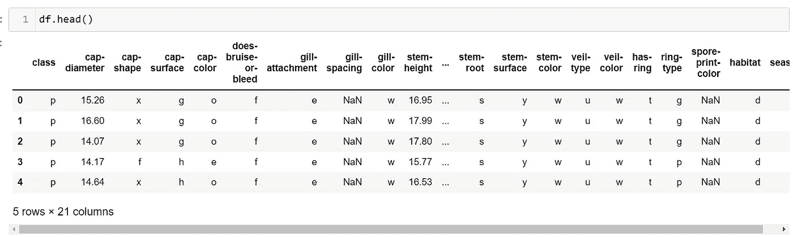

作者图片

我们现在将比较箱线图和 boxen 图，并尝试理解为什么需要创建另一个类似于箱线图的可视化。

让我们为蘑菇帽直径创建一个简单的盒状图。

我们可以实现以下目标:

```
sns.boxplot(x=df['cap-diameter'])
```

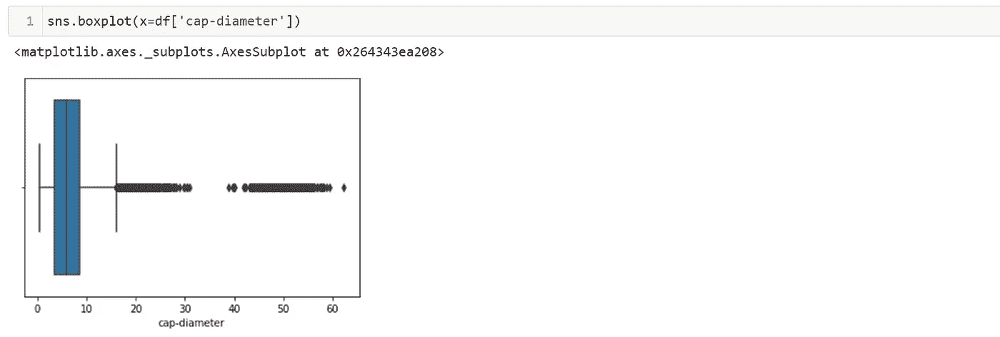

作者图片

我们可以看到，有许多数据点被标记为异常值。正如在箱线图文章中所讨论的，seaborn 将“Q3 + 1.5 * IQR”标记为图表上的须。

从上面这一点来看，我们观察到许多数据点，我们没有分析它们的分布，这是箱线图的主要缺点。

数学上，当我们考虑一个分布遵循正态分布的数据集时。我们知道四分位距(IQR)占数据的 50 %,盒须图覆盖了约 99.3%的数据。

上面直接暗示了盒图中异常值的百分比总是 0.7%，不管我们正在分析的数据集大小如何。

例如，如果我们有一个包含 500，000 个点的数据集，我们将有 3500 个数据点作为异常值。当在箱线图上绘制时，我们可以想象如果 3500 个数据点混杂在一条线上，图表看起来会有多混乱。

与上面显示的样本盒图相比，它看起来更加拥挤。

boxen 图的出现是为了解决盒图在分析大型数据集时出现的问题。

让我们创建一个简单的 boxen 图，看看实际情况。我们将采用与箱线图相同的数据点，如下所示:

```
sns.boxenplot(x=df['cap-diameter']);
```

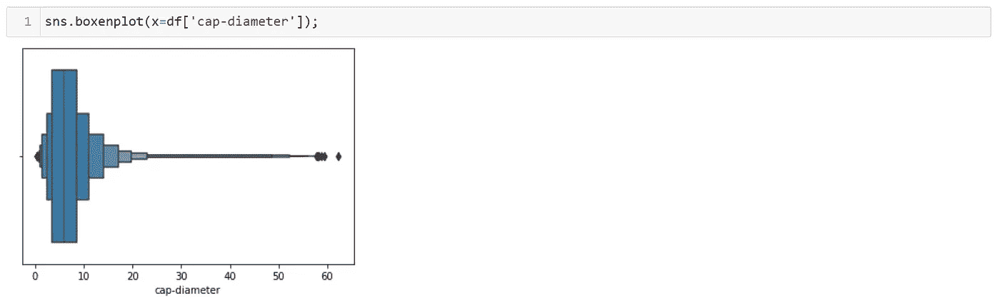

作者图片

为了更详细地查看图表，让我们使用 matplotlib 来增加 boxen 和 box 图的图形大小。

我们可以使用以下命令来实现这一点:

```
fig, ax = plt.subplots(figsize = (12, 8))  
fig = sns.boxenplot(x=df['cap-diameter'])
plt.show()
```

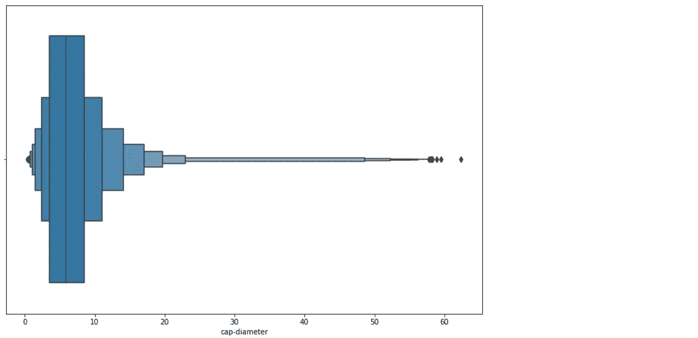

作者图片

```
fig, ax = plt.subplots(figsize = (12, 8))  
fig = sns.boxplot(x=df['cap-diameter'])
plt.show()
```

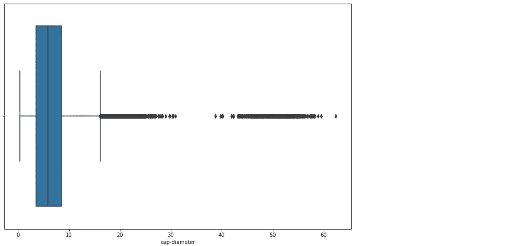

作者图片

我们可以看到，boxen 图不那么杂乱，给了我们更详细的信息。

现在我们来试着理解一下博森剧情到底想传达什么。

boxen 图也称为字母值图，因为每个方框代表字母表中的一个字母。最里面的方框就是我们在方框图中看到的方框。额外的框遵循将中值除以 2 的逻辑。

让我们举个例子来理解这一点:

假设我们有以下数字:

3, 3, 6, 7, 7, 10, 10, 10, 11, 13, 30.

第一步是检查值是否按升序排列。

在我们的例子中，上面的数字已经按顺序排列了。

下一步是计算数据的中位数。

我们知道中位数是数据集的中间点。

在我们的例子中，我们有 11 个数字，所以我们需要取数据集的中间数字 10。

3，3，6，7，7， **10** ，10，10，11，13，30。

我们还可以使用以下公式找到与中位数相关的一批数字的深度:

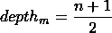

作者图片

这里，depth_m 代表中值深度，可以使用上面的等式来计算。

这里 n 是所考虑的数据中值的数量。

因此，将该公式应用于我们的数据，我们得到(11 + 1)/2，即 6。

所以中位数的深度是第 6 个数字，即 10。从另一个角度来看，整个数据的中值具有最高的深度，即 6。最小和最大数字在数据中的最低深度为 1。

接下来，我们需要计算什么是众所周知的中位数的铰链。计算类似于我们在盒图文章中看到的。

我们将在中间值的两侧创建两半，并计算每一半的中点。

在我们的例子中，我们有:

左半部分:

三，三，**六**，七，七。

右半部分:

10 日， **11 日，** 13 日，30 日。

两半的中点被认为是中线的铰链。计算铰链的另一种方法是通过以下公式:

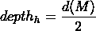

作者图片

这里，depth_h 代表铰链深度，可以使用上面的等式计算。
d(M)代表中央分隔带的深度。
因此，将公式应用于我们的数据，我们得到 6/2，即 3，第三个数字是铰链，即上面显示的 6 和 11。

铰链的计算类似于四分位数的计算，如果数据点的数量不同，我们会使用上面所示的公式得到稍微不同的铰链结果。

与上面的计算类似，如果我们在未来的步骤中继续上面计算深度并划分它的过程，我们将开始获得它旁边的盒子的值。

让我们计算一下八分之一的深度。我们称之为八分之一，因为我们将把外面的四分之一除以 2。

公式如下:

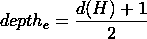

作者图片

这里 depth_e 代表深度的八分之一，d(H)是上一步计算的铰链深度。

应用我们得到的值(3 + 1)/2，即 2

所以这些数字取自之前计算的两半。

左半部分:

3，3， **6** ，7，7。

右半部分:

十日，**十日，**十一日，三十日。

所以在我们的例子中，八分之一的深度是 3 和 10。

我们继续这样做，直到我们用尽所有的数字，我们达到 1 的深度。

字母的分配方式是:

1.  中间值被指定为字母“M”。
2.  接下来，我们以相反的顺序从 F 开始，所以 F 被指定为四度，E 是八度，D 是十六度，依此类推。

下表显示了前 20 个字母值(摘自 2011 年 12 月 2 日发表的关于字母值图的研究论文):

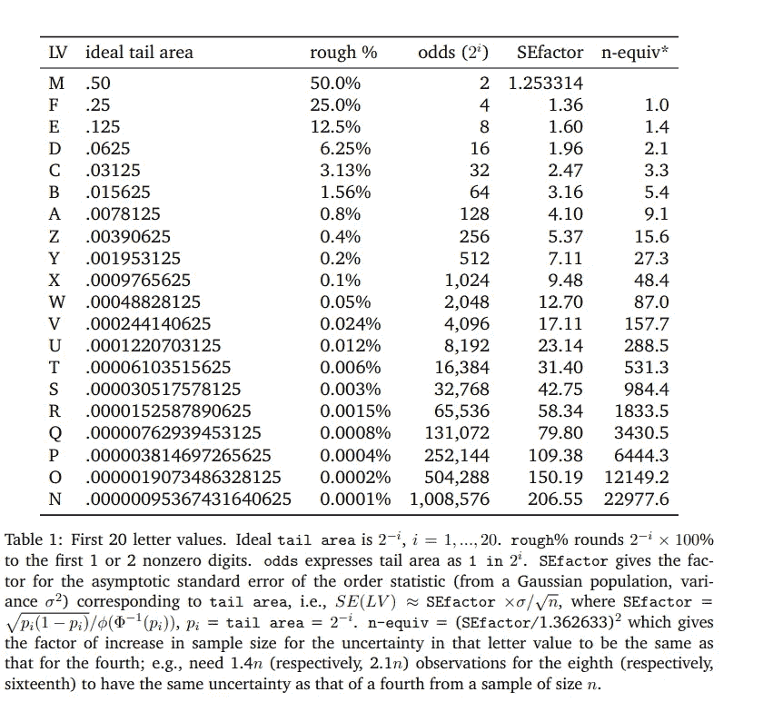

https://vita.had.co.nz/papers/letter-value-plot.pdf[第 9 页](https://vita.had.co.nz/papers/letter-value-plot.pdf)

对于任何有兴趣阅读该研究论文的人，您可以在 boxen plots 的 [seaborn 文档页面上找到它。我也将在下面的参考部分链接相同的内容。](https://seaborn.pydata.org/generated/seaborn.boxenplot.html)

现在我们已经了解了 boxen 图的工作原理，让我们把注意力转移到学习如何用 python 编写字母值图。

在上面的讨论中，我们已经学习了如何创建一个简单的 boxen 图。
现在让我们创建一个更复杂的博森情节。

我们来分析一下不同生境条件下蘑菇的菌盖直径。

我们可以这样做:

```
fig, ax = plt.subplots(figsize = (10, 5))  
fig = sns.boxenplot(x='habitat',y='cap-diameter', data=df)
plt.show()
```

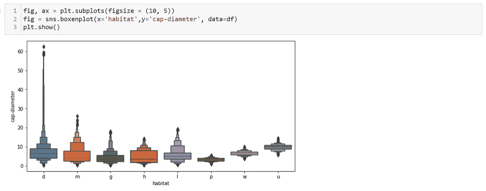

作者图片

现在，我们来讨论一下博森剧情最热门的参数。

第一行是色调参数，用于根据特定的列给图着色。
我们将利用蘑菇上的圆环来改变图的颜色，如下所示:

```
fig, ax = plt.subplots(figsize = (10, 5))  
fig = sns.boxenplot(x='habitat',y='cap-diameter', data=df, 
hue='has-ring')
plt.show()
```

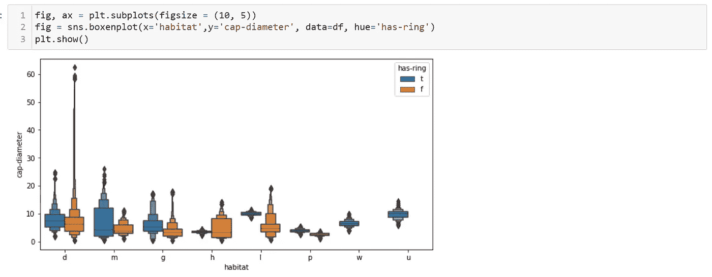

作者图片

从图中我们可以看出，有蘑菇不发育年轮的栖息地。

接下来，我们有 order 参数，它允许我们改变图中分类变量的顺序。

例如，我们将颠倒图表中栖息地的顺序，如下所示:

```
fig, ax = plt.subplots(figsize = (10, 5))  
fig = sns.boxenplot(x='habitat',y='cap-diameter', data=df, 
hue='has-ring', order=sorted(df['habitat'].unique(),reverse=True))
plt.show()
```

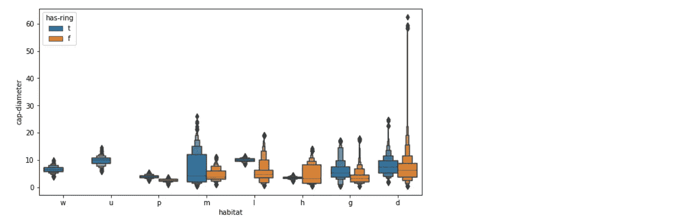

作者图片

让我们分解一下上面的代码:

**步骤 1** :我们已经使用 matplotlib 将图形大小固定为 10 乘 5

**第二步**:在 order 参数中，我们使用了带有 reverse 参数的 sorted 函数为真，并以相反的顺序得到栖息地值。

**第三步**:使用 matplotlib 的 show 函数，得到生成的图表。

接下来，我们有色调顺序，它可以改变色调中变量的顺序，如下所示:

```
fig, ax = plt.subplots(figsize = (10, 5))  
fig = sns.boxenplot(x='habitat',y='cap-diameter', data=df, 
hue='has-ring',                   order=sorted(df['habitat'].unique(),reverse=True), 
hue_order=['f','t'])
plt.show()
```

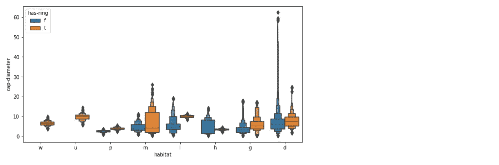

作者图片

与之前的图相比，这里我们颠倒了色调顺序。

最后，我们使用调色板参数来改变创建的图表的颜色模式。

我们已经在以前的文章中广泛讨论了 palette 参数，所以我将在下面展示一个使用它的例子:

```
fig, ax = plt.subplots(figsize = (10, 5))  
fig = sns.boxenplot(x='habitat',y='cap-diameter', data=df, 
hue='has-ring',                 order=sorted(df['habitat'].unique(),reverse=True), palette='coolwarm')
plt.show()
```

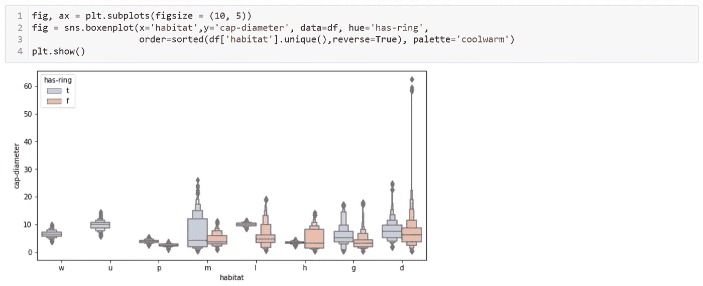

作者图片

感谢优秀的 Seaborn 团队将研究论文放入文档中！！！

**参考文献:**

1.  【https://seaborn.pydata.org/generated/seaborn.boxenplot.html】T5[T6](https://seaborn.pydata.org/generated/seaborn.boxenplot.html)
2.  [*https://vita.had.co.nz/papers/letter-value-plot.pdf*](https://vita.had.co.nz/papers/letter-value-plot.pdf)
3.  [*UCI 机器学习知识库*](https://archive.ics.uci.edu/ml/datasets/Secondary+Mushroom+Dataset)

下次见！