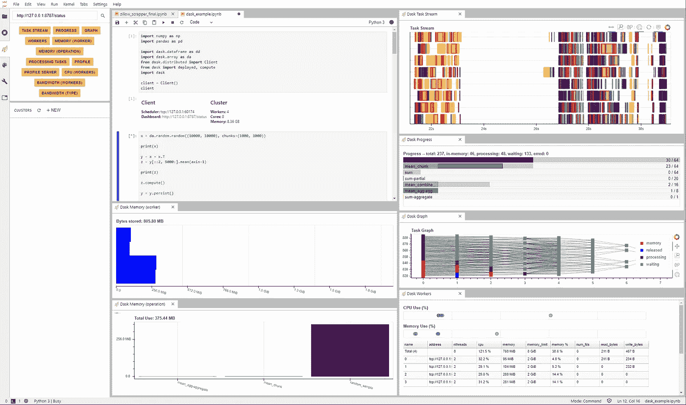
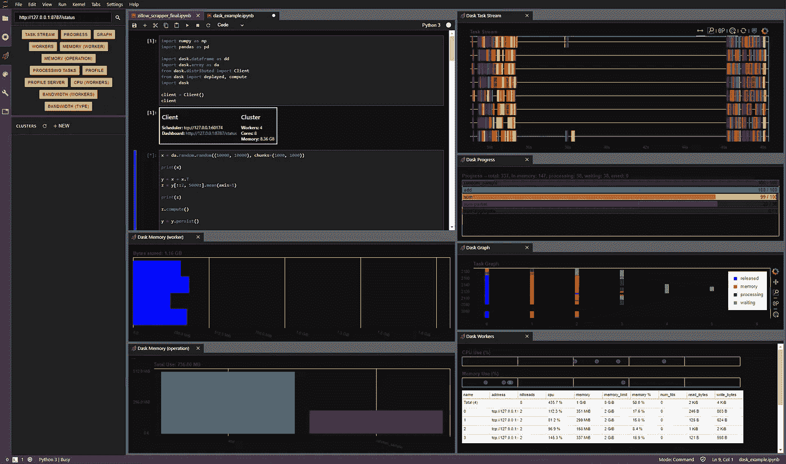

# 使用 Dask 执行 Python 代码时可视化计算指标

> 原文：<https://blog.devgenius.io/visualizing-computational-metrics-when-executing-python-code-with-dask-711b7e279ff7?source=collection_archive---------16----------------------->

# 当您在 PYTHON 中分析数据时，实际上发生了什么？

Dask 是一个非常棒的工具，可以帮助您在运行代码时可视化计算发生的事情，以及在执行 Pandas 或 Numpy 操作时利用并行处理。



# 已经有大量关于 DASK 的信息了

一些文章说得比我更好，我宁愿不要为了在文章中有更多的内容而进行一些多余的行为。这里有一些地方可以让你开始:

*   [**第一条**](https://l.workplace.com/l.php?u=https%3A%2F%2Ftowardsdatascience.com%2Ftrying-out-dask-dataframes-in-python-for-fast-data-analysis-in-parallel-aa960c18a915&h=AT1PIOucrVsAb97HHQci_toPnixHcDVpm4F5-uP2ewgC9RY_bMK7Rq8d5pjduf3HsJfZJaOKgvA3HRGpjli8FxSIzBI90zzqoWtuWJfittrOEn66LDI8VoGpzogjmB20y3Z4T-pC1tlHDmmD0OR0mTVkZVNrYIgtbS8Z8Co)
*   [**第二条**](https://l.workplace.com/l.php?u=https%3A%2F%2Ftowardsdatascience.com%2Fwhy-every-data-scientist-should-use-dask-81b2b850e15b&h=AT0vWlH0p366Eo87PjOfoqRUf3BwsnTQMs2Jixve3o6y7ogVX9BBBeDoRzuFl9rmWctsnZlapYUhk0DS2v6gnS8pFuvZV7ZhmLXKINaA5rHVx8Pl13jPKyvzgfSw3qh_8_obx_k8iYIXSXLNk9W2B9HP-AoY1o7Fv8Ioe-A)
*   [**Dask Dcos**](https://l.workplace.com/l.php?u=https%3A%2F%2Fdocs.dask.org%2Fen%2Flatest%2F&h=AT1D0aALSUKaJkSC2YW_Qv-fF4q2OLA4BvDljk01836wv16nJPz_k5mNFB4tB4SLzzrKJUtog4xEvILMfBuDLdvjKjtUcHn_lHEmacJAjs_ZtrSdswBTOa9uPEh1k2DSO1rru3HO2ba-BVwXqRK1inPcHMk_aKE2Zc9XVhA)
*   [Dask JupyterLab 扩展 ](https://l.workplace.com/l.php?u=https%3A%2F%2Fgithub.com%2Fdask%2Fdask-labextension&h=AT3BGVIyvI-Q7gyfP7ZODVdifhD4HycTXttnSc4RerlGMf_V463hqFm6PFR01GZGngvjLQsQUtm40vQuYrhQGxK3EiPBSQNB-AhPLvFOtekOTtB8-BjhmrutOfFlYatLHvgxAsDW-1cT_nbv3uC4UEVR8LTskQp2i1Q5B68)

# 浅显易懂的基础知识

*   减少在大型数据集(如 pandas 数据帧或 numpy 数组)上运行操作时的处理时间
*   存储和处理无法放入内存的对象
*   允许本地或通过集群进行并行处理
*   提供有关操作处理的图表

# JupyterLab



Dask 为 jupyterlab 提供了一个扩展，您可以通过 pip/conda 安装它。我想你知道怎么打开 JupyterLab。如果没有，安装它并在 anaconda 提示符下运行 jupyter lab。使用下拉工具将它们变亮或变暗。安装以下要求:

# 装置

要安装 Dask JupyterLab 扩展，您需要 JupyterLab 和 Node.js。这些可以通过各种来源获得。Python 用户常见的一个来源是 conda 包管理器。

```
conda install jupyterlab nodejs
```

这个扩展包括客户端 JupyterLab 扩展和服务器端 Jupyter notebook 扩展。

# 通过 PIP 或 CONDA-FORGE 安装:

```
pip install dask_labextension
conda install -c conda-forge dask-labextension
```

# 按如下方式构建扩展:

```
jupyter labextension install dask-labextension
jupyter serverextension enable dask_labextension
```

# 如果您运行的是 NOTEBOOK 5.2 或更早版本，请通过运行以下命令来启用服务器扩展

```
jupyter serverextension enable –py –sys-prefix dask_labextension
```

# 如何展示所有的图表

安装完毕后，打开 jupterlab。您应该会在页面左侧看到 dask 选项卡/图标。运行以下客户端代码后，将仪表板客户端 url 复制并粘贴到 dask 选项卡的搜索栏中:

```
import dask.dataframe as dd
import dask.array as da
from dask.distributed import Client
from dask import delayed, compute
import daskclient = Client()
client
```

# 客户端结果将如下所示:

```
Client
Scheduler: tcp://127.0.0.1:x
Dashboard: [http://127.0.0.1:x/status](http://127.0.0.1:x/status)
Cluster
Workers: 4
Cores: 8
Memory: 8.36 GB
```

# 一旦连接

单击各个图表，当连接正确时，这些图表将变成橙色，而不是灰色。双击这些图表将在新的选项卡中打开。将选项卡拖到 jupyterlab 内部或周围的区域。我在这篇文章所附的视频中添加了一些图表，但是你可以随意添加那些你认为有帮助的图表。我使用了:

```
- Dask Task Stream
- Dask Bandwidth (workers)
- Dask Progress
- Dask Graph
- Dask Workers
- Dask Memory (worker)
- Dask Memory (operation)
```

# 问题

我在安装过程中只遇到了一个问题。在 mac 上，安装 dask 和扩展可以工作，但是仪表板无法加载。解决方法是将散景包降级到 2.0。不知道为什么，但新版本的散景打破了仪表板。使用以下命令降级:

```
pip install bokeh==2.0
```

# 媒体

由于 Workplace 喜欢将视频质量降级为像 ratio 和 blog.accenture 这样的简笔画，所以我似乎不提供超过 2mb 的视频上传，我已经将它上传到了 [youtube](https://youtu.be/62hqiGtwUzg) 。

# 有问题吗？

我记得昨天这个包有多酷，决定今天早上重新学习一下。因为它有多棒，这是一个非常快速的安装/设置过程。了解图书馆的来龙去脉是另一回事。但至少你知道什么是可能的。

# 来源:

[Github](https://github.com/supercoolgetsallthegirlsmax/dask_jupyter)

感谢阅读！

马克斯·巴德