# 在 Seaborn 可视化热图

> 原文：<https://blog.devgenius.io/visualizing-heatmaps-in-seaborn-cc323748af69?source=collection_archive---------6----------------------->


[粘土银行](https://unsplash.com/@claybanks?utm_source=medium&utm_medium=referral)在 [Unsplash](https://unsplash.com?utm_source=medium&utm_medium=referral) 拍摄的照片

让我们讨论在 Seaborn 中创建热图的不同可视化技术。

热图是底层数据的二维颜色表示。

颜色强度随其对应的数据值而变化，即值越高，颜色越强烈，反之亦然。

在数据科学和机器学习中，热图使我们能够在探索性数据分析(EDA)中分析相关矩阵。它允许我们观察变量之间关系的可视化表示，并在数据清理步骤中采取适当的行动。

在我们学习如何为关联矩阵创建热图之前，让我们先讨论一下术语关联和关联矩阵的含义。

*相关性* 决定了两个变量 ***之间的*线性关系*。*** 它不仅为我们提供了关系的*强度*，还为我们提供了关系的*方向*，即变量是直接相关还是反向相关。

相关性的*量化*是一个叫做*‘相关系数’*的统计量，其值总是在-1 和 1 之间。

-1 代表*完全负相关*，一个变量增加，另一个变量以精确的比例减少。

+1 代表完全相反的情况，即当一个变量增加时，另一个变量以相同的比例增加。

零值表示考虑中的两个变量之间没有线性关系。

-1 到 1 之间的任何其他值表示:

1.  低相关性或高相关性。
2.  正相关或负相关。

以上将取决于符号以及值与 1 的接近程度。

既然我们已经理解了相关性。让我们把焦点切换到文章开头提到的相关矩阵。

相关矩阵是一种表示，其中我们可以一次看到所有的相关系数。

让我们举一个例子来看看这一点。我们将使用 mpg 数据集作为例子。

第一项任务是将数据集加载到名为 df 的数据框中。

```
df = sns.load_dataset('mpg')
```

接下来，让我们通过查看前五个条目来了解这些信息。

实现这一点的命令是:

```
df.head()
```

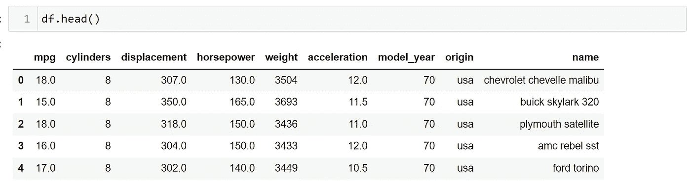

作者图片

接下来，让我们计算手头数据的相关系数。
在熊猫数据帧中，我们有一个名为‘corr()’的简洁函数，它是相关性的简称。

要计算相关系数，我们可以运行以下命令:

```
df.corr()
```

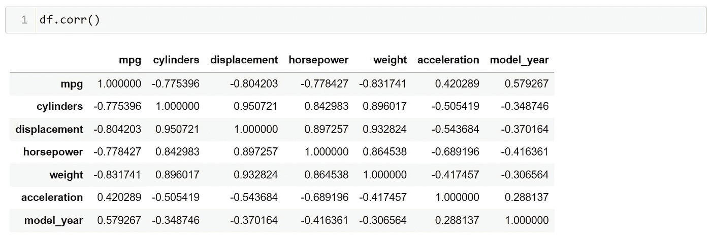

作者图片

检查上述命令的输出，我们观察到 Seaborn 只使用数字列来生成相关矩阵。

对角线上的值都是 1。我们将该列与其自身进行比较，导致相关系数等于 1，因为所选列将与其自身百分之百匹配。

让我们将相关矩阵保存在一个变量中，以便于回忆。
我们将这个变量称为‘my _ corr _ mat ’,如下所示:

```
my_corr_mat = df.corr()
```

现在，让我们根据上面的关联矩阵创建一个简单的热图。

我们可以通过运行以下命令来实现这一点:

```
sns.heatmap(my_corr_mat)
```

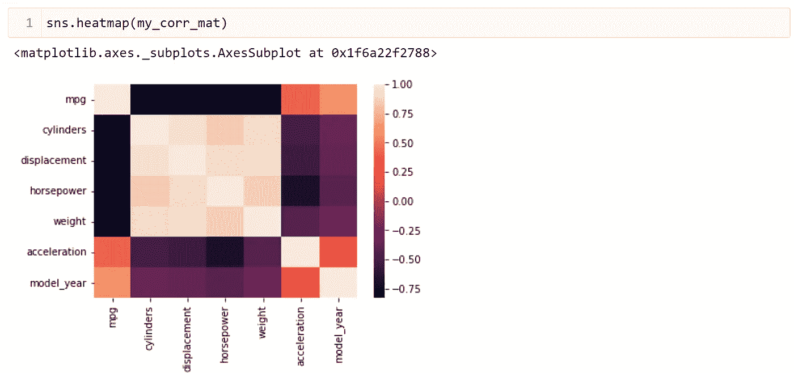

作者图片

我们可以看到 Seaborn 根据相关矩阵的值给出了一种颜色。

现在，让我们检查一下热图函数中可用的各种参数。了解参数有助于我们在需要时创建自定义图。

我们可以使用折线图文章中显示的相同技巧来获得可供使用的彩色地图列表。

我们首先给' cmap '参数一个随机字符串，并尝试运行代码，如下所示:

```
sns.heatmap(my_corr_mat, cmap='abc')
```

当我们向下滚动查看错误消息时，我们注意到 Seaborn 为我们提供了一个可用于“cmap”参数的选项列表，如下所示:

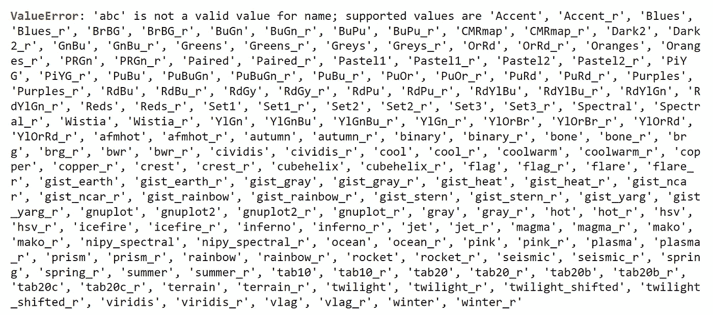

作者图片

我们现在可以从不同的选项中选择并重新运行代码。例如，我使用等离子选项，如下所示:

```
sns.heatmap(my_corr_mat, cmap='plasma')
```

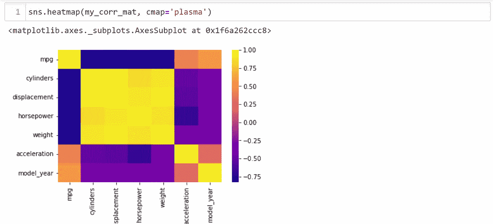

作者图片

有时生成的热图比输出中预期的要小。这可能是由于各种原因，最常见的是数据中的大量数字列迫使 seaborn 将所有列放在同一个空间中。
为了改变这种情况，我们可以使用 matplotlib 在更大的表面上绘制热图，如下所示:

```
plt.figure(figsize=(12,6))
sns.heatmap(my_corr_mat, cmap='plasma')
```

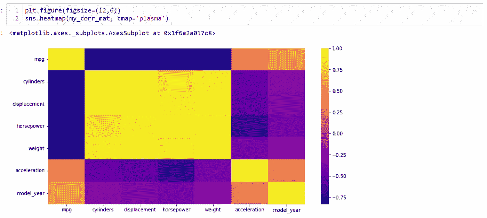

作者图片

一些分析师希望看到没有说明内存位置的图表。

要达到以上目的，我们有两种方法:

1.  我们可以在热图函数后使用分号。
2.  我们可以使用 matplotlib 的 show 函数。

第一种方法的输出如下:

```
plt.figure(figsize=(12,6))
sns.heatmap(my_corr_mat, cmap='plasma');
```

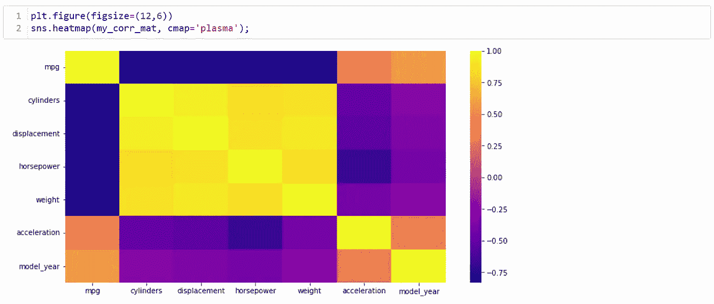

作者图片

同样，第二种方法的输出如下:

```
plt.figure(figsize=(12,6))
sns.heatmap(my_corr_mat, cmap='plasma')
plt.show()
```

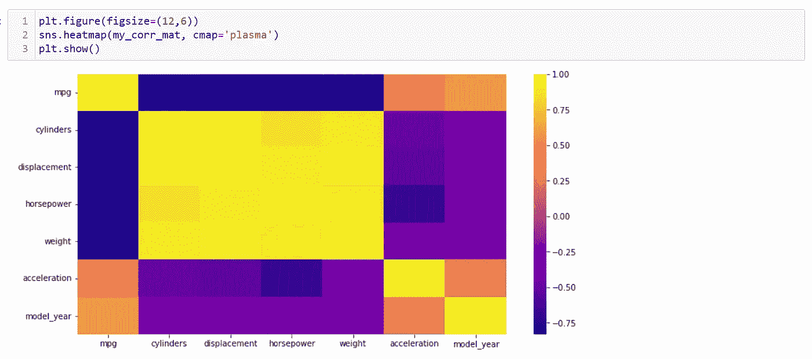

作者图片

接下来，我们有“vmin”和“vmax”参数，它们是图中显示的最小值和最大值。这些有时被称为锚。

假设我们要查看 0.8 到 1 范围内的单元格。我们可以将这些值设置为如下所示的参数:

```
plt.figure(figsize=(12,6))
sns.heatmap(my_corr_mat, cmap='plasma', vmin=0.8, vmax=1);
```

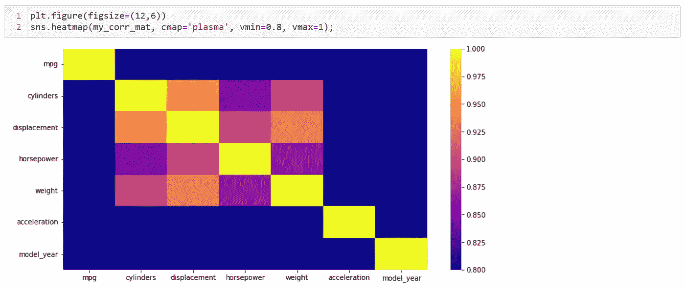

作者图片

我们观察到 Seaborn 只对满足上述参数的细胞着色。

接下来，让我们讨论中心参数。

如果我们观察生成的热图，我们会注意到 Seaborn 已经根据提供的值自动选择了图例。

当绘制不同的数据时，我们希望根据我们选择的特定值将彩色地图居中，我们使用 centre 参数。

让我们看看这是怎么回事，取前面的图，取中心为 0.8:

```
plt.figure(figsize=(12,6))
sns.heatmap(my_corr_mat, cmap='plasma', center=0.8, vmin=0.8, vmax=1);
```

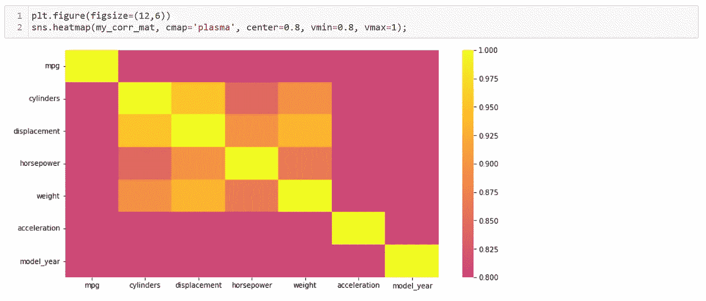

作者图片

接下来，我们有' annot '参数，它是 annotation 的缩写。

当我们想要查看热图上的颜色和数量时，需要' annot '参数。

让我们使用最初绘制的简单热图，并对其应用注释。

我们可以通过以下方式实现这一点:

```
plt.figure(figsize=(12,6))
sns.heatmap(my_corr_mat, annot=True);
```

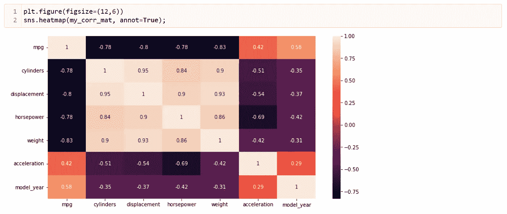

作者图片

我们现在可以立即查看我们有兴趣分析的任何特定值。

接下来，我们有“fmt”参数，这是格式化的缩写。

有时我们希望在注释中看到一定数量的小数。为此，我们需要格式化参数。

我们将把小数位数格式化为 3，而不是 2。我们通过以下方式实现这一目标:

```
plt.figure(figsize=(12,6))
sns.heatmap(my_corr_mat, annot=True, fmt='.3f');
```

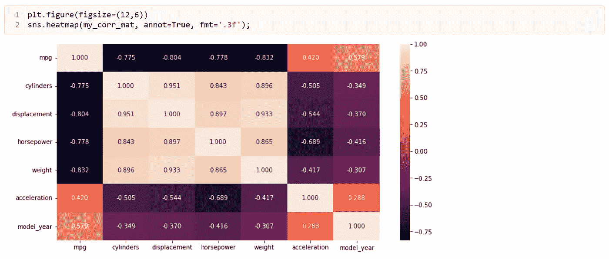

作者图片

我们可以使用. 3f 值作为格式参数，我们告诉 Seaborn 为我们提供三位小数。

接下来，我们有线条宽度和线条颜色参数。

线条宽度和颜色定义了热图中值之间的线条。

例如，假设我们希望线条宽度为三个单位，颜色为红色，而颜色贴图为岩浆色。

该设置为我们提供了如下图:

```
plt.figure(figsize=(12,6))
sns.heatmap(my_corr_mat, annot=True, linewidths=3, linecolor='red', cmap='magma');
```

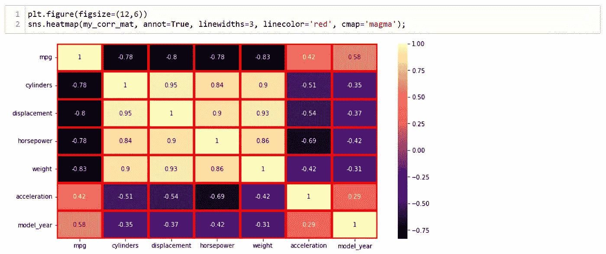

作者图片

接下来，我们有用于显示热图图例的 cbar 参数。默认情况下，它为 true，但可以更改为 false 以从绘图中丢弃图例。

以下示例向我们展示了一个没有图例的热图:

```
plt.figure(figsize=(12,6))
sns.heatmap(my_corr_mat, annot=True, cbar=False);
```

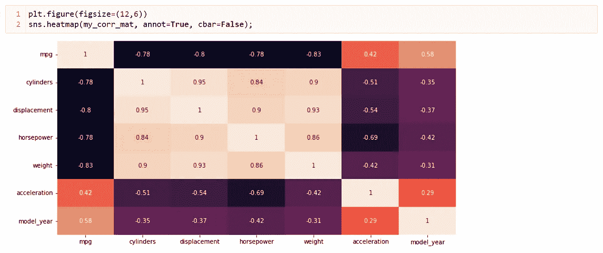

作者图片

接下来，我们有 square 参数，它以正方形格式给出了热图。

下面的例子说明了这一点:

```
plt.figure(figsize=(12,6))
sns.heatmap(my_corr_mat, annot=True, square=True);
```

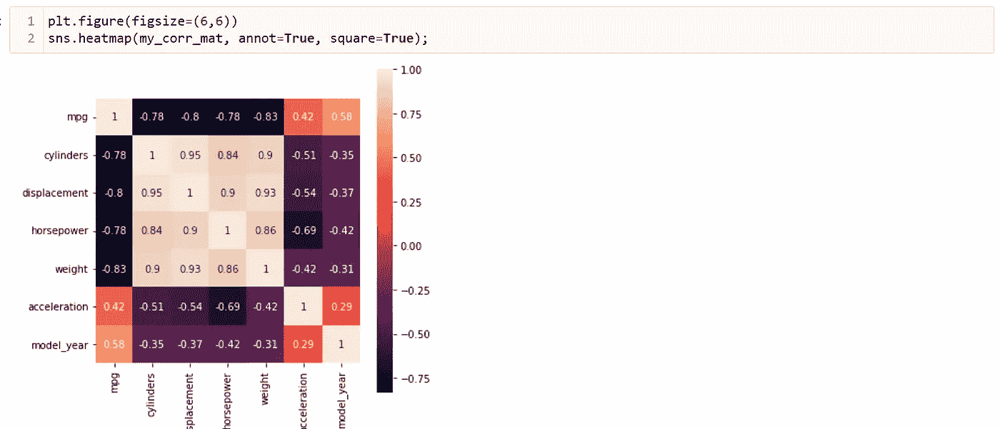

作者图片

最后，我们有一个掩膜参数，用于覆盖或掩膜热图的上半部分。

如果我们观察热图，我们会发现我们可以把它分成对角线两边的两个三角形。

我们可以在相关矩阵上使用 NumPy 的“triu”方法来实现这一点。

以下示例说明了这一点:

```
plt.figure(figsize=(12,6))
sns.heatmap(my_corr_mat, annot=True, mask=np.triu(my_corr_mat));
```

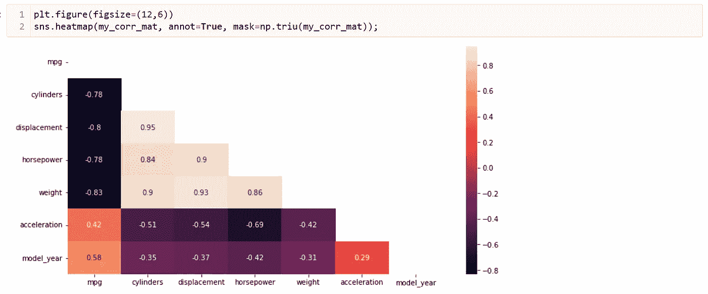

作者图片

下次见！