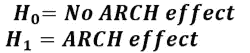

# 用 R :: ARCH 和 GARCH 模型进行波动率建模

> 原文：<https://blog.devgenius.io/volatility-modeling-with-r-arch-and-garch-models-11fde2d7ac38?source=collection_archive---------0----------------------->

## 用 rugrach()包估计具有正态和非正态新息的 ARCH 和 GARCH 模型

Siarhei Palishchuk 在 [Unsplash](https://unsplash.com?utm_source=medium&utm_medium=referral) 上拍摄的照片

可以从 GitHub 下载 [**数据**](https://github.com/riqbal-k/Data) 和 [**笔记本**](https://gist.github.com/riqbal-k/9fb9f6a6ca50538e72377dc5450bdcc2) 。

A [RIMA 型](https://medium.com/dev-genius/auto-arima-and-manual-arima-models-for-stock-prices-with-r-829bee0420f4)模型无法解释大多数金融时间序列共有的一些重要特征。在另一篇文章中，我讨论了财务回报的所有程式化事实。

有许多不同种类的非线性时间序列模型。用于建模和预测波动性的 **ARCH 或 GARCH** 模型是使用最广泛的非线性金融模型。

拱门的概念是由经济学家罗伯特·恩格尔三世在 20 世纪 80 年代提出的。ARCH 立即改进了金融模型，使得 Engle 获得了 2003 年诺贝尔经济学奖。

经济学家罗伯特·恩格尔三世在 20 世纪 80 年代创造了 ARCH 概念。由于阿奇对金融模型的迅速改进，恩格尔获得了 2003 年诺贝尔经济学奖。

# 1.拱形效应

重要的是要考虑一个不假设方差是恒定的模型，因为在金融时间序列的情况下，误差的方差不可能在整个时间内保持恒定。

通过纳入**条件波动率**而不是**恒定波动率**假设，自回归条件异方差(ARCH)模型被创建来增强计量经济学模型

> 如果误差的方差不是常数，这将被称为**异方差**。在**平方序列**中表现出条件异方差或自相关的时间序列被称为具有自回归条件异方差- **ARCH)效应**。
> 
> **在应用 ARCH 或 g ARCH 模型之前，测试 ARCH 效应非常重要。**

# 2.拱形效应测试

在估计 GARCH 型模型之前，计算 Engle (1982)对 ARCH 效应的检验更有意义，以确保这类模型适用于数据。

engle ARCH 检验是一种拉格朗日乘数检验，用于评估 ARCH 效应的重要性:

考虑测试假设:

> **ARCH 检验经常应用于原始回报数据。**

# 3.恩格尔的 ARCH(p)模型

ARCH 是条件异方差，它表达了金融市场的波动性不是恒定的，它几乎在大部分时间都在变化。

> **ARCH(1)模型是最简单的 GARCH 模型**

在 ARCH 模型下，通过允许误差项的条件方差依赖于平方误差的前一个值，对“波动率的自相关性”进行建模:

误差方差取决于平方误差的 q 个滞后的一般情况，称为 ARCH(q)模型:

# 4.GARCH(p，q)模型

在捕捉金融回报的波动聚类时，Taylor (1986)和 Bollerslev (1986)的广义自回归条件异方差(GARCH)模型占主导地位。

> **广义自回归条件异方差(GARCH)是对 Engle(1986)建立的原始 ARCH 模型的改进。**

GARCH 模型允许条件方差依赖于先前自己的滞后和平方误差项

最简单的广义自回归条件异方差(GARCH)模型可以写成:

GARCH(1，1)模型可以扩展到 GARCH(p，q)公式，其中当前条件方差被参数化为取决于平方误差的 q 个滞后和条件方差的 p 个滞后:

> **在大多数情况下，GARCH(1，1)模型足以捕捉数据中波动性的聚类，并且在学术金融文献中很少估计甚至考虑高阶模型。**

# 5.估计波动率模型之前的步骤

当估计 GARCH 类型模型时，以下步骤是必不可少的:

## ***一.检查静止的***

*   应用扩展的 dicky fuller 检验
*   时间序列图

## ***二世。*检查有无波动**

-时间序列图

## **三世*。检查正常性***

*   柱状图
*   雅尔克-贝拉正态性检验
*   QQ 图
*   汇总统计(峰度)

## ***四世。检查拱形效果***

*   应用 LM ARCH 测试

> **如果 LM 检验显示 p 值小于 0.05，表明可以拒绝零假设(无 arch 效应)。因此，股票收益的日志会有 *ARCH。***

或者

*   对平方残差序列的第一个 *m* 滞后进行 Ljung-Box Q 检验

> **作为 Engle ARCH 测试的替代方法，您可以通过对平方残差序列的第一个 *m* 滞后进行 Ljung-Box Q 测试来检查残差序列中的序列相关性(ARCH 效应)。**

## 动词 （verb 的缩写）使用 rugarch()软件包估计具有正态新息的 ARCH 和 GARCH 模型

如果收益中存在 ARCH 效应，我们将使用 rugarch()软件包估计 ARCH 和 GARCH 模型。

## 不及物动词使用 rugarch()软件包估计具有非正态新息的 ARCH 和 GARCH 模型

从程式化的事实可以看出，正态分布假设并不成立。我们将用 t 分布创新估计 ARCH 和 GARCH 模型。

## 七。基于信息准则的模型选择

# 6.R 中的应用

安装并加载所需的库:

设置您的工作目录并上传您的数据

计算财务回报并删除第一个 NA 值

## i-检查文具:

*   可以使用“t 系列”或“urca”包中的 ADF-test。

就绝对值而言，测试静态值(50.0512)高于三个临界值。所以宝马的收益是稳定的。

## 二。检查波动的存在

*   我们使用对数收益、平方收益和绝对收益的时间序列图来检验波动性的存在。

## 三。检查常态

*   检查正态性的直方图

*   QQ-检查正常性的图

*   检查正态性的峰度值

*   检查正态性的 Jarque Bera 试验

这告诉我们，检验统计量是 3741.4，检验的 p 值是 0.000。在这种情况下，我们将拒绝数据不是正态分布的零假设。

## 四。检查拱形效应

我将首先绘制自相关图:

平方收益和绝对收益显示了高度的自相关性。

我们可以通过对平方收益应用容格检验来再次检验平方收益中自相关性。

当对 ARCH 模型的平方残差进行 Ljung-box 检验时，仍然存在序列相关性。

## 具有正常新息的 GARCH(1，1)

容格检验告诉我们，我们在 GARCH 模型的平方残差中没有发现序列相关的证据。

## **新息正常的 ARCH(1)和 GARCH(1，1)不是合适的模型**

*   GARCH 的 QQ 图-正常拟合值

> 不及物动词基于 rugarch()包的非正态新息 ARCH 和 GARCH 模型估计

*   具有 t 分布新息的 ARCH 模型

具有 t 分布新息的 GARCH 模型

> 我们可以观察到 Garch (1，1)的 QQ 图确实给出了更好的结果。

*   拟合模型的各种图

## 七。基于信息准则的模型选择

*   我将在另一篇文章中估计非对称 GARCH 模型。

*   参考

布鲁克斯，克里斯。*金融计量经济学导论*。第四版。剑桥大学出版社。2019.

*   [齐沃特](https://www.google.com/search?sxsrf=ALiCzsayTNs9JTN1lnhK-lYSImKGKmibRg:1665934602238&q=Eric+Zivot&stick=H4sIAAAAAAAAAOPgE-LVT9c3NEw2LMhNMrDMUIJw0wxyUwoqCgy0ZLKTrfST8vOz9cuLMktKUvPiy_OLsq0SS0sy8osWsXK5FmUmK0RlluWX7GBl3MXOxMEAAJsVnbFTAAAA&sa=X&ved=2ahUKEwi6wr2BiuX6AhWVM8AKHUF5AbsQmxMoAHoECFMQAg)，E. 2023。*计算金融与金融计量经济学导论*。

## vii. Model Selection using Information Criterion

I will estimate the asymmetric GARCH model in a separate post.

# Reference

Brooks, Chris. *Introductory econometrics for finance*. 4th edition. Cambridge University Press. 2019.

[Zivot](https://www.google.com/search?sxsrf=ALiCzsayTNs9JTN1lnhK-lYSImKGKmibRg:1665934602238&q=Eric+Zivot&stick=H4sIAAAAAAAAAOPgE-LVT9c3NEw2LMhNMrDMUIJw0wxyUwoqCgy0ZLKTrfST8vOz9cuLMktKUvPiy_OLsq0SS0sy8osWsXK5FmUmK0RlluWX7GBl3MXOxMEAAJsVnbFTAAAA&sa=X&ved=2ahUKEwi6wr2BiuX6AhWVM8AKHUF5AbsQmxMoAHoECFMQAg), E. 2023\. *Introduction to Computational Finance and Financial Econometrics*.