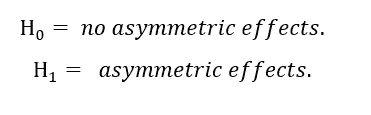

# 基于 R::非对称 GARCH 模型的波动率建模

> 原文：<https://blog.devgenius.io/volatility-modeling-with-r-asymmetric-garch-models-85ee02f8b6e8?source=collection_archive---------5----------------------->

## 用 rugrach()包估计具有正态和非正态新息的非对称 GARCH 模型

Siarhei Palishchuk 在 [Unsplash](https://unsplash.com?utm_source=medium&utm_medium=referral) 上拍摄的照片

可以从 GitHub 下载 [**数据**](https://github.com/riqbal-k/Data) 和 [**笔记本**](https://gist.github.com/riqbal-k/753d788c9509ff3dd6b98ec37a91f1af) 。

# 1.不对称 GARCH 模型

答根据对称 GARCH 模型，条件方差以同样的方式对同等重要的正负市场冲击做出反应。

与好消息或正面冲击相比，坏消息或负面冲击对波动性的影响更大。糟糕的冲击导致股价下跌，这增加了杠杆率(债务股本比)，使股票风险更大。

> **杠杆效应是一个用来描述不对称消息如何影响波动性的术语。**

EGARCH(p，q)、TGARCH(p，q)和 NGARCH(p，q)捕捉不对称效应。

## **i. EGARCH()模型**

EGARCH 是一个非对称 GARCH 模型，它不仅指定了条件方差，还指定了条件波动率的对数。

与其他类型的 GARCH 模型相比，EGARCH 模型给出了更好的样本内拟合，这一点已被广泛接受。

Nelson (1991)的指数 GARCH 模型或 EGARCH 捕捉到了杠杆效应，并定义为:

*   方差总是正的，因为:

所以即使参数是负的，方差仍然是正的。

*   杠杆效应意味着如果波动性和回报之间的关系是负的，那么:

> **e arch 模型的 rugarch 规范与上述等式略有不同:**

## 二。TGARCH /GJR 模型

被 Zakoian (1994)规范称为 TGARCH 模型的门限 GARCH 是:

## iii)杠杆效应测试/波动性不对称测试

Engle 和 Ng (1993)引入的**符号和大小偏差测试**，是波动不对称性测试的集合。
为了评估一组特定数据是否需要非对称模型，或者对称 GARCH 模型是否合适，应使用 Engle 和 Ng 检验。

Engle 和 Ng 提议基于回归对符号和大小偏差进行联合测试

*   正负冲击对未来波动率的影响不同，根据**符号偏差**，用显著性***φ1***表示。
*   相反地，***φ2***或***φ3***的重要性将指向**尺寸偏差**的存在，其中冲击的符号和幅度都是重要的。

> **rugarch()包还提供了第四种测试，这是一种符号和大小偏差相结合的测试。**

## 四。新闻影响曲线

给定一个估计模型，新闻影响曲线描绘了各种积极和消极冲击将导致的下一个时期的波动。

> **对于所有类型的 GARCH 模型，新闻影响曲线都很容易构建。**

## 动词 （verb 的缩写）非正态新息的 GARCH 模型

在具有正态新息的 GARCH 模型或非对称 GARCH 模型中，计算的标准化残差通常具有厚尾。这表明可以使用典型的厚尾分布来代替正态分布。

> **rugarch()软件包允许我们使用学生 t 分布(std)、广义误差分布(ged)和偏斜学生 t 分布(sstd)创新来估计 garch 类型模型。**

# 2.R 中的应用

安装并加载所需的库:

设置你的工作目录，上传你的数据和计算日志回报。

## I)杠杆效应测试/波动性不对称测试

首先我们需要用 rugarch()包估计 GARCH(1，1)或对称 GARCH 模型。然后，我们将应用 Engle 和 Ng 符号和大小偏差测试。

## ii)使用正常和非正常新息估计 EGARCH()

## 三。正态和非正态分布的 TGARCH/GJR 模型

## 四。模型比较

## 动词 （verb 的缩写）e arch-Normal 和 e arch-Student t QQ-Plot 比较

EGARCH-t 分发 QQ-plot 大部分都很好看很直！

然而，我们可以尝试用一个偏斜的 t 分布来估计 EGARCH，以改进我们的结果。

在我的下一篇文章中，我将回顾 GARCH 类型模型的预测。

# 参考

Chris brooks . 2019 .*金融计量经济学导论*。第四版。剑桥大学出版社。

[Zivot](https://www.google.com/search?sxsrf=ALiCzsayTNs9JTN1lnhK-lYSImKGKmibRg:1665934602238&q=Eric+Zivot&stick=H4sIAAAAAAAAAOPgE-LVT9c3NEw2LMhNMrDMUIJw0wxyUwoqCgy0ZLKTrfST8vOz9cuLMktKUvPiy_OLsq0SS0sy8osWsXK5FmUmK0RlluWX7GBl3MXOxMEAAJsVnbFTAAAA&sa=X&ved=2ahUKEwi6wr2BiuX6AhWVM8AKHUF5AbsQmxMoAHoECFMQAg) ，E. 2023。*计算金融学与金融计量经济学导论*。