# 直观解释 Voronoi 图和 Delaunay 三角剖分

> 原文：<https://blog.devgenius.io/voronoi-graph-and-delaunay-triangulation-visually-explained-1df842640c55?source=collection_archive---------11----------------------->

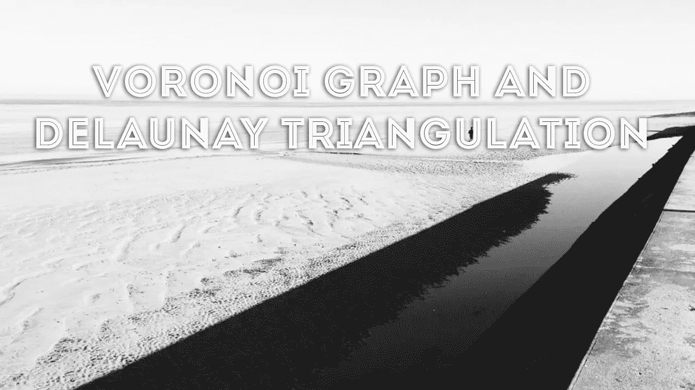

奥罗诺图帮助我们找到离任意点最近的点。让我们从显示平面上的一组点开始。

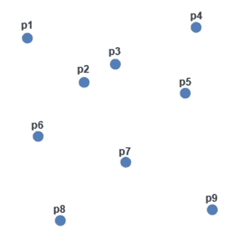

Voronoi 图在这些点之间画出边界。在每个点周围，将形成被称为 Voronoi 区域的区域。让我们来看看如何划分这些界限。每个边界应该在两个点的中间。让我们首先在点 1 和点 2 之间画一条边界。

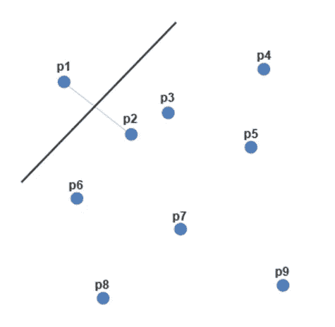

边界应该直接位于分隔两点的中间。让我们来创建点 2 和点 3 之间的边界。

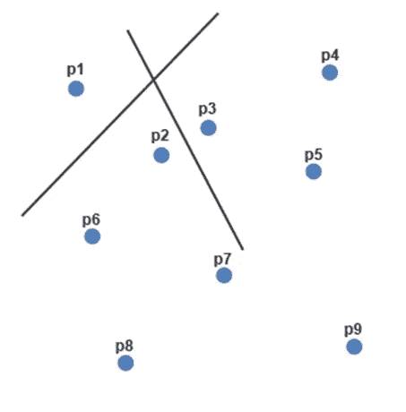

在点相交的地方，我们将删除该线段。

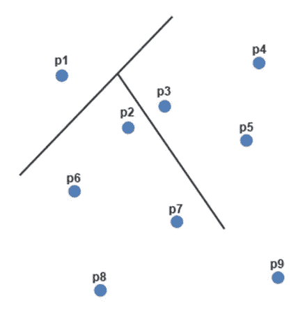

接下来，我们将在点 2 和点 6 之间创建边界。

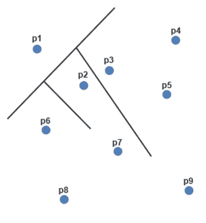

我们还必须在点 1 和点 6 之间创建一个边界。这将需要修剪几个不同的边界。

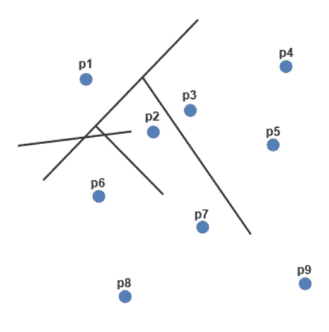

最终产品如下所示。

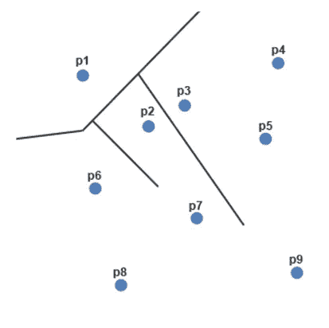

让我们继续，在 2 和 7 之间创建一个边界。

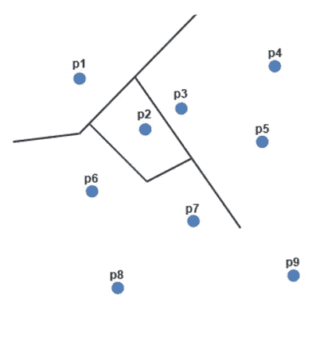

接下来，我们将在点 6 和点 7 之间创建边界。

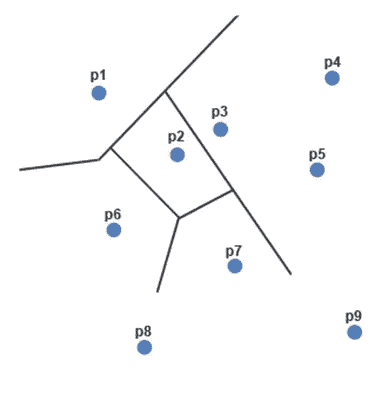

接下来，我们将在点 6 和点 8 之间创建边界。

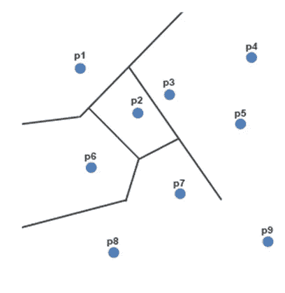

接下来，我们将在点 7 和点 8 之间创建边界。

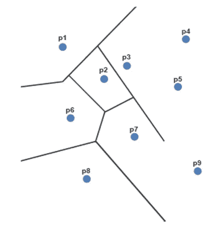

接下来，我们将在点 5 和点 7 之间创建边界。

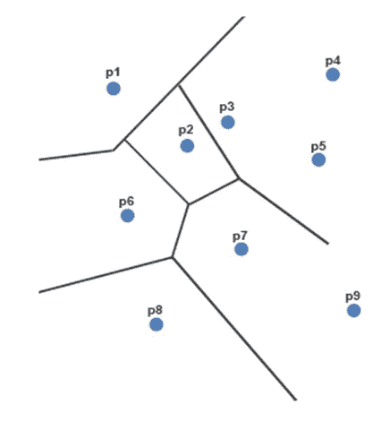

接下来，我们将在点 7 和点 9 之间创建边界。

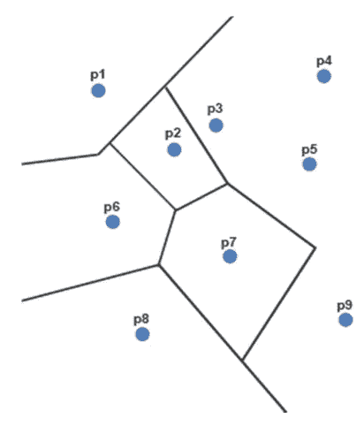

让我们在第 5 点和第 9 点之间画一条边界。

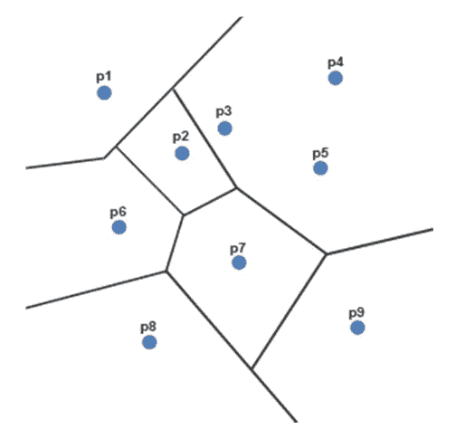

还差几分。接下来我们将画出点 3 和点 5 的边界。

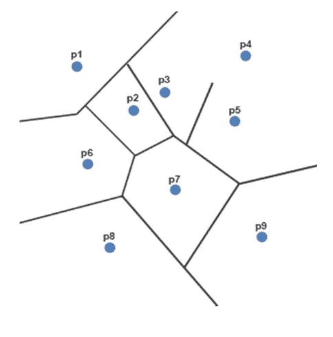

接下来，我们将在点 3 和点 4 之间创建边界。

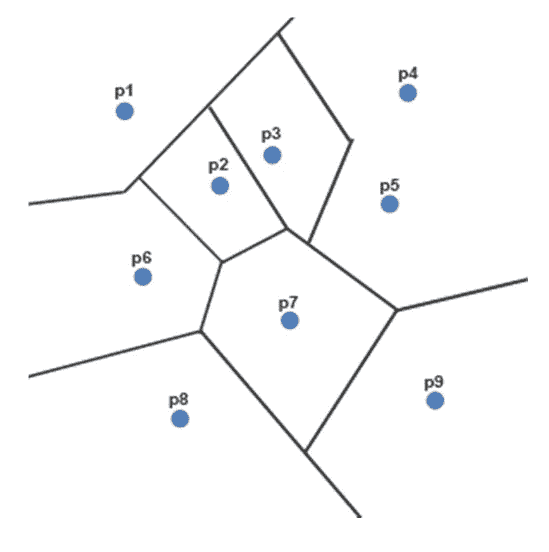

我们将在第 4 点和第 5 点之间画一条分界线。

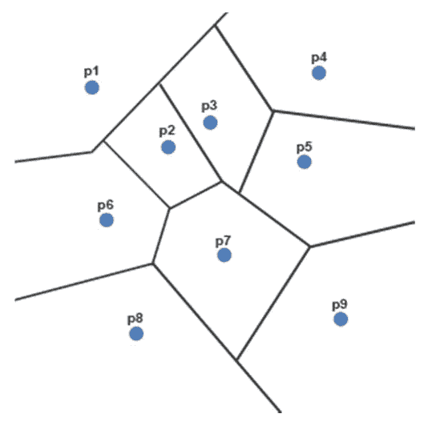

从图中看，有几个边界没有考虑，即点 1 和 3 之间的边界以及点 8 和 9 之间的边界。让我们快速调整这些并完成 Voronoi 图。

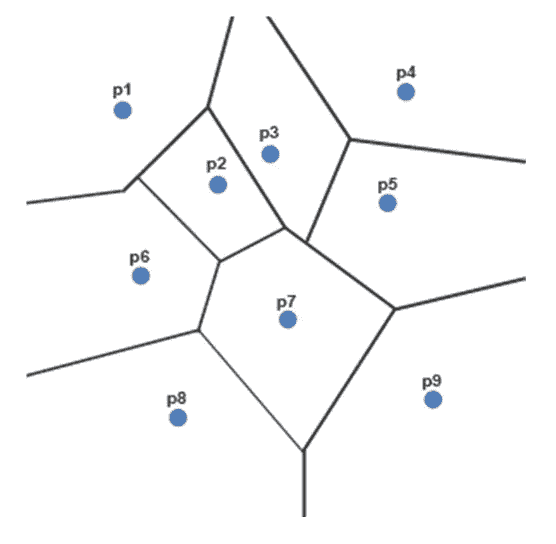

一旦我们定义了区域，我们就可以画出组成 Delaunay 三角网的线。简单的经验法则是，如果这些点有共同的边界，画一条线连接它们。点 1 与点 2、3 和 6 共享一条边界，因此我们将绘制连接这些点的线。

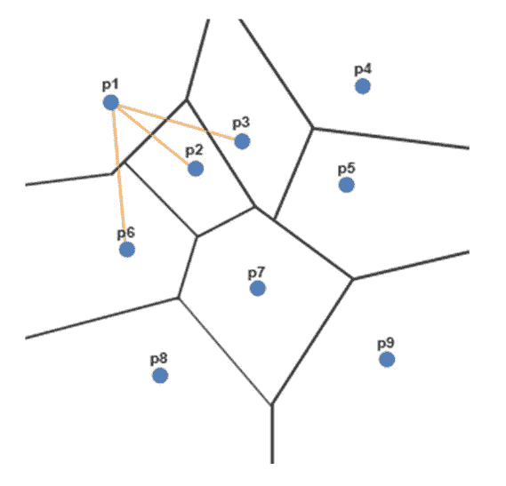

虽然当从点 1 到点 3 时，这条线看起来像是穿过两条边界线，但是我们可以快速修改这条线，以显示它只会穿过边界一次。

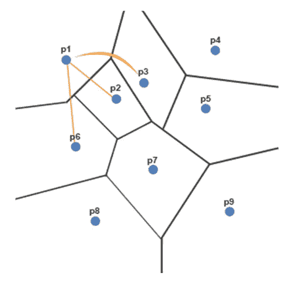

点 2 与未连接点 3、6 和 7 共享边界；它已经连接到点 1。

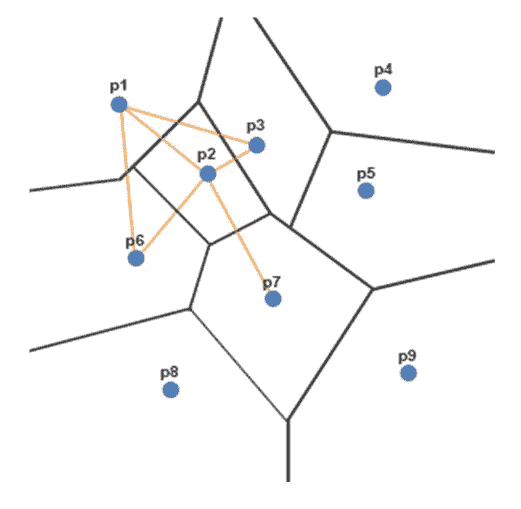

点 3 与未连接的点 4、5 和 7 共享边界。

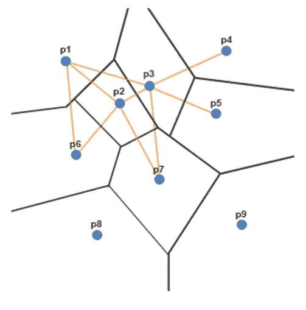

点 4 与未连接点 5 共享一条边界。

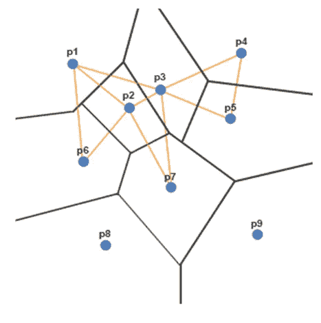

点 5 与未连接的点 7 和 9 共享边界。

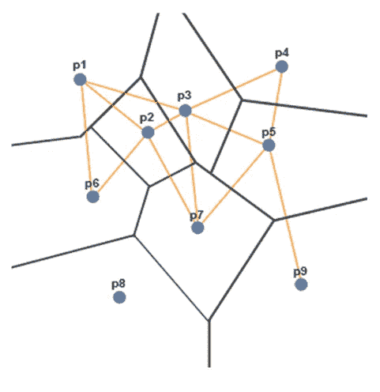

点 6 与未连接的点 7 和 8 共享边界。

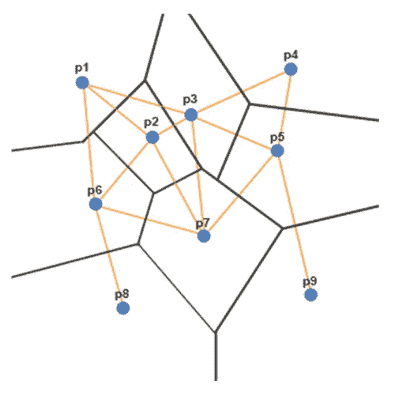

点 7 与未连接的点 8 和 9 共享边界。

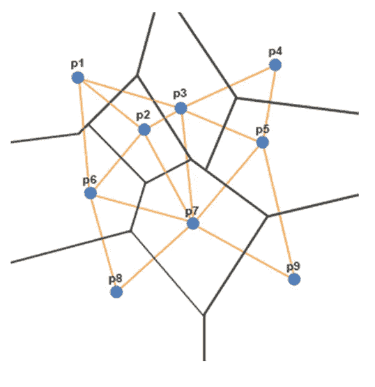

点 8 与未连接点 9 共享一条边界。

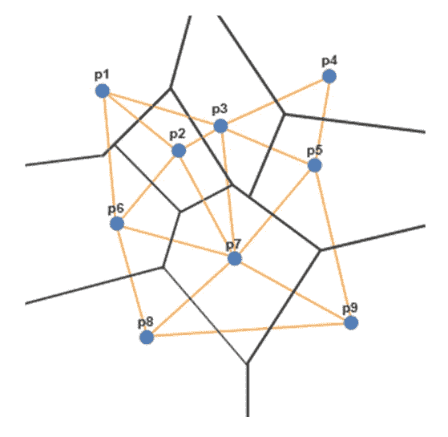

点 9 已经连接到共享其边界的所有其他点，因此这完成了 Delaunay 三角形的构造。如果我们知道每条边的权重，我们可以在创建 Delaunay 三角形后构建一个最小生成树。

如何找到直线度量中一组点的 Voronoi 图？让我们从网格上的一小组点开始。

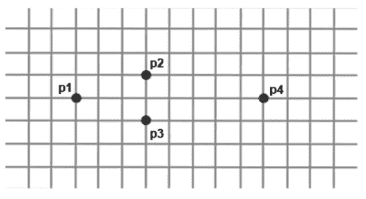

无论选择哪条路径，从 p1 到 p2 的距离都是 4 个单位。

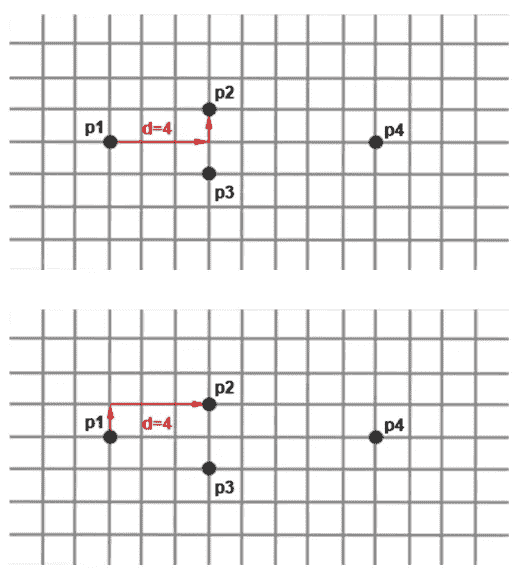

穿过任何一条路线的中点都在 2 个单位之外。

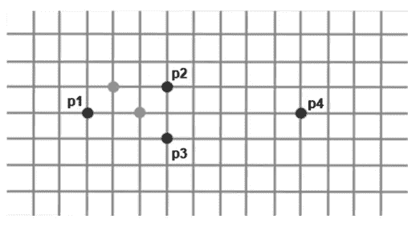

我们将从画一条连接这两点的线开始。

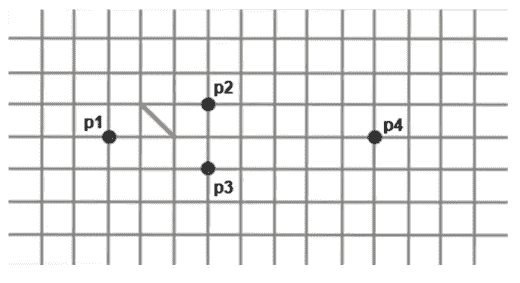

为了均等地分隔这些点，我们将绘制从每个端点突出的线，以最大化每个点的面积。

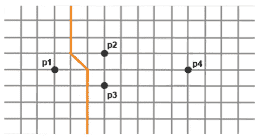

接下来，我们将检查点 1 和点 3 的边界。这将创建一个类似于分隔点 1 和 2 的边界。同样，不管你选择哪条路径，要到达这两点之间的中点，需要 2 个单位的行程。

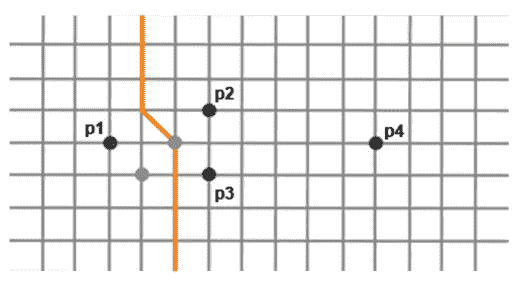

我们将连接这两点，并移动底部的垂直线。

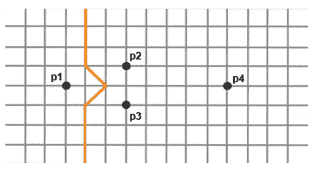

接下来，我们必须在点 2 和点 3 之间画一条边界。中点相距 1 个单位，因此将画一条水平线来分隔这两点。

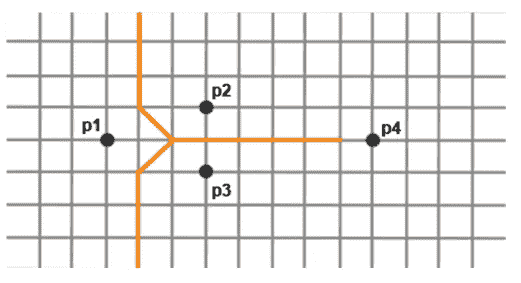

需要在点 2 和点 4 之间构建边界。从点 2 到点 4 的距离是 6 个单位。轨迹的中点距离点 2 和 4 3 个单位。

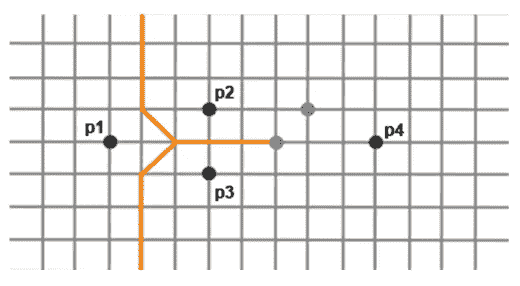

我们将画一条线连接这两点，并从端点画垂直线。

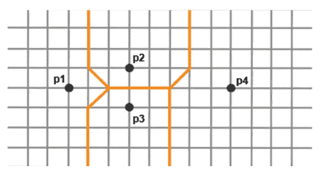

第 3 点和第 4 点之间仍有边界需要构建。由于点 3 和 4 之间的距离与点 2 和 4 之间的距离相同，因此采用类似的方法来构建它们之间的边界。中点距离 3 个单位，所以我们将画一条线连接顶部和底部的中点。右下角的垂直线将被移动到新的端点。

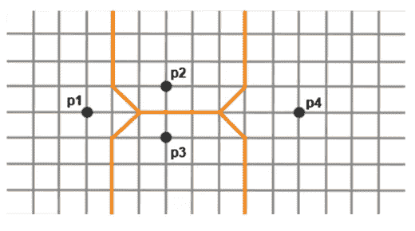

我们可以通过连接共享一个边界的点来再次构建 Delaunay 三角形。点 1 与点 2 和点 3 共享边界。

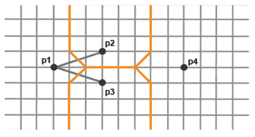

点 2 与未连接的点 3 和 4 共享边界。

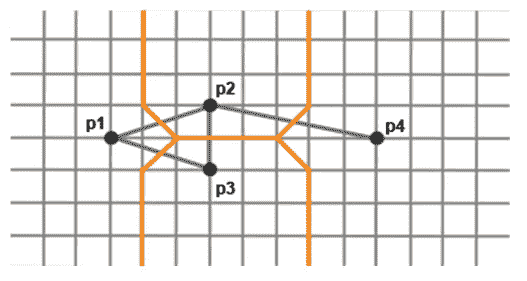

点 3 与未连接点 4 共享一条边界。

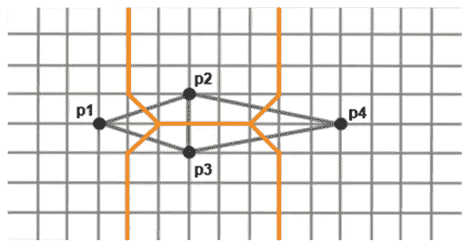

所有点现在都连接到它们的直接邻居。这就完成了 Delaunay 三角剖分。因为我们知道到每个点的距离，我们可以构建一个最小生成树。对于这个问题，最小生成树有几种不同的形式，但是我们将选择其中一种。这个 MST 的总长度是 12。

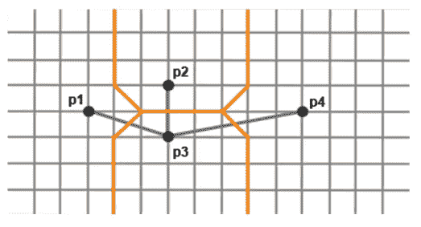

*如果你喜欢你所读的，看看我的书，***算法说明性介绍。**

**

*迪诺·卡伊奇目前是 [LSBio(生命周期生物科学公司)](https://www.lsbio.com/)、[绝对抗体](https://absoluteantibody.com/)、 [Kerafast](https://www.kerafast.com/) 、[珠穆朗玛生物](https://everestbiotech.com/)、[北欧 MUbio](https://www.nordicmubio.com/) 和 [Exalpha](https://www.exalpha.com/) 的 IT 主管。他还担任我的自动系统的首席执行官。他有十多年的软件工程经验。他拥有计算机科学学士学位，辅修生物学。他的背景包括创建企业级电子商务应用程序、执行基于研究的软件开发，以及通过写作促进知识的传播。*

*你可以在 [LinkedIn](https://www.linkedin.com/in/dinocajic/) 上联系他，在 [Instagram](https://instagram.com/think.dino) 上关注他，或者[订阅他的媒体出版物](https://dinocajic.medium.com/subscribe)。*

*[*阅读迪诺·卡吉克(以及媒体上成千上万其他作家)的每一个故事。你的会员费直接支持迪诺·卡吉克和你阅读的其他作家。你也可以在媒体上看到所有的故事。*](https://dinocajic.medium.com/membership)*