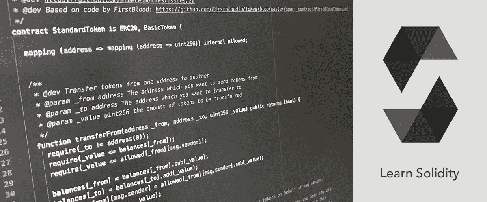

# 可靠的投票、筹款和 ERC20

> 原文：<https://blog.devgenius.io/voting-fundraising-and-erc20-in-solidity-fff08eb7e577?source=collection_archive---------4----------------------->

***越往前走越难。但这是我们在开发软件时接受的。***

通过观看教学视频来学习可靠性是很困难的。但是，通过构建实时应用程序，您可以进行比观看教学视频更多的实践。在这里，我将帮助您如何创建实时的 solidity 应用程序。

## 先决条件

一台有适当存储量的计算机、VS 代码、以太坊开发环境和一个 Github 帐户就足够了。尽管如此，它们可能还不够，因为设计阶段的知识是必需的。因此，我们将更详细地讨论先决条件。

**VS 代码(文本编辑器)**

一个开源的文本编辑器，除了统计编程，你可以在这里进行所有的编程。这是你开始开发智能联系人的第一个工具。它可以简单地在互联网上下载。一旦下载了先决条件，特定的区块链开发工具包就会安装在您的文本编辑器中。

**节点 JS**

NodeJS 包括 npm，可以通过点击链接下载。当您单击最新长期支持(LTS)版本的链接时，它会下载到您的计算机上，您必须设置该程序。一旦你完成了程序的设置，它就可以运行了。

**加纳切**

以太坊发展的先决条件之一。它允许您使用一些帐户地址在区块链上进行交易。更重要的是，他们使与 CorDapps 的互动成为可能。和 nodeJS 一样，可以在网上下载。

**酿造**

这是终端使用的起点。但是没有 web3js 或者松露那么复杂。它包含一个简单的终端命令，一旦写好就开始下载。完成后，它会给你一个终端命令。

## 复杂的部分开始了

**web3js**

一个与以太网交互的 javascript 库。即使命令已经写好了，下载这个库还是会让人感到困惑。如果你认为你已经下载了库，你必须用命令行检查。

**松露**

如果您不熟悉这些命令，那么创建一个开发环境就会变成一场噩梦。所以，这可能需要相当长的时间。如果你不确定是否下载了 truffle，你需要输入一个简单的命令来检查它的状态。它可以通过互联网上的命令行工具下载。

*你将如何在可靠性方面创建智能合同？在下面的评论区分享你的想法和经历。*