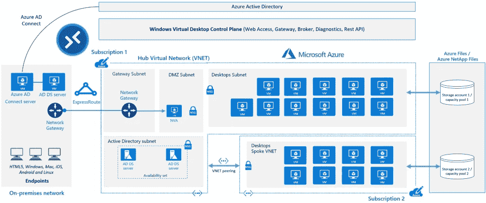

# VPN 还是 VDI？当在家工作成为新常态

> 原文：<https://blog.devgenius.io/vpn-or-vdi-when-work-from-home-become-the-new-normal-921bb16b5083?source=collection_archive---------3----------------------->

使用 VDI 的场景和注意事项


来源: [JP 洛克伍德](https://unsplash.com/@deskmate)的 [Unsplash](https://unsplash.com/photos/ejiaULZfrCs)

台湾最近遭受了新冠肺炎疫情的打击，迫使许多公司开始在家工作。除了 VPN，虚拟专用网络，还有更多选项，如 VDI，虚拟桌面基础架构。VDI 最大的优点是它不仅限于 WFH，还适用于其他场景。

本文涵盖的主题:

*   什么是虚拟桌面基础架构？
*   VDI 和 VPN 的区别
*   常见做法
*   利弊
*   VDI 的更多使用案例
*   考虑
*   思想
*   结论

# 什么是虚拟桌面基础架构？

虚拟桌面基础架构(VDI)是一种使用虚拟机来提供和管理虚拟桌面的技术。企业根据员工的角色设置不同的模板。更准确地说，是虚拟桌面上使用的功能和应用。员工使用自己的设备登录并访问特定的模板。VDI 为每个用户提供专用虚拟桌面，并保存用户配置文件。

# VDI 和 VPN 的区别

VPN 是通过设备和网络的加密连接。组织使用 VPN 来保护与托管设备共享的信息。它通常用于远程工作人员。

# 常见做法

在邀请我的朋友做了一个调查后，我发现他们中的大多数人使用 VPN 去 WFH。首要原因是性价比。此外，VPN 易于使用，就像在用户设备和公司网络之间建立虚拟隧道一样，使员工能够将设备带回家并访问网络，就像在办公室工作一样。

另一方面，VDI 的典型情况是针对没有公司笔记本电脑的员工，例如使用台式电脑进行日常工作。在这种情况下，让员工使用他们的设备并连接虚拟桌面来工作。

# 使用 VDI 的利弊

主要优势:

*   设备不可知论者
*   使用方便
*   较少担心数据泄露

挑战

*   表演在很大程度上依赖于网络表演

# 使用 VPN 的利与弊

主要优势:

*   性价比高

挑战:

*   维护可能会很复杂，例如，如果它不是公司的笔记本电脑，就会有不同的版本和类型
*   如果员工使用自己的笔记本电脑，很难将数据保存在公司内部

# 数据安全

从公司的角度来看，最大的区别在于数据安全性，因为 VPN 解决方案允许员工使用自己的笔记本电脑访问公司数据。相比之下，VDI 仅使用虚拟桌面进行访问，阻止复制和粘贴功能也可用。

# 费用

总的来说，VPN 性价比更高，但还是有一些例外。例如，我们经常看到许多公司不为员工提供笔记本电脑，而是提供台式电脑。与提供一台计算机相比，使用 VDI 连接到台式计算机进行远程工作应该更具成本效益。更不用说一些解决方案提供多会话功能，允许许多员工共享一台虚拟机。

# VDI 的更多使用案例

以下是我从客户那里观察到的一些使用案例。相信很多企业都有类似的要求:

```
**Collaborations between companies and universities**There are many benefits for both sides. Companies seed early-stage research with much lower R&D costs and access to talent. Universities have real-world challenges to tackle with and financial support.VDI helps both parties to share the information in a regulated environment. On top of that, new services also develop on the cloud platform if it’s on a cloud VDI solution. **Hackathon**Similar to the previous one, but the user is open to public or graduates, with a shorter timeframe. **New employee**During the pandemic, many new hires haven’t had the chance to visit the office and pick up their laptops. VDI can be an easy way to provide a working environment for the new hires. **Contractors or partner access**Contractors or partners may not have an AD in the company but still need to access data or applications.
```

这些场景的共同特征是:

## 快速部署

云 VDI 的一些特征有助于公司在短时间内做好准备。例如可扩展性和按需。

## 基于均衡而非长期需求

IT 部门不需要长期维护它。

## 数据丢失预防

除了身份、网络控制和应用程序安全性之外，一些 VDI 解决方案还提供了启用或禁用复制粘贴功能或屏幕截图的灵活性。

# 考虑

# 网络拓扑结构

如果您使用的是云解决方案，VDI 服务可以在几个小时内准备就绪。耗时的部分是联网和合规。一定要邀请你的 CISO 参加讨论。

## 设计星型网络拓扑

集线器是连接到您的内部网络的虚拟网络。辐条是与集线器对等的虚拟网络，用于隔离工作负载。

星型架构确保您的员工在受管环境中使用 VDI。另一方面，它也降低了与错误配置相关的风险。想法是在中心部署网关、DMZ 和 AD 服务器，并根据需要扩展分支中的虚拟机。



来源:[企业版 Windows 虚拟桌面](https://docs.microsoft.com/en-us/azure/architecture/example-scenario/wvd/windows-virtual-desktop)

# 身份

一些公司会将 VDI 与其广告服务器连接起来，而其他公司则更喜欢独立的。如果您想将内部广告服务器与云广告集成，有不同的工具可供选择，如 AD connect。

# 表演

VDI 提供专用的机器和资源，确保高性能。换句话说，VDI 不受设备限制，不依赖终端用户硬件。另一方面，在使用 VPN 时，性能更多地取决于用户的设备。

# 思想

从短期来看，VDI 和 VPN 是 WFH 的实用解决方案。但从长远来看，公司应该考虑如何减少对传统内部网的依赖，并利用 SaaS 进行协作。

内部网有一些限制。除了带宽和网络，基础设施也需要努力维护。

如果您担心安全性，市场上有解决方案。

我大致将它们归类如下:

*   身份:身份验证、多因素身份验证和有条件访问
*   设备:设备管理
*   数据:数据收集、分类、牵引、保护和加密

上面的例子更多的是针对外部用例，但是也有管理内部风险的工具。换句话说，保留记录，跟踪用户行为，并对可疑行为采取行动。一些解决方案还采用人工智能进行更智能的预防、检测和建议。

# 保持联系

*   在 [Medium](https://medium.com/@wanchunghuang) 上关注我，了解更多类似的故事
*   在 [LinkedIn](https://www.linkedin.com/in/wanchung-huang/) 上连接
*   你怎么想呢?留下评论