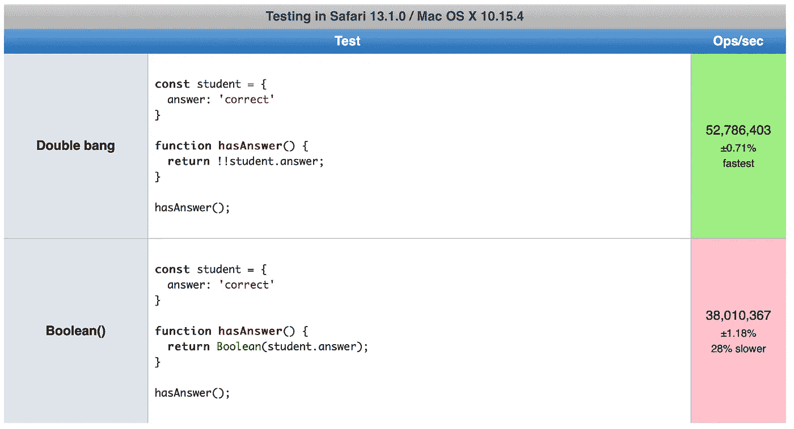
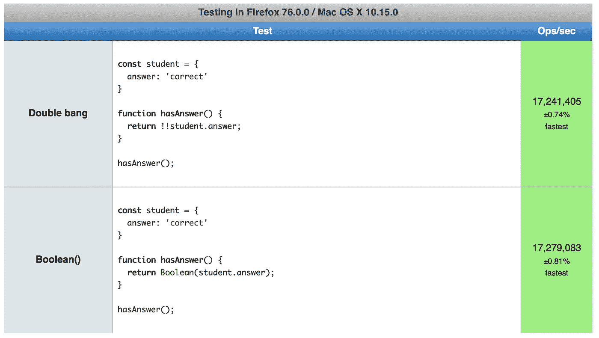
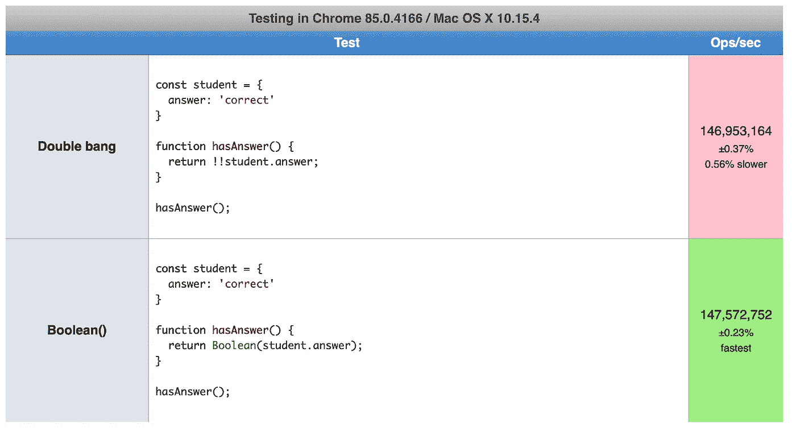
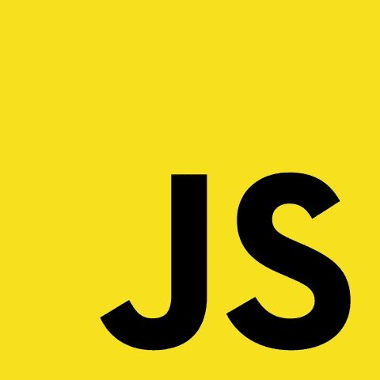

# ！！vs .布尔()

> 原文：<https://blog.devgenius.io/vs-boolean-cd502fbd6101?source=collection_archive---------1----------------------->

# 回答“对还是错”这个问题的最好方法是什么在 JavaScript 中

## JavaScript 在类型上不会给你带来太多麻烦(起初)，这既是一件好事也是一件坏事。但是我们都知道布尔型。布尔变量可以是`true`或`false`。是或不是。

JavaScript 中的每个值都可以被翻译成布尔值、`true`或`false`。翻译成`true`的值是真的，翻译成`false`的值是假的。简单。

这是两种翻译的方法。

# ！！和布尔()

```
const value = 'hello world';

Boolean(value); // true - the boolean function
!!value; // true - double bang / double negation
```

哪个最好？

# 真理和谬误

从任意值到`true`或`false`的转换由 ECMAScript 语言规范的[章节 9.2](https://www.ecma-international.org/ecma-262/5.1/#sec-9.2) 中的抽象操作`ToBoolean`描述。

所有的价值都是真实的，除非它们是虚假的。所以我们只要知道假的就能知道真的。

Falsy 值(`ToBoolean`结果为`false`):

*   `false`
*   `undefined`
*   `null`
*   `''` -空字符串
*   `0`、`-0`和`0n` -零
*   `NaN`(不是数字)

所以真实的例子是(`ToBoolean`结果是`true`):

*   `true`
*   `{}`
*   `"false"`

在某些操作中(比如在 if/else 语句中)，JavaScript 会使用这些 truthy/falsy 规则自动将值转换成`true`或`false`。这是类型强制。在 [MDN 网络文档](https://developer.mozilla.org/en-US/docs/Glossary/Type_coercion)中了解更多信息。

一个例子:

```
const student = {
  answer: 'correct'
};

// student.answer is truthy, 
// so we get true and the answer is verified.
if (student.answer) {
  verifyAnswer();
}
```

让我们仔细看看`Boolean()`和`!!`。

# 布尔()

总是使用布尔作为函数。所以这样做:

```
const trueOrFalse = Boolean('yes'); // true
```

不要这样做！

```
const trueOrFalse = new Boolean('yes');
```

`trueOrFalse`现在变成了布尔对象，而不是布尔值！我们知道`{}`不是假的，所以`new Boolean()`总是真的。这可能导致意想不到的行为。

```
typeof new Boolean(false); // object - {...}
typeof Boolean(false); // boolean - false

if (new Boolean(false)) {
  // This will run! Because the Boolean {} is coerced to true.
}

if (Boolean(false)) {
  // This will not run! Which is probably what you want.
}
```

关于布尔对象的更多信息，请参见 [MDN web 文档](https://developer.mozilla.org/en-US/docs/Web/JavaScript/Reference/Global_Objects/Boolean)。

# !!

`!`逻辑非运算符，感叹号，也叫“砰”。它将真值翻译成`false`，将假值翻译成`true`。明白了吗？

这样做两次会将真值转换为`true`，将假值转换为`false`。

这是双重否定。如果一个陈述是真的，那么这个陈述是*而不是*真的。很复杂，但是请记住`!!`的结果是一个布尔型。`true`为真值，`false`为假值。

```
const value = 'hello';

// Step 1\. First bang.
const step1 = !value; // step1 = false (NOT truthy = false)

// Step 2\. Second bang.
const step2 = !step1; // step2 = true (NOT false = true) 

// Thus
console.log(step1, !value); // false
console.log(step2, !!value); // true
```

# 专家怎么说？

优秀的 [Airbnb 风格指南](https://airbnb.io/javascript/#coercion--booleans)偏爱双 bang / `!!`。

```
// good
const hasAge = Boolean(age);

// best
const hasAge = !!age;
```

在凯尔·辛普森的《你不知道的 JS》一书的第四章中，两种选择都被认为是好的。

```
const a = "42";

// bad (will fail!):
if (a == true) {
	// ..
}

// also bad (will fail!):
if (a === true) {
	// ..
}

// good enough (works implicitly):
if (a) {
	// ..
}

// better (works explicitly):
if (!!a) {
	// ..
}

// also great (works explicitly):
if (Boolean( a )) {
	// ..
}
```

# 为什么显式转换比隐式转换好？

比起隐式转换，显式转换更受青睐有多种原因。

首先，更容易看出意图是什么。好的代码让你假设更少，理解更多。通过使用`Boolean()`或`!!`，很明显`ToBoolean`转换是有意的。

它防止意外的结果，例如使用`||`和`&&`操作符。

```
// isValid becomes 'yup', not true as with for example PHP.
const isValid = 'yes' && 'yup'; // isValid becomes 'yes', not true.
const isValid = 'yes' || 'no';
```

更好:

```
// isValid becomes true! Probably what we want.
const isValid = Boolean('yes' && 'yup'); // isValid becomes true!
const isValid = Boolean('yes' || 'no');
```

`||`和`&&`操作符产生两个变量中的一个，不一定是布尔值。通过使用`Boolean()`,我们明确了这一点，少了一件需要考虑的事情！

也有可能伴随着一声巨响🔫 🔫。

```
!!('yes' && 'yup'); // results in true
```

# 表演

我做了一个快速的 jsperf 测试。我认为这两种操作都是基本的，因此对于大多数用例来说“足够快”。可读性和清晰性对我来说更重要。看到结果还是很有趣的。

我一直认为双爆炸是性能方面的出路。虽然你必须进行两次转换(假/真->布尔->布尔)。但是不管怎样，也许浏览器内置了一些优化。

游猎，`!!`获胜。



火狐，平局。



铬，`Boolean()`胜(略)。



没有明显的赢家。检查您的网络浏览器使用份额。🙃

# 结论

随便挑一个！😁

我个人更喜欢`Boolean()`。我喜欢这样说:“给我一个布尔值”。大多数开发人员会立即理解这一点，`!!`不太清楚(但很容易记住)。

就性能而言，这并不重要，但是你可以更快地输入`!!`。懒人的有效论据。

还有一个`Boolean()`的加分点，是功能。所以你可以这样做:

```
const answers = ['', 'correct', '', 'good'];
const completedAnswers = answers.filter(Boolean);
```

如果你想阅读更多关于 JavaScript 中的类型，我可以强烈推荐第一本书[你不知道的 JS，类型&语法](https://github.com/getify/You-Dont-Know-JS/tree/1st-ed/types%20%26%20grammar)。



*最初发布于*[*http://github.com*](https://gist.github.com/arthurvi/66cb1e2bcfc92f99f465e0db04264367)[https://gist . github . com/Arthur VI/66 cb1e 2 bcfc 92 f 99 f 465 E0 db 04264367](https://gist.github.com/arthurvi/66cb1e2bcfc92f99f465e0db04264367)*。*