# VS 代码——将其设置为您的 Java Spring Boot 开发环境

> 原文：<https://blog.devgenius.io/vs-code-setting-it-up-as-your-java-spring-boot-development-environment-6464d86dc3f0?source=collection_archive---------1----------------------->

让#1 IDE 成为您的 Java Spring Boot 开发环境。

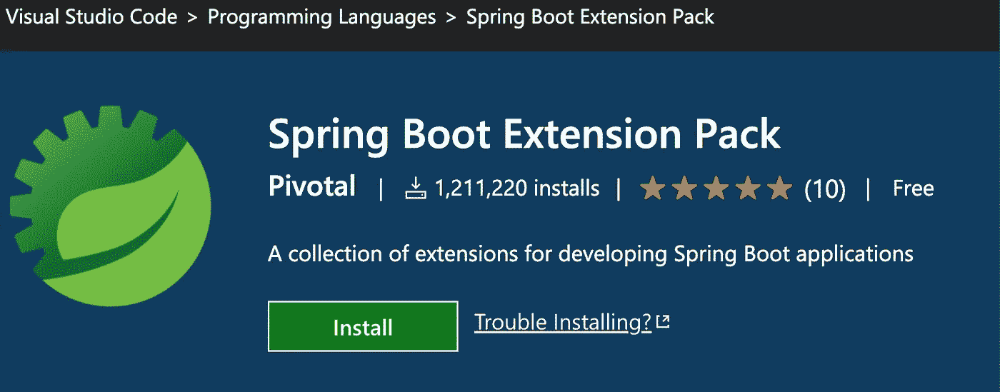

# 介绍

[VS Code](https://code.visualstudio.com/) 是来自[微软](https://www.microsoft.com/en-us/)的一款非常棒的 IDE，被全球开发者社区公认为最好的开发工具之一。根据[stack overflow 2022 年开发者调查](https://survey.stackoverflow.co/2022/#integrated-development-environment)，它仍然是所有专业开发人员以及学习编码的人最喜欢的 IDE。

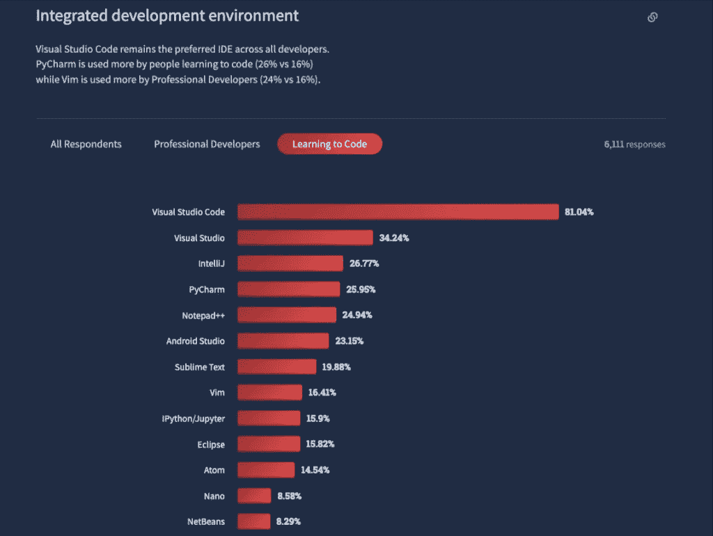

根据 [GitHub 顶级 IDE 索引](https://pypl.github.io/IDE.html)，VS 代码也排在第一位:

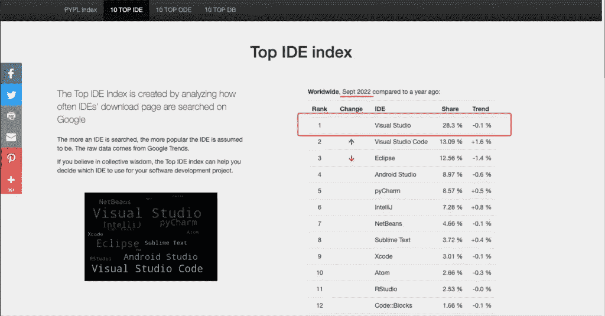

它可用于 3 个主要平台(Linux、macOS 和 Windows)，它提供代码自动完成(IntelliSense)，从 IDE 中调试，内置 Git 支持，以及几十个扩展、主题、linters 和其他工具，可供选择，最后，同样重要的是，它是免费的！

我喜欢的一个显著特点是，它可以被设置为与所有主要的编程语言和框架一起工作，这使它成为后端或前端开发的理想选择。

如果你还没有在你的系统中安装它，去官方的 [VS 代码网站](https://code.visualstudio.com/Download)下载它:

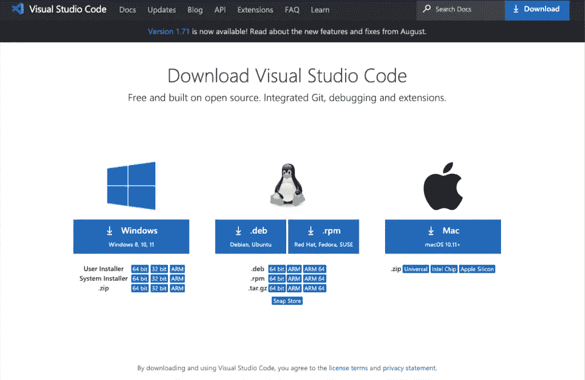

如果您既没有安装 Java 也没有安装 VS 代码，那么您可以考虑下载并安装 Java 编码包，其中包括 VS 代码、Java 开发工具包(JDK)和基本的 Java 扩展。编码包可以用于全新安装，或者更新或修复现有的开发环境。

[另一方面，Spring Boot](https://spring.io/projects/spring-boot) 也是 [Java](https://www.java.com/en/) 的旗舰框架，被所有开发者广泛认为是 Java 开发项目的重型工具。

几年前，Spring Boot 开发环境被来自知名和受人尊敬的玩家的其他 ide 所主导，例如 [Eclipse](https://eclipseide.org/release/) 和[IntelliJ IDEA](https://www.jetbrains.com/idea/)([JetBrains](https://www.jetbrains.com/))，尤其是来自 [Spring 工具套件— STS](https://github.com/spring-projects/toolsuite-distribution/wiki/Spring-Tool-Suite-3) (也基于 [Eclipse](https://www.eclipse.org/) )。然而，从 [STS 版本 4](https://spring.io/tools#main) 开始，它开始作为其他 ide 的插件(扩展)发布:Eclipse、[忒伊亚](https://theia-ide.org/)和 VS 代码。

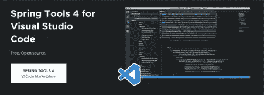

在这篇文章中，我们将采取步骤来看看如何在**和**代码上建立我们的 Spring Boot 开发环境。

请注意，假设您已经在机器上安装了 VS Studio，并且对它已经足够熟悉。值得访问 VS 代码"[为 Java 开发设置 VS 代码](https://code.visualstudio.com/docs/java/java-tutorial#_setting-up-vs-code-for-java-development)"来获得所有必要的信息。

# Java 扩展

在继续之前，请确保您已经在 VS 代码 IDE 中安装了重要的 Java 扩展。当然，所有 VS 代码扩展都可以在 [VS 代码市场](https://marketplace.visualstudio.com/)获得。

所以，如果你还没有做，你所要做的就是安装 Java 的**语言支持，以及 Java** 的**扩展包:**

[**语言支持 Java 由红哈**](https://marketplace.visualstudio.com/items?itemName=redhat.java) [**t**](https://marketplace.visualstudio.com/items?itemName=redhat.java)

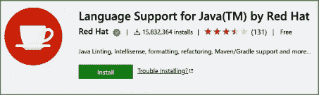

[**Java 扩展包**](https://marketplace.visualstudio.com/items?itemName=vscjava.vscode-java-pack)

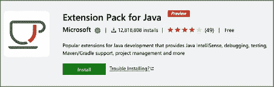

最新的是一组流行的扩展，可以帮助用 Visual Studio 代码编写、测试和调试 Java 应用程序。通过安装它，将安装以下扩展:

代码导航自动完成重构代码段

[**Java 调试器**](https://marketplace.visualstudio.com/items?itemName=vscjava.vscode-java-debug)

排除故障

【Java 的 [**测试运行器**](https://marketplace.visualstudio.com/items?itemName=vscjava.vscode-java-test)

运行和调试 JUnit/TestNG 测试用例

[**Maven for Java**](https://marketplace.visualstudio.com/items?itemName=vscjava.vscode-maven)

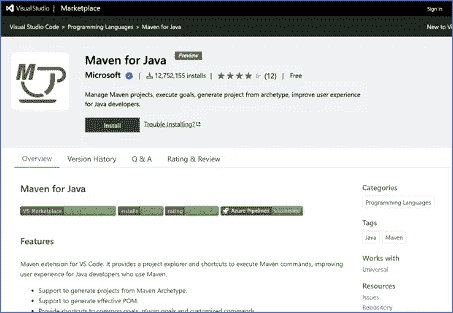

这是你基于 [Maven](https://maven.apache.org/) 的项目的“必须”。

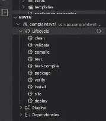

正如您所看到的，t 提供了一个项目浏览器和执行 Maven 命令的快捷方式，为使用 Maven 的 Java 开发人员改善了用户体验。

*   支持从 Maven 原型生成项目。
*   支持生成有效的 POM。
*   提供共同目标、插件目标和定制命令的快捷方式。
*   保留命令历史以快速重新运行。
*   项目脚手架
*   自定义目标

[**Java 项目经理**](https://marketplace.visualstudio.com/items?itemName=vscjava.vscode-java-dependency)

管理 Java 项目、引用的库、资源文件、包、类和类成员

[**IntelliCode**](https://marketplace.visualstudio.com/items?itemName=VisualStudioExptTeam.vscodeintellicode)

该扩展为 Java 开发人员(以及许多其他语言)提供了 Visual Studio 代码中的人工智能辅助开发功能，其洞察力基于对代码上下文的理解并结合了机器学习。

之后，我们将继续安装 Spring Tools 4 for Visual Studio 代码。

# 用于 Visual Studio 代码扩展的 Spring Tools 4

实际上，你要做的就是去 VS 代码市场的 [Spring Boot 扩展包](https://marketplace.visualstudio.com/items?itemName=Pivotal.vscode-boot-dev-pack)页面安装它。您可以通过使用浏览器来完成:

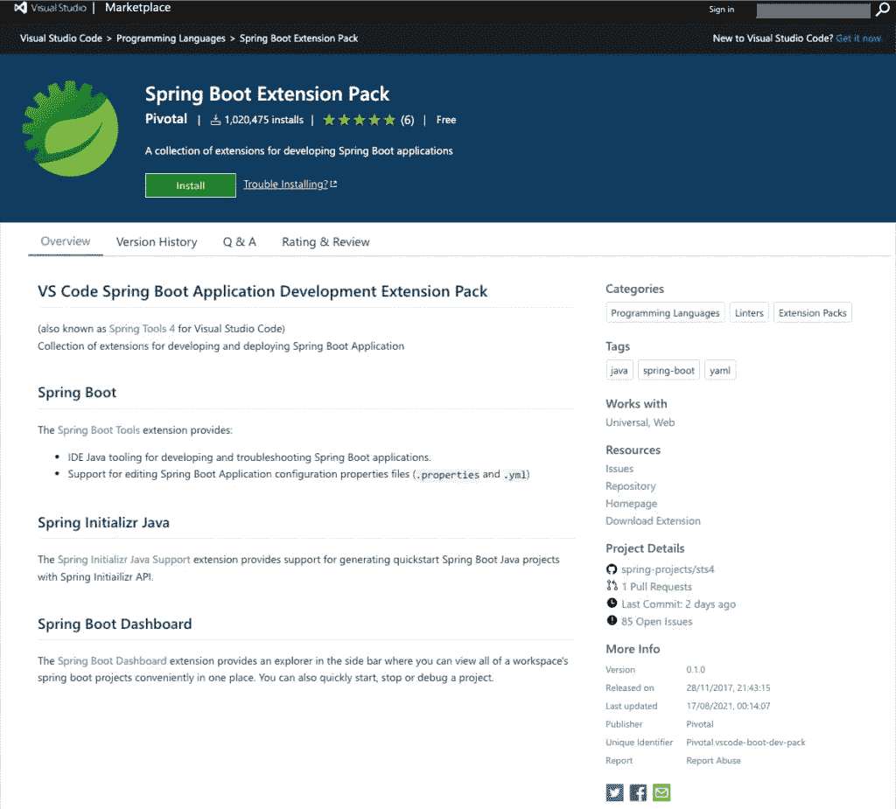

或者通过 VS 代码 IDE 本身:

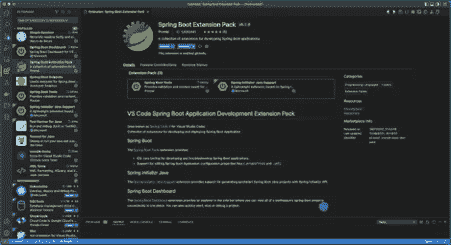

这也是一个扩展包，实际上由 3 个独立的扩展组成:

[**Spring Boot(Spring Boot 工具)**](https://marketplace.visualstudio.com/items?itemName=Pivotal.vscode-spring-boot)

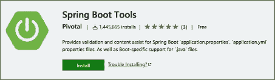

它是 VSCode 扩展和语言服务器，为使用 Spring Boot application . properties、application.yml 和。java 文件。

**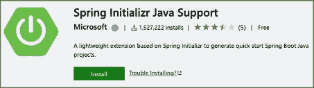**

**这是众所周知的在 VS 代码 IDE 中快速生成 Spring Boot 项目的工具。它帮助您使用配置定制项目，并管理 Spring Boot 依赖项。**

**和**

**[**Spring Boot**](https://marketplace.visualstudio.com/items?itemName=vscjava.vscode-spring-boot-dashboard)[**仪表盘**](https://marketplace.visualstudio.com/items?itemName=vscjava.vscode-spring-boot-dashboard)**

****

**它在侧边栏中提供了一个浏览器，通过它，您可以查看和管理工作区中所有可用的 Spring Boot 项目。它还支持快速启动、停止或调试 Spring Boot 项目的功能。**

# **其他与 Java 相关的扩展**

# **[Tomcat for Java](https://marketplace.visualstudio.com/items?itemName=adashen.vscode-tomcat)**

******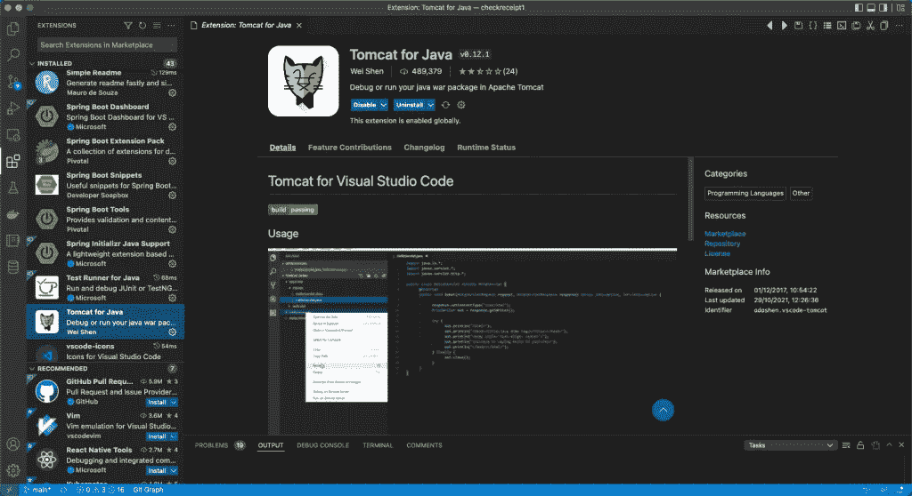**

**这个扩展要求 Tomcat 应用服务器应该已经安装在您的机器上。**

**👉下面是我的另一个帖子，关于如何在你的系统上安装和配置 Tomcat:**

** [## Apache Tomcat 挑战:安装、配置、开始工作、SSL 和其他好东西！

### Apache Tomcat 是 Java 开发人员社区中最受欢迎的应用服务器。在这里，我们将看看一些…

blog.devgenius.io](/apache-tomcat-challenges-install-configure-start-working-ssl-and-other-goodies-95f519cb4926) 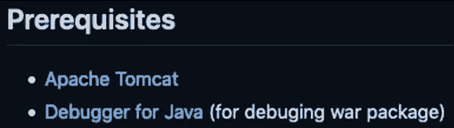

因此，我们可以通过选择安装 Tomcat 服务器的文件夹来添加它。

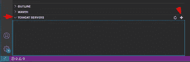

之后就可以开始用了。

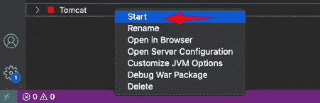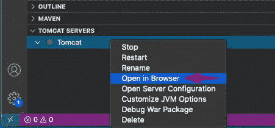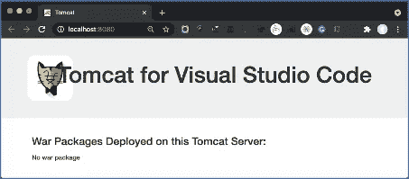

**扩展功能:**

*   从 Tomcat 安装路径添加 Tomcat 服务器
*   从 VSCode 启动/重启 Tomcat 服务器
*   在 Tomcat 服务器上运行 war 包
*   在 Tomcat 服务器上调试 war 包
*   在 Tomcat 服务器上运行爆炸式 war
*   调试 Tomcat 服务器上爆发的 war
*   在浏览器中打开服务器主页，检查所有部署的 war 包
*   在 Tomcat Explorer 中查看所有部署的 war 包
*   打开。浏览器中的 war 包主页
*   停止 Tomcat 服务器
*   重命名 Tomcat 服务器
*   启动 Tomcat 服务器时自定义 JVM 选项
*   在文件资源管理器中显示部署的 war 包
*   删除部署的 war 包

# 其他有用的扩展

通过 CS Code Market Place 可以获得大量的扩展。下面只提到其中的几个。

# [XML 工具](https://marketplace.visualstudio.com/items?itemName=DotJoshJohnson.xml)

特点:

*   XML 格式
*   XML 树视图
*   XPath 评估
*   XQuery 林挺
*   XQuery 执行
*   XQuery 代码完成

# [Spring Boot 片段](https://marketplace.visualstudio.com/items?itemName=developersoapbox.vscode-springboot-snippets)

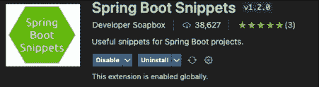

它为 Spring Boot 添加了一些片段。这些对于创建 REST APIs 和配置数据库连接属性特别有用。

Java 片段

实现了 CRUD 操作的 Spring-CRUD ctrl Spring Controller
Spring-CRUD repo Spring Data JPA CRUD repository with REST API annotation
Spring-jparepo Spring Data JPA repository with REST API annotation
Spring-entity JPA entity with ID field
Spring-Lombok-entity JPA entity with ID field and Lombok @ Data annotation
Spring-ctrl-getall Controller GET action for collection
Spring-ctrl-getone Controller GET action for single item
Spring-ctrl-POST Controller POST action

application . properties/application . YAML 片段

spring-sqlite SQLite 数据库 jdbc url 和属性
spring-sqlserver SQL Server 数据库 jdbc url 和属性
spring-oracle Oracle 数据库 jdbc url 和属性
spring-PostgreSQL PostgreSQL 数据库 jdbc url 和属性
spring-mysql MySQL 数据库 jdbc url 和属性
spring-h2 H2 数据库 jdbc url 和属性

# [针对 VS 代码(SQL 和 PLSQL)的 Oracle 开发人员工具](https://marketplace.visualstudio.com/items?itemName=Oracle.oracledevtools)

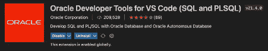

功能包括:

*   使用轻松连接语法、TNS 连接别名或 ODP.NET 连接字符串连接到 Oracle 数据库和 Oracle 自治数据库
*   使用 Oracle 云基础架构浏览器树控制创建和管理 Oracle 自治数据库(ADB)。创建、启动、停止和终止 ADB 实例。自动下载凭证文件并创建数据库连接。
*   Oracle 数据库浏览器树控件:连接和浏览 Oracle 模式；显示表和视图的数据，并另存为 CSV 或 JSON 文件；为表自动生成 CREATE、SELECT、INSERT 和 DELETE 语句。查看、编辑、调试和保存 PL/SQL 程序包、过程和函数。使用输入参数值的用户界面运行存储过程和函数。
*   编辑 SQL 和 PL/SQL，支持悬停、转到/Peek 定义、转到/Peek 类型定义和转到/Peek 实现。该编辑器还具有智能感知功能，可自动完成模式对象名称、过程/函数参数和 SQL*Plus 命令。使用面包屑导航大型脚本。
*   使用 Visual Studio 代码的本机调试功能调试存储过程、函数和包中的 PL/SQL。编译 PL/SQL 进行调试，单步执行 PL/SQL，并运行到断点。启用外部应用程序调试来监听和调试应用程序或 SQL 脚本调用的 PL/SQL 过程和函数。
*   执行 SQL 和 PL/SQL 并查看和保存结果。在“问题”面板中查看错误，并导航到有错误的行。在对话框中输入绑定和替换变量。
*   有限的 SQL*Plus 支持
*   查看 SQL 命令历史，并查看和保存 SQL 书签** 

**最后，下面是一系列关于如何使用 Spring Boot Initializr 建立一个 Maven/pom 项目的图片。**

**👉注意:如果您没有访问 Oracle 数据库实例的权限，您可以创建您的 Oracle Dicker 映像并运行您自己的容器，请关注我下面的帖子:**

** [## Docker 中的 Oracle 数据库

### 5 分钟指南。轻松全面！

blog.devgenius.io](/oracle-database-in-docker-65da9c96ed56) 

# 使用 Spring Boot Initializr 建立新项目

*   按`Ctrl (or Alt/Option on Mac) + Shift + P`打开命令面板。
*   键入`Spring Initializr`开始生成项目。

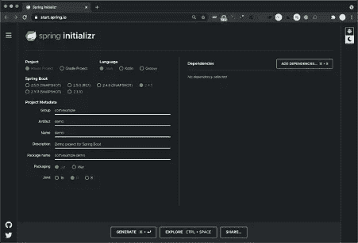

基本项目设置

选择一个 Maven 项目并按照向导进行操作。

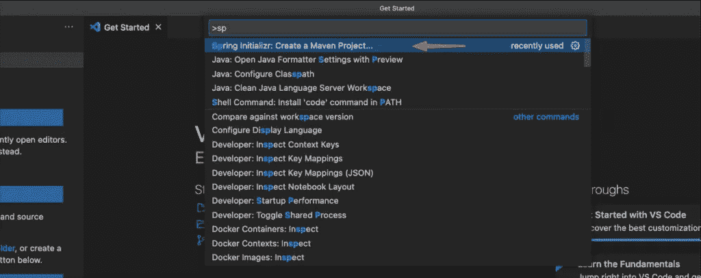

指定您想要的 Spring Boot 版本

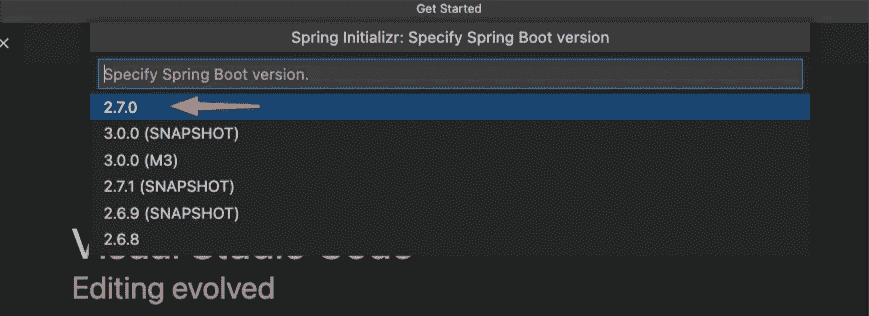

设置组 id(例如，以相反的顺序设置您公司或组织的域)

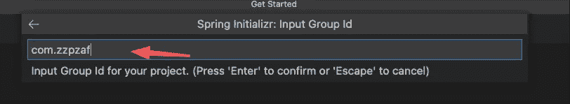

给出项目的工件 id

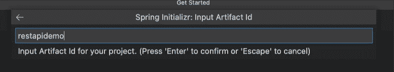

指定项目的程序语言

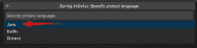

指定输出包格式

指定您喜欢的 Java 版本

逐一选择您计划在项目中使用的依赖项，例如:

spring Web——这是开发基于 Web 的应用程序(例如 MVC)和 RESTFull 服务等所必需的。它还添加了一个嵌入式 Apache Tomcat 服务器，默认情况下，当我们在开发过程中运行/调试我们的项目时，它就会启动

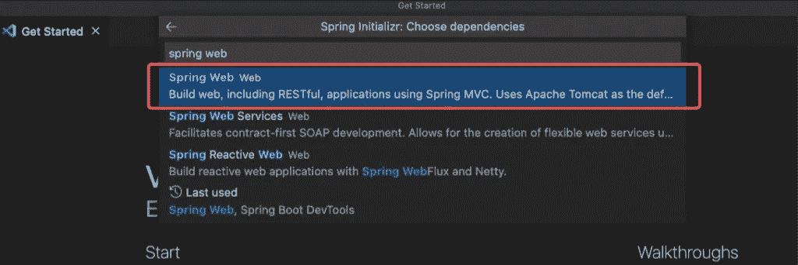

Spring Boot 开发工具:非常有用，甚至对于修改源代码后的自动重启选项也是如此

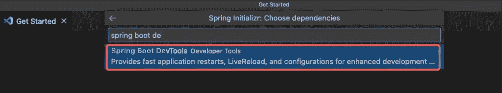

您认为项目应用程序需要的任何其他包，例如:JDBC 支持、数据库驱动程序等。

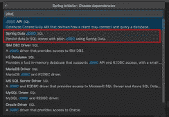

最后，选择项目的文件夹并生成它

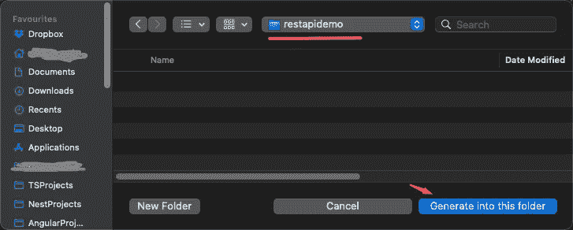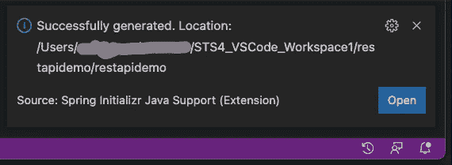

下面，给出生成的项目 **pom.xml** 文件:

然后就可以开始编码了！

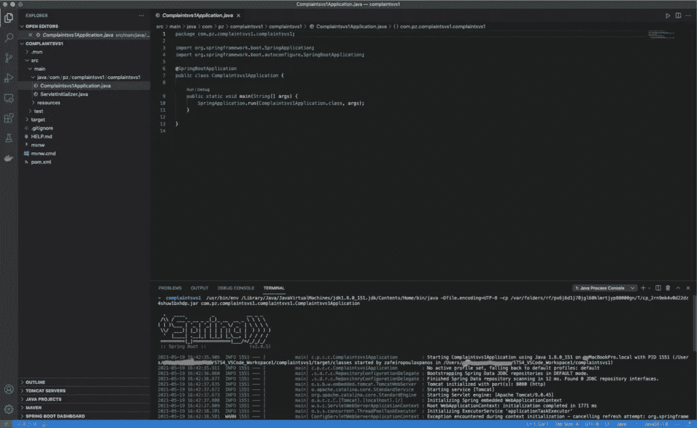

注意:您可以在我的帖子中继续创建您的第一个 REST API 项目:

 [## Spring Boot Rest API 开发快速入门

### 一个快速、简单、解释清晰且真正有效的 Spring Boot REST API 项目。提供回购！

blog.devgenius.io](/quick-intro-to-rest-api-development-with-spring-boot-64583dabbe8c) 

就是这样！
享受，感谢你的阅读👏！**