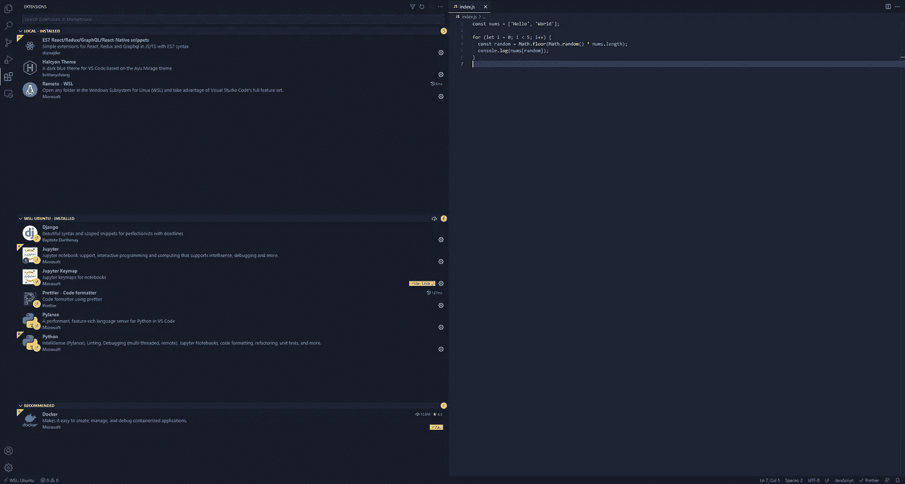
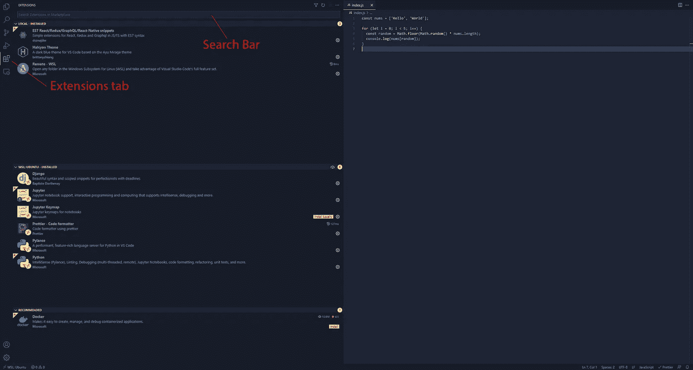
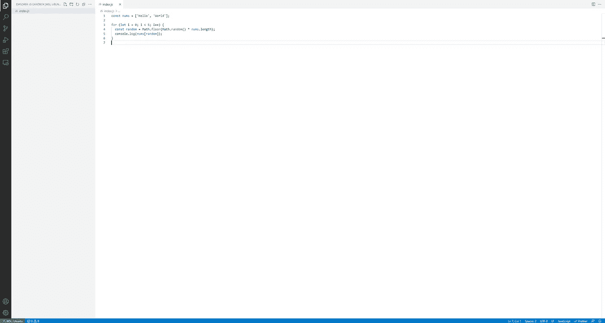
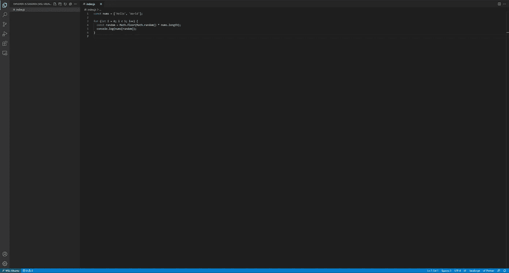
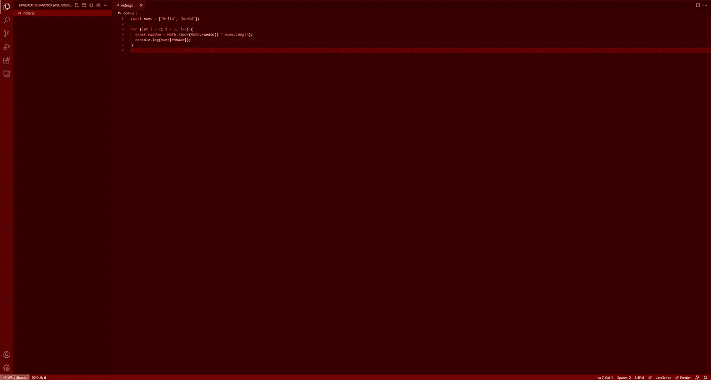
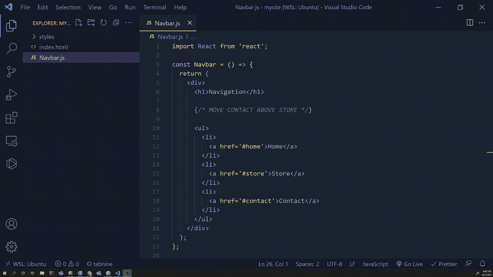
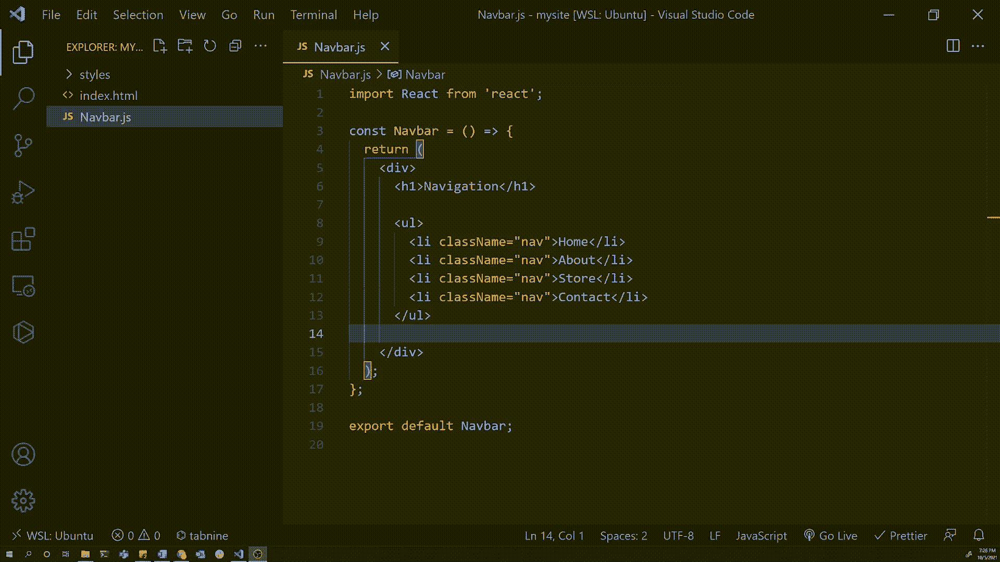

# VS 代码提示和技巧

> 原文：<https://blog.devgenius.io/vs-code-tips-and-tricks-bbda8b4fdea9?source=collection_archive---------2----------------------->



VS 代码编辑器截图

[VS 代码](https://code.visualstudio.com/)是我最喜欢的文本编辑器。当正确使用并充分发挥其潜力时，它可以帮助您快速编写干净、有效且高效的代码。我在[熨斗学校](https://flatironschool.com/)当技术蔻驰的时候，我一直教学生一些技巧和窍门，让他们最大限度地利用这个不可思议的工具。

**上下文表:**

1.  更漂亮(和其他格式化程序)
2.  编程语言支持
3.  主题
4.  保存时格式化
5.  ES7 React/Redux/graph QL/React-原生片段扩展
6.  ALT +向上或向下箭头移动代码行以移动代码
7.  选择文件上的所有关键字

1.  **更漂亮**

VS 代码最好的一点是它附带了 JavaScript 支持。不需要安装任何额外的东西就可以开始完美地编写一些 JavaScript。然而，任何一个写了几行 JS 的人都会告诉你这种语言可以有多乱。Prettier 是一个格式化程序，可以作为扩展安装到 VS 代码中。更漂亮的带有格式化样式，但是如果你喜欢，你可以自定义它们。

要安装得更漂亮，请打开左侧菜单栏中的扩展选项卡:



指出了扩展标签和搜索栏的 VS 代码编辑器

在搜索栏中输入*，你会看到 ***漂亮的代码格式器*** 是列表中的首选。在我写这篇文章的时候，这个扩展已经有超过 1500 万的下载量了！只需点击旁边的安装按钮。*

*使用 beauty 很简单。当您在编辑器中编写一些 JavaScript 时，右键单击编辑器区域以显示一些选项。你应该看到一个写着*格式的文档。*点击此*，可能会提示您*选择一个格式化程序。如果这个提示出现，点击更漂亮的选项，你的代码应该重新格式化。如果提示没有出现，代码应该只是格式化。现在，您不必担心花括号对齐、代码换行等问题了！*

*请注意，prettier 只是一个应用于 JavaScript、TypeScript、JSX、JSON、CSS、HTML 和其他一些语言的格式化程序的例子。然而，如果你用其他语言写代码，肯定会有一个格式化程序，它的工作方式与 prettier 相似。*

***2。编程语言支持***

*如上所述，VS 代码附带了 JavaScript 支持。然而，假设你用不同的语言写代码，比如 Java，或者 Python。在 VS 代码中添加对几乎任何语言的支持都非常简单。*

*要安装语言支持扩展，请打开“扩展”选项卡，并在搜索栏中键入要使用的语言名称。微软或其他人可能会创建一个 VS 代码扩展来支持这种语言。例如，如果你在搜索中输入 python，你会看到微软创建的 Python 扩展。然而，如果你输入 Java，你会看到一些微软开发的调试工具。您还会看到语言支持扩展是由 Red Hat 创建的。这将允许您根据自己的需要定制语言支持！你可以安装任何你想要的。*

***3。主题***

*VS 代码带有相当多的明暗主题。然而，如果你不喜欢这些，有太多不同的主题可供选择。在上面 VS 代码的照片中，我使用的是[宁静主题](https://marketplace.visualstudio.com/items?itemName=brittanychiang.halcyon-vscode)。我喜欢这个主题，因为它为我增加了足够的对比度，同时保持了黑暗和舒适。如果你不喜欢默认的 VS 代码主题，你可以在[市场](https://marketplace.visualstudio.com/search?target=vscode&category=Themes&sortBy=Relevance)找到一个！*

*一旦你找到一个你喜欢的主题，只需通过在扩展标签中搜索来安装它，就像我们在漂亮和语言支持中所做的一样。然后从菜单栏进入**视图>命令托盘**并键入**主题**。您应该会看到一个选项，上面写着**首选项:颜色主题。点击这个，你应该会看到一系列可供选择的主题，以及你安装的主题。你可以随意交换主题，直到找到最合适的为止。***

**

*VS 主题轻松的代码*

**

*默认深色主题的 VS 代码*

**

*VS 红色主题的代码*

***4。保存时的格式***

*我们之前已经讨论过**更漂亮的**扩展。然而，每次你想格式化一个文件时，都要点击右键，选择格式化文档，这是非常烦人和重复的。幸运的是，每次手动保存文件时，都有一个格式化文件的选项。通过手动保存，我的意思是用`cmd + s`保存文件(mac ),或者用`ctrl + s`保存文件(windows)。要在保存时启用格式，点击**查看>命令托盘**。在命令托盘搜索中寻找**首选项:打开设置(UI)** 并打开它。您应该会看到 VS 代码设置列表。在**搜索设置**栏中，将搜索表单**格式保存在**上。您应该会看到一个带有复选框的设置。确保复选框被选中。*

***5。ES7 React/Redux/graph QL/React-Native snippets 扩展***

*对于那些写了很多 React 的人来说，这个扩展是必须拥有的奢侈品。创建 react 组件时，通常的流程是用组件的名称创建一个 JavaScript 文件。例如，如果您有一个`Navbar`组件，您将创建一个名为`Navbar.js.`的文件。在此之后，您将创建组件的框架，例如:*

```
*import React from 'react'const Navbar = () => {
    return <div>Navbar</div>;
}export default Navbar;*
```

*随着应用程序的增长，对每个组件都这样做可能会变得重复和乏味。该扩展提供了许多快捷方式来快速浏览您的 react 代码。我用的最多的是`racfe.`*

*要使用快捷方式，只需按照我们之前做得更漂亮的方式安装扩展即可。创建新的 react 应用程序，并准备创建新的组件之后。只需创建组件文件。当在空文件中时，只需键入`racfe`并跟着一个制表符。组件结构应自动填写。请注意，扩展名使用文件名来确定要放入的内容。*

***6。ALT +向上或向下箭头移动代码行***

*你经常写一些代码，然后意识到你想把它移到文件的另一部分吗？这样做的自然方法是复制、剪切代码，然后将其粘贴到您想要的位置。然而，这个技巧可以帮你节省很多时间。*

*这里有一个它运行的快速视频:*

**

*ALT + UP 的 GIF*

*要使用这个巧妙的技巧，只需选择您想要移动的代码区域。然后按住 **ALT** 键(mac 上的 option 键)，按向上或向下箭头移动代码。这是一件简单的事情，但我发现，如果在这里或那里节省一两秒钟，就可以通过编码会话节省大量时间。*

***7。ALT + D 选择文件中的特定单词***

*在编程时，重命名事物是一种常见的做法。然而，假设你在一个文件中多次引用了一个同名的变量，并且必须更新所有的变量。最简单的方法之一就是用这个技巧。*

*只需突出显示您想要更新的变量的第一个实例，按住 **ALT** 键，然后一直按住 **D** 键，直到所有实例都被选中。这将允许你像变魔术一样一次编辑所有的实例。这里有一个它运行的快速视频:*

**

***结论***

*这些是我最好的，也是最常用的 7 VS 代码技巧。我希望它们能在你的编码之旅中帮助你！*

*如果你喜欢这篇博文，觉得它很有用，可以考虑为它鼓掌，并在 Medium 上关注我。此外，考虑使用我的推荐链接在此注册 Medium [。只要你还是会员，我就能得到一点回扣。如果你愿意，你也可以在这里](https://tarricsookdeo.medium.com/subscribe)给我买杯咖啡[！非常感谢！](https://www.buymeacoffee.com/tarricsookdeo)*