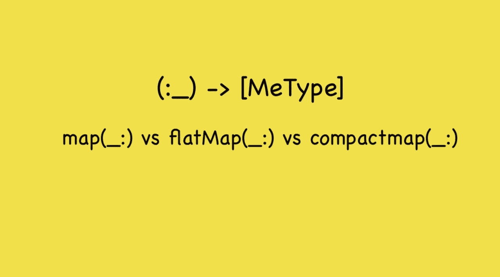
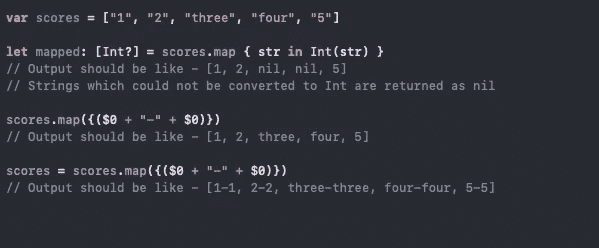

# vs —地图、平面地图和压缩地图

> 原文：<https://blog.devgenius.io/vs-map-flatmap-and-compactmap-e7cb3e496fad?source=collection_archive---------0----------------------->

Swift 中的高阶函数是极好的补充。尽管 Swift 很早就引入了它，而且我们许多人都非常熟悉如何使用它。当我深入研究并开始使用它们时，我发现它们之间有一个巧妙区别。每种方法在特定的期望中都有它的熟练程度。

这篇文章对初学者更有帮助，也有助于理解如何选择特定需求的方法。它们都有一个共同点，那就是它们都应用于集合并返回一个数组。让我们单独讨论它们—

**Map** ( [map(_:)](https://developer.apple.com/documentation/swift/array/3017522-map) ) —当您必须对数组的每个元素执行操作/更新时，将使用 Map。输入和输出阵列可以是也可以不是同一类型。虽然，投入和产出的大小不变。这是我们如何以不同的方式使用它—

所以在上面的例子中，很明显 map 并不更新集合本身，而是返回一个包含预期变化的数组。

*简而言之——只有当我们想要改变数组元素或者更新现有元素并返回更新后的集合时，才应该使用 map(_:)。*

**平面图** ( [平面图(_:)](https://developer.apple.com/documentation/swift/array/3126947-flatmap) ) —平面图是另一个应用于集合的高阶函数。它和 map 一样适用，唯一的区别是它总是返回连接所有元素的展平数组。当您需要在嵌套数组、字典或集合中收集特定数据时，必须使用它。即

这里的例子显示了地图和平面图的区别。你可以根据需要选择任何一个。

*简而言之——当需要连接集合中特定元素的数据并生成扁平化集合时，应该使用 flatMap(_:)。*

**compact map**([compact map(_:)](https://developer.apple.com/documentation/swift/array/2957701-compactmap))—compact map 是集合结果中非常有用且强大的函数。compactMap 在功能上与 map(_:)非常相似，唯一的区别是它处理 nil 并且只返回非零值。此外，返回数组的大小可能因非零值而异。compactMap 总是避免 nil 值，并且不认为它是返回数组。

此示例显示了 map 和 compactMap 的不同输出。对于预期的类型结果，compactMap 从不返回空值。此外，输出数组的大小是不同的，压缩数组具有更少的零值输入数组的数量计数。

*简而言之——当预期类型具有可选值，并且您需要避免集合中的零值时，应该使用 compactMap(_:)。请始终记住，输出数组的大小可能与预期的不同。*

***复杂度*** *—以上所有函数在复杂度方面都是线性的。它是-O(m+n ),其中 n 是这个序列的长度，m 是结果的长度*

**其他** —除了上述函数，还有几个更高阶的函数。让我们也来看一看它们:

*   [filter(_:)](https://developer.apple.com/documentation/swift/sequence/3018365-filter) —对集合进行过滤，只返回符合过滤逻辑的元素。它返回数组中的元素，如果不匹配则为空。
*   [first(where:)](https://developer.apple.com/documentation/swift/array/1848165-first) —与 filter(_:)相同，但它返回单个元素，并且是最先匹配过滤器逻辑的元素。如果不匹配，则返回零。
*   [reduce(_:)](https://developer.apple.com/documentation/swift/array/2298686-reduce) —从整个序列的元素中产生单个值。一般来说，它有助于求和，追加字符串等。

快乐编码——干杯！！！