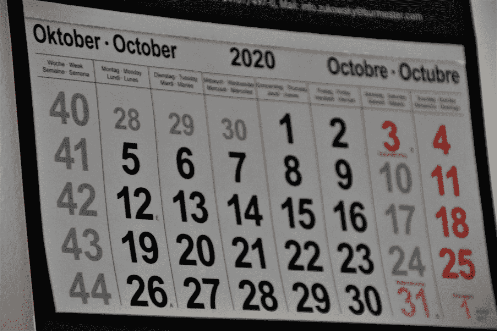

# 使用 PrimeVue 框架开发 vue 3—日历和订单列表

> 原文：<https://blog.devgenius.io/vue-3-development-with-the-primevue-framework-calendar-and-order-list-eac263a749e5?source=collection_archive---------4----------------------->



照片由[瓦尔德马尔·布兰特](https://unsplash.com/@waldemarbrandt67w?utm_source=medium&utm_medium=referral)在 [Unsplash](https://unsplash.com?utm_source=medium&utm_medium=referral) 上拍摄

PrimeVue 是一个与 Vue 3 兼容的 UI 框架。

在本文中，我们将了解如何开始使用 PrimeVue 开发 Vue 3 应用程序。

# 日历

我们可以使用 PrimeVue 的`FullCalendar`组件将日历添加到 Vue 3 应用程序中。

要使用它，我们通过运行以下命令来安装所需的软件包:

```
npm install @fullcalendar/core --save
npm install @fullcalendar/daygrid --save
npm install @fullcalendar/timegrid --save
npm install @fullcalendar/interaction --save
```

然后，我们可以通过编写以下内容将日历添加到 Vue 3 应用程序中:

`main.js`

```
import { createApp } from "vue";
import App from "./App.vue";
import PrimeVue from "primevue/config";
import FullCalendar from 'primevue/fullcalendar';
import 'primevue/resources/primevue.min.css'
import 'primevue/resources/themes/saga-blue/theme.css'
import 'primeicons/primeicons.css'
import 'primeflex/primeflex.css';const app = createApp(App);
app.use(PrimeVue);
app.component("FullCalendar", FullCalendar);
app.mount("#app");
```

`App.vue`

```
<template>
  <div>
    <FullCalendar :events="events" :options="options" />
  </div>
</template><script>
import '@fullcalendar/core'
import dayGridPlugin from "@fullcalendar/daygrid";
import timeGridPlugin from "@fullcalendar/timegrid";
import interactionPlugin from "@fullcalendar/interaction";export default {
  name: "App",
  data() {
    return {
      options: {
        plugins: [dayGridPlugin, timeGridPlugin, interactionPlugin],
        initialDate: "2020-12-01",
        headerToolbar: {
          left: "prev,next",
          center: "title",
          right: "dayGridMonth,timeGridWeek,timeGridDay",
        },
        editable: true,
      },
      events: [
        {
          id: 1,
          title: "All Day Event",
          start: "2020-12-01",
        },
        {
          id: 2,
          title: "Long Event",
          start: "2020-12-07",
          end: "2020-12-10",
        },
      ],
    };
  },
  methods: {},
};
</script>
```

我们必须安装`@fullcalendar`依赖项。

然后我们导入并注册`FullCalendar`组件。

然后在`App.vue`中，我们通过将插件放入`options.plugins`数组来添加所需的插件。

然后事件由`events`数组填充，该数组具有`id`、`title`、`start`和`end`属性。

如果没有指定`end`，那么事件持续一天。

我们还用`headerToolbar`属性指定了日历中顶栏的显示方式。

所有列出的项目都是工具栏按钮的名称。

我们可以设置`initialDate`属性来设置日历中显示的初始日期。

# 订单

我们可以添加一个可以用`OrderList`组件重新排序的列表。

为了补充它，我们写道:

`main.js`

```
import { createApp } from "vue";
import App from "./App.vue";
import PrimeVue from "primevue/config";
import OrderList from 'primevue/orderlist';
import 'primevue/resources/primevue.min.css'
import 'primevue/resources/themes/saga-blue/theme.css'
import 'primeicons/primeicons.css'
import 'primeflex/primeflex.css';const app = createApp(App);
app.use(PrimeVue);
app.component("OrderList", OrderList);
app.mount("#app");
```

`App.vue`

```
<template>
  <div>
    <OrderList v-model="cars" listStyle="height:auto" dataKey="vin">
      <template #header> List of Cars </template>
      <template #item="slotProps">
        <div class="p-caritem">
          <div>
            <span class="p-caritem-vin">{{ slotProps.item.vin }}</span>
            <span>{{ slotProps.item.year }} - {{ slotProps.item.color }}</span>
          </div>
        </div>
      </template>
    </OrderList>
  </div>
</template><script>
export default {
  name: "App",
  data() {
    return {
      cars: [
        { brand: "Volkswagen", year: 2012, color: "Orange", vin: "dsad231ff" },
        { brand: "Audi", year: 2011, color: "Black", vin: "gwregre345" },
        { brand: "Renault", year: 2005, color: "Gray", vin: "h354htr" },
      ],
    };
  },
  methods: {},
};
</script>
```

我们在`main.js`中注册`OrderList`组件。

然后我们把它加到`App.vue`里。

我们用标题内容填充`header`槽。

我们用单个项目的内容填充`item`槽。

`slotProps.item`属性有项目数据。

我们现在应该得到一个条目列表，我们可以用按钮选择这些条目来重新排序。

`v-model`被绑定到`cars`数组，该数组包含列表项。

# 结论

我们可以使用 PrimeVue 将日历和可重新排序列表添加到我们的 Vue 3 应用程序中。