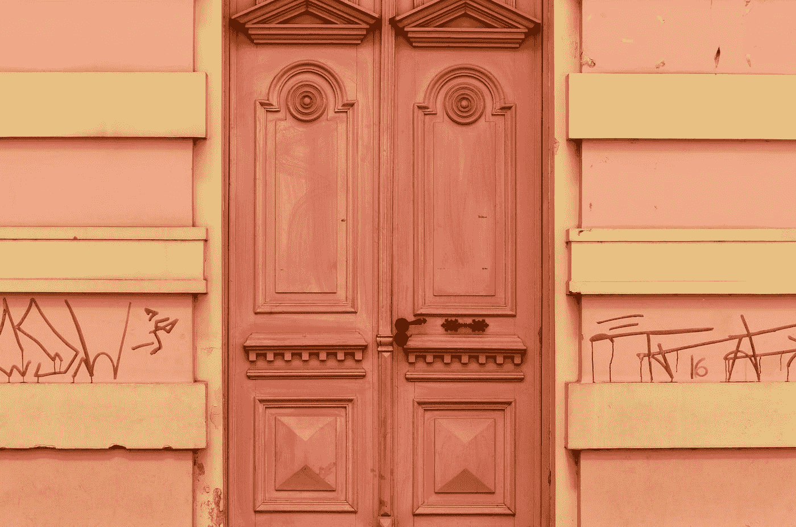

# 用 PrimeVue 框架开发 vue 3——旋钮和列表框

> 原文：<https://blog.devgenius.io/vue-3-development-with-the-primevue-framework-knob-and-listbox-23da4f820216?source=collection_archive---------5----------------------->



[加布里埃尔](https://unsplash.com/@spenas88?utm_source=medium&utm_medium=referral)在 [Unsplash](https://unsplash.com?utm_source=medium&utm_medium=referral) 上拍摄的照片

PrimeVue 是一个与 Vue 3 兼容的 UI 框架。

在本文中，我们将了解如何开始使用 PrimeVue 开发 Vue 3 应用程序。

# 瘤

PrimeVue 的`Knob`组件让我们添加一个刻度盘，在屏幕上用一个条显示一个数值。

我们也可以用它来设置数值。

要添加它，我们可以写:

`main.js`

```
import { createApp } from "vue";
import App from "./App.vue";
import PrimeVue from "primevue/config";
import Knob from 'primevue/knob';
import 'primevue/resources/primevue.min.css'
import 'primevue/resources/themes/saga-blue/theme.css'
import 'primeicons/primeicons.css'
import 'primeflex/primeflex.css';const app = createApp(App);
app.use(PrimeVue);
app.component("Knob", Knob);
app.mount("#app");
```

`App.vue`

```
<template>
  <div>
    <Knob v-model="value" />
  </div>
</template><script>
export default {
  name: "App",
  data() {
    return {
      value: 50,
    };
  },
  methods: {},
};
</script>
```

我们在`main.js`中注册组件。

然后我们将其添加到`App`组件中，并用`v-model`将选择的值绑定到`value`。

我们可以用`size`道具通过设置像素大小来改变它的大小:

```
<template>
  <div>
    <Knob v-model="value" :size="200" />
  </div>
</template><script>
export default {
  name: "App",
  data() {
    return {
      value: 50,
    };
  },
  methods: {},
};
</script>
```

# 列表框

PrimeVue 带有一个 listbox 组件。

例如，我们可以写:

`main.js`

```
import { createApp } from "vue";
import App from "./App.vue";
import PrimeVue from "primevue/config";
import Listbox from 'primevue/listbox';
import 'primevue/resources/primevue.min.css'
import 'primevue/resources/themes/saga-blue/theme.css'
import 'primeicons/primeicons.css'
import 'primeflex/primeflex.css';const app = createApp(App);
app.use(PrimeVue);
app.component("Listbox", Listbox);
app.mount("#app");
```

`App.vue`

```
<template>
  <div>
    <Listbox v-model="selectedCity" :options="cities" optionLabel="name" />
  </div>
</template><script>
export default {
  name: "App",
  data() {
    return {
      selectedCity: null,
      cities: [
        { name: "Miami", code: "MI" },
        { name: "Rome", code: "RM" },
        { name: "London", code: "LDN" },
        { name: "Istanbul", code: "IST" },
        { name: "Paris", code: "PRS" },
      ],
    };
  },
  methods: {},
};
</script>
```

`options`道具让我们指定选项。

`optionLabel`具有每个条目的属性名和要显示的值。

我们可以让用户使用`multiple`道具选择多个项目:

```
<template>
  <div>
    <Listbox
      v-model="selectedCity"
      :options="cities"
      optionLabel="name"
      multiple
    />
  </div>
</template><script>
export default {
  name: "App",
  data() {
    return {
      selectedCity: null,
      cities: [
        { name: "Miami", code: "MI" },
        { name: "Rome", code: "RM" },
        { name: "London", code: "LDN" },
        { name: "Istanbul", code: "IST" },
        { name: "Paris", code: "PRS" },
      ],
    };
  },
  methods: {},
};
</script>
```

我们可以通过编写以下内容来自定义项目的显示方式:

```
<template>
  <div>
    <Listbox
      v-model="selectedCity"
      :options="cities"
      optionLabel="name"
      multiple
    >
      <template #option="slotProps">
        <div>
          <b>{{ slotProps.option.name }}</b>
        </div>
      </template>
    </Listbox>
  </div>
</template><script>
export default {
  name: "App",
  data() {
    return {
      selectedCity: null,
      cities: [
        { name: "Miami", code: "MI" },
        { name: "Rome", code: "RM" },
        { name: "London", code: "LDN" },
        { name: "Istanbul", code: "IST" },
        { name: "Paris", code: "PRS" },
      ],
    };
  },
  methods: {},
};
</script>
```

我们填充了`option`槽来定制项目的显示方式。

`slotProps.option`有物品。

`filter`道具增加了一个输入框让我们过滤内容

# 结论

我们可以使用 PrimeVue 框架将旋钮和列表框添加到我们的 Vue 3 应用程序中。