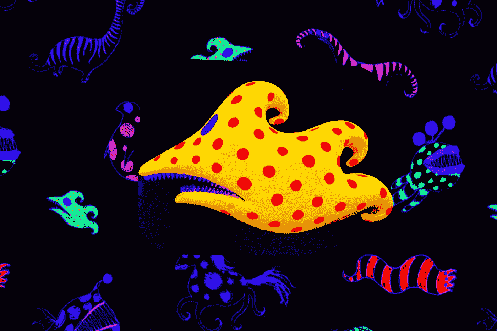

# Vue 3 — JavaScript 转换

> 原文：<https://blog.devgenius.io/vue-3-javascript-transitions-7ca6ad10d109?source=collection_archive---------4----------------------->



摄影:周在 [Unsplash](https://unsplash.com?utm_source=medium&utm_medium=referral)

Vue 3 处于测试阶段，可能会有变化。

Vue 3 是 Vue 前端框架的最新版本。

它建立在 Vue 2 的普及性和易用性之上。

在本文中，我们将看看如何设置转场持续时间和创建 JavaScript 转场。

# 过渡持续时间

我们可以用`duration`属性设置过渡持续时间。

例如，我们可以写:

```
<!DOCTYPE html>
<html lang="en">
  <head>
    <title>App</title>
    <script src="https://unpkg.com/vue@next"></script>
    <style>
      .bounce-enter-active {
        animation: bounce-in 1.5s;
      }
      .bounce-leave-active {
        animation: bounce-in 1.5s reverse;
      }
      @keyframes bounce-in {
        0% {
          transform: scale(0);
        }
        50% {
          transform: scale(1.5);
        }
        100% {
          transform: scale(1);
        }
      }
    </style>
  </head>
  <body>
    <div id="app">
      <button @click="show = !show">
        Toggle
      </button> <transition name="bounce" :duration="1000">
        <p v-if="show">hello</p>
      </transition>
    </div>
    <script>
      const app = Vue.createApp({
        data() {
          return {
            show: false
          };
        }
      });
      app.mount("#app");
    </script>
  </body>
</html>
```

我们只需将`duration`道具添加到`transition`组件来设置持续时间。

持续时间以毫秒为单位。

我们还可以为进入和离开转换设置单独的值:

```
<!DOCTYPE html>
<html lang="en">
  <head>
    <title>App</title>
    <script src="https://unpkg.com/vue@next"></script>
    <style>
      .bounce-enter-active {
        animation: bounce-in 1.5s;
      }
      .bounce-leave-active {
        animation: bounce-in 1.5s reverse;
      }
      [@keyframes](http://twitter.com/keyframes) bounce-in {
        0% {
          transform: scale(0);
        }
        50% {
          transform: scale(1.5);
        }
        100% {
          transform: scale(1);
        }
      }
    </style>
  </head>
  <body>
    <div id="app">
      <button @click="show = !show">
        Toggle
      </button> <transition name="bounce" :duration="{ enter: 500, leave: 1000 }">
        <p v-if="show">hello</p>
      </transition>
    </div>
    <script>
      const app = Vue.createApp({
        data() {
          return {
            show: false
          };
        }
      });
      app.mount("#app");
    </script>
  </body>
</html>
```

我们再次用`enter`和`leave`属性以毫秒为单位来设置每个效果的持续时间。

# JavaScript 挂钩

转换的每个阶段都有 JavaScript 挂钩。

它们包括:

```
<transition
  @before-enter="beforeEnter"
  @enter="enter"
  @after-enter="afterEnter"
  @enter-cancelled="enterCancelled"
  @before-leave="beforeLeave"
  @leave="leave"
  @after-leave="afterLeave"
  @leave-cancelled="leaveCancelled"
  :css="false"
>
  <!-- ... -->
</transition>
```

`css`设置为`false`意味着我们使用 JavaScript 来应用过渡效果。

和往常一样，钩子在组件的`methods`属性中。

的签名是:

```
methods: {
  beforeEnter(el) {
    // ...
  },

  enter(el, done) {
    // ...
    done()
  }, afterEnter(el) {
    // ...
  }, enterCancelled(el) {
    // ...
  }, beforeLeave(el) {
    // ...
  },

  leave(el, done) {
    // ...
    done()
  }, afterLeave(el) {
    // ...
  },

  leaveCancelled(el) {
    // ...
  }
}
```

`el`是元素，`done`是指示转换完成的函数。

我们可以使用 Greensock 库进行 JavaScript 转换。

例如，我们可以写:

```
<!DOCTYPE html>
<html lang="en">
  <head>
    <title>App</title>
    <script src="https://unpkg.com/vue@next"></script>
    <script src="https://cdnjs.cloudflare.com/ajax/libs/gsap/3.3.4/gsap.min.js"></script>
  </head>
  <body>
    <div id="app">
      <button @click="show = !show">
        Toggle
      </button> <transition
        @before-enter="beforeEnter"
        @enter="enter"
        @leave="leave"
        :css="false"
      >
        <p v-if="show">
          hello world
        </p>
      </transition>
    </div>
    <script>
      const app = Vue.createApp({
        data() {
          return {
            show: false
          };
        },
        methods: {
          beforeEnter(el) {
            gsap.set(el, {
              scaleX: 0.9,
              scaleY: 1.6
            });
          },
          enter(el, done) {
            gsap.to(el, {
              duration: 1,
              scaleX: 1.2,
              scaleY: 0.9,
              opacity: 1,
              x: 150,
              ease: "elastic.inOut(2.8, 1)",
              onComplete: done
            });
          },
          leave(el, done) {
            gsap.to(el, {
              duration: 0.5,
              scaleX: 1,
              scaleY: 1,
              x: 300,
              ease: "elastic.inOut(2.5, 1)"
            });
            gsap.to(el, {
              duration: 0.2,
              delay: 0.5,
              opacity: 0,
              onComplete: done
            });
          }
        }
      });
      app.mount("#app");
    </script>
  </body>
</html>
```

用格林斯托克创作我们的动画。

我们添加了带有脚本标签的 Greensock 库。

然后我们调用`gsap.set`方法在开始动画之前设置元素的初始比例。

`enter`方法具有输入转换效果。

`duration`设置为 1 持续 1 秒钟

`scaleX`和`scaleY`改变我们 p 元素的大小。

`opacity`改变不透明度。

`x`是向右平移的距离，以像素为单位。

`ease`是缓和效果。

`onComplete`是一个回调，表示过渡已经完成。

我们在`leave`方法中也有类似的东西。

我们有两个过渡效果，而不是一个离开过渡效果。

这些方法被设置为`transition`组件中相应指令的值，因此我们可以使用它。


安妮·兰贝克在 [Unsplash](https://unsplash.com?utm_source=medium&utm_medium=referral) 上拍摄的照片

# 结论

我们可以用 JavaScript 代替 CSS 来创建我们的过渡。

像 Greensock 这样的库使这个过程变得很容易。