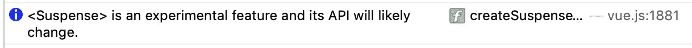

# Vue 3 新功能摘要

> 原文：<https://blog.devgenius.io/vue-3-new-features-summary-2c9a7360d56?source=collection_archive---------2----------------------->


Vue-next (Vue 3)已经出了一段时间了。它现在处于发布候选阶段，这意味着开放 API 不会有大的变化。很高兴看到 Vue 已经稳定下来，并准备好进入我们的项目。

不得不说 Vue 2 已经足够惊艳了。但是有了 Vue 3 的新特性，我们的项目很可能会升级到一个更高的水平。我猜 Vue 3 中最激动人心的功能是合成 API。尤雨溪自己提到过，复合 API 是受 React 钩子的启发。尽管这两个 API 挂钩和组合非常相似，但从代码基础来看，它们是完全不同的。我们不要讨论哪个更好或更有前途，因为我真的不认为哪个框架比另一个更好。

总之，很高兴看到 Vue 也能做 React 做的事情。让我们仔细看看新功能。

TLDR；

访问[Pitayan.com](https://pitayan.com/posts/vue-next-features/?ref=medium)阅读原文。

[](https://pitayan.com/posts/vue-next-features/?ref=medium) [## Vue 3 新特性总结- Pitayan

### Vue-next (Vue 3)已经出了一段时间了。它现在处于发布候选阶段，这意味着不会有大的…

pitayan.com](https://pitayan.com/posts/vue-next-features/?ref=medium) 

# [1。邀请](https://pitayan.com/posts/vue-next-features/#1-vite)

这是尤雨溪的另一个艺术作品，旨在取代 Vue 开发中的 [Webpack](https://webpack.js.org/) (目前仅适用于 Vue)。正如它的法语名字所暗示的那样，它被设计得很快。

# 【Vite 入门

官方回购为我们提供了一种通过 [Vite](https://github.com/vitejs/vite) 创建 Vue 3 应用的简单方法。

## [国家预防机制](https://pitayan.com/posts/vue-next-features/#npm)

```
$ npm init vite-app <project-name>
$ cd <project-name>
$ npm install
$ npm run dev
```

## [纱线](https://pitayan.com/posts/vue-next-features/#yarn)

```
$ yarn create vite-app <project-name>
$ cd <project-name>
$ yarn
$ yarn dev
```

## [启动开发服务器](https://pitayan.com/posts/vue-next-features/#start-dev-server)

这一切都发生在一眨眼的功夫。

```
❯ yarn dev
yarn run v1.22.4
$ vite
vite v1.0.0-rc.4 Dev server running at:
  > Local:    http://localhost:3000/
  > Network:  http://192.168.3.2:3000/
  > Network:  [http://10.80.67.216:3000/](http://10.80.67.216:3000/)
```

打开 [http://localhost:3000/](http://localhost:3000/)


# [vue-next-features](https://pitayan.com/posts/vue-next-features/#vue-next-features)

*   [储存库链接](https://github.com/daiyanze/vue-next-features)
*   [演示链接](https://daiyanze.com/vue-next-features/dist/)

我创建了一个小应用程序来演示 Vue 3 的新功能。如果你看一下项目的`package.json`，简单的 [vue-next-features](https://github.com/daiyanze/vue-next-features) 依赖关系会让你立刻喜欢上 [Vite](https://github.com/vitejs/vite) 。(我的意思是，谁不想从更简单的`package.json`开始呢？)

还有另外一个 Vue 3“Hello World”回购([Vue-next-web pack-preview](https://github.com/vuejs/vue-next-webpack-preview))捆绑 [Webpack](https://webpack.js.org/) 。这也是一个很好的游乐场。

[vue-next-features](https://github.com/daiyanze/vue-next-features)

```
{
  ...,
  "dependencies": {
    "vite": "^1.0.0-rc.4",
    "vue": "^3.0.0-rc.5"
  },
  "devDependencies": {
    "@vue/compiler-sfc": "^3.0.0-rc.5"
  }
}
```

[vue-next-web pack-preview](https://github.com/vuejs/vue-next-webpack-preview)

```
{
  ...,
  "dependencies": {
    "vue": "^3.0.0-beta.2"
  },
  "devDependencies": {
    "@vue/compiler-sfc": "^3.0.0-beta.2",
    "css-loader": "^3.4.2",
    "file-loader": "^6.0.0",
    "mini-css-extract-plugin": "^0.9.0",
    "url-loader": "^4.0.0",
    "vue-loader": "^16.0.0-alpha.3",
    "webpack": "^4.42.1",
    "webpack-cli": "^3.3.11",¥
    "webpack-dev-server": "^3.10.3"
  }
}
```

# [2。组合 API](https://pitayan.com/posts/vue-next-features/#2-composition-api)

作为 [Vue.js](https://vuejs.org/) 最大的变化，组合 API 将成为你下一个最常用的特性。就像 [React hooks](https://reactjs.org/docs/hooks-reference.html#) 一样，使用 Vue 组合 API 将有助于获得更多的可定制性。

下面是 Vue 3 组合 API 的列表。(其实还有更多……)

## 反应

*   `computed`T3`ref`
*   `watch` `watchEffect` `unref` `toRefs`
*   `isRef` `isProxy` `isReactive` `isReadonly`
*   `customRef` `markRaw` `shallowReactive`
*   `shallowReadonly` `shallowRef` `toRaw`

## 生命周期挂钩

*   `onBeforeMount` `onBeforeUnmount` `onBeforeUpdate`
*   `onMounted``onUpdated`
*   `onRenderTracked` `onRenderTriggered` `onUnmounted`
*   `onActivated` `onDeactivated`

访问 Vue 3 官方文档以了解更多关于这些 API 的信息。[https://v3.vuejs.org/api/composition-api.html](https://v3.vuejs.org/api/composition-api.html)

# [组件样式](https://pitayan.com/posts/vue-next-features/#component-styles)

## [在 Vue 2 中](https://pitayan.com/posts/vue-next-features/#in-vue-2)

使用配置模板定义组件内容。在 Vue 3 中，这种传统用法仍然可用。如果你喜欢这种风格，你可以继续使用它。

```
<template>
  <button @click="count++">count: {{ count }}</button>
</template><script>
const multiplier = 2export default {
  data () {
    return {
      count: 0
    }
  },
  computed: {
    result () {
      return this.count * multiplier
    }
  },
  mounted () {
    console.log(this.count)
  },
  watch: {
    count (val, oldVal) {
      console.log(val, oldVal)
    }
  }
}
</script>
```

## [在 Vue 3 中](https://pitayan.com/posts/vue-next-features/#in-vue-3)

要使用组合 API，您需要在默认导出中添加一个`setup`属性。下面的代码完全等同于上面的[代码。](https://pitayan.com/posts/vue-next-features/#in-vue-2)

```
<template>
  <button @click="count++">count: {{ count }}</button>
</template><script>
import { computed, reactive, toRefs, onMounted, watch } from 'vue'export default {
  setup () {
    const multiplier = 2 const state = reactive({
      count: 0
    }) const result = computed(() => {
      return state.count * multiplier
    }) onMounted(() => {
      console.log(state.count)
    }) watch(state.count, (val, oldVal) => {
      console.log(val, oldVal)
    }) return {
      ...toRefs(state)
    }
  }
}
</script>
```

## [继续使用新的 API](https://pitayan.com/posts/vue-next-features/#go-ahead-with-the-new-api)

有 4 个原因可以说明为什么应该使用 composition API 而不是默认的 Vue 2 配置模板:

*   为了增加源代码的可读性
*   为了避免重复或冗余的逻辑
*   把相似的逻辑组合起来
*   重用逻辑

与 Vue 2 配置风格相比，逻辑被精确地分解成更小的部分，因此您可以很容易地将相似的逻辑组合在一起。通过这种方式，它也减少了从不相关的逻辑跳转的机会。毫无疑问，这将有助于提高生产率。

# [2。高级反应性 API](https://pitayan.com/posts/vue-next-features/#2-advanced-reactivity-api)

个人认为这和其他反应性 API 没什么区别。但是它确实提供了处理边缘情况的能力，比如定制钩子和浅层修改。根据 Vue 3 官方文件，它现在是[基本反应性 API](https://v3.vuejs.org/api/basic-reactivity.html) 的一部分。

在 [Vue 组合 api](https://composition-api.vuejs.org/) 文档中(是的，有一个文档只针对组合 api)，下列 API 被列为高级反应性 API。

*   customRef:自定义挂钩
*   马克劳:不能成为一个`reactive`
*   shallowReactive:对象的第一层`reactive`
*   shallowReadonly:物体的第一层`readonly`
*   shallowRef:对象的值不是`reactive`
*   托拉:恢复一个`reactive`正常物体

你熟悉`Debounce`吗？下面是`customRef`的官方演示:

```
import { customRef } from 'vue'const useDebouncedRef = (value, delay = 200) => {
  let timeout
  return customRef((track, trigger) => {
    return {
      get() {
        track()
        return value
      },
      set(newValue) {
        clearTimeout(timeout)
        timeout = setTimeout(() => {
          value = newValue
          trigger()
        }, delay)
      },
    }
  })
}export default {
  setup () {
    return {
      text: useDebouncedRef('some text')
    }
  }
}
```

# [3。v-进入-离开/v-离开-离开](https://pitayan.com/posts/vue-next-features/#3-v-enter-from--v-leave-from)

在 Vue 2 中，`<Transition>`组件帮助处理组件`animation` / `transition`。但是组件属性`v-enter-active` `v-enter` `v-enter-to`对我来说很模糊。有时候我会搞不清楚哪种情况先发生。

现在，在 Vue 3 中，这些转换属性名称变得更加统一和直观。

*   `v-enter` = > `v-enter-from`
*   `v-leave` = > `v-leave-from`

```
<template>
  <transition name="fade">
    <div v-show="show">fade transition</div>
  </transition>
</template><script>
import { reactive, toRefs } from 'vue'
export default {
  setup () {
    const state = reactive({
      show: true
    }) setTimeout(() => {
      state.show = false
    }, 1000) setTimeout(() => {
      state.show = true
    }, 2000) return {
      ...toRefs(state)
    }
  }
}
</script><style>
.fade-enter-from,
.fade-leave-to {
  opacity: 0;
}.fade-enter-to,
.fade-leave-from {
  opacity: 1;
}.fade-enter-active,
.fade-leave-active {
  transition: opacity 2000ms;
}</style>
```

过渡顺序:

1.  `v-enter-from`(回车)
2.  `v-enter-active`
3.  `v-enter-to`
4.  `v-leave-from` (v 型假)
5.  `v-leave-active`
6.  `v-leave-to`

我相信这样就好理解多了，不是吗？

# [4。允许多个根元素](https://pitayan.com/posts/vue-next-features/#4-allow-multiple-root-element)

Vue 2 在多个根元素上抛出错误。所有元素必须嵌套在模板中的一个根元素内。

```
<!-- Error -->
<template>
  <div>pitayan</div>
  <div>blog</div>
</template><!-- One Root Element only -->
<template>
  <div>
    <div>pitayan</div>
    <div>blog</div>
  </div>
</template>
```

Vue 3 去掉了这个烦人的用法。我认为当你真的不想将你的元素嵌套在一个“容器”父元素中时，这是非常有用的。有时你所需要的也许只是将那些裸露的元素插入正确的位置。

这类似于 [React 片段](https://reactjs.org/docs/fragments.html)，有助于减轻嵌套问题。

```
<!-- Vue 3 Multiple Root Element -->
<!-- Okay -->
<template>
  <div>pitayan</div>
  <div>blog</div>
</template>
```

# [5。“过滤器”已弃用(已删除)](https://pitayan.com/posts/vue-next-features/#5-filters-is-deprecatedremoved)

我想很多人认为`filters`可能是 Vue.js 的一个很棒的特性。它确实在 Vue 的模板引擎中工作得很好。(例如，数据格式化/计算等)。

让我们看看 Vue 3 doc 是如何解释为什么`filters`被移除的:

> *虽然这看起来很方便，但它需要一个定制的语法，打破花括号内的表达式“只是 JavaScript”的假设，这既有学习成本，也有实现成本。*

我相信没有`filters`对开发没有什么不好，即使它可能会花费你额外的时间来迁移到 Vue 3。在我的项目中，`filters`的出现非常罕见，因为我可以很容易地用`method`或`computed`来替换这样的功能。因为在我看来，`method` / `computed`比`filters`可读性更高。

```
<template>
  <!-- Deprecated (removed) & Error -->
  <span>{{ count | double }}</span> <!-- If you have to use fiter, make it a function -->
  <span>{{ double(count) }}</span>
</template><script>
import { ref } from 'vue'export default {
  // Not working
  filters: {
    double (val) {
      return val * 2
    }
  },
  setup () {
    const count = ref(1)
    return {
      count,
      double: val => val * 2
    }
  }
}
</script>
```

# [6。新异步组件:暂记](https://pitayan.com/posts/vue-next-features/#6-new-async-component-suspense)

这或许是 Vue 3 唯一一个即使正式发布后也可能改变的新特性。灵感也来自[反应悬疑](https://reactjs.org/docs/concurrent-mode-suspense.html)。所以在我看来，使用场景是一样的。



你还记得以前在 Vue 2 中是如何渲染异步数据的吗？我觉得`v-if` / `v-else`应该是答案。

```
<template>
  <div>
    <div v-for="i in items" :key="i">{{ i }}</div>
    <div v-else>loading...<div>
  </div>
</template><script>
export default {
  data () {
    return {
      items: null
    }
  },
  mounted () {
    this.items = await new Promise(resolve => {
      setTimeout(() => {
        return resolve(['one', 'two'])
      }, 3000)
    })
  }
}
</script>
```

有了`Suspense`组件，不需要自己处理条件也能做到。通过设置`default`和`fallback`插槽，`Suspense`组件将自动处理异步事件。

```
<template>
  <suspense>
    <template #default>
      <div v-for="i in items" :key="i">{{ i }}</div>
    </template> <template #fallback>
      Loading...
    </template>
  </suspense>
</template><script>
export default {
  async setup () {
    const items = await new Promise(resolve => {
      setTimeout(() => {
        return resolve(['one', 'two'])
      }, 3000)
    }) return {
      items
    }
  }
}
</script>
```

# 7。在别处显示:传送

这是另一个基于 [React Portals](https://reactjs.org/docs/portals.html) 的很酷的东西。它提供了将组件插入目标 DOM 节点的能力。

我们在 Vue 2 中所做的是在`<body>`中插入一个自定义组件(当然有一个 Vue 第三方插件 [PortalVue](https://portal-vue.linusb.org/) 提供这样的功能):

```
import Vue from 'vue'const Ctor = Vue.extends({
  template: `<div>hello world</div>`
})const vm = new Ctor({ ... }).$mount()document.body.appendChild(vm.$el)
```

要在 Vue 3 中使用这样的特性，将目标组件包装在`<Teleport>`中，并在`to`属性中定义目的节点(querySelector)。

```
<template>
  <Teleport to="body">
    <div>Pitayan</div>
  </Teleport>
</template>
```

# [8。允许多个虚拟模型](https://pitayan.com/posts/vue-next-features/#8-allow-multiple-v-model)

`v-model`用于表单元素甚至自定义组件中的数据双向绑定。在 Vue 2 中，一个定制组件在标签中只能有一个`v-model`。

```
<template>
  <my-input-form v-model="input" />
</template>
```

Vue 3 取消了这个限制，允许您拥有多个`v-model`，这样您就可以为更多的输入元素分别指定绑定。

```
<template>
  <my-input-form
    v-model:first="inputFirst"
    v-model:second="inputSecond"
    />
</template>
```

# [9。全球 API](https://pitayan.com/posts/vue-next-features/#9-global-apis)

Vue 3 提供了一些新的 API 来帮助我们更好地控制组件和实例。

# [createApp](https://pitayan.com/posts/vue-next-features/#createapp)

在 Vue 2 中，`Vue`可以作为构造函数返回实例对象。在 Vue 3 中，你可以使用`createApp`函数来代替。行为其实是一样的。

```
// Vue 2
import Vue from 'vue'
import App from '@/src/App'new Vue({
  el: '#app',
  components: {
    App
  }
})// Vue 3
import { createApp } from 'vue'
import App from '@/src/App'const app = createApp(App)
```

那些像`extend``component``mixin``directive`这样的全局方法呢？

相同，但是您需要使用实例方法。

```
// Global methods
app.extend()
app.component()
app.mixin()
app.directive()
```

# [下一个滴答](https://pitayan.com/posts/vue-next-features/#nexttick)

我认为`nextTick`是一个经常使用的 API，因为许多逻辑实际上是异步的，它们需要被安排到下一个 DOM 更新周期。

在 Vue 2 中，`nextTick`是一个实例方法。

```
export default {
  ...,
  mounted () {
    this.$nextTick(() => {
      console.log('pitayan')
    })
  }
}
```

Vue 3 允许你使用`nextTick`作为一个独立的功能。

```
// nextTick function type
export declare function nextTick(fn?: () => void): Promise<void>;// An official doc Example
import { nextTick } from 'vue'export default {
  setup () {
    const message = ref('Hello, Pitayan!') const changeMessage = async newMessage => {
      message.value = newMessage
      await nextTick()
      console.log('Now DOM is updated')
    }
  }
}
```

# [其他辅助功能](https://pitayan.com/posts/vue-next-features/#other-helper-functions)

当您需要对更加抽象的场景进行额外的控制时，这些新的 API 将会非常有用。我个人认为它们可以在第三方库中频繁使用。

*   **h** :返回虚拟节点
*   createRenderer :可用于跨环境目的的自定义渲染器
*   **定义组件**:键入传入的对象
*   **defineAsyncComponent** :必要时加载异步组件
*   **resolveComponent** :解析当前实例范围内的组件
*   **resolveDynamicComponent**:解析当前实例范围内的动态组件
*   **resolveDirective** :从当前实例作用域获取一个`directive`
*   **带指令**:将`directive`应用于`VNode`

# [结论](https://pitayan.com/posts/vue-next-features/#conclusions)

我很高兴也很荣幸见证了 Vue.js 2.x => 3.x 的成长，Vue 团队总结了在 Vue 2 中原本不可能的事情，让它们在 Vue 3 中成为可能。正如我所看到的，有许多熟悉的东西来自 Vue 3 的代码库。

不难看出，Vue 3 是一个更加坚实的框架。它提供了一种新的更简单的方法来组织你的源代码，同时更小更快。在`Typescript`和他们的新特性比如组合 API 的帮助下，项目的结构会变得和以前大不相同。我认为这对前端社区是一个积极的影响。

这就是 Vue 3 的新功能。

如果你觉得这篇文章很棒。请分享到社交网络。感谢阅读。

# [参考文献](https://pitayan.com/posts/vue-next-features/#references)

*   [https://v3.vuejs.org](https://v3.vuejs.org/)
*   [https://vuejs.org/v2/](https://vuejs.org/v2/)
*   [https://composition-api.vuejs.org/](https://composition-api.vuejs.org/)
*   [https://reactjs.org/docs/](https://reactjs.org/docs/)

原本在[上的 Pitayan.com](https://pitayan.com/posts/vue-next-features/?ref=medium)

[](https://pitayan.com/posts/vue-next-features/?ref=medium) [## Vue 3 新特性总结- Pitayan

### Vue-next (Vue 3)已经出了一段时间了。它现在处于发布候选阶段，这意味着不会有大的…

pitayan.com](https://pitayan.com/posts/vue-next-features/?ref=medium)