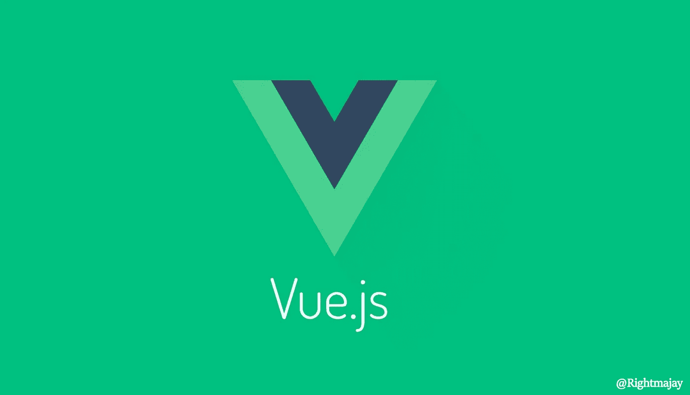
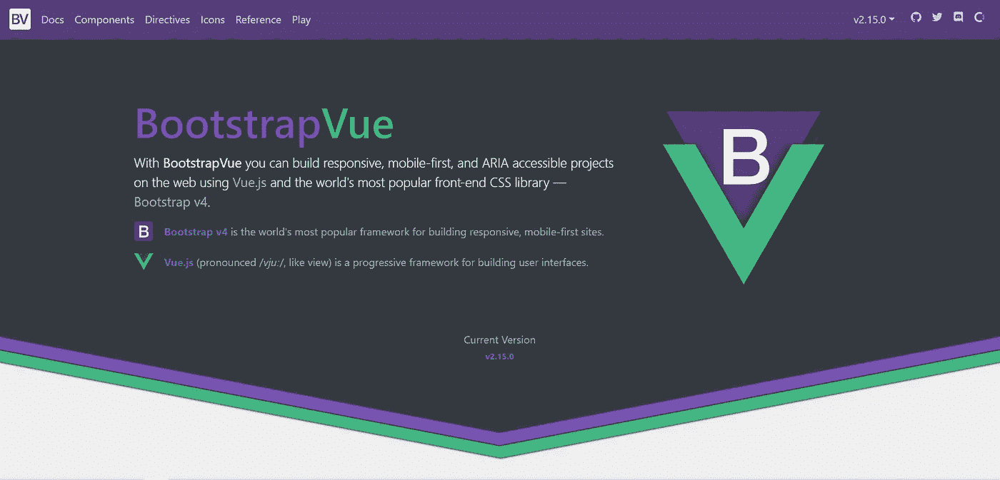
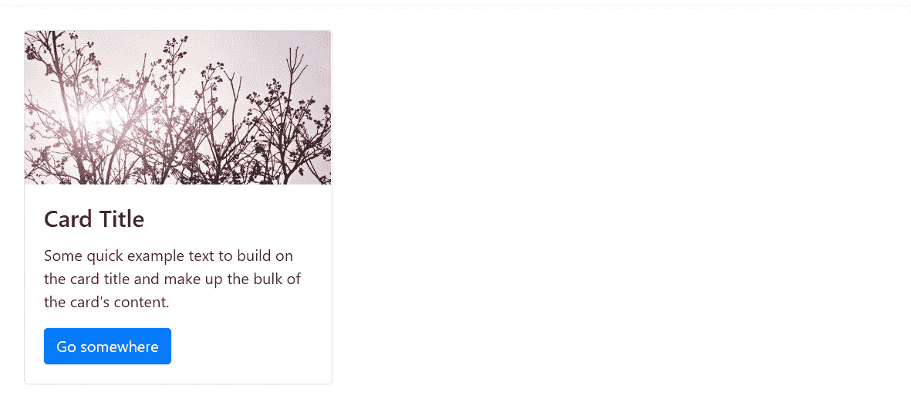
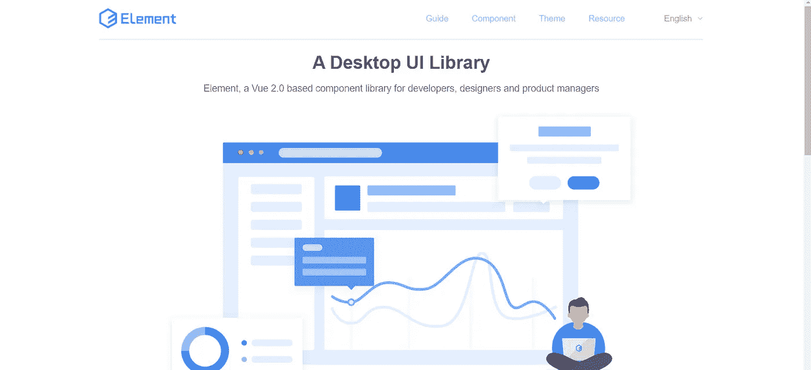
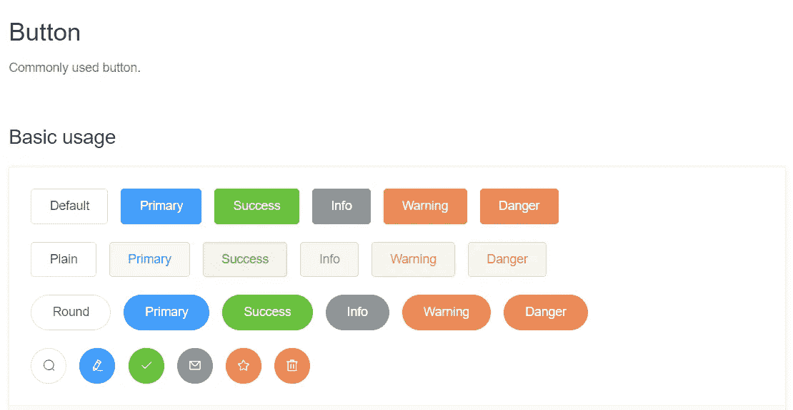
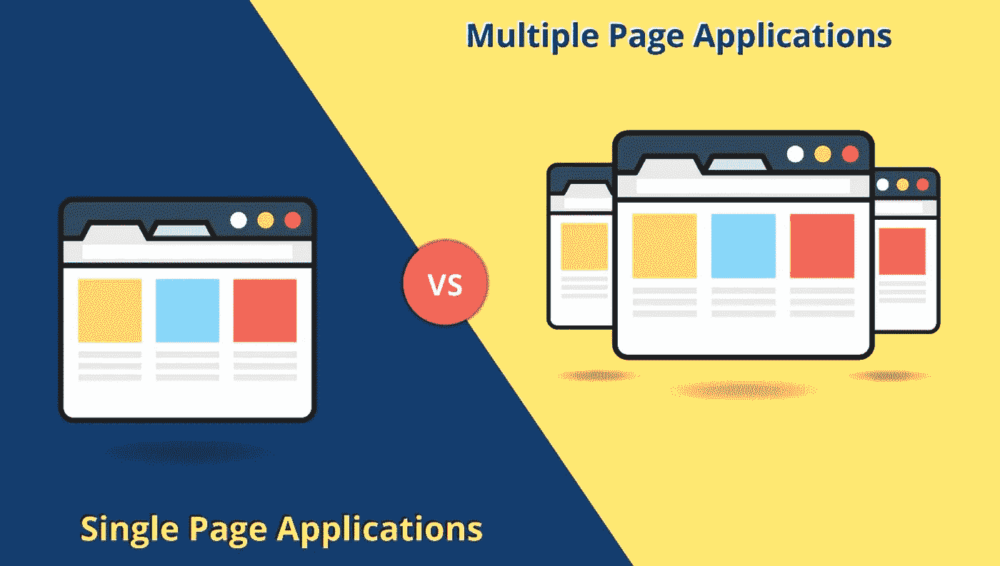

# Vue 是 Web 开发人员的神奇工具

> 原文：<https://blog.devgenius.io/vue-as-a-magical-tool-for-web-developer-d9a06ed6a811?source=collection_archive---------24----------------------->



Vue.js 是一个用于构建用户界面和单页面应用程序的开源 JavaScript 框架。它是由尤雨溪创造的。还不清楚，我要把所有的概念都弄清楚。

Vue 自带了很多工具，让你可以轻松设计一个好的网站。如果我们谈论普通的 HTML CSS，那么我们必须主要用 CSS 编写大量的样板代码。但是这里你得到了一个预制的设计，你可以直接把它添加到你的代码面板中。

这些是；

1.  自举 Vue
2.  元素 UI
3.  碳设计

> 自举 Vue



[https://bootstrap-vue.org/](https://bootstrap-vue.org/)

Bootstrap 没有 CSS 概念，你可以在一个类属性中定义所有 CSS 属性，而不是从外部添加样式或链接 CSS 属性。与 Vue 一起，它也支持框架的其余部分，是一个非常流行的设计工具。

示例:



```
<div>
  <b-card
    title="Card Title"
    img-src="https://picsum.photos/600/300/?image=25"
    img-alt="Image"
    img-top
    tag="article"
    style="max-width: 20rem;"
    class="mb-2"
  >
    <b-card-text>
      Some quick example text to build on the card title and make up the bulk of the card's content.
    </b-card-text> <b-button href="#" variant="primary">Go somewhere</b-button>
  </b-card>
</div>
```

> 元素 UI



https://element.eleme.io/?ref=madewithvuejs.com#/en-US

我非常喜欢元素 UI，因为你得到了所有的设计组件，相信我，你也喜欢用它来设计。

示例:



【https://element.eleme.io/? ref = madewithvuejs . com #/en-US/component/button

> 碳设计

Carbon 是 IBM 的开源设计系统，在这里你提供了不同的组件，通过它们你可以制作一个好看的网站。

示例:

[](https://www.carbondesignsystem.com/components/inline-loading/usage) [## 直列装载

### 内联加载组件提供用户动作正在被处理的视觉反馈。在线装载旋转器…

www.carbondesignsystem.com](https://www.carbondesignsystem.com/components/inline-loading/usage) 

*所有的设计工具也提供了对整个框架的支持，像 Angular，React，Vanilla。*

# 什么是单页应用程序？



在 SPA 中，所有必需的 HTML、JavaScript 和 CSS 代码要么由浏览器通过单个页面加载来检索，要么根据需要动态加载适当的资源并添加到页面中，通常是为了响应用户操作。尽管可以使用位置哈希或 HTML5 历史 API 来提供应用程序中独立逻辑页面的感知和可导航性，但页面不会在过程中的任何点重新加载，也不会将控制转移到另一个页面

> 而 Vue 是基于单页面应用的 web 框架。

# 数据库支持

Vue 是一个基于节点的框架，所以你可以使用所有那些支持节点模块的数据库，比如 Mongo DB


哪个数据库是我的意见？

我使用 Firebase 数据库，因为你可以通过移动到他们的库文档直接在你的代码面板中使用现成的代码。在这种情况下，你会得到很多便利，比如如果你谈论身份验证，那么你的网站上就有移动、Gmail、脸书，以非常简单的方式进行身份验证。如果你与 MongoDB 等其他数据库进行比较，你必须使用 [Vuefire](https://vuefire.vuejs.org/) 在你的 Vue 应用程序中集成 firebase 数据库。

# Vue 中的状态管理


https://vuex.vuejs.org/

状态管理是指对一个或多个用户界面控件(如文本字段、OK 按钮、单选按钮等)的状态的管理。在图形用户界面中。在这种用户界面编程技术中，一个 UI 控件的状态依赖于其他 UI 控件的状态。

Vuex 是 Vue.js 应用程序的状态管理模式+库。它充当应用程序中所有组件的集中存储，规则确保状态只能以可预测的方式变化。它还与 Vue 的官方开发工具[扩展](https://github.com/vuejs/vue-devtools)集成，以提供诸如零配置时间旅行调试和状态快照导出/导入等高级功能。

如果你是初学者，想从 Vue.js 开始，那么你必须遵循这个学习层次。

1.  Html 和 CSS 基础

[](https://www.w3schools.com/html/) [## HTML 教程

### 组织良好，易于理解的网站建设教程，有很多如何使用 HTML，CSS，JavaScript 的例子…

www.w3schools.com](https://www.w3schools.com/html/) [](https://www.w3schools.com/css/) [## CSS 教程

### 组织良好，易于理解的网站建设教程，有很多如何使用 HTML，CSS，JavaScript 的例子…

www.w3schools.com](https://www.w3schools.com/css/) 

2.Javascript(ES6)。

[](https://www.w3schools.com/js/) [## JavaScript 教程

### JavaScript 是 HTML 和 Web 的编程语言。JavaScript 很容易学。本教程将教你…

www.w3schools.com](https://www.w3schools.com/js/) 

3.vue . j

[](https://vuejs.org/v2/guide/) [## 简介— Vue.js

### vue . js——渐进式 JavaScript 框架

vuejs.org](https://vuejs.org/v2/guide/) 

4.Vue.js 中的状态管理

[](https://vuex.vuejs.org/) [## Vuex 是什么？Vuex

### Vuex 是 Vue.js 应用程序的状态管理模式+库。它作为一个集中的商店为所有的…

vuex.vuejs.org](https://vuex.vuejs.org/) 

5.Vue.js 的 Firebase 数据库

 [## 简介| Vuefire

### Vuexfire 是一个小型实用的解决方案，用于在 Firebase RTDB 或 Firebase Cloudstore 之间创建实时绑定…

vuefire.vuejs.org](https://vuefire.vuejs.org/vuexfire/) 

*你可以使用我上面讨论的所有 UI 套件，图片下面给出了链接。*

你有什么建议或意见吗？联系我们进行快速聊天的最简单方式是通过[电子邮件](http://rightmajay@gmail.com)。

你可以在 [Instagram](https://www.instagram.com/im_ajaypandey/) 、[脸书](https://www.facebook.com/Ajaypandeyofficial/)和 [LinkedIn](https://www.linkedin.com/in/ajay-pandey-a45483138/) 上进一步关注/联系我们。