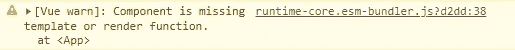

# 如何修复 Vue 中的“组件缺少模板或渲染函数”警告

> 原文：<https://blog.devgenius.io/vue-component-is-missing-template-or-render-function-53275060bcff?source=collection_archive---------6----------------------->


在本文中，我们将学习如何轻松地修复 Vue 中的“组件缺少模板或渲染功能”警告。



以下是导致此警告的一些可能原因:

1.  呈现没有模板的组件。
2.  没有将`App`组件传递给`createApp()`方法。
3.  使用`app.component()`的结果为 Vue 路由器路由设置一个组件。

在本文中，我们将逐一介绍它们。

# 1.呈现没有模板的组件

当您导入一个组件并将其添加到标记中，但该组件的文件没有`template`标记时，会出现“组件缺少模板或呈现功能”警告。要解决这个问题，可以在组件文件中添加一个带有子元素的`template`标签。

**App.vue**

```
<template>
  <div id="app">
    <post-list></post-list>
  </div>
</template><script>
import PostList from './components/PostList.vue';export default {
  components: {
    'post-list': PostList,
  },
};
</script>
```

**components/postlist . vue**

```
// ⚠️ empty file
```

会有一个警告，因为`PostList.vue`是空的并且没有`template`标签。

以下是我们删除警告的方法:

**components/postlist . vue**

```
<template>
  <div></div>
</template>
```

# 2.没有将应用程序组件传递给 createApp()方法

要修复 Vue 中的“组件缺少模板或渲染函数”警告，请确保使用`App`组件作为参数来调用`createApp()`方法。

例如，设置 Vue 应用程序的文件可能如下所示:

**main.js**

```
import { createApp } from 'vue';
import * as VueRouter from 'vue-router';
import Home from './HomePage.vue';// ⚠️ don't pass {} to createApp()!
const app = createApp({});const routes = [{ path: '/', component: Home }];const router = VueRouter.createRouter({
  history: VueRouter.createWebHashHistory(),
  routes,
});app.use(router);app.mount('#app');
```

这里会有一个警告，因为我们传递了一个空对象(`{}`)给`createApp()`，而不是一个组件对象。

在这种情况下，我们可以通过导入`App`组件并将其传递给`createApp()`来删除警告:

```
import { createApp } from 'vue';
import * as VueRouter from 'vue-router';
import Home from './HomePage.vue';// import App component
import App from './App.vue';// ✅ removed warning
const app = createApp(App);const routes = [{ path: '/', component: Home }];const router = VueRouter.createRouter({
  history: VueRouter.createWebHashHistory(),
  routes,
});app.use(router);app.mount('#app');
```

# 3.使用 app.component()的结果为 Vue 路由器路由设置组件

您可以选择用由`createApp()`返回的对象的`component()`方法创建一个组件，而不是从文件中导入一个组件。

```
import { createApp } from 'vue/dist/vue.esm-bundler';
import * as VueRouter from 'vue-router';
import App from './App.vue';const app = createApp(App);// app.component() returns the app instance, not a component
// object
const Home = app.component('HomePage', {
  template: '<div>Home</div>',
});// ⚠️ don't set "component" to the app instance!
const routes = [{ path: '/', component: Home }];const router = VueRouter.createRouter({
  history: VueRouter.createWebHashHistory(),
  routes,
});app.use(router);app.mount('#app');
```

当用定义对象(第二个参数)调用`app.component()`时，它返回应用程序实例以允许链接调用。

在这种情况下，要修复“组件缺少模板或渲染函数”警告，只使用组件名作为参数再次调用`app.component()`方法，并使用返回的组件对象为 Vue Router 定义路由。

```
import { createApp } from 'vue/dist/vue.esm-bundler';
import * as VueRouter from 'vue-router';
import App from './App.vue';const app = createApp(App);// first app.component() call defines component
app.component('HomePage', {
  template: '<div>Home</div>',
});// ✅ fix: second app.component() call returns component object
const Home = app.component('HomePage');// ✅ sets "component" to component object
const routes = [{ path: '/', component: Home }];const router = VueRouter.createRouter({
  history: VueRouter.createWebHashHistory(),
  routes,
});app.use(router);app.mount('#app');
```

*原载于*[*codingbeautydev.com*](https://cbdev.link/5270e1)

# JavaScript 做的每一件疯狂的事情

一本关于 JavaScript 微妙的警告和鲜为人知的部分的迷人指南。


[注册](https://cbdev.link/d3c4eb)，立即免费领取一份。