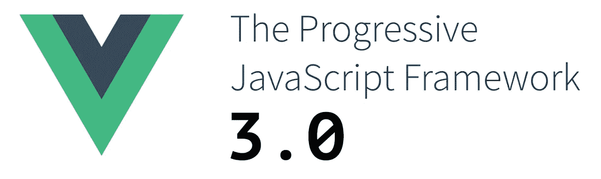
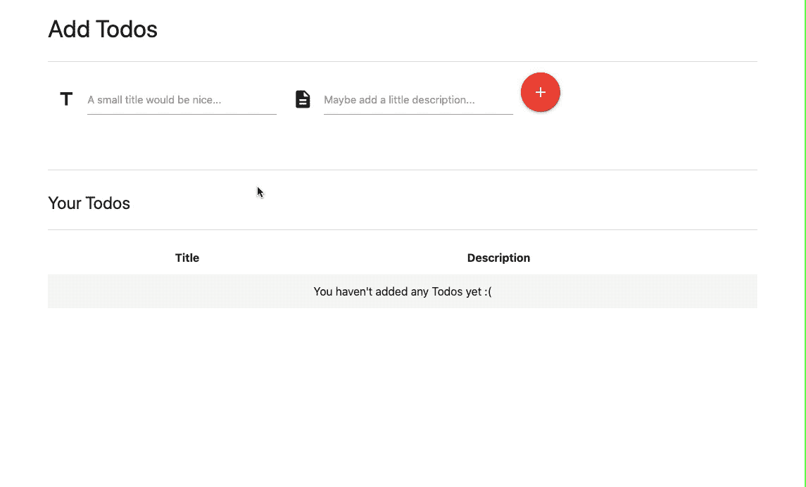

# Vue.js 3:第一步

> 原文：<https://blog.devgenius.io/vue-js-3-first-steps-91374c45937e?source=collection_archive---------0----------------------->

## 代号为“One Piece”的 Vue 3.0 是最流行的前端框架之一的最新版本。



Vue.js 3.0。图片来源: [JavaScript 周刊](https://javascriptweekly.com/issues/506)

2020 年 9 月 18 日，传来了发布 [Vue 3.0](https://v3.vuejs.org/) 的好消息。

Vue.js 团队通过其官方 Twitter 账户宣布了它的发布:

来自 Vue.js 官方推特账号的一条推文

我很兴奋地尝试了一下，并决定创建一个小的 Todo 应用程序。

在这篇文章中，我将带领大家完成使用 Vue 3.0 创建 web 应用程序的过程。

但是在我们开始之前，让我给你看一下我们将要创造的东西:



使用 Vue 3.0 创建的 Todo 应用程序。图片来源:普拉蒂克·乔德里(作者)

现在您已经对它的外观和功能有了直观的了解，让我们深入研究一下代码。

# 第一步。

## 设置您的应用程序以使用 Vue 3.0

为了简单起见，这里我们不使用流行的 JavaScript 包管理器 [npm](https://www.npmjs.com/) 。

相反，我们将使用 good ol' 

```
<script src="https://unpkg.com/vue@next"></script>
```

注意上面代码中的 ***@next*** 。它用于向 unpkg.com 表示我们想要 vue.js 的最新版本

如果省略了***@下一个*** *，*unpkg.com 会给你提供 vue 2.6.12，目前的 [LTS](https://en.wikipedia.org/wiki/Long-term_support) 版本的 Vue.js

# 第二步。

## 导入其他第三方库

我唯一用过的第三方库是 [Materialize CSS](https://materializecss.com/) 。

这不是真正必要的，但它给了应用一个漂亮的时髦外观:)

所以让我们导入它:

```
<link rel="stylesheet" href="https://cdnjs.cloudflare.com/ajax/libs/materialize/1.0.0/css/materialize.min.css"><script src="https://cdnjs.cloudflare.com/ajax/libs/materialize/1.0.0/js/materialize.min.js"></script>
```

如您所见，我们需要两个导入:

1.  物化 CSS 文件
2.  物化 JS 文件

JS 文件是显示具体化 CSS 提供的烤面包机和工具提示所必需的。

# 第三步。

## 创建 HTML 模板

我们需要一个有两个输入字段的表单:一个用于标题，一个用于描述。我们还需要一个按钮，允许用户向应用程序提交待办事项。

代码如下:

(我在这里使用 [GitHub 的 gist 特性](https://docs.github.com/en/free-pro-team@latest/github/writing-on-github/creating-gists)来嵌入代码，因为将这种长度的代码的原始文本直接添加到文章中会使其难以阅读)

Todo 应用程序的 index.html 文件片段

我们还需要一个表格来显示用户添加的所有待办事项。

我们是这样设计的:

Todo 应用程序的 index.html 文件片段

# 第四步。

## 创建 app.js

让我们创建 app.js，它将使我们的应用变得生动:

Todo 应用程序的整个 app.js 文件

一旦我们将上述所有代码粘合在一起，我们的应用程序将开始运行，正如我们在文章开头的 *gif* 中看到的那样。

如果你想看这个应用程序的现场演示(或者修改它的代码并玩它)，请到下面的 Codepen，我已经上传了所有的代码:

Todo 应用程序的代码笔。

本文到此为止。我希望你们喜欢它！