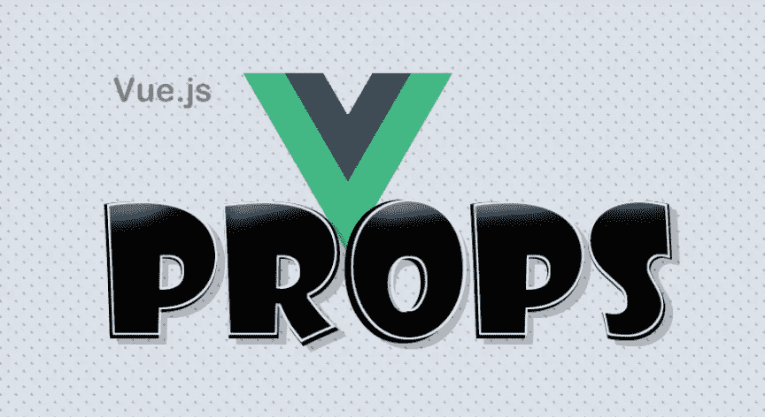
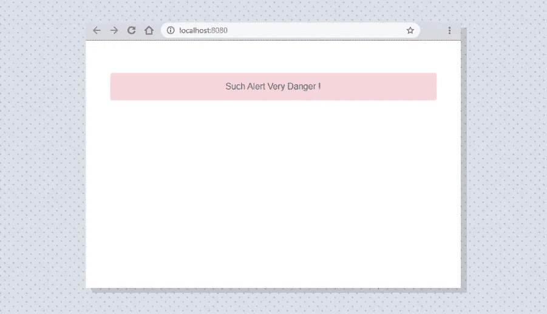
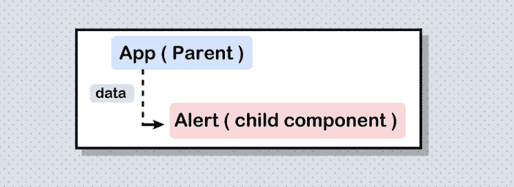
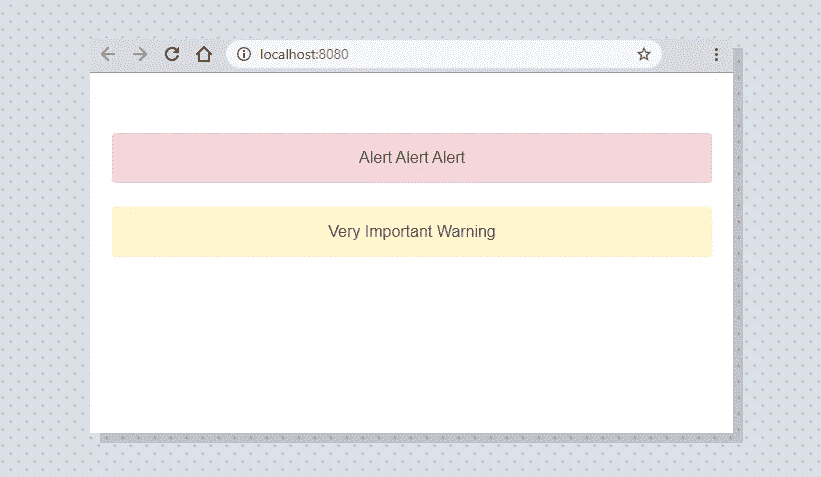
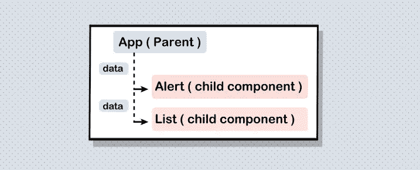
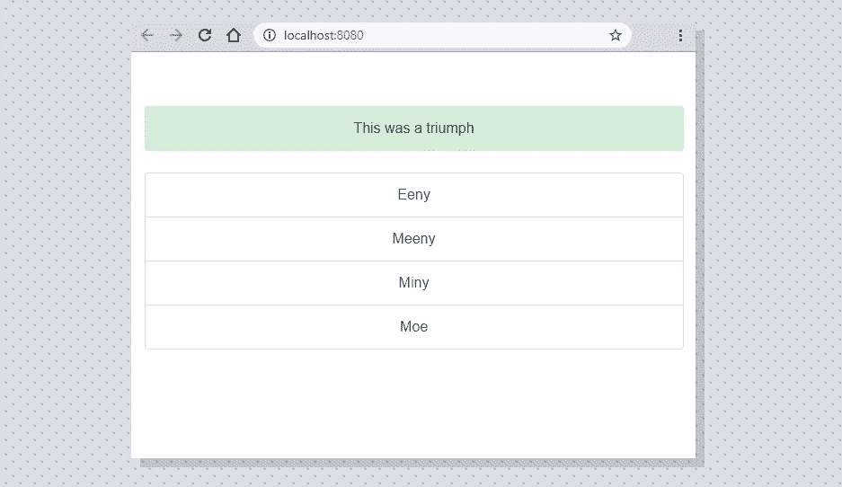
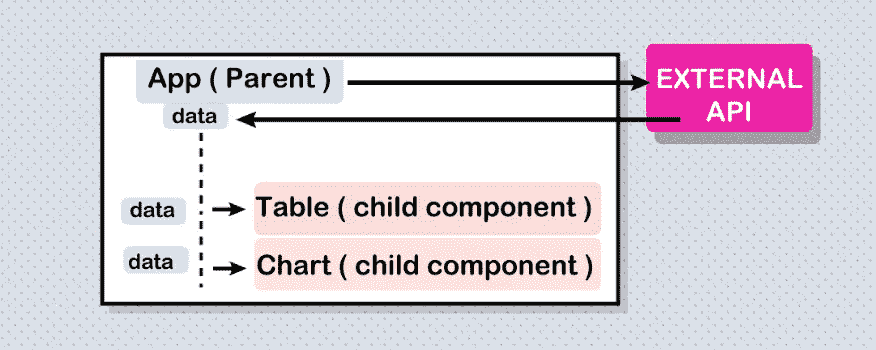
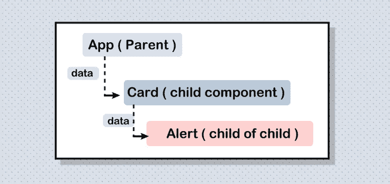
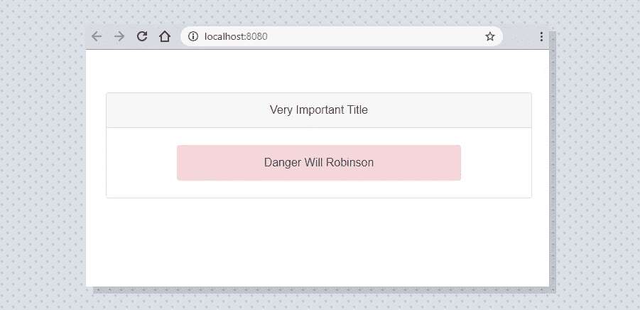

# VUE 道具

> 原文：<https://blog.devgenius.io/vue-props-b04621f4a531?source=collection_archive---------5----------------------->



## 基本、简单和多组件使用。

我最近开始使用 Vue，我发现有些困惑的事情之一是跨多个组件使用 props，我能找到的大多数例子要么太简单，要么不太符合，所以这里有第二个你可能会发现有用的，如果你是从 props 和 Vue 开始的，这也可能有助于补充你的学习…

```
**Note:** This is somehow intermediate Vue stuff, if you come from Angular,React or have some Vue experience it should be straightforward, else I suggest you read the [introductory tutorials](https://vuejs.org/v2/guide/index.html).
```

```
**Setting Up:** I am using [vue-cli](https://cli.vuejs.org) if you want to tag along, just make a new project, else just read the code bits and adapt them to your needs, here's the barebones template with no props: 
```

应编译为:



## 一个组件和道具:



这很简单，一个父应用和一个子组件(在这种情况下是一个引导警告),我们希望父应用向警告发送一些数据，下面是一种使用 props 的方法:



```
**Explanation:** It is common to have to do some processing to data, this can be done beforehand in the parent component **App.vue**'s data export :data() {
      return {
        **dangerData:** 'Alert Alert Alert',
        **warningData:** 'Very Important Warning'
      }
    }
} After that these are added to the component as props (still in App.vue):<bootsAlert v-bind="{ **dangerD: dangerData**, **warnignD: warningData** }"/> ---------- *** ----------In the child component you need to first register the props in case you need to pass them down or do some operations on them:export default {
 ** props:** ['**dangerD**','**warnignD**'],
  name: 'bootsAlert'
}And finally use them:<div class="alert alert-danger" role="alert" style="margin:auto;width:600px;">
  **{{dangerD}}**
</div><div class="alert alert-warning" role="alert" style="margin:auto;width:600px;">
{{**warnignD**}}
</div>**Note:** There are other aspects of props like reactivity, type and enumeration, if you want to know more the docs might be a good segway...
```

[](https://vuejs.org/v2/guide/components-props.html) [## Props - Vue.js

### 本页假设您已经阅读了组件基础知识。如果您不熟悉组件，请先阅读该文档。HTML…

vuejs.org](https://vuejs.org/v2/guide/components-props.html) 

## 多个组件和道具:



当然，事情从来没有这么简单，这里我们有多个组件，我们希望父组件向每个组件发送道具，如果您理解前面的示例，这应该很简单:



```
**Explanation:**Like before we start with the data exports from the parent component:data() {
      return {
        alertData: 'This was a triumph',
        **listData**: [
          { item: 'Eeny' },
          { item: 'Meeny' },
          { item: 'Miny' },
          { item: 'Moe' }
        ]
      }
    } Then we pass them along to our 2 components as props:<bootsAlert v-bind="{ alertD: alertData }"/>
<bootsList v-bind="{ **listD** : **listData** }"/>And finally we declare and read them as props in the individual components ( here the list component): export default {
  props: ['**listD**'],
  name: 'bootsList'
}And on the template:<li v-for="element in **listD**" :key="element" class="list-group-item">
          {{ element.item }}
</li>
```

## 真实世界的用法

这些示例非常适合学习和入门，但更现实的用例是从 API 或数据库读取，然后渲染和更新组件，架构如下所示:



下面是如何在父组件级别实现它的示例:

```
**Note:** we are doing our API call on the created part of the component lifecycle, in order to do further queries we would need to make new methods ([or use other strategy](https://itnext.io/anyway-heres-how-to-do-ajax-api-calls-with-vue-js-e71e57d5cf12)) and probably have the child components talk to the parent.
```

## 一直向下支撑

一旦你在父母/孩子层次上对道具感到舒适，你就可以向下扩展(这需要一些精神体操)。例如，如果你有一个嵌套组件(一个子组件的子组件),你想把数据从父组件发送到子组件的子组件，你的架构应该是:



这里有一个小的实现:



```
To recap whats going on here, we are starting from a parent App component and we are sending 2 props to a card component child, then this card component child sends props to an alert component. Note that the first child component ( bootsCard ) does not need to export data, but does need to export the prop it received from the paren (App ) component to its child (bootsAlert), experiment by removing the prop line on both to see what breaks.
```

## **下一步**

到目前为止，我们已经讨论了单向声明性通信，但这只是使 props 在编写复杂页面时有效的一半，子组件可以与它们的父组件通信(*主要与* `[**v-model**](https://vuejs.org/v2/guide/forms.html) and [**$emit**](https://vuejs.org/v2/guide/components.html#Emitting-a-Value-With-an-Event)`)，更复杂的情况可能需要[状态管理器](https://vuejs.org/v2/guide/state-management.html)或模式。

现在，我希望这能帮助你理解或扩展你在 vue.js 中的道具知识

感谢阅读！