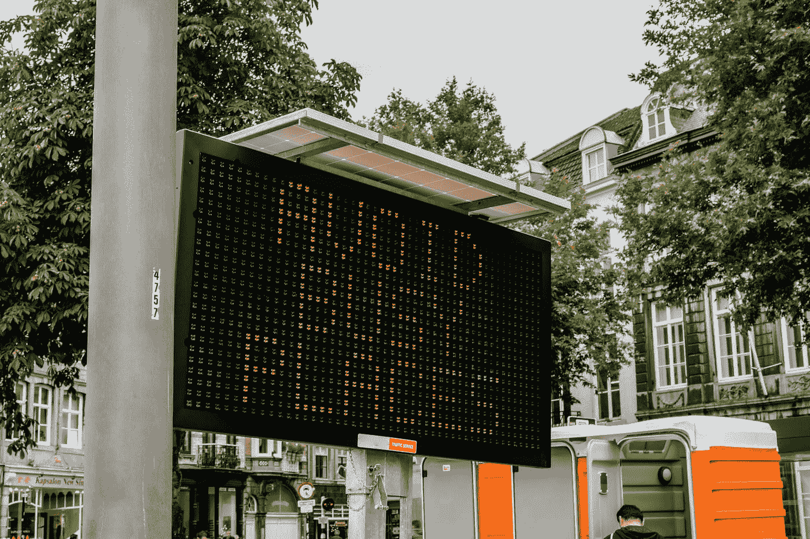

# Vuelidate —异步验证和规则数据

> 原文：<https://blog.devgenius.io/vuelidate-async-validation-and-rules-data-59dd8b8573aa?source=collection_archive---------4----------------------->



照片由[迈克·范·登博斯](https://unsplash.com/@mike_van_den_bos?utm_source=medium&utm_medium=referral)在 [Unsplash](https://unsplash.com?utm_source=medium&utm_medium=referral) 拍摄

默认情况下，Vue.js 没有任何表单验证功能。

因此，我们需要添加自己的表单验证库或自己的代码。

在本文中，我们将了解如何用 Vuelidate 验证表单。

# 异步验证

我们可以异步验证表单字段。

例如，我们可以写:

```
<template>
  <div id="app">
    <div :class="{ 'form-group--error': $v.$error }">
      <label>Name</label>
      <input v-model.trim="$v.name.$model">
    </div>
    <div v-if="!$v.name.required">Name is required.</div>
    <div v-if="!$v.name.isUnique">Name already exists.</div>
  </div>
</template>
<script>
import { required } from "vuelidate/lib/validators";export default {
  name: "App",
  data() {
    return {
      name: ""
    };
  },
  validations: {
    name: {
      required,
      isUnique(value) {
        if (value === "") return true;
        return new Promise((resolve, reject) => {
          setTimeout(() => {
            resolve(typeof value === "string" && value.length % 2 !== 0);
          }, 350 + Math.random() * 300);
        });
      }
    }
  }
};
</script>
```

我们有一个`isUnique`方法，如果`value`是一个字符串并且它的长度是偶数，那么这个方法返回一个解析为`true`的承诺。

`value`是我们输入的值。

`true`表示`value`无效。

在模板中，我们只是用`$v.name.isUnique`属性检查规则。

我们还可以使用`async`和`await`语法进行异步验证。

我们只返回函数内部的解析值:

```
validations: {
  async isUnique (value) {
    if (value === '') return true
    const response = await fetch(`/api/unique/${value}`)
    return Boolean(await response.json())
  }
}
```

# 延迟验证错误

我们可以延迟验证错误。

为此，我们可以创建一个被延迟的`touch`方法。

例如，我们可以写:

```
<template>
  <div id="app">
    <div :class="{ 'form-group--error': $v.$error }">
      <label>Name</label>
      <input v-model.trim="$v.name.$model" @input="delayTouch($v.name)">
    </div>
    <div v-if="!$v.name.required">Name is required.</div>
    <div
      class="error"
      v-if="!$v.name.minLength"
    >Name must have at least {{$v.name.$params.minLength.min}} letters.</div>
    <div
      class="error"
      v-if="!$v.name.maxLength"
    >Name must have at most {{$v.name.$params.maxLength.max}} letters.</div>
  </div>
</template>
<script>
import { required, minLength, maxLength } from "vuelidate/lib/validators";
const touchMap = new WeakMap();export default {
  name: "App",
  data() {
    return {
      name: ""
    };
  },
  validations: {
    name: {
      required,
      minLength: minLength(4),
      maxLength: maxLength(15)
    }
  },
  methods: {
    delayTouch($v) {
      $v.$reset();
      if (touchMap.has($v)) {
        clearTimeout(touchMap.get($v));
      }
      touchMap.set($v, setTimeout($v.$touch, 1000));
    }
  }
};
</script>
```

添加一个`delayTouch`方法来延迟运行表单验证代码。

我们有一个弱映射来检查和存储延迟运行`$v.$touch`的定时器。

如果定时器存在于弱映射中，我们清除超时。

这样，我们就不必在每次运行`delayTouch`时创建一个新的定时器。

`delayTouch`在发出输入事件时运行。

# 访问验证器参数

我们可以访问子字段的`$params`属性。

例如，我们可以写:

```
<template>
  <div id="app">
    <div :class="{ 'form-group--error': $v.$error }">
      <label>Name</label>
      <input v-model.trim="$v.form.name.$model">
    </div>
    <div v-if="!$v.form.name.required">Name is required.</div>
    <div
      v-if="!$v.form.name.minLength"
    >Name must have at least {{$v.form.name.$params.minLength.min}} letters.</div>
    <div
      v-if="!$v.form.name.maxLength"
    >Name must have at most {{$v.form.name.$params.maxLength.max}} letters.</div>
  </div>
</template>
<script>
import { required, minLength, maxLength } from "vuelidate/lib/validators";export default {
  name: "App",
  data() {
    return {
      form: {
        name: ""
      }
    };
  },
  validations: {
    form: {
      name: {
        required,
        minLength: minLength(4),
        maxLength: maxLength(15)
      }
    }
  }
};
</script>
```

我们有`$v.form.name.$params.minLength.min`和`$v.form.name.$params.maxLength.max`属性来访问`name`字段允许的最小和最大字符数。

# 结论

我们可以异步验证表单字段，并使用 Vuelidate 访问表单验证规则数据。