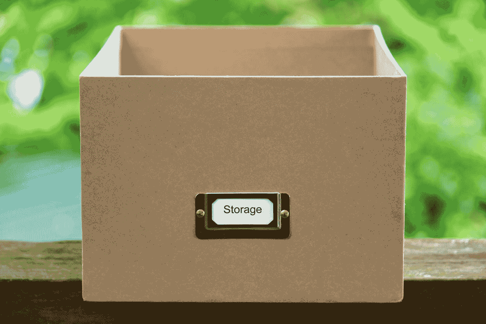

# Vuetify —自动完成和 Combobox

> 原文：<https://blog.devgenius.io/vuetify-autocomplete-and-combobox-8025787f8b1?source=collection_archive---------0----------------------->



[Unsplash](https://unsplash.com?utm_source=medium&utm_medium=referral) 上 [Lia Trevarthen](https://unsplash.com/@melodi2?utm_source=medium&utm_medium=referral) 的照片

Vuetify 是一个流行的 Vue 应用的 UI 框架。

在本文中，我们将了解如何使用 Vuetify 框架。

# 异步自动完成

`v-autocomplete`组件使用异步数据源。

例如，我们可以写:

```
<template>
  <v-container>
    <v-row>
      <v-col col="12">
        <v-toolbar dark color="teal">
          <v-toolbar-title>State</v-toolbar-title>
          <v-autocomplete
            v-model="select"
            :loading="loading"
            :items="items"
            :search-input.sync="search"
            cache-items
            class="mx-4"
            flat
            hide-no-data
            hide-details
            label="State"
            solo-inverted
          ></v-autocomplete>
          <v-btn icon>
            <v-icon>mdi-dots-vertical</v-icon>
          </v-btn>
        </v-toolbar>
      </v-col>
    </v-row>
  </v-container>
</template><script>
export default {
  name: "HelloWorld",
  data() {
    return {
      loading: false,
      items: [],
      search: null,
      select: null,
      states: [
        "Alabama",
        "Alaska",
        "American Samoa",
        "Arizona",
        "Arkansas"
      ],
    };
  },
  watch: {
    search(val) {
      val && val !== this.select && this.querySelections(val);
    },
  },
  methods: {
    querySelections(v) {
      this.loading = true;
      setTimeout(() => {
        this.items = this.states.filter((e) => {
          return (e || "").toLowerCase().indexOf((v || "").toLowerCase()) > -1;
        });
        this.loading = false;
      }, 500);
    },
  },
};
</script>
```

我们有`select`状态，这是自动完成的模型。

我们有一个观察者`search`在`search`状态改变时进行查询。

在`querySelections`方法调用`filter`对项目进行过滤。

# 组合框

`v-combobox`组件是`v-autocomplete`组件，允许我们输入所提供项目不存在的值。

创建的项目将以字符串形式返回。

例如，我们可以写:

```
<template>
  <v-container>
    <v-row>
      <v-col col="12">
        <v-combobox
          v-model="select"
          :items="items"
          label="Select activity"
          multiple
        ></v-combobox>
      </v-col>
    </v-row>
  </v-container>
</template><script>
export default {
  name: "HelloWorld",
  data() {
    return {
      select: ["Vue"],
      items: ["Programming", "Vue", "Vuetify"],
    };
  },
};
</script>
```

以添加`v-combobox`组件来创建下拉列表。

`items`用`items`数组填充项目。

我们有`multiple`道具支持多选。

`label`为下拉标签。

`v-model`设置所选项目的状态。

现在我们看到了一个下拉列表，其中有我们可以选择的项目。

此外，我们还可以使用自己的选择来填充`data`插槽。

例如，我们可以写:

```
<template>
  <v-container>
    <v-row>
      <v-col col="12">
        <v-combobox v-model="select" :items="items" label="Select activity" multiple chips>
          <template v-slot:selection="data">
            <v-chip
              :key="JSON.stringify(data.item)"
              v-bind="data.attrs"
              :input-value="data.selected"
              :disabled="data.disabled"
              @click:close="data.parent.selectItem(data.item)"
            >
              <v-avatar
                class="accent white--text"
                left
                v-text="data.item.slice(0, 1).toUpperCase()"
              ></v-avatar>
              {{ data.item }}
            </v-chip>
          </template>
        </v-combobox>
      </v-col>
    </v-row>
  </v-container>
</template><script>
export default {
  name: "HelloWorld",
  data() {
    return {
      select: ["Vue"],
      items: ["Programming", "Vue", "Vuetify"],
    };
  },
};
</script>
```

我们已经用`v-chip`组件填充了`selection`插槽。

# 稠密的

我们可以使用`dense`道具减少组合框高度和列表项的最大高度:

```
<template>
  <v-container>
    <v-row>
      <v-col col="12">
        <v-combobox v-model="select" :items="items" label="Select activity" multiple dense></v-combobox>
      </v-col>
    </v-row>
  </v-container>
</template><script>
export default {
  name: "HelloWorld",
  data() {
    return {
      select: ["Vue"],
      items: ["Programming", "Vue", "Vuetify"],
    };
  },
};
</script>
```


[安德鲁·曼塔罗](https://unsplash.com/@andymant?utm_source=medium&utm_medium=referral)在 [Unsplash](https://unsplash.com?utm_source=medium&utm_medium=referral) 上的照片

# 结论

我们可以通过自动完成获得异步数据。

此外，我们可以添加一个组合框来添加一个下拉菜单，我们可以在其中添加项目。