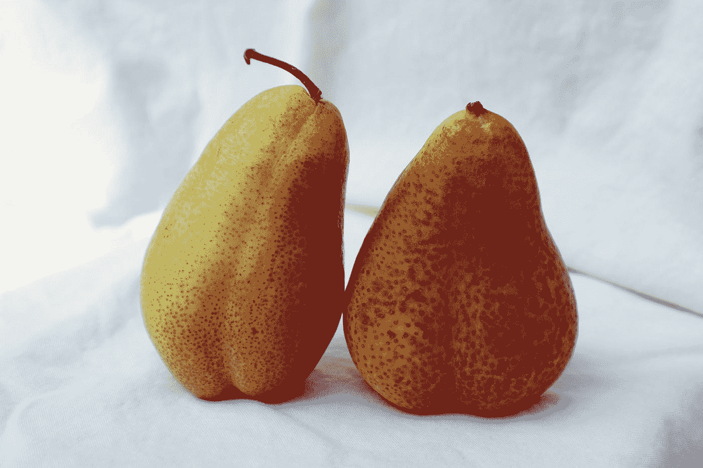

# Vuetify —底板

> 原文：<https://blog.devgenius.io/vuetify-bottom-sheet-8e153108240f?source=collection_archive---------3----------------------->


照片由 [bantersnaps](https://unsplash.com/@bantersnaps?utm_source=medium&utm_medium=referral) 在 [Unsplash](https://unsplash.com?utm_source=medium&utm_medium=referral) 上拍摄

Vuetify 是一个流行的 Vue 应用程序 UI 框架。

在本文中，我们将了解如何使用 Vuetify 框架。

# 底部导航栏滚动阈值

我们可以根据阈值设置`v-bottom-navigation`的`scroll-threshold`来显示导航条。

例如，我们可以写:

```
<template>
  <v-container>
    <v-row class="text-center">
      <v-col col="12">
        <v-card class="overflow-hidden mx-auto" height="200" max-width="500">
          <v-bottom-navigation
            scroll-target="#scroll-area"
            hide-on-scroll
            absolute
            horizontal
            scroll-threshold="500"
          >
            <v-btn text color="deep-purple accent-4">
              <span>History</span>
              <v-icon>mdi-history</v-icon>
            </v-btn> <v-btn text color="deep-purple accent-4">
              <span>Favorites</span>
              <v-icon>mdi-heart</v-icon>
            </v-btn> <v-btn text color="deep-purple accent-4">
              <span>Map</span>
              <v-icon>mdi-map-marker</v-icon>
            </v-btn>
          </v-bottom-navigation> <v-sheet id="scroll-area" class="overflow-y-auto" max-height="600">
            <v-container style="height: 1500px;"></v-container>
          </v-sheet>
        </v-card>
      </v-col>
    </v-row>
  </v-container>
</template><script>
export default {
  name: "HelloWorld",
  data: () => ({
    activeBtn: undefined,
    showNav: false,
  }),
};
</script>
```

我们添加了`scroll-threshold`属性来设置向下滚动的像素数，直到导航条显示出来。

# 底部板材

底层是内容的另一个容器。

它显示在这一页的底部。

我们可以用`v-bottom-sheet`组件添加一个:

```
<template>
  <v-container>
    <v-row class="text-center">
      <v-col col="12">
        <v-card class="overflow-hidden mx-auto" height="200" max-width="500">
          <v-bottom-sheet v-model="sheet" persistent>
            <template v-slot:activator="{ on, attrs }">
              <v-btn color="green" dark v-bind="attrs" v-on="on">Open Persistent</v-btn>
            </template>
            <v-sheet class="text-center" height="200px">
              <v-btn class="mt-6" text color="error" @click="sheet = !sheet">close</v-btn>
              <div class="py-3">Lorem ipsum</div>
            </v-sheet>
          </v-bottom-sheet>
        </v-card>
      </v-col>
    </v-row>
  </v-container>
</template><script>
export default {
  name: "HelloWorld",
  data: () => ({
    sheet: false,
  }),
};
</script>
```

我们添加了`v-bottom-sheet`组件，以便在我们单击打开持久按钮时显示工作表内容。

打开持久按钮应该在`activator`槽中，以便我们切换底部的板材。

`v-model`设置底部板材的打开状态。

到了`true`就开了。

# v 型控制

我们可以使用`v-model`来控制底部板材。

例如，我们可以写:

```
<template>
  <v-container>
    <v-row class="text-center">
      <v-col col="12">
        <div class="text-center">
          <v-btn color="blue" dark @click="sheet = !sheet">Open v-model</v-btn>
          <v-bottom-sheet v-model="sheet">
            <v-sheet class="text-center" height="200px">
              <v-btn class="mt-6" text color="red" @click="sheet = !sheet">close</v-btn>
              <div class="py-3">Lorem ipsum</div>
            </v-sheet>
          </v-bottom-sheet>
        </div>
      </v-col>
    </v-row>
  </v-container>
</template><script>
export default {
  name: "HelloWorld",
  data: () => ({
    sheet: false,
  }),
};
</script>
```

我们有打开 v-model 按钮来切换底部表。



丽贝卡·马修斯在 [Unsplash](https://unsplash.com?utm_source=medium&utm_medium=referral) 上拍摄的照片

# 结论

我们可以添加一个底部表来显示页面底部的内容。

它可以被切换。