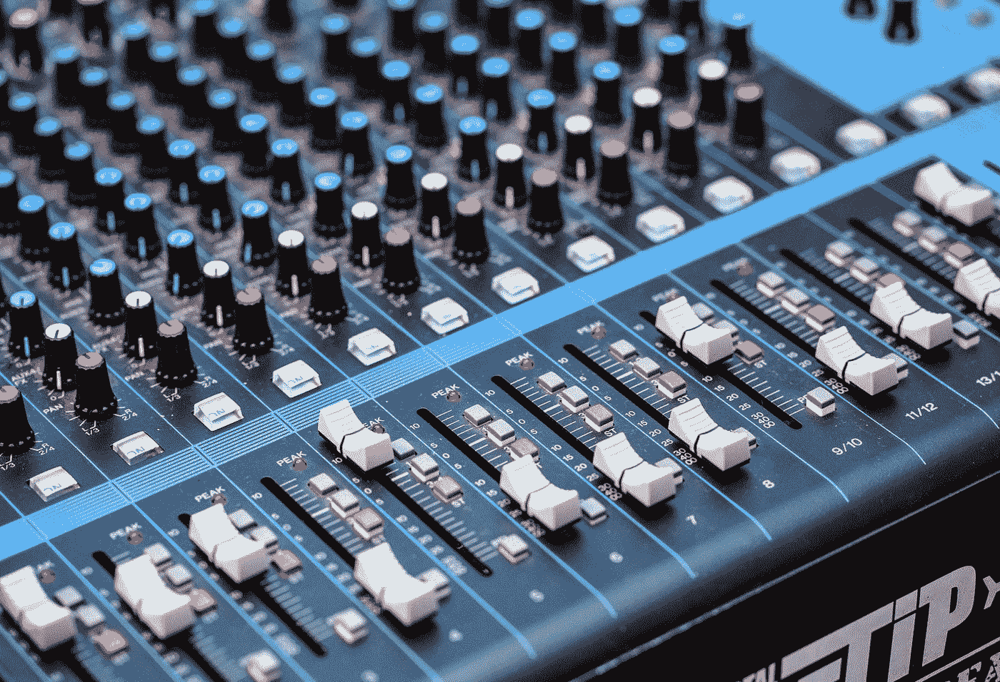
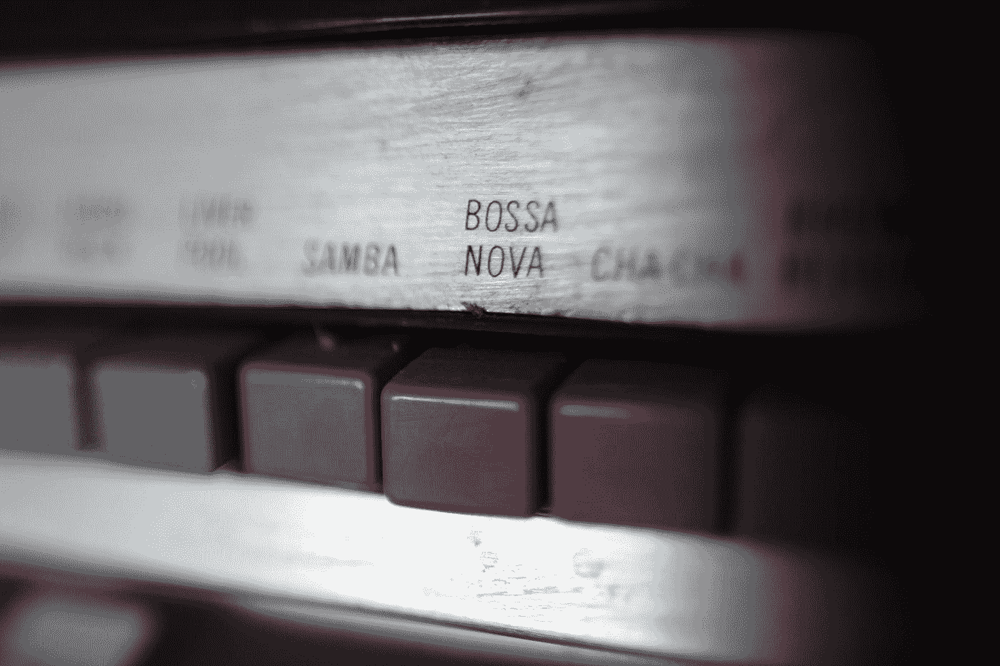

# 虚拟化—按钮

> 原文：<https://blog.devgenius.io/vuetify-buttons-db54f051cce2?source=collection_archive---------2----------------------->



照片由 [Yomex Owo](https://unsplash.com/@yomex4life?utm_source=medium&utm_medium=referral) 在 [Unsplash](https://unsplash.com?utm_source=medium&utm_medium=referral) 上拍摄

Vuetify 是一个流行的 Vue 应用程序 UI 框架。

在本文中，我们将了解如何使用 Vuetify 框架。

# 小跟班

我们可以用`v-btn`组件添加按钮。

例如，我们可以写:

```
<template>
  <v-container>
    <v-row class="text-center">
      <v-col col="12">
        <div class="my-2">
          <v-btn text small color="primary">Primary</v-btn>
        </div>
      </v-col>
    </v-row>
  </v-container>
</template><script>
export default {
  name: "HelloWorld",
  data: () => ({}),
};
</script>
```

添加按钮。

`small`道具让它变小了。

并且`color`道具会改变颜色。

`text`道具去除凸起样式。

# 凸起按钮

凸起的按钮是默认样式。

例如，我们可以写:

```
<template>
  <v-container>
    <v-row class="text-center">
      <v-col col="12">
        <div class="my-2">
          <v-btn small color="primary">Primary</v-btn>
        </div>
      </v-col>
    </v-row>
  </v-container>
</template><script>
export default {
  name: "HelloWorld",
  data: () => ({}),
};
</script>
```

添加凸起的按钮。

凸起的按钮有阴影。

# 按下按钮

`depressed`道具让我们制作一个按下的按钮。

按下的按钮没有阴影。

例如，我们可以写:

```
<template>
  <v-container>
    <v-row class="text-center">
      <v-col col="12">
        <div class="my-2">
          <v-btn depressed color="primary">Primary</v-btn>
        </div>
      </v-col>
    </v-row>
  </v-container>
</template><script>
export default {
  name: "HelloWorld",
  data: () => ({}),
};
</script>
```

创建一个按下的按钮。

# 按钮下拉变体

Vuetify 让我们添加一个下拉按钮。

为此，我们写道:

```
<template>
  <v-container>
    <v-row class="text-center">
      <v-col col="12">
        <div id="dropdown">
          <v-overflow-btn class="my-2" :items="fruits" label="Choose Fruit" target="#dropdown"></v-overflow-btn>
        </div>
      </v-col>
    </v-row>
  </v-container>
</template><script>
export default {
  name: "HelloWorld",
  data: () => ({
    fruits: ["apple", "orange", "pear"],
  }),
};
</script>
```

我们有`items` prop，它接受一个包含选项的字符串数组。

`label`有显示的标签。

目标是容器的选择器。

我们还可以添加`segmented`道具来制作一个分段的下拉按钮。

并且`editable`道具使下拉菜单可编辑。

# 图标按钮

我们可以用`v-icon`组件添加一个`icon`道具来添加一个图标按钮。

例如，我们可以写:

```
<template>
  <v-container>
    <v-row class="text-center">
      <v-col col="12">
        <v-btn icon color="pink">
          <v-icon>mdi-heart</v-icon>
        </v-btn>
      </v-col>
    </v-row>
  </v-container>
</template><script>
export default {
  name: "HelloWorld",
  data: () => ({}),
};
</script>
```

我们还将`color`设置为我们想要的颜色。

`disabled`支柱将禁用按钮。

# 浮动按钮

我们还可以用`fab`道具添加一个浮动按钮。

例如，我们可以写:

```
<template>
  <v-container>
    <v-row class="text-center">
      <v-col col="12">
        <v-btn class="mx-2" fab dark large color="purple">
          <v-icon dark>mdi-android</v-icon>
        </v-btn>
      </v-col>
    </v-row>
  </v-container>
</template><script>
export default {
  name: "HelloWorld",
  data: () => ({}),
};
</script>
```

我们添加`fab`和`large`道具，使按钮成为浮动按钮。



照片由[皮尔斯·奥哈洛伦](https://unsplash.com/@pearseoh?utm_source=medium&utm_medium=referral)在 [Unsplash](https://unsplash.com?utm_source=medium&utm_medium=referral) 上拍摄

# 结论

我们可以用`v-btn`组件添加一个按钮。