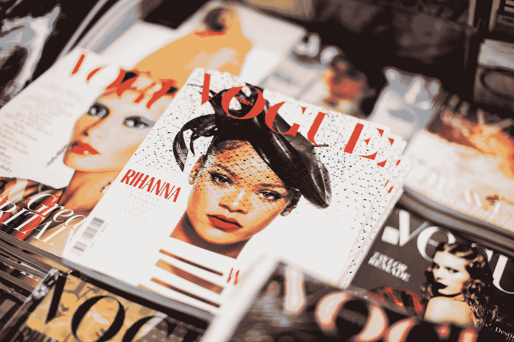
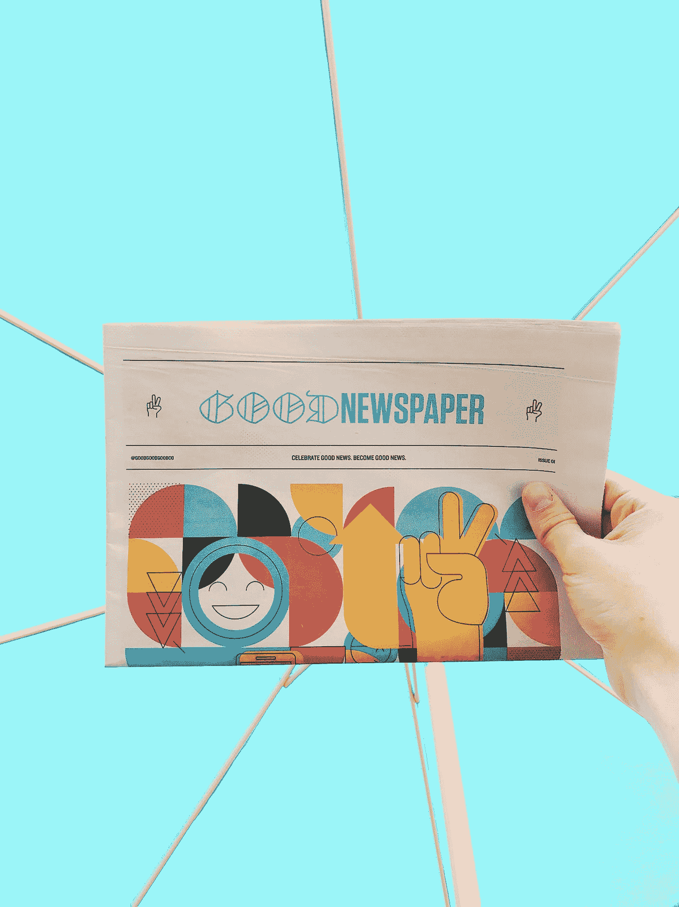

# 虚拟化—卡媒体

> 原文：<https://blog.devgenius.io/vuetify-card-media-7d59500e65eb?source=collection_archive---------3----------------------->



照片由 [Charisse Kenion](https://unsplash.com/@charissek?utm_source=medium&utm_medium=referral) 在 [Unsplash](https://unsplash.com?utm_source=medium&utm_medium=referral) 上拍摄

Vuetify 是一个流行的 Vue 应用程序 UI 框架。

在本文中，我们将了解如何使用 Vuetify 框架。

# 带文本的卡片媒体

我们可以添加一张有图片和文字的卡片。

例如，我们可以写:

```
<template>
  <v-container>
    <v-row>
      <v-col col="12">
        <v-card class="mx-auto" max-width="400">
          <v-img
            class="white--text align-end"
            height="200px"
            src="https://cdn.vuetifyjs.com/images/cards/docks.jpg"
          >
            <v-card-title>Lorem ipsum</v-card-title>
          </v-img> <v-card-subtitle class="pb-0">Lorem ipsum</v-card-subtitle> <v-card-text class="text--primary">
            <div>Lorem ipsum</div>
            <div>Lorem ipsum</div>
          </v-card-text> <v-card-actions>
            <v-btn color="orange" text>Lorem ipsum</v-btn>
            <v-btn color="orange" text>Lorem ipsum</v-btn>
          </v-card-actions>
        </v-card>
      </v-col>
    </v-row>
  </v-container>
</template><script>
export default {
  name: "HelloWorld",
  data: () => ({}),
};
</script>
```

我们有一个`v-card`组件，里面有一个`v-img`。

这样，我们在顶部显示图像。

`v-card-title`有标题文字。

`v-card-subtitle`有字幕文字。

我们添加了`v-card-text`来添加正文。

`v-card-actions`添加动作。

`v-btn`底部有按钮。

# 网格

我们可以在卡片上添加一个网格。

例如，我们可以写:

```
<template>
  <v-container>
    <v-row>
      <v-col col="12">
        <v-card class="mx-auto" max-width="500">
          <v-system-bar color="indigo darken-2" dark>
            <v-spacer></v-spacer>
            <v-icon>mdi-window-minimize</v-icon>
            <v-icon>mdi-window-maximize</v-icon>
            <v-icon>mdi-close</v-icon>
          </v-system-bar> <v-toolbar color="indigo" dark>
            <v-app-bar-nav-icon></v-app-bar-nav-icon>
            <v-toolbar-title>Discover</v-toolbar-title>
            <v-spacer></v-spacer>
            <v-btn icon>
              <v-icon>mdi-magnify</v-icon>
            </v-btn>
          </v-toolbar> <v-container fluid>
            <v-row dense>
              <v-col v-for="card in cards" :key="card.title" :cols="card.flex">
                <v-card>
                  <v-img
                    :src="card.src"
                    class="white--text align-end"
                    gradient="to bottom, rgba(0,0,0,.1), rgba(0,0,0,.5)"
                    height="200px"
                  >
                    <v-card-title v-text="card.title"></v-card-title>
                  </v-img> <v-card-actions>
                    <v-spacer></v-spacer>
                    <v-btn icon>
                      <v-icon>mdi-heart</v-icon>
                    </v-btn>
                    <v-btn icon>
                      <v-icon>mdi-bookmark</v-icon>
                    </v-btn>
                    <v-btn icon>
                      <v-icon>mdi-share-variant</v-icon>
                    </v-btn>
                  </v-card-actions>
                </v-card>
              </v-col>
            </v-row>
          </v-container>
        </v-card>
      </v-col>
    </v-row>
  </v-container>
</template><script>
export default {
  name: "HelloWorld",
  data: () => ({
    cards: [
      {
        title: "house",
        src: "https://cdn.vuetifyjs.com/images/cards/house.jpg",
        flex: 12,
      },
      {
        title: "road",
        src: "https://cdn.vuetifyjs.com/images/cards/road.jpg",
        flex: 6,
      },
      {
        title: "plane",
        src: "https://cdn.vuetifyjs.com/images/cards/plane.jpg",
        flex: 6,
      },
    ],
  }),
};
</script>
```

我们有`v-container`组件，它有`v-row`和`v-col`组件来创建布局。

根据`cards`数组创建布局。

我们还设置了类和渐变来设计盒子的样式。

此外，我们添加了`v-card-actions`组件来显示底部的按钮。



照片由[好的好的好的](https://unsplash.com/@goodgoodgood?utm_source=medium&utm_medium=referral)在 [Unsplash](https://unsplash.com?utm_source=medium&utm_medium=referral) 上拍摄

# 结论

我们可以在卡片上添加媒体。

此外，我们可以在需要的位置添加文本和按钮。