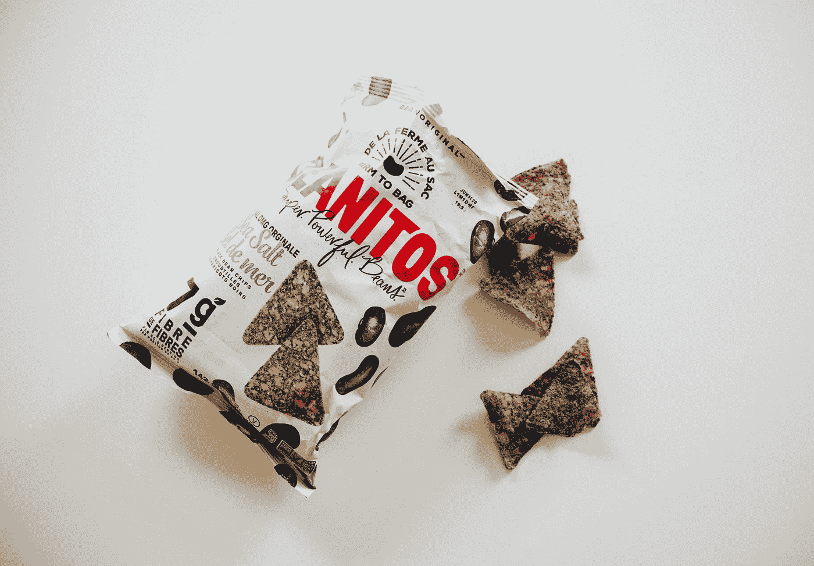
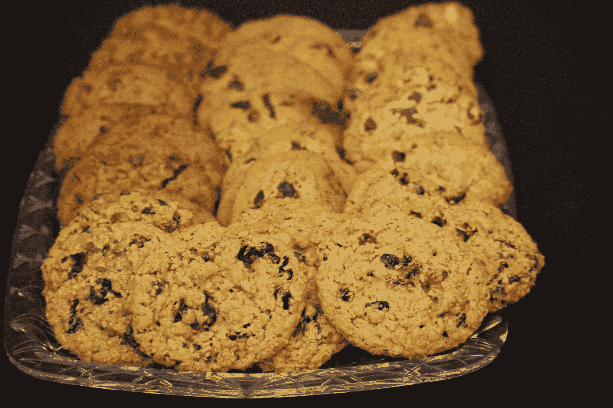

# 油炸—薯片

> 原文：<https://blog.devgenius.io/vuetify-chips-f31695ce601b?source=collection_archive---------11----------------------->



照片由 [Charles Deluvio](https://unsplash.com/@charlesdeluvio?utm_source=medium&utm_medium=referral) 在 [Unsplash](https://unsplash.com?utm_source=medium&utm_medium=referral) 上拍摄

Vuetify 是一个流行的 Vue 应用程序 UI 框架。

在本文中，我们将了解如何使用 Vuetify 框架。

# 炸薯条

我们可以使用`v-chip`组件添加一个芯片。

它传达了一小段信息。

`close`道具让芯片变得互动。

要添加一个，我们可以写:

```
<template>
  <v-container>
    <v-row>
      <v-col col="12">
        <v-chip class="ma-2" color="primary">Primary</v-chip>
      </v-col>
    </v-row>
  </v-container>
</template><script>
export default {
  name: "HelloWorld",
  data: () => ({}),
};
</script>
```

我们添加了`v-chip`组件和`color`道具来改变颜色。

# 图标

我们可以在芯片里添加一个图标。

例如，我们可以写:

```
<template>
  <v-container>
    <v-row>
      <v-col col="12">
        <v-chip class="ma-2" color="indigo" text-color="white">
          <v-avatar left>
            <v-icon>mdi-account-circle</v-icon>
          </v-avatar>James
        </v-chip>
      </v-col>
    </v-row>
  </v-container>
</template><script>
export default {
  name: "HelloWorld",
  data: () => ({}),
};
</script>
```

我们添加一个`v-avatar`组件，里面有一个`v-icon`。

然后我们会看到文本左侧的图标。

# 概述

`outlined`道具会让芯片显示出轮廓。

例如，我们可以写:

```
<template>
  <v-container>
    <v-row>
      <v-col col="12">
        <v-chip class="ma-2" color="success" outlined>
          <v-icon left>mdi-server-plus</v-icon>Status
        </v-chip>
      </v-col>
    </v-row>
  </v-container>
</template><script>
export default {
  name: "HelloWorld",
  data: () => ({}),
};
</script>
```

现在我们将在芯片上看到一个带边框的白色背景。

# 标签

我们可以使芯片的边界半径不那么圆来制作标签。

`label`道具会调整边框半径，使其不那么圆:

```
<template>
  <v-container>
    <v-row>
      <v-col col="12">
        <v-chip class="ma-2" color="pink" label text-color="white">
          <v-icon left>mdi-label</v-icon>Tags
        </v-chip>
      </v-col>
    </v-row>
  </v-container>
</template><script>
export default {
  name: "HelloWorld",
  data: () => ({}),
};
</script>
```

# 大小

我们可以通过`v-chip`组件获得各种尺寸。

例如，我们可以写:

```
<template>
  <v-container>
    <v-row>
      <v-col col="12">
        <v-chip class="ma-2" x-small>x-small</v-chip>
        <v-chip class="ma-2" small>small</v-chip>
        <v-chip class="ma-2">Default</v-chip>
        <v-chip class="ma-2" large>large</v-chip>
        <v-chip class="ma-2" x-large>x-large</v-chip>
      </v-col>
    </v-row>
  </v-container>
</template><script>
export default {
  name: "HelloWorld",
  data: () => ({}),
};
</script>
```

我们有`x-small`、`small`、`large`和`x-large`道具来改变筹码大小。

# 过滤器

`filter`道具让我们显示一个额外的图标，如果它是活动的。

例如，我们可以写:

```
<template>
  <v-container>
    <v-row>
      <v-col col="12">
        <v-chip class="ma-2" :input-value="active" filter filter-icon="mdi-minus">chip</v-chip>
        <v-switch v-model="active" label="Active"></v-switch>
      </v-col>
    </v-row>
  </v-container>
</template><script>
export default {
  name: "HelloWorld",
  data: () => ({
    active: false,
  }),
};
</script>
```

我们有带`input-value`支柱的`v-chip`组件。

当它是`true`时，我们显示一个带有`filter`道具的额外图标。

`filter-icon`让我们设置与`active`一起显示的图标是`true`。



照片由[丹尼斯·莱昂](https://unsplash.com/@denisseleon?utm_source=medium&utm_medium=referral)在 [Unsplash](https://unsplash.com?utm_source=medium&utm_medium=referral) 上拍摄

# 结论

我们可以添加芯片来显示少量信息。

图标可以显示和切换。