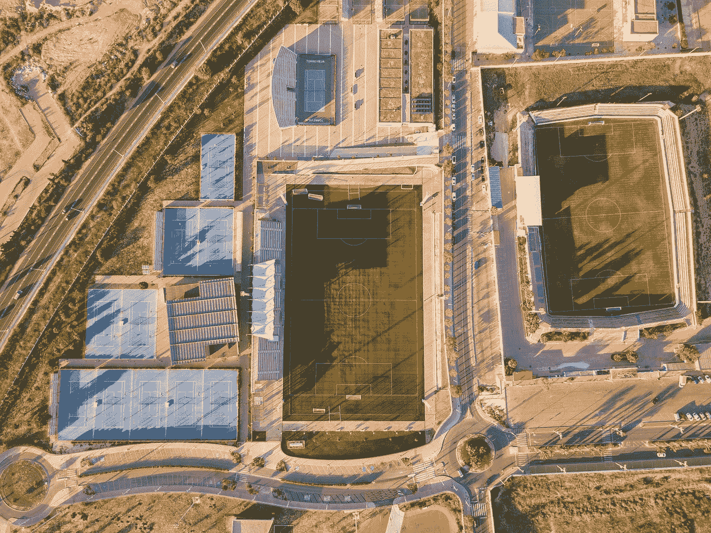

# 复杂抽屉

> 原文：<https://blog.devgenius.io/vuetify-complex-drawers-ca53ed1631ad?source=collection_archive---------0----------------------->



照片由[威利安·贾斯登·德·瓦斯康塞洛斯](https://unsplash.com/@willianjusten?utm_source=medium&utm_medium=referral)在 [Unsplash](https://unsplash.com?utm_source=medium&utm_medium=referral) 上拍摄

Vuetify 是一个流行的 Vue 应用程序 UI 框架。

在本文中，我们将了解如何使用 Vuetify 框架。

# 悬停时展开

我们可以做一个导航抽屉，然后在悬停时展开。

例如，我们可以写:

```
<template>
  <v-row>
    <v-col cols="12">
      <div class="ma-12 pa-12">
        <template>
          <v-card>
            <v-navigation-drawer permanent expand-on-hover>
              <v-list>
                <v-list-item class="px-2">
                  <v-list-item-avatar>
                    <v-img src="https://randomuser.me/api/portraits/women/85.jpg"></v-img>
                  </v-list-item-avatar>
                </v-list-item> <v-list-item link>
                  <v-list-item-content>
                    <v-list-item-title class="title">Jane Smith</v-list-item-title>
                    <v-list-item-subtitle>jane@example.com</v-list-item-subtitle>
                  </v-list-item-content>
                </v-list-item>
              </v-list> <v-divider></v-divider> <v-list nav dense>
                <v-list-item link>
                  <v-list-item-icon>
                    <v-icon>mdi-folder</v-icon>
                  </v-list-item-icon>
                  <v-list-item-title>My Files</v-list-item-title>
                </v-list-item>
                <v-list-item link>
                  <v-list-item-icon>
                    <v-icon>mdi-account-multiple</v-icon>
                  </v-list-item-icon>
                  <v-list-item-title>Shared with me</v-list-item-title>
                </v-list-item>
                <v-list-item link>
                  <v-list-item-icon>
                    <v-icon>mdi-star</v-icon>
                  </v-list-item-icon>
                  <v-list-item-title>Starred</v-list-item-title>
                </v-list-item>
              </v-list>
            </v-navigation-drawer>
          </v-card>
        </template>
      </div>
    </v-col>
  </v-row>
</template>
<script>
export default {
  name: "HelloWorld",
  data: () => ({
    drawer: null,
  }),
};
</script>
```

我们添加了`v-navigation-drawer`和`expand-on-hover`道具，让它在悬停时展开。

这个`permanent`道具让它一直展现出来。

`v-list-item`组件有菜单项。

# 导航抽屉背景

我们可以在抽屉上应用自定义背景。

我们需要在`img`槽中自定义一个`v-img`属性。

例如，我们可以写:

```
<template>
  <v-row>
    <v-col cols="12">
      <v-card class="mx-auto" height="300" width="300">
        <v-navigation-drawer
          absolute
          dark
          src="https://cdn.vuetifyjs.com/images/backgrounds/bg-2.jpg"
          width="100%"
          permanent
        >
          <v-list>
            <v-list-item v-for="([icon, text], i) in items" :key="i" link>
              <v-list-item-icon>
                <v-icon>{{ icon }}</v-icon>
              </v-list-item-icon> <v-list-item-content>
                <v-list-item-title>{{ text }}</v-list-item-title>
              </v-list-item-content>
            </v-list-item>
          </v-list>
        </v-navigation-drawer>
      </v-card>
    </v-col>
  </v-row>
</template>
<script>
export default {
  name: "HelloWorld",
  data: () => ({
    drawer: null,
    items: [
      ["mdi-email", "Email"],
      ["mdi-account-supervisor-circle", "Account"],
      ["mdi-clock-start", "Clock"],
    ],
  }),
};
</script>
```

`v-navigation-drawer`有改变风格的道具。

道具有背景图片的 URL。

# 组合抽屉

我们可以有一个嵌套的抽屉，与主抽屉并排显示。

例如，我们可以写:

```
<template>
  <v-row>
    <v-col cols="12">
      <v-card class="mx-auto" height="300" width="330">
        <v-navigation-drawer permanent width="100%">
          <v-row class="fill-height" no-gutters>
            <v-navigation-drawer dark mini-variant mini-variant-width="56" permanent>
              <v-list-item class="px-2">
                <v-list-item-avatar>
                  <v-img src="https://randomuser.me/api/portraits/women/1.jpg"></v-img>
                </v-list-item-avatar>
              </v-list-item> <v-divider></v-divider> <v-list dense nav>
                <v-list-item v-for="item in items" :key="item.title">
                  <v-list-item-action>
                    <v-icon>{{ item.icon }}</v-icon>
                  </v-list-item-action> <v-list-item-content>
                    <v-list-item-title>{{ item.title }}</v-list-item-title>
                  </v-list-item-content>
                </v-list-item>
              </v-list>
            </v-navigation-drawer> <v-list class="grow">
              <v-list-item v-for="link in links" :key="link" link>
                <v-list-item-title v-text="link"></v-list-item-title>
              </v-list-item>
            </v-list>
          </v-row>
        </v-navigation-drawer>
      </v-card>
    </v-col>
  </v-row>
</template>
<script>
export default {
  name: "HelloWorld",
  data: () => ({
    drawer: null,
    items: [
      { title: "Home", icon: "dashboard" },
      { title: "About", icon: "question_answer" },
    ],
    links: ["Home", "Contacts", "Settings"],
    mini: true,
  }),
};
</script>
```

外面的`v-navigation-drawer`里面装着另一个`v-navigation-drawer`。

里面的一个是主导航抽屉，外面的一个保存额外的信息。

# 结论

我们有各种各样的抽屉，里面放着不同种类的物品和嵌套。