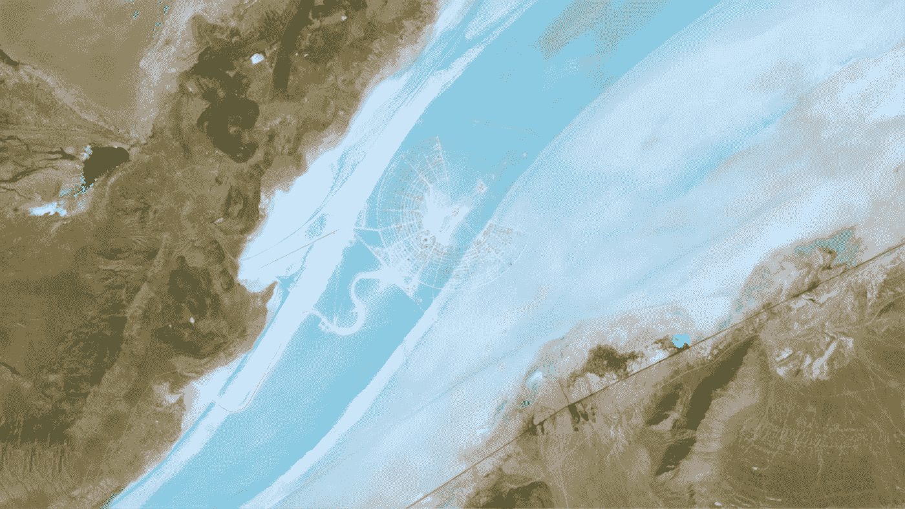

# 美化—图像

> 原文：<https://blog.devgenius.io/vuetify-images-15ec43ce3a1f?source=collection_archive---------1----------------------->



[USGS](https://unsplash.com/@usgs?utm_source=medium&utm_medium=referral) 在 [Unsplash](https://unsplash.com?utm_source=medium&utm_medium=referral) 上拍摄的照片

Vuetify 是一个流行的 Vue 应用程序 UI 框架。

在本文中，我们将了解如何使用 Vuetify 框架。

# 形象

我们可以用`v-img`组件添加图像。

例如，我们可以写:

```
<template>
  <v-container class="grey lighten-5">
    <v-row>
      <v-col>
        <v-img src="https://picsum.photos/510/300?random" aspect-ratio="1.7"></v-img>
        <v-img src="https://picsum.photos/510/300?random" aspect-ratio="2"></v-img>
        <v-img src="https://picsum.photos/510/300?random" aspect-ratio="1.4"></v-img>
      </v-col>
    </v-row>
  </v-container>
</template>
<script>
export default {
  name: "HelloWorld",
  data: () => ({}),
  methods: {
    next() {
      alert("You clicked next");
    },
  },
};
</script>
```

用`v-img`组件添加图像。

`src`有图片的网址。

`aspect-ratio`有图像的长宽比。

# 高度

我们可以用`height`和`max-height`道具改变高度。

例如，我们可以写:

```
<template>
  <v-container class="fill-height" fluid style="min-height: 434px">
    <v-fade-transition mode="out-in">
      <v-row key="0">
        <v-col cols="6">
          <v-card>
            <v-img src="https://picsum.photos/350/165?random" height="125" class="grey darken-4"></v-img>
            <v-card-title class="title">height</v-card-title>
          </v-card>
        </v-col> <v-col cols="6">
          <v-card>
            <v-img
              src="https://picsum.photos/350/165?random"
              height="125"
              contain
              class="grey darken-4"
            ></v-img>
            <v-card-title class="title">height with contain</v-card-title>
          </v-card>
        </v-col> <v-col cols="6">
          <v-card>
            <v-img
              src="https://picsum.photos/350/165?random"
              max-height="125"
              class="grey darken-4"
            ></v-img>
            <v-card-title class="title">max-height</v-card-title>
          </v-card>
        </v-col> <v-col cols="6">
          <v-card>
            <v-img
              src="https://picsum.photos/350/165?random"
              max-height="125"
              contain
              class="grey darken-4"
            ></v-img>
            <v-card-title class="title">max-height with contain</v-card-title>
          </v-card>
        </v-col>
      </v-row>
    </v-fade-transition>
  </v-container>
</template>
<script>
export default {
  name: "HelloWorld",
  data: () => ({}),
};
</script>
```

`contain`防止图像因不合适而被裁剪。

# 固定比率

如果我们想改变图像的纵横比，我们可以设置纵横比。

例如，我们可以写:

```
<template>
  <v-container fluid>
    <v-slider v-model="width" min="200" max="500" step="1"></v-slider>
    <v-navigation-drawer :width="width" :value="true" stateless>
      <v-img :aspect-ratio="16/9" src="https://cdn.vuetifyjs.com/images/parallax/material.jpg"></v-img> <v-list>
        <template v-for="(item, i) in items">
          <v-divider v-if="item.divider" :key="i"></v-divider>
          <v-list-item v-else :key="item.title">
            <v-list-item-action>
              <v-icon>{{ item.icon }}</v-icon>
            </v-list-item-action>
            <v-list-item-title>{{ item.title }}</v-list-item-title>
          </v-list-item>
        </template>
      </v-list>
    </v-navigation-drawer>
  </v-container>
</template>
<script>
export default {
  name: "HelloWorld",
  data: () => ({
    width: 300,
    items: [
      { icon: "inbox", title: "Inbox" },
      { icon: "star", title: "Starred" },
    ],
  }),
};
</script>
```

我们有`width`道具来改变宽度。

我们用`v-list`组件渲染图标。

`aspect-ratio`道具使图像的长宽比固定。

# 占位符

我们可以添加一个`placeholder`槽来在里面添加一个占位符内容。

例如，我们可以写:

```
<template>
  <v-container fluid>
    <v-row align="center" justify="center">
      <v-img
        src="https://bad.src/not/valid"
        lazy-src="https://picsum.photos/id/11/100/60"
        aspect-ratio="1"
        class="grey lighten-2"
        max-width="500"
        max-height="300"
      >
        <template v-slot:placeholder>
          <v-row class="fill-height ma-0" align="center" justify="center">
            <v-progress-circular indeterminate color="grey lighten-5"></v-progress-circular>
          </v-row>
        </template>
      </v-img>
    </v-row>
  </v-container>
</template>
<script>
export default {
  name: "HelloWorld",
  data: () => ({}),
};
</script>
```

我们有一个无效的`src`道具，因此将显示占位符图像。

`lazy-src`有占位符的 URL。

我们使用`placeholder`槽在占位符图像上放置一个循环进度显示。

# 结论

我们可以用占位符显示图像等等。