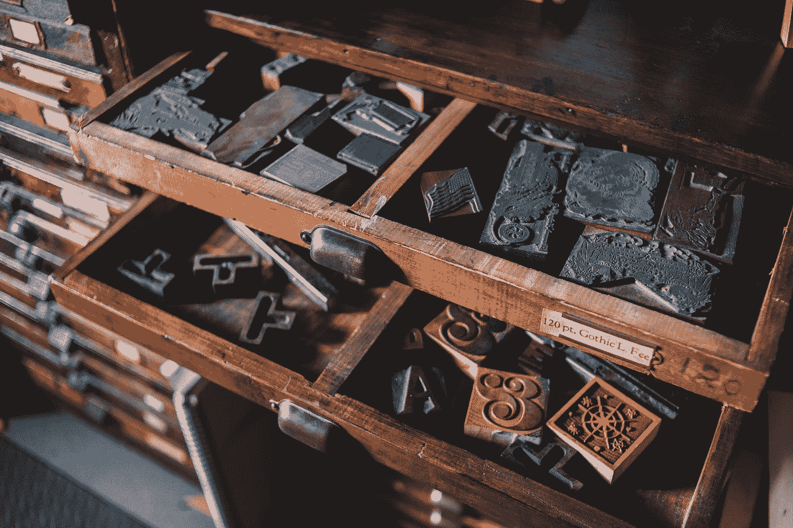

# 菜单和抽屉

> 原文：<https://blog.devgenius.io/vuetify-menus-and-drawers-cfbc2bca9640?source=collection_archive---------7----------------------->



Erik Mclean 在 [Unsplash](https://unsplash.com?utm_source=medium&utm_medium=referral) 上拍摄的照片

Vuetify 是一个流行的 Vue 应用程序 UI 框架。

在本文中，我们将了解如何使用 Vuetify 框架。

# 菜单

我们可以在任何组件中放置菜单。

例如，我们可以写:

```
<template>
  <v-row>
    <v-col cols="12" sm="6" offset-sm="3">
      <v-card height="200px">
        <v-card-title class="blue white--text">
          <span class="headline">Menu</span> <v-spacer></v-spacer> <v-menu bottom left>
            <template v-slot:activator="{ on, attrs }">
              <v-btn dark icon v-bind="attrs" v-on="on">
                <v-icon>mdi-dots-vertical</v-icon>
              </v-btn>
            </template> <v-list>
              <v-list-item v-for="(item, i) in items" :key="i">
                <v-list-item-title>{{ item.title }}</v-list-item-title>
              </v-list-item>
            </v-list>
          </v-menu>
        </v-card-title> <v-card-text>Lorem Ipsum</v-card-text>
      </v-card>
    </v-col>
  </v-row>
</template>
<script>
export default {
  name: "HelloWorld",
  data: () => ({
    items: [
      { title: "Click Me" },
      { title: "Click Me 2" },
      { title: "Click Me 3" },
    ],
  }),
};
</script>
```

我们将我们的`v-menu`放在`v-card`组件中。

然后`v-menu`有了`bottom`和`left`道具，这样我们可以把它放在卡片的左下方。

# 导航抽屉

要添加导航抽屉，我们可以添加`v-navigation-drawer`组件。

例如，我们可以写:

```
<template>
  <v-row>
    <v-col cols="12">
      <v-card class="mx-auto" height="400" width="256">
        <v-navigation-drawer class="deep-purple accent-4" dark permanent>
          <v-list>
            <v-list-item v-for="item in items" :key="item.title" link>
              <v-list-item-icon>
                <v-icon>{{ item.icon }}</v-icon>
              </v-list-item-icon> <v-list-item-content>
                <v-list-item-title>{{ item.title }}</v-list-item-title>
              </v-list-item-content>
            </v-list-item>
          </v-list> <template v-slot:append>
            <div class="pa-2">
              <v-btn block>Logout</v-btn>
            </div>
          </template>
        </v-navigation-drawer>
      </v-card>
    </v-col>
  </v-row>
</template>
<script>
export default {
  name: "HelloWorld",
  data: () => ({
    items: [
      { title: "Click Me" },
      { title: "Click Me 2" },
      { title: "Click Me 3" },
    ],
  }),
};
</script>
```

我们有`v-list`来显示一个项目列表。

这个放在`v-navigation-drawer`里面，让它显示在抽屉里。

# 永久浮动抽屉

我们可以添加一个浮动在页面上的导航抽屉。

例如，我们可以写:

```
<template>
  <v-row>
    <v-col cols="12">
      <v-card class="pa-12" color="indigo darken-2" flat>
        <v-card elevation="12" width="256">
          <v-navigation-drawer floating permanent>
            <v-list dense rounded>
              <v-list-item v-for="item in items" :key="item.title" link>
                <v-list-item-icon>
                  <v-icon>{{ item.icon }}</v-icon>
                </v-list-item-icon> <v-list-item-content>
                  <v-list-item-title>{{ item.title }}</v-list-item-title>
                </v-list-item-content>
              </v-list-item>
            </v-list>
          </v-navigation-drawer>
        </v-card>
      </v-card>
    </v-col>
  </v-row>
</template>
<script>
export default {
  name: "HelloWorld",
  data: () => ({
    items: [
      { title: "Click Me" },
      { title: "Click Me 2" },
      { title: "Click Me 3" },
    ],
  }),
};
</script>
```

我们有菜单浮动在页面上，带有`permanent`和`floating`道具。

# 结论

我们可以用 Vuetify 添加各种菜单。