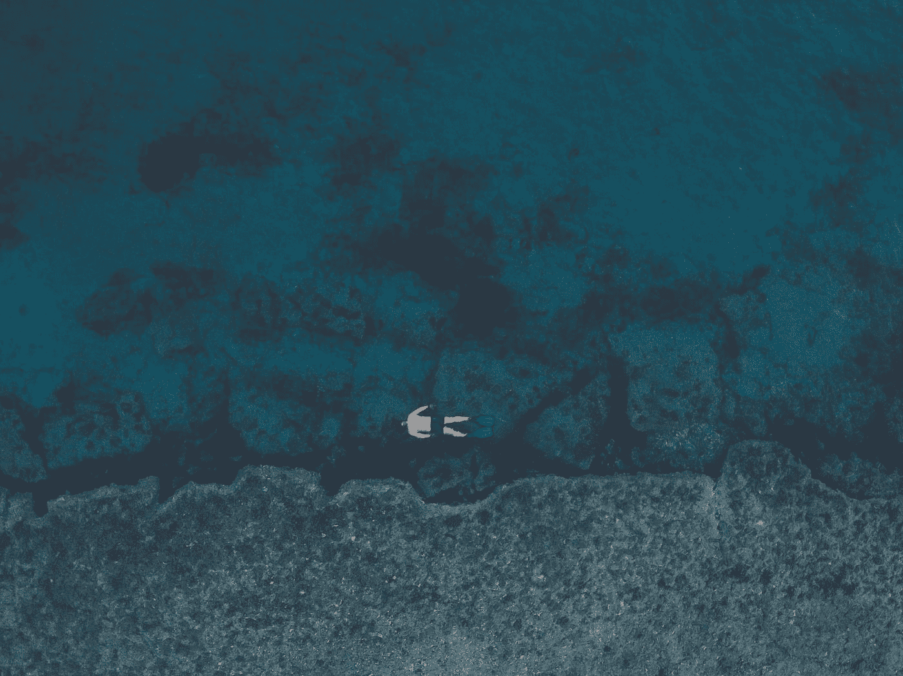

# 虚拟化—轮廓按钮和浮动按钮

> 原文：<https://blog.devgenius.io/vuetify-outlined-and-floating-buttons-ce38122b1a9c?source=collection_archive---------1----------------------->


由[利奥·里瓦斯](https://unsplash.com/@leorivas?utm_source=medium&utm_medium=referral)在 [Unsplash](https://unsplash.com?utm_source=medium&utm_medium=referral) 上拍摄的照片

Vuetify 是一个流行的 Vue 应用程序 UI 框架。

在本文中，我们将了解如何使用 Vuetify 框架。

# 轮廓按钮

我们可以用`outlined`道具创建轮廓按钮。

例如，我们可以写:

```
<template>
  <v-container>
    <v-row class="text-center">
      <v-col col="12">
        <v-btn class="ma-2" outlined color="indigo">Outlined Button</v-btn>
      </v-col>
    </v-row>
  </v-container>
</template><script>
export default {
  name: "HelloWorld",
  data: () => ({}),
};
</script>
```

我们还可以创建一个内部带有图标的轮廓按钮:

```
<template>
  <v-container>
    <v-row class="text-center">
      <v-col col="12">
        <v-btn class="ma-2" outlined fab color="teal">
          <v-icon>mdi-format-list-bulleted-square</v-icon>
        </v-btn>
      </v-col>
    </v-row>
  </v-container>
</template><script>
export default {
  name: "HelloWorld",
  data: () => ({}),
};
</script>
```

# 阻止按钮

块按钮扩展了屏幕的整个宽度。

要添加一个，我们可以添加`block`道具:

```
<template>
  <v-container>
    <v-row class="text-center">
      <v-col col="12">
        <v-btn block color="secondary" dark>Block Button</v-btn>
      </v-col>
    </v-row>
  </v-container>
</template><script>
export default {
  name: "HelloWorld",
  data: () => ({}),
};
</script>
```

# 按钮装载机

我们可以在按钮上显示一个装载指示器，通知用户正在进行处理。

默认行为是使用一个`v-progress-circular`组件。

这个可以定制。

例如，我们可以写:

```
<template>
  <v-container>
    <v-row class="text-center">
      <v-col col="12">
        <v-btn
          class="ma-2"
          :loading="loading"
          :disabled="loading"
          color="secondary"
          @click="loading = true"
        >Accept Terms</v-btn>
      </v-col>
    </v-row>
  </v-container>
</template><script>
export default {
  name: "HelloWorld",
  data: () => ({
    loading: false,
  }),
};
</script>
```

然后，当我们点击按钮时，我们可以看到装载指示器。

`loading`设置为`true`，显示装载指示器。

`loading`道具设置为加载状态。

# 按钮:浮动动作按钮

我们可以用`fab`道具添加一个幸灾乐祸的动作按钮。

例如，我们可以写:

```
<template>
  <v-container>
    <v-row class="text-center">
      <v-col col="12">
        <v-card>
          <v-toolbar color="light-blue" light extended>
            <v-app-bar-nav-icon></v-app-bar-nav-icon>
            <v-toolbar-title class="white--text">App</v-toolbar-title>
            <v-spacer></v-spacer>
            <v-btn icon>
              <v-icon>mdi-magnify</v-icon>
            </v-btn>
            <v-btn icon>
              <v-icon>mdi-view-module</v-icon>
            </v-btn>
            <template v-slot:extension>
              <v-btn fab color="cyan accent-2" bottom left absolute @click="dialog = !dialog">
                <v-icon>mdi-plus</v-icon>
              </v-btn>
            </template>
          </v-toolbar>
        </v-card>
      </v-col>
    </v-row>
  </v-container>
</template><script>
export default {
  name: "HelloWorld",
  data: () => ({
    dialog: false,
  }),
};
</script>
```

我们将一个`v-btn`添加到`extension`槽中，这样它就会显示在工具栏的左下方。

同样，我们设置`color`道具，并添加`bottom`和`left`道具，使其显示在左下角。

`absolute`使其以绝对位置显示。

# 显示动画

我们可以在显示和隐藏浮动动作按钮时显示动画。

例如，我们可以写:

```
<template>
  <v-container>
    <v-row class="text-center">
      <v-col col="12">
        <v-card>
          <v-toolbar extended>
            <v-app-bar-nav-icon></v-app-bar-nav-icon>
            <template v-slot:extension>
              <v-fab-transition>
                <v-btn v-show="!hidden" color="pink" fab dark small absolute bottom left>
                  <v-icon>mdi-plus</v-icon>
                </v-btn>
              </v-fab-transition>
            </template>
          </v-toolbar>
          <v-card-text style="height: 300px;" class="grey lighten-5 text-center">
            <v-btn color="primary" @click="hidden = !hidden">{{ hidden ? 'Show' : 'Hide' }}</v-btn>
          </v-card-text>
          <v-card-text style="height: 100px; position: relative">
            <v-fab-transition>
              <v-btn v-show="!hidden" color="pink" dark absolute top right fab>
                <v-icon>mdi-plus</v-icon>
              </v-btn>
            </v-fab-transition>
          </v-card-text>
        </v-card>
      </v-col>
    </v-row>
  </v-container>
</template><script>
export default {
  name: "HelloWorld",
  data: () => ({
    hidden: false,
  }),
};
</script>
```

我们在`extension`槽中添加了`v-fab-transition`道具，使浮动动作按钮可以通过动画切换开关。

切换是通过`hidden`道具完成的。

我们使用`small`道具让它变小。

`bottom`和`left`定位按钮图标。

`absolute`使位置绝对化。

`fab`使按钮成为浮动动作按钮。



本·库伦格韦尔在 [Unsplash](https://unsplash.com?utm_source=medium&utm_medium=referral) 上拍摄的照片

# 结论

我们可以用 Vuetify 显示各种按钮。