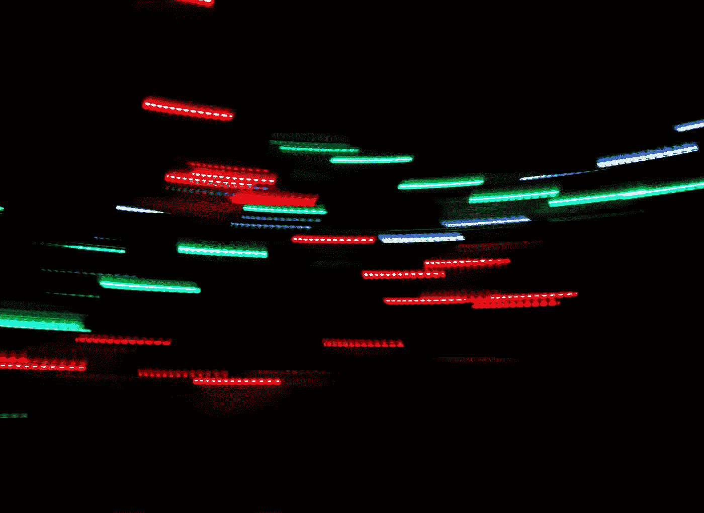

# 验证—选择

> 原文：<https://blog.devgenius.io/vuetify-select-e1d1505594d1?source=collection_archive---------2----------------------->



[Jerin J](https://unsplash.com/@jn1434?utm_source=medium&utm_medium=referral) 在 [Unsplash](https://unsplash.com?utm_source=medium&utm_medium=referral) 拍摄的照片

Vuetify 是一个流行的 Vue 应用程序 UI 框架。

在本文中，我们将了解如何使用 Vuetify 框架。

# 选择

我们可以用`v-select`组件创建一个选择下拉列表。

例如，我们可以写:

```
<template>
  <v-container>
    <v-row>
      <v-col col="12">
        <v-select :items="items" label="Fruit"></v-select>
      </v-col>
    </v-row>
  </v-container>
</template>
<script>
export default {
  name: "HelloWorld",
  data: () => ({
    items: ["apple", "orange", "pear"],
  }),
};
</script>
```

我们有带`items`道具的`v-select`组件。

`items`接受一个显示为选项的项目数组。

`label`有下拉标签。

`disabled`和`readonly`属性可以与`v-select`一起使用。

`disabled`让我们禁用显示禁用样式的下拉菜单。

`readonly`也使其禁用，但不应用样式更改。

我们可以写:

```
<template>
  <v-container>
    <v-row>
      <v-col col="12">
        <v-select :items="items" label="Fruit" disabled></v-select>
      </v-col>
    </v-row>
  </v-container>
</template>
<script>
export default {
  name: "HelloWorld",
  data: () => ({
    items: ["apple", "orange", "pear"],
  }),
};
</script>
```

禁用`v-select`组件。

我们可以使用以下命令将它添加为只读:

```
<template>
  <v-container>
    <v-row>
      <v-col col="12">
        <v-select :items="items" label="Fruit" readonly></v-select>
      </v-col>
    </v-row>
  </v-container>
</template>
<script>
export default {
  name: "HelloWorld",
  data: () => ({
    items: ["apple", "orange", "pear"],
  }),
};
</script>
```

# 选择

我们可以向`v-select`组件添加各种选项。

`chips`使所选项目看起来像薯片。

`multiple`启用多项选择。

`attach`指定组件应该附加到哪个 DOM 元素。

该值是我们想要附加到的元素的选择器。

`solo`呈现不带标签的下拉列表。

例如，我们可以写:

```
<template>
  <v-container>
    <v-row>
      <v-col col="12">
        <v-select :items="items" label="Fruit" multiple></v-select>
      </v-col>
    </v-row>
  </v-container>
</template>
<script>
export default {
  name: "HelloWorld",
  data: () => ({
    items: ["apple", "orange", "pear"],
  }),
};
</script>
```

启用多重选择。

# 核标准情报中心

我们可以在下拉菜单中添加前置和附加图标。

例如，我们可以写:

```
<template>
  <v-container>
    <v-row>
      <v-col col="12">
        <v-select
          v-model="fruit"
          :items="items"
          menu-props="auto"
          label="Select"
          hide-details
          prepend-icon="mdi-domain"
          single-line
        ></v-select>
      </v-col>
    </v-row>
  </v-container>
</template>
<script>
export default {
  name: "HelloWorld",
  data: () => ({
    items: ["apple", "orange", "pear"],
    fruit: "",
  }),
};
</script>
```

我们用`prepend-icon`道具将图标添加到下拉列表的左边。

我们可以用`append-outer-icon`道具在下拉菜单的右边添加一个图标:

```
<template>
  <v-container>
    <v-row>
      <v-col col="12">
        <v-select
          v-model="fruit"
          :items="items"
          menu-props="auto"
          label="Select"
          hide-details
          append-outer-icon="mdi-domain"
          single-line
        ></v-select>
      </v-col>
    </v-row>
  </v-container>
</template>
<script>
export default {
  name: "HelloWorld",
  data: () => ({
    items: ["apple", "orange", "pear"],
    fruit: "",
  }),
};
</script>
```

在这两个例子中，我们只是将 prop 值设置为带有图标名称的字符串。


照片由[法鲁尔·阿兹米](https://unsplash.com/@fahrulazmi?utm_source=medium&utm_medium=referral)在 [Unsplash](https://unsplash.com?utm_source=medium&utm_medium=referral) 上拍摄

# 结论

我们可以使用 Vuetify 添加带有各种选项的下拉菜单。