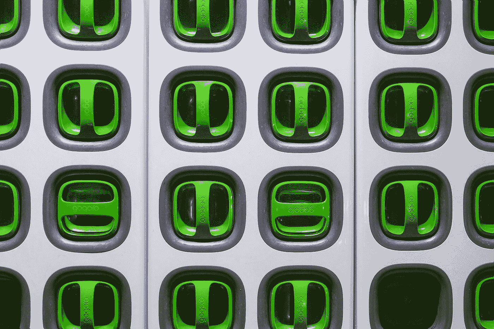

# 虚拟化—开关和滑块

> 原文：<https://blog.devgenius.io/vuetify-switches-and-sliders-755cf0bd9d9e?source=collection_archive---------0----------------------->



[亨利&公司](https://unsplash.com/@hngstrm?utm_source=medium&utm_medium=referral)在 [Unsplash](https://unsplash.com?utm_source=medium&utm_medium=referral) 上拍摄的照片

Vuetify 是一个流行的 Vue 应用程序 UI 框架。

在本文中，我们将了解如何使用 Vuetify 框架。

# 禁用的开关

我们可以用`disabled`道具禁用开关:

```
<template>
  <v-container>
    <v-row>
      <v-col col="12">
        <v-switch value input-value="true" disabled></v-switch>
      </v-col>
    </v-row>
  </v-container>
</template>
<script>
export default {
  name: "HelloWorld",
  data: () => ({}),
};
</script>
```

这样，就不主动了。

# 装载开关

开关可以显示负载状态。

例如，我们可以写:

```
<template>
  <v-container>
    <v-row>
      <v-col col="12">
        <v-switch loading="warning" value input-value="true"></v-switch>
      </v-col>
    </v-row>
  </v-container>
</template>
<script>
export default {
  name: "HelloWorld",
  data: () => ({}),
};
</script>
```

带有样式名的`loading`道具显示给定样式的加载状态。

# 切换颜色

我们可以用`color`道具改变开关颜色:

```
<template>
  <v-container>
    <v-row>
      <v-col col="12">
        <v-switch v-model="ex" label="red" color="red" value="red" hide-details></v-switch>
      </v-col>
    </v-row>
  </v-container>
</template>
<script>
export default {
  name: "HelloWorld",
  data: () => ({
    ex: false,
  }),
};
</script>
```

# 平面开关

`flat`道具使开关变平:

```
<template>
  <v-container>
    <v-row>
      <v-col col="12">
        <v-switch v-model="sw" flat :label="`Switch: ${sw.toString()}`"></v-switch>
      </v-col>
    </v-row>
  </v-container>
</template>
<script>
export default {
  name: "HelloWorld",
  data: () => ({
    sw: false,
  }),
};
</script>
```

# 嵌入式开关

使用`inset`道具，开关可以以插入模式显示:

```
<template>
  <v-container>
    <v-row>
      <v-col col="12">
        <v-switch v-model="sw" inset :label="`Switch: ${sw.toString()}`"></v-switch>
      </v-col>
    </v-row>
  </v-container>
</template>
<script>
export default {
  name: "HelloWorld",
  data: () => ({
    sw: false,
  }),
};
</script>
```

# 滑块

滑块用于让用户从一个范围中选择一个数字。

我们添加一个带有`v-slider`组件的:

```
<template>
  <v-container>
    <v-row>
      <v-col col="12">
        <v-slider v-model="slider" class="align-center" :max="max" :min="min" hide-details>
          <template v-slot:append>
            <v-text-field
              v-model="slider"
              class="mt-0 pt-0"
              hide-details
              single-line
              type="number"
              style="width: 60px"
            ></v-text-field>
          </template>
        </v-slider>
      </v-col>
    </v-row>
  </v-container>
</template>
<script>
export default {
  name: "HelloWorld",
  data: () => ({
    slider: 0,
    max: 100,
    min: 0,
  }),
};
</script>
```

我们填充了`append`槽，在滑块的右边显示一些。

显示一个`v-text-field`来显示`v-model`值。

`max`和`min`分别是滑块的最大值和最小值。

此外，我们可以通过填充`prepend`插槽将一个项目添加到滑块上:

```
<template>
  <v-container>
    <v-row>
      <v-col col="12">
        <v-slider v-model="slider" class="align-center" :max="max" :min="min" hide-details>
          <template v-slot:prepend>
            <v-text-field
              v-model="slider"
              class="mt-0 pt-0"
              hide-details
              single-line
              type="number"
              style="width: 60px"
            ></v-text-field>
          </template>
        </v-slider>
      </v-col>
    </v-row>
  </v-container>
</template>
<script>
export default {
  name: "HelloWorld",
  data: () => ({
    slider: 0,
    max: 100,
    min: 0,
  }),
};
</script>
```

现在我们有了左边显示的数字。

# 结论

我们可以用 Vuetify 添加开关和数字滑块。